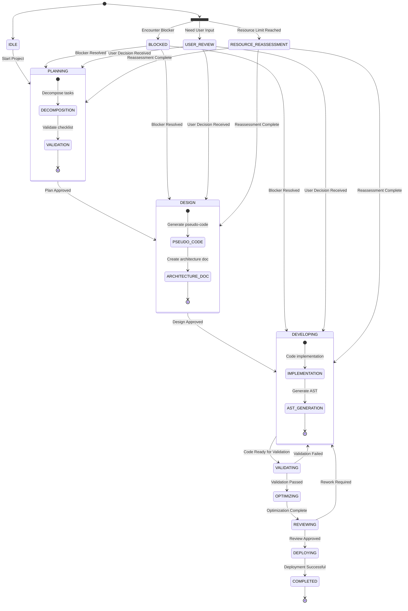

# AI Project Build Rules (v2.1)
<!-- Updated to v2.1 by AI assistant; source: .trae/rules/project_rules.md (AI审计配置 v3.1); Timestamp: 2025-09-10 20:00:11 Asia/Shanghai -->

## 1. 核心配置 (YAML)

```yaml
# ===================================================================
# AI Project Build Rules - Configuration Block
# Version: 2.1
# Last Updated: 2025-09-10
# ===================================================================
config:
  version: 2.1
  project_governance:
    scale_mode: "medium"
    project_version: "1.0.0"
    user_response_timeout_hours: 24
    resource_limits:
      max_total_tokens_k: 1000
      task_token_deviation_threshold_percent: 20

  structure:
    source_dir: "src/"
    docs_dir: "docs/"
    api_contract_dir: "docs/api/"
    ast_dir: "ast/"
    deployment_dir: "deployment/"
    tasks_dir: "tasks/"
    reports_dir: "audit-reports/"
    project_file: "project.md"
    checklist_file: "tasks/checklist.md"

  # --- Audit Configuration (Merged from project_rules.md) ---
  audit:
    profile: "balanced"
    depth: "deep"
    scope:
      include:
        - "js/**/*.js"
        - "js/**/*.cjs"
        - "css/**/*.css"
        - "*.html"
        - "*.json"
        - "components/**/*"
        - "config/**/*"
        - "scripts/**/*"
      exclude:
        - "**/node_modules/**"
        - "**/dist/**"
        - "**/build/**"
        - "**/test*/**"
        - "**/tests/**"
        - "**/docs/**"
        - "**/*.md"
        - "**/*.log"
        - "**/.*"
    profiles:
      strict:
        fail_fast: true
        security: { block_on_cvss: 7.0, max_vulnerabilities: 0 }
        quality: { min_coverage_line: 95, min_coverage_branch: 90, max_complexity: 8 }
        performance: { max_p99_latency_ms: 100 }
        license: { deny: ["GPL-*", "AGPL-*"] }
      balanced:
        fail_fast: true
        security: { block_on_cvss: 8.0, max_vulnerabilities: 5 }
        quality: { min_coverage_line: 90, min_coverage_branch: 85, max_complexity: 10 }
        performance: { max_p99_latency_ms: 250 }
        license: { deny: ["AGPL-*"] }
      lenient:
        fail_fast: false
        security: { block_on_cvss: 9.0, max_vulnerabilities: 20 }
        quality: { min_coverage_line: 80, min_coverage_branch: 75, max_complexity: 15 }
        performance: { max_p99_latency_ms: 500 }
        license: { deny: [] }

  # --- Toolchain Configuration (Merged from project_rules.md) ---
  toolchain:
    sast:
      - { name: "CodeQL", enabled: true, config: "security-and-quality", languages: ["javascript"], timeout: 1800 }
      - { name: "Semgrep", enabled: true, config: "p/ci", rules: ["p/security-audit", "p/javascript"], timeout: 600 }
      - { name: "ESLint", enabled: true, config: ".eslintrc.cjs", fix: false }
    sca:
      - { name: "OSV-Scanner", enabled: true, format: "sarif", timeout: 300 }
      - { name: "npm-audit", enabled: true, args: "--audit-level=moderate", format: "json" }
      - { name: "Retire.js", enabled: true, severity: "medium" }
    sbom:
      - { name: "Syft", enabled: true, format: "cyclonedx-json", include_dev: false }
    container_security:
      - { name: "Trivy", enabled: false, ignore_unfixed: true, severity: "CRITICAL,HIGH" }
    api_validator:
      tool: "@redocly/cli"
      command: "lint"

  # --- Execution Environment (Merged from project_rules.md) ---
  environment:
    platform: "docker"
    docker:
      image: "mcr.microsoft.com/powershell:latest"
      container_name: "trae-audit-container"
    working_directory: "./"
    timeout_minutes: 45
    fail_fast: true
    cache:
      enabled: true
      path: ".audit-cache"
      ttl_hours: 24

  # --- Reporting & Notifications (Merged from project_rules.md) ---
  reporting:
    formats: ["sarif", "markdown", "json"]
    output_path: "audit-reports/"
    timestamp_format: "yyyy-MM-dd_HH-mm-ss"
    notifications:
      console: { enabled: true, level: "info" }
      file: { enabled: true, path: "audit-run.log" }

  # --- CI/CD Integrations (Merged from project_rules.md) ---
  integrations:
    github_actions:
      enabled: true
      auto_generate: true
      workflow_file: ".github/workflows/audit.yml"

  # --- State Machine Definitions ---
  state_machine:
    initial_state: "IDLE"
    terminal_state: "COMPLETED"
    recovery_priority: ["BLOCKED", "RESOURCE_REASSESSMENT", "USER_REVIEW"]
```

## 2. 项目主状态机 (Mermaid)



## 3. 核心工作流步骤

### Step 0: 项目初始化
- **目标**: 准备工作环境，克隆项目仓库。
- **动作**:
    1.  调用 `git clone` 克隆 `config.project_governance.project_repo`。
    2.  在项目根目录创建 `.trae` 目录。

### Step 1: 创建 `project.md`
- **目标**: 定义项目核心目标、范围和高级别需求。
- **动作**:
    1.  在根目录创建 `project.md`。
    2.  内容应包括：项目愿景、核心功能、技术栈、关键交付成果。
    3.  生成文件内容的 SHA256 哈希并存储，用于后续一致性检查。

### Step 2: 创建架构设计文档
- **目标**: 设计系统架构和数据模型。
- **动作**:
    1.  在 `config.structure.docs_dir` 目录下创建 `architecture.md`。
    2.  内容应包括：C4 模型图（系统上下文、容器、组件）、数据模型、技术选型理由。

### Step 3: 创建任务清单 (`checklist.md`)
- **目标**: 将项目需求分解为可执行的任务。
- **动作**:
    1.  在 `config.structure.tasks_dir` 目录下创建 `checklist.md`。
    2.  将 `project.md` 中的功能点分解为具体的、可操作的任务项。
    3.  每个任务项格式：`- [ ] {任务ID}: {任务描述}`。

### Step 4: 生成伪代码
- **目标**: 为每个任务创建详细的实现逻辑。
- **动作**:
    1.  为 `checklist.md` 中的每个任务，在 `config.structure.source_dir` 下创建对应的伪代码文件。
    2.  命名约定：`{任务ID}.pseudo.txt`。
    3.  伪代码应清晰描述算法、数据流和函数签名。

### Step 5: 代码实现与AST生成
- **目标**: 将伪代码转换为实际代码并生成AST。
- **动作**:
    1.  基于伪代码文件，生成最终的源代码文件。
    2.  使用 `tree-sitter` 为每个源文件生成 AST，并存储在 `config.structure.ast_dir` 目录中。

### Step 6: 代码验证 (AI 审计)
- **目标**: 执行全面的自动化代码审计，确保代码质量、功能正确性、安全性和风格一致性。
- **核心理念**: 采用“零信任”原则，所有代码变更都必须经过严格的多维度、多工具交叉验证。
- **动作**:
    1.  **环境准备**:
        - 确认 `config.toolchain` 中定义的所有工具（CodeQL, Semgrep, ESLint, OSV-Scanner等）均已安装并处于可用状态。
        - 根据 `config.environment` 配置，准备审计环境（如启动 Docker 容器）。
    2.  **执行 SAST (静态应用安全测试)**:
        - 依次运行 `CodeQL`, `Semgrep`, `ESLint` 等工具。
        - 根据 `config.audit.profile`（如 `balanced`）设定的规则集进行扫描。
        - 将原始报告输出到 `config.reporting.output_path` 目录。
    3.  **执行 SCA (软件成分分析)**:
        - 运行 `OSV-Scanner` 和 `npm audit` 检查第三方库的已知漏洞。
        - 根据 `config.audit.profiles.balanced.security.block_on_cvss` 等阈值判断是否中断构建。
    4.  **生成 SBOM (软件物料清单)**:
        - 使用 `Syft` 生成项目的 CycloneDX 格式 SBOM。
    5.  **报告整合与格式化**:
        - 将所有工具的输出（SARIF, JSON, text）进行汇总。
        - 生成一份统一的 Markdown 格式审计总报告 `audit-summary.md`，包含：
            - 执行摘要（发现的问题总数、按严重性分类）。
            - 各工具发现的关键问题列表。
            - SBOM 摘要。
    6.  **状态转移**:
        - **如果审计发现严重问题 (根据 `block_on_cvss` 等配置)**: 状态转移到 `DEVELOPING`，并附带审计报告供修复。
        - **如果审计通过**: 状态转移到 `OPTIMIZING`。

#### 调用方式
- 首选执行脚本：`.trae/rules/audit.ps1`（PowerShell 7+）。在项目根目录执行示例：
  - Windows: `pwsh -File .\\.trae\\rules\\audit.ps1`
- 备选：参照 <mcfile name="project_rules.md" path="d:\codes\onlinestore\.trae\rules\project_rules.md"></mcfile> 中的“执行指南”，按文档创建并运行 `Start-Audit.ps1`。
- 配置与阈值来源：
  - 报告目录：`config.reporting.output_path`（当前为 `audit-reports/`）。
  - 阻断阈值：`config.audit.profiles.{profile}.security.block_on_cvss`（默认 profile: `balanced` → 8.0）与 `max_vulnerabilities`（balanced → 5）。
- 产物与位置：SAST/SCA/SBOM 的 SARIF/JSON 与汇总 Markdown 输出到 `audit-reports/`，文件名带时间戳（如 `audit-summary-<yyyy-MM-dd_HH-mm-ss>.md`）。
- 状态机对接：若触发阻断阈值，状态回退至 `DEVELOPING`；审计通过则进入 `OPTIMIZING`。

### Step 7: 代码优化与回归验证
- **目标**: 提升代码性能和可维护性。
- **动作**:
    1.  使用性能分析工具（如 `py-spy`, `0x`）识别瓶颈。
    2.  重构代码以提升性能。
    3.  执行回归测试，确保优化未引入新问题。

### Step 8: 迭代评审与回顾
- **目标**: 进行代码审查和项目回顾。
- **动作**:
    1.  发起 Pull Request 进行代码审查。
    2.  召开项目回顾会议，总结经验教训。

### Step 9: 创建部署与运维文档
- **目标**: 提供清晰的部署和维护指南。
- **动作**:
    1.  在 `config.structure.deployment_dir` 目录创建 `README.md`。
    2.  内容包括：环境要求、部署步骤、监控配置、回滚计划。

### Step 10: 项目交付
- **目标**: 完成项目并交付最终产物。
- **动作**:
    1.  确保所有任务在 `checklist.md` 中标记为完成。
    2.  生成包含所有项目产物（代码、文档、报告）的交付包。
    3.  通知用户项目已完成。

## 4. 核心原则

1.  **内容真实性**: 所有生成的内容（代码、文档、报告）必须基于可验证的事实，禁止幻觉。
2.  **变更可追溯**: 所有对代码和文档的修改都必须通过版本控制系统进行，并附有清晰的提交信息。
3.  **资源监控**: 严格监控 Token 和计算资源消耗，超出阈值时触发 `RESOURCE_REASSESSMENT` 状态。
4.  **错误处理**: 遇到任何阻塞性问题时，立即进入 `BLOCKED` 状态，并通知用户。
5.  **用户交互**: 在关键决策点，进入 `USER_REVIEW` 状态，并使用标准模板向用户请求输入。

## 5. 附录

### A. API 契约管理 (OAS 3.1)
- **规范**: 所有模块间接口必须使用 OpenAPI 3.1 规范定义。
- **位置**: 契约文件（`api-{模块名}-contract.yaml`）存储在 `config.structure.api_contract_dir` 目录。
- **验证**: 在 CI/CD 流程中集成 `redocly-cli` 进行自动验证。

### B. 用户通知模板
```markdown
## 🔍 关键决策点需要您的确认

**任务ID**: `{TASK_ID}`
**决策类型**: `{DECISION_TYPE}`

### 📋 问题描述
{详细描述问题背景和需要决策的内容}

### 💡 推荐方案
**方案A**: {推荐方案描述}
- ✅ 优点: {优点1}, {优点2}
- ⚠️ 缺点: {缺点1}

### 🔄 备选方案
**方案B**: {备选方案描述}
- ✅ 优点: {优点1}
- ⚠️ 缺点: {缺点1}, {缺点2}

---

⏰ **请在 {config.project_governance.user_response_timeout_hours} 小时内回复。**
（超时将自动选择推荐方案）
```

### C. 会话恢复流程
1.  **读取状态**: 从 `checklist.md` 和其他项目文件中恢复当前状态。
2.  **验证一致性**: 检查文件哈希值、依赖项和资源记录。
3.  **恢复工作**: 根据当前状态和 `config.state_machine.recovery_priority` 中定义的优先级恢复执行。
