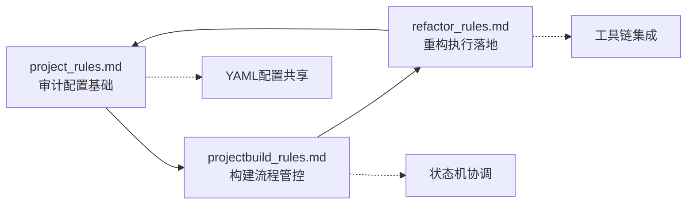
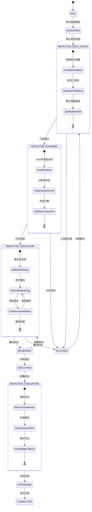

# AI协同重构执行协议 - Integrated Edition v3.0

## 协议概述

本协议是AI驱动项目管理体系的核心组件，与`project_rules.md`和`projectbuild_rules.md`深度集成，形成**构建→审计→重构**的完整闭环。协议v3.0版本实现了三大规则文件的统一协调，支持AI自动化执行项目全生命周期管理。

**核心原则**：
- **集成化 (Integrated)**: 与审计配置和构建流程无缝集成，共享YAML配置和状态机。
- **结构化 (Structured)**: 所有规则和流程都以清晰的`key-value`形式定义，便于AI解析。
- **原子化 (Atomic)**: 每个重构步骤都是一个独立的、可验证的原子操作。
- **可度量 (Measurable)**: 重构效果通过明确的量化指标进行评估。
- **自动化 (Automated)**: 尽可能将检查、验证和执行步骤脚本化、自动化。
- **状态驱动 (State-Driven)**: 基于项目状态机自动触发重构流程。

## 与其他规则文件的协同关系



**集成机制**：
- **配置继承**: 重构流程继承`project_rules.md`中的审计配置和质量阈值
- **状态联动**: 基于`projectbuild_rules.md`的状态机自动触发重构流程
- **工具复用**: 复用现有的SAST、SCA、SBOM工具链进行重构前后对比
- **报告统一**: 重构报告与审计报告使用相同的格式和存储路径

## 🔄 集成机制 (Integration Mechanisms)

### 配置继承链
```
project_rules.md (基础审计配置)
    ↓ 继承
projectbuild_rules.md (构建流程配置)
    ↓ 继承
refactor_rules.md (重构执行配置)
```

### 状态联动
- **触发条件**: 基于 `projectbuild_rules.md` 的状态机
- **执行环境**: 复用 `project_rules.md` 的审计工具链
- **产物管理**: 统一输出到 `audit-reports/` 目录
- **质量门禁**: 基于审计标准的自动化验证

### CI/CD 集成流程

```yaml
# 继承自 projectbuild_rules.md 的 GitHub Actions 配置
name: Integrated Build-Audit-Refactor Pipeline

on:
  push:
    branches: [main, develop]
  pull_request:
    branches: [main]
  workflow_dispatch:
    inputs:
      refactor_mode:
        description: 'Refactor execution mode'
        required: false
        default: 'auto'
        type: choice
        options:
        - auto
        - manual
        - analysis_only

jobs:
  # 阶段1: 基础构建和审计 (继承自 projectbuild_rules.md)
  build-and-audit:
    runs-on: ubuntu-latest
    outputs:
      audit-status: ${{ steps.audit.outputs.status }}
      refactor-needed: ${{ steps.analysis.outputs.refactor_needed }}
    steps:
      - uses: actions/checkout@v4
      - name: Setup PowerShell Environment
        run: |
          echo "Using Microsoft PowerShell container for audit pipeline"
      - name: Run Full Audit Pipeline
        id: audit
        run: |
          docker run --rm -v "$PWD:/workspace" -w /workspace mcr.microsoft.com/powershell:latest \
            pwsh -NoLogo -NoProfile -ExecutionPolicy Bypass -File ./.trae/rules/audit.ps1
      - name: Analyze Refactor Needs (SOLID/DRY)
        id: analysis
        run: |
          python3 ast-solid-dry-check.py --project-root . --format json --output audit-reports/refactor/solid-dry-check.json
          echo "refactor_needed=$(python3 - << 'PY'
import json
with open('audit-reports/refactor/solid-dry-check.json','r',encoding='utf-8') as f:
    d=json.load(f)
violations=d.get('summary',{}).get('total_violations',0)
quality=d.get('summary',{}).get('quality_score',100)
need = (violations > 0) or (quality < 90)
print(str(need).lower())
PY
          )" >> $GITHUB_OUTPUT
      <!-- Inserted by AI assistant; Timestamp: 2025-09-11 01:06:51 Asia/Shanghai; Source: <mcfile name="project_rules.md" path="d:\\codes\\onlinestore\\.trae\\rules\\project_rules.md"></mcfile> <mcfile name="Dockerfile" path="d:\\codes\\onlinestore\\Dockerfile"></mcfile> -->

  # 阶段2: 自动重构执行 (新增)
  auto-refactor:
    needs: build-and-audit
    if: needs.build-and-audit.outputs.refactor-needed == 'true'
    runs-on: ubuntu-latest
    steps:
      - uses: actions/checkout@v4
      - name: Setup PowerShell Environment
        run: |
          echo "Using Microsoft PowerShell container for refactor pipeline"
      - name: Execute Integrated Refactor Pipeline
        run: |
          python3 scripts/performance-optimizer.py --apply-fixes
      - name: Format code (Prettier if available)
        run: |
          docker run --rm -v "$PWD:/workspace" -w /workspace mcr.microsoft.com/powershell:latest \
            pwsh -NoProfile -Command "if (Test-Path package.json) { npx prettier --write . }"
      - name: Post-Refactor Audit
        run: |
          docker run --rm -v "$PWD:/workspace" -w /workspace mcr.microsoft.com/powershell:latest \
            pwsh -NoLogo -NoProfile -ExecutionPolicy Bypass -File ./.trae/rules/audit.ps1 --post-refactor
      - name: Create Refactor PR
        if: success()
        uses: peter-evans/create-pull-request@v5
        with:
          title: "🔧 Automated Refactor: ${{ github.sha }}"
          body: |
            ## 自动重构报告
            
            基于审计结果自动执行的代码重构。
            
            ### 重构内容
            - 复杂度优化
            - 代码重复消除
            - 安全漏洞修复
            
            ### 审计报告
            详见 `audit-reports/post-refactor-audit/`
          branch: auto-refactor/${{ github.sha }}
```

### 状态机集成配置

```yaml
# 继承并扩展 projectbuild_rules.md 的状态机
refactor_state_machine:
  # 基础状态继承自 projectbuild_rules.md
  base_states: ["INITIALIZING", "BUILDING", "AUDITING", "COMPLETED", "FAILED"]
  
  # 重构专用状态扩展
  refactor_states:
    REFACTOR_ANALYSIS:
      description: "分析重构需求和制定重构计划"
      entry_conditions:
        - audit_completed: true
        - refactor_needed: true
      exit_conditions:
        - refactor_plan_generated: true
      timeout: 300  # 5分钟
      
    REFACTOR_EXECUTING:
      description: "执行自动化重构"
      entry_conditions:
        - refactor_plan_approved: true
      exit_conditions:
        - refactor_completed: true
        - post_refactor_audit_passed: true
      timeout: 1800  # 30分钟
      
    REFACTOR_REVIEWING:
      description: "重构结果评审"
      entry_conditions:
        - refactor_completed: true
      exit_conditions:
        - review_approved: true
      timeout: 86400  # 24小时
      
    REFACTOR_DEPLOYING:
      description: "部署重构后的代码"
      entry_conditions:
        - review_approved: true
      exit_conditions:
        - deployment_successful: true
      timeout: 600  # 10分钟

  # 状态转换规则
  transitions:
    - from: "AUDITING"
      to: "REFACTOR_ANALYSIS"
      condition: "audit_results.refactor_needed == true"
      
    - from: "REFACTOR_ANALYSIS"
      to: "REFACTOR_EXECUTING"
      condition: "refactor_plan.approved == true"
      
    - from: "REFACTOR_EXECUTING"
      to: "REFACTOR_REVIEWING"
      condition: "refactor_execution.status == 'completed'"
      
    - from: "REFACTOR_REVIEWING"
      to: "REFACTOR_DEPLOYING"
      condition: "review.status == 'approved'"
      
    - from: "REFACTOR_DEPLOYING"
      to: "COMPLETED"
      condition: "deployment.status == 'successful'"
      
    # 错误恢复路径
    - from: ["REFACTOR_ANALYSIS", "REFACTOR_EXECUTING"]
      to: "FAILED"
      condition: "timeout_exceeded OR critical_error"
      
    - from: "REFACTOR_REVIEWING"
      to: "REFACTOR_ANALYSIS"
      condition: "review.status == 'rejected'"

  # 监控和告警配置
  monitoring:
    metrics:
      - refactor_success_rate
      - average_refactor_time
      - code_quality_improvement
      - security_issues_resolved
    
    alerts:
      - condition: "refactor_success_rate < 0.8"
        severity: "warning"
        message: "重构成功率低于80%，需要检查重构策略"
        
      - condition: "average_refactor_time > 1800"
        severity: "info"
        message: "重构时间超过30分钟，考虑优化重构流程"
        
      - condition: "state == 'FAILED'"
        severity: "critical"
        message: "重构流程失败，需要人工介入"
```

### 工具链集成配置

```yaml
# 继承自 project_rules.md 和 projectbuild_rules.md 的工具配置
tool_integration:
  # 审计工具复用
  audit_tools:
    sast: "继承自 project_rules.md"
    sca: "继承自 project_rules.md"
    secrets: "继承自 project_rules.md"
    
  # 重构专用工具
  refactor_tools:
    complexity_analyzer:
      tool: "radon"
      config: "pyproject.toml"
      thresholds:
        cyclomatic_complexity: 10
        maintainability_index: 20
        
    duplication_detector:
      tool: "jscpd"
      config: ".jscpd.json"
      thresholds:
        duplication_percentage: 15
        
    security_fixer:
      tool: "bandit"
      auto_fix: true
      severity_threshold: "medium"
      
    code_formatter:
      tool: "black"
      config: "pyproject.toml"
      auto_apply: true
      
  # 集成执行脚本
  execution_scripts:
    analyze_refactor_needs: "ast-solid-dry-check.py" # Updated by AI assistant; Timestamp: 2025-09-11 01:16:45 Asia/Shanghai; Source: d:\codes\onlinestore\ast-solid-dry-check.py
    execute_refactor_pipeline: "scripts/performance-optimizer.py" # Updated by AI assistant; Timestamp: 2025-09-11 01:16:45 Asia/Shanghai; Source: d:\codes\onlinestore\scripts\performance-optimizer.py
    validate_refactor_results: "scripts/architecture-check.py" # Updated by AI assistant; Timestamp: 2025-09-11 01:16:45 Asia/Shanghai; Source: d:\codes\onlinestore\scripts\architecture-check.py
    
  # 报告集成
  reporting:
    output_directory: "audit-reports/refactor/"
    formats: ["json", "html", "markdown"]
    templates:
      refactor_plan: "templates/refactor_plan.md"
      refactor_report: "templates/refactor_report.md"
      impact_analysis: "templates/impact_analysis.md"
```

## 🤖 AI自动化执行配置 (AI Automation Configuration)

### AI决策引擎

```yaml
ai_decision_engine:
  # AI模型配置
  model_config:
    primary_model: "claude-3.5-sonnet"
    fallback_model: "gpt-4"
    context_window: 200000
    temperature: 0.1  # 低温度确保一致性
    
  # 决策规则
  decision_rules:
    refactor_trigger:
      complexity_threshold: 10
      duplication_threshold: 15
      security_issues_threshold: 5
      maintainability_threshold: 20
      ai_confidence_threshold: 0.8
      
    refactor_strategy:
      auto_approve_conditions:
        - complexity_reduction > 30%
        - security_issues_resolved > 80%
        - no_breaking_changes: true
        - test_coverage_maintained: true
        
      human_review_required:
        - breaking_changes_detected: true
        - complexity_reduction < 10%
        - test_coverage_decreased: true
        - ai_confidence < 0.7
        
  # AI提示词模板
  prompt_templates:
    refactor_analysis: |
      基于以下审计报告，分析代码重构需求：
      
      审计结果：{audit_results}
      代码复杂度：{complexity_metrics}
      安全问题：{security_issues}
      
      请提供：
      1. 重构优先级排序
      2. 具体重构策略
      3. 风险评估
      4. 预期改进效果
      
    refactor_execution: |
      执行以下重构任务：
      
      重构计划：{refactor_plan}
      目标文件：{target_files}
      质量标准：{quality_standards}
      
      要求：
      1. 保持功能不变
      2. 提高代码质量
      3. 修复安全问题
      4. 保持测试覆盖率
      
    impact_assessment: |
      评估重构影响：
      
      重构前指标：{before_metrics}
      重构后指标：{after_metrics}
      变更内容：{changes_summary}
      
      请分析：
      1. 质量改进程度
      2. 潜在风险
      3. 建议后续行动
```

### 自动化触发器

```yaml
automation_triggers:
  # 基于审计结果的自动触发
  audit_based_triggers:
    - name: "high_complexity_trigger"
      condition: "complexity_score > 10"
      action: "schedule_refactor"
      priority: "high"
      delay: "0"  # 立即执行
      
    - name: "security_issues_trigger"
      condition: "security_issues_count > 5"
      action: "schedule_security_refactor"
      priority: "critical"
      delay: "0"
      
    - name: "code_duplication_trigger"
      condition: "duplication_percentage > 15"
      action: "schedule_deduplication"
      priority: "medium"
      delay: "3600"  # 1小时后执行
      
  # 基于时间的定期触发
  scheduled_triggers:
    - name: "weekly_quality_review"
      schedule: "0 9 * * 1"  # 每周一上午9点
      action: "comprehensive_refactor_analysis"
      
    - name: "monthly_debt_cleanup"
      schedule: "0 9 1 * *"  # 每月1号上午9点
      action: "technical_debt_refactor"
      
  # 基于事件的触发
  event_based_triggers:
    - name: "pre_release_refactor"
      event: "release_preparation"
      action: "critical_issues_refactor"
      
    - name: "post_incident_refactor"
      event: "security_incident"
      action: "security_hardening_refactor"
```

### 智能监控系统

```yaml
intelligent_monitoring:
  # 实时监控指标
  real_time_metrics:
    code_quality:
      - cyclomatic_complexity
      - maintainability_index
      - code_duplication_ratio
      - test_coverage_percentage
      
    security_metrics:
      - vulnerability_count
      - security_hotspots
      - secrets_exposure_risk
      - dependency_vulnerabilities
      
    performance_metrics:
      - refactor_execution_time
      - success_rate
      - rollback_frequency
      - ai_decision_accuracy
      
  # AI驱动的异常检测
  anomaly_detection:
    algorithms:
      - isolation_forest
      - statistical_outlier_detection
      - trend_analysis
      
    thresholds:
      complexity_spike: 50%  # 复杂度突增50%
      quality_degradation: 20%  # 质量下降20%
      refactor_failure_rate: 10%  # 重构失败率超过10%
      
  # 自适应学习
  adaptive_learning:
    feedback_collection:
      - refactor_success_outcomes
      - human_review_decisions
      - production_impact_metrics
      
    model_updates:
      frequency: "weekly"
      validation_method: "cross_validation"
      rollback_threshold: 0.05  # 性能下降5%则回滚
      
  # 告警和通知
  alerting:
    channels:
      - slack: "#dev-alerts"
      - email: "dev-team@company.com"
      - webhook: "https://monitoring.company.com/webhook"
      
    alert_rules:
      - condition: "refactor_failure_rate > 0.1"
        severity: "critical"
        message: "重构失败率过高，需要人工介入"
        
      - condition: "ai_confidence < 0.6"
        severity: "warning"
        message: "AI决策置信度较低，建议人工审核"
        
      - condition: "quality_improvement < 0.05"
        severity: "info"
        message: "重构效果不明显，考虑调整策略"
```

### AI工作流编排

```yaml
ai_workflow_orchestration:
  # 工作流定义
  workflows:
    auto_refactor_pipeline:
      steps:
        - name: "audit_analysis"
          type: "ai_analysis"
          input: "audit_reports"
          output: "refactor_recommendations"
          
        - name: "refactor_planning"
          type: "ai_planning"
          input: "refactor_recommendations"
          output: "refactor_plan"
          
        - name: "risk_assessment"
          type: "ai_assessment"
          input: "refactor_plan"
          output: "risk_analysis"
          
        - name: "execution_decision"
          type: "ai_decision"
          input: ["refactor_plan", "risk_analysis"]
          output: "execution_approval"
          
        - name: "automated_execution"
          type: "code_execution"
          condition: "execution_approval.auto_approved == true"
          input: "refactor_plan"
          output: "refactor_results"
          
        - name: "human_review"
          type: "human_task"
          condition: "execution_approval.auto_approved == false"
          input: ["refactor_plan", "risk_analysis"]
          output: "human_decision"
          
        - name: "post_refactor_validation"
          type: "automated_validation"
          input: "refactor_results"
          output: "validation_report"
          
        - name: "impact_analysis"
          type: "ai_analysis"
          input: ["refactor_results", "validation_report"]
          output: "impact_assessment"
          
  # 并行执行配置
  parallel_execution:
    max_concurrent_refactors: 3
    resource_limits:
      cpu: "2 cores"
      memory: "4GB"
      timeout: "30 minutes"
      
  # 错误处理和恢复
  error_handling:
    retry_policy:
      max_retries: 3
      backoff_strategy: "exponential"
      base_delay: 60  # 秒
      
    rollback_strategy:
      auto_rollback_conditions:
        - test_failures > 0
        - compilation_errors > 0
        - performance_degradation > 20%
        
      rollback_timeout: 300  # 5分钟
```

## 🔧 审计工具链深度集成 (Deep Audit Toolchain Integration)

### 工具映射和兼容性

```yaml
audit_toolchain_integration:
  # 继承自 project_rules.md 的工具配置
  inherited_tools:
    sast_tools:
      semgrep:
        config_path: ".semgrep.yml"
        rules_inheritance: "project_rules.md#sast.semgrep"
        refactor_integration:
          auto_fix_rules: ["security.secrets", "security.sql-injection"]
          complexity_rules: ["complexity.cognitive", "complexity.cyclomatic"]
          
      codeql:
        config_path: ".github/codeql/codeql-config.yml"
        rules_inheritance: "project_rules.md#sast.codeql"
        refactor_integration:
          query_packs: ["security-extended", "code-quality"]
          custom_queries: ".trae/codeql/refactor-queries.ql"
          
    sca_tools:
      trivy:
        config_path: "trivy.yaml"
        rules_inheritance: "project_rules.md#sca.trivy"
        refactor_integration:
          dependency_update_strategy: "conservative"
          vulnerability_fix_priority: ["critical", "high"]
          
      snyk:
        config_path: ".snyk"
        rules_inheritance: "project_rules.md#sca.snyk"
        refactor_integration:
          auto_fix_enabled: true
          fix_strategy: "minimal_change"
          
    secrets_tools:
      gitleaks:
        config_path: ".gitleaks.toml"
        rules_inheritance: "project_rules.md#secrets.gitleaks"
        refactor_integration:
          remediation_actions:
            - "remove_secrets"
            - "add_to_gitignore"
            - "update_documentation"
            
  # 重构专用工具扩展
  refactor_specific_tools:
    code_analysis:
      radon:
        purpose: "复杂度分析"
        config: "pyproject.toml"
        integration_points:
          - input: "audit_reports/sast/complexity.json"
          - output: "audit_reports/refactor/complexity_analysis.json"
          - thresholds:
              cyclomatic_complexity: 10
              maintainability_index: 20
              
      jscpd:
        purpose: "代码重复检测"
        config: ".jscpd.json"
        integration_points:
          - input: "source_code/**/*"
          - output: "audit_reports/refactor/duplication_report.json"
          - thresholds:
              duplication_percentage: 15
              min_tokens: 50
              
    code_transformation:
      black:
        purpose: "Python代码格式化"
        config: "pyproject.toml"
        integration_points:
          - trigger: "post_refactor"
          - scope: "modified_files_only"
          
      prettier:
        purpose: "JavaScript/TypeScript格式化"
        config: ".prettierrc"
        integration_points:
          - trigger: "post_refactor"
          - scope: "modified_files_only"
          
      eslint:
        purpose: "JavaScript/TypeScript代码质量"
        config: ".eslintrc.js"
        integration_points:
          - auto_fix: true
          - rules_override: "refactor_mode"
```

### 数据流转和管道集成

```yaml
data_pipeline_integration:
  # 审计数据流
  audit_data_flow:
    input_sources:
      - path: "audit-reports/sast/"
        format: "json"
        schema: "sast_report_schema.json"
        
      - path: "audit-reports/sca/"
        format: "json"
        schema: "sca_report_schema.json"
        
      - path: "audit-reports/secrets/"
        format: "json"
        schema: "secrets_report_schema.json"
        
    transformation_pipeline:
      - stage: "normalize"
        processor: "audit_data_normalizer.py"
        output: "audit-reports/normalized/"
        
      - stage: "aggregate"
        processor: "audit_data_aggregator.py"
        output: "audit-reports/aggregated/audit_summary.json"
        
      - stage: "prioritize"
        processor: "refactor_prioritizer.py"
        output: "audit-reports/refactor/refactor_priorities.json"
        
  # 重构数据流
  refactor_data_flow:
    planning_stage:
      inputs:
        - "audit-reports/aggregated/audit_summary.json"
        - "audit-reports/refactor/refactor_priorities.json"
        - "source_code_metrics.json"
      processor: "refactor_planner.py"
      outputs:
        - "audit-reports/refactor/refactor_plan.json"
        - "audit-reports/refactor/risk_assessment.json"
        
    execution_stage:
      inputs:
        - "audit-reports/refactor/refactor_plan.json"
        - "source_code/**/*"
      processor: "refactor_executor.py"
      outputs:
        - "refactored_code/**/*"
        - "audit-reports/refactor/execution_log.json"
        
    validation_stage:
      inputs:
        - "refactored_code/**/*"
        - "audit-reports/refactor/refactor_plan.json"
      processor: "refactor_validator.py"
      outputs:
        - "audit-reports/refactor/validation_report.json"
        - "audit-reports/refactor/impact_analysis.json"
```

### 配置同步和版本管理

```yaml
config_synchronization:
  # 配置文件同步
  config_sync:
    sync_strategy: "inheritance_based"
    sync_frequency: "on_change"
    
    sync_mappings:
      # project_rules.md -> refactor_rules.md
      - source: "project_rules.md#audit.profiles.strict"
        target: "refactor_rules.md#quality_gates.strict_mode"
        transformation: "audit_profile_to_quality_gate"
        
      - source: "project_rules.md#tools.sast.semgrep.rules"
        target: "refactor_rules.md#refactor_tools.security_fixer.rules"
        transformation: "sast_rules_to_refactor_rules"
        
      # projectbuild_rules.md -> refactor_rules.md
      - source: "projectbuild_rules.md#state_machine.states"
        target: "refactor_rules.md#refactor_state_machine.base_states"
        transformation: "extend_state_machine"
        
      - source: "projectbuild_rules.md#github_actions.workflow"
        target: "refactor_rules.md#ci_cd_integration.workflow"
        transformation: "extend_workflow"
        
  # 版本兼容性管理
  version_compatibility:
    schema_versions:
      project_rules: "v2.1"
      projectbuild_rules: "v1.8"
      refactor_rules: "v1.0"
      
    compatibility_matrix:
      - project_rules: "v2.x"
        projectbuild_rules: "v1.x"
        refactor_rules: "v1.x"
        status: "supported"
        
    migration_scripts:
      - from: "v1.0"
        to: "v1.1"
        script: ".trae/scripts/migrate_refactor_config.py"
        
  # 配置验证
  config_validation:
    validation_rules:
      - rule: "inheritance_consistency"
        description: "确保继承的配置项一致性"
        validator: "validate_inheritance_consistency.py"
        
      - rule: "tool_compatibility"
        description: "验证工具版本兼容性"
        validator: "validate_tool_compatibility.py"
        
      - rule: "workflow_integrity"
        description: "验证工作流完整性"
        validator: "validate_workflow_integrity.py"
```

### 性能优化和缓存策略

```yaml
performance_optimization:
  # 缓存策略
  caching:
    audit_results_cache:
      enabled: true
      ttl: 3600  # 1小时
      storage: "redis"
      key_pattern: "audit:{project}:{commit_hash}"
      
    refactor_plans_cache:
      enabled: true
      ttl: 7200  # 2小时
      storage: "filesystem"
      path: ".trae/cache/refactor_plans/"
      
    tool_outputs_cache:
      enabled: true
      ttl: 1800  # 30分钟
      storage: "memory"
      max_size: "500MB"
      
  # 并行执行优化
  parallel_execution:
    audit_tools_parallel:
      enabled: true
      max_workers: 4
      resource_limits:
        cpu_per_worker: "1 core"
        memory_per_worker: "2GB"
        
    refactor_tasks_parallel:
      enabled: true
      max_workers: 2
      dependency_resolution: "topological_sort"
      
  # 增量处理
  incremental_processing:
    change_detection:
      method: "git_diff"
      baseline: "last_successful_audit"
      
    selective_execution:
      audit_scope: "changed_files_and_dependencies"
      refactor_scope: "affected_modules_only"
      
    delta_reporting:
      enabled: true
      format: "json_patch"
      storage: "audit-reports/deltas/"
```

---

## 集成配置继承 (Configuration Inheritance)

重构流程自动继承并扩展其他规则文件的配置：

```yaml
# 重构配置继承自 project_rules.md 和 projectbuild_rules.md
refactor_config:
  # 继承审计配置
  inherit_from:
    - "project_rules.md#audit"
    - "projectbuild_rules.md#profiles"
  
  # 重构特定配置
  refactor_specific:
    trigger_conditions:
      # 基于审计结果自动触发
      auto_trigger:
        complexity_threshold: 15  # 继承自 audit.profiles.balanced.quality.max_complexity
        duplication_rate: 0.05   # 5%代码重复率
        test_coverage_below: 0.90 # 继承自 audit.profiles.balanced.quality.min_coverage_line
        security_issues: true     # 存在安全问题时触发
      
      # 手动触发条件
      manual_trigger:
        user_request: true
        scheduled_maintenance: true
    
    # 重构质量目标（继承并优化审计阈值）
    quality_targets:
      complexity_reduction: 0.3   # 降低30%复杂度
      duplication_elimination: 0.8 # 消除80%重复代码
      coverage_improvement: 0.05   # 提升5%测试覆盖率
      security_fix_rate: 1.0      # 100%修复安全问题
```

## 状态机集成重构工作流 (State-Integrated Refactoring Workflow)



---

## 集成化阶段执行清单 (Integrated Phase Execution Checklist)

### 🔰 Phase 0: 重构门禁检查 (Refactor Gate Check)

**目标**: 基于审计结果和项目状态，确认重构触发条件和准备状态。

| 步骤 ID | 描述 | 工具/命令 | 产物/验证点 | 配置继承 |
|---|---|---|---|---|
| **RG-01** | **继承审计配置** | `load_config("project_rules.md#audit")` | 生成 `audit-reports/refactor-config.yaml` | 继承审计阈值和工具配置 |
| **RG-02** | **验证审计工具链** | `docker run --rm -v "$PWD:/workspace" -w /workspace onlinestore-audit:latest pwsh -NoProfile -File ./.trae/rules/audit.ps1 --validate-tools` | 确认Semgrep、OSV-Scanner、Syft等可用 | 复用仓库自建镜像 |
| **RG-03** | **分析审计报告** | `parse_audit_reports("audit-reports/")` | 生成 `audit-reports/refactor-triggers.json` | 基于审计结果确定重构范围 |
| **RG-04** | **建立质量基线** | `extract_metrics("audit-reports/audit-summary-*.md")` | 生成 `audit-reports/quality-baseline.json` | 记录重构前的质量指标 |
| **RG-05** | **环境隔离验证** | `docker ps \| grep trae-audit` | 确认在审计容器环境中运行 | 复用审计环境配置 |
| **RG-06** | **生成重构门禁报告** | `generate_refactor_gate_report()` | 生成 `audit-reports/refactor-gate.md` | 集成审计和重构状态 |

---

### 📝 Phase 1: 集成化分析与规划 (Integrated Analysis & Planning)

**目标**: 基于审计结果和AI分析，精准识别代码坏味道并制定重构计划。

| 步骤 ID | 描述 | 工具/命令 | 产物/验证点 | 集成机制 |
|---|---|---|---|---|
| **RP-01** | **解析Semgrep扫描结果** | `parse_sarif("audit-reports/sast-Semgrep-*.json")` | 生成 `audit-reports/code-smells.json` | 复用现有SAST扫描结果 |
| **RP-02** | **AST深度分析** | `tree-sitter query --config=refactor-queries.scm` | 生成 `audit-reports/ast-analysis.json` | 扩展现有AST分析能力 |
| **RP-03** | **AI影响评估** | `ai_analyze_impact(code_smells, dependency_graph)` | 生成 `audit-reports/ai-impact-report.md` | 基于SBOM和依赖分析 |
| **RP-04** | **继承质量目标** | `inherit_quality_targets("refactor_config.yaml")` | 更新 `audit-reports/refactor-targets.yaml` | 基于审计阈值设定目标 |
| **RP-05** | **AI任务分解** | `ai_decompose_tasks(impact_report, quality_targets)` | 生成 `audit-reports/refactor-tasks.md` | AI自动生成原子化任务 |

---

### 🛡 Phase 2: 集成化安全网建立 (Integrated Safety Net Setup)

**目标**: 基于现有测试基础设施，建立重构安全网。

| 步骤 ID | 描述 | 工具/命令 | 产物/验证点 | 集成机制 |
|---|---|---|---|---|
| **RS-01** | **分析现有测试覆盖率** | `extract_coverage_from_audit_reports()` | 提取 `audit-reports/coverage-baseline.json` | 复用审计中的覆盖率数据 |
| **RS-02** | **识别测试缺口** | `identify_test_gaps(coverage_baseline, refactor_targets)` | 生成 `audit-reports/test-gaps.json` | 基于重构目标识别风险点 |
| **RS-03** | **AI生成测试用例** | `ai_generate_tests(test_gaps, code_context)` | 生成 `audit-reports/ai-generated-tests/` | AI自动补充测试用例 |
| **RS-04** | **容器化测试验证** | `docker run --rm -v "$PWD:/workspace" -w /workspace onlinestore-audit:latest pwsh -NoProfile -Command "npm test"` | 验证测试通过率 >= 95% | 复用审计容器环境 |
| **RS-05** | **建立回滚机制** | `setup_git_hooks_and_checkpoints()` | 配置自动回滚脚本 | 集成Git工作流 |

---

### ✅ Phase 3: 集成化原子重构 (Integrated Atomic Refactoring)

**目标**: 基于审计标准和构建流程，执行可验证、可回滚的原子重构。

**集成化核心规则**:
- **架构分层**: 遵循`project_rules.md`中定义的架构模式
- **性能优化**: 基于审计报告中的性能瓶颈进行优化
- **代码规范**: 继承ESLint、Prettier等工具配置
- **原子提交**: 每次提交触发容器化验证流程
- **状态同步**: 重构进度与项目状态机同步

| 步骤 ID | 描述 | 工具/命令 | 产物/验证点 | 集成机制 |
|---|---|---|---|---|
| **RE-01** | **AI执行重构任务** | `ai_refactor_task(task_id, context)` | 基于`audit-reports/refactor-tasks.md`执行 | AI自动化重构 |
| **RE-02** | **集成化代码格式化** | `docker run --rm -v "$PWD:/workspace" -w /workspace mcr.microsoft.com/powershell:latest pwsh -NoProfile -Command "npx prettier --write ."` | 使用审计容器的格式化工具 | 复用审计工具链 |
| **RE-03** | **容器化测试验证** | `docker run --rm -v "$PWD:/workspace" -w /workspace mcr.microsoft.com/powershell:latest pwsh -NoProfile -Command "npm test"` | 所有测试通过，生成测试报告 | 复用审计测试环境 |
| **RE-04** | **安全扫描验证** | `docker run --rm -v "$PWD:/workspace" -w /workspace mcr.microsoft.com/powershell:latest pwsh -NoProfile -Command "semgrep --config=p/ci ."` | 无新增安全问题 | 实时安全验证 |
| **RE-05** | **原子提交与状态更新** | `git commit && update_project_state()` | 提交并更新状态机 | 与构建流程联动 |
| **RE-06** | **循环执行** | `while has_pending_tasks()` | 直到所有任务完成 | 自动化循环控制 |

---

### 📋 Phase 3.5: 集成化同行评审 (Integrated Peer Review)

**目标**: 基于审计标准进行自动化预审和智能评审分配。

| 步骤 ID | 描述 | 工具/命令 | 产物/验证点 | 集成机制 |
|---|---|---|---|---|
| **RR-01** | **集成化预审** | `docker run --rm -v "$PWD:/workspace" -w /workspace mcr.microsoft.com/powershell:latest pwsh -NoLogo -NoProfile -ExecutionPolicy Bypass -File ./.trae/rules/audit.ps1` | 生成 `audit-reports/pre-review-audit.md` | 复用完整审计流程 |
| **RD-01** | **重构后完整审计** | `docker run --rm -v "$PWD:/workspace" -w /workspace mcr.microsoft.com/powershell:latest pwsh -NoLogo -NoProfile -ExecutionPolicy Bypass -File ./.trae/rules/audit.ps1` | 生成 `audit-reports/post-refactor-audit/` | 验证重构效果 |
| **RD-02** | **依赖安全验证** | `extract_dependencies_from_sbom()` | 验证无新增漏洞 | 基于SBOM验证 |
| **RD-03** | **状态机驱动部署** | `trigger_deploy_state("DEPLOYING")` | 更新项目状态为DEPLOYING | 与构建流程联动 |
| **RD-04** | **部署后监控** | `monitor_deployment_metrics()` | 监控性能和错误率 | 集成监控体系 |

---

### 📈 Phase 5: 集成化评估反馈 (Integrated Evaluation & Feedback)

**目标**: 基于审计指标量化评估重构效果，形成知识闭环。

| 步骤 ID | 描述 | 工具/命令 | 产物/验证点 | 集成机制 |
|---|---|---|---|---|
| **RF-01** | **指标对比分析** | `compare_audit_metrics(before, after)` | 生成 `audit-reports/refactor-impact-analysis.md` | 基于审计指标对比 |
| **RF-02** | **AI效果评估** | `ai_evaluate_refactor_success(metrics_diff)` | 生成 `audit-reports/ai-refactor-evaluation.md` | AI自动评估重构效果 |
| **RF-03** | **更新配置优化** | `optimize_refactor_config(lessons_learned)` | 更新 `audit-reports/refactor-config.yaml` | 持续优化重构配置 |
| **RF-04** | **状态机完成** | `trigger_complete_state("COMPLETED")` | 项目状态更新为COMPLETED | 完成状态机循环 |
| **RF-05** | **知识库更新** | `update_knowledge_base(refactor_report)` | 更新AI知识库 | 形成学习闭环 |