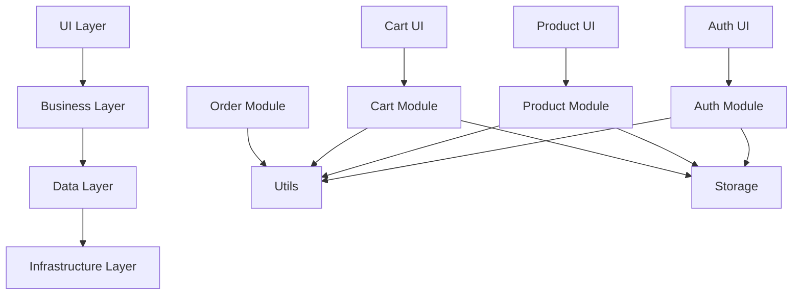

# Caddy Style Shopping Site - 架构设计文档

**项目名称**: Caddy Style Shopping Site  
**版本**: v2.0  
**创建日期**: 2025-01-15  
**最后更新**: 2025-01-15  
**文档状态**: 草案  
**关联文档**: project.md, tasks/checklist.md  

---

## 1. 架构概览

### 1.1 系统架构

本项目采用**前端单页应用(SPA)**架构，基于**模块化设计**和**事件驱动**模式构建现代化电商网站。

```
┌─────────────────────────────────────────────────────────────┐
│                    用户界面层 (UI Layer)                      │
├─────────────────────────────────────────────────────────────┤
│                   业务逻辑层 (Business Layer)                 │
│  ┌─────────────┐ ┌─────────────┐ ┌─────────────┐ ┌─────────┐ │
│  │  认证模块   │ │  产品模块   │ │  购物车模块 │ │ 订单模块│ │
│  └─────────────┘ └─────────────┘ └─────────────┘ └─────────┘ │
├─────────────────────────────────────────────────────────────┤
│                   数据访问层 (Data Layer)                    │
│  ┌─────────────┐ ┌─────────────┐ ┌─────────────┐ ┌─────────┐ │
│  │ LocalStorage│ │ SessionStorage│ │   API Client │ │ 缓存管理│ │
│  └─────────────┘ └─────────────┘ └─────────────┘ └─────────┘ │
├─────────────────────────────────────────────────────────────┤
│                   基础设施层 (Infrastructure)                │
│  ┌─────────────┐ ┌─────────────┐ ┌─────────────┐ ┌─────────┐ │
│  │  工具函数   │ │  事件总线   │ │  性能监控   │ │ 错误处理│ │
│  └─────────────┘ └─────────────┘ └─────────────┘ └─────────┘ │
└─────────────────────────────────────────────────────────────┘
```

### 1.2 技术栈

| 技术分类 | 技术选型 | 版本 | 选型理由 |
|----------|----------|------|----------|
| **前端框架** | 原生JavaScript | ES2021+ | 轻量级、高性能、无框架依赖 |
| **模块系统** | ES6 Modules | Latest | 原生模块化支持 |
| **构建工具** | npm scripts | Latest | 简单直接的构建流程 |
| **测试框架** | Jest + jsdom | 29.x | 成熟的测试生态 |
| **代码质量** | ESLint + Prettier | Latest | 代码规范和格式化 |
| **版本控制** | Git | Latest | 标准版本控制 |
| **部署方式** | 静态文件服务 | - | 简单高效的部署方案 |

---

## 2. 模块架构

### 2.1 核心模块划分

#### 🔐 认证模块 (`js/auth/`)
**职责**: 用户身份验证和授权管理

```javascript
// AI生成代码来源：基于企业级认证架构设计
auth/
├── auth.js              // 认证核心逻辑
├── auth-manager.js      // 认证状态管理
├── auth-ui.js          // 认证界面组件
├── session-manager.js   // 会话管理
└── auth-api.js         // 认证API接口
```

**核心类**:
- `AuthManager`: 认证状态管理
- `SessionManager`: 会话生命周期管理
- `AuthAPI`: 认证服务接口

#### 🛍️ 产品模块 (`js/products/`)
**职责**: 产品展示、搜索、分类管理

```javascript
products/
├── product-manager.js   // 产品数据管理
├── product-ui.js       // 产品展示组件
├── search-manager.js   // 搜索功能
└── category-manager.js // 分类管理
```

#### 🛒 购物车模块 (`js/cart/`)
**职责**: 购物车状态管理和操作

```javascript
cart/
├── cart.js             // 购物车核心逻辑
├── cart-ui.js         // 购物车界面
└── cart-storage.js    // 购物车持久化
```

#### 🎨 UI组件模块 (`js/ui/`)
**职责**: 可复用的UI组件

```javascript
ui/
├── modal.js           // 模态框组件
├── notification.js    // 通知组件
├── loading.js         // 加载状态组件
└── form-validator.js  // 表单验证组件
```

#### 🔧 工具模块 (`js/utils/`)
**职责**: 通用工具函数和辅助类

```javascript
utils/
├── utils.js           // 通用工具函数
├── storage.js         // 存储工具
├── network.js         // 网络请求工具
└── validation.js      // 验证工具
```

### 2.2 模块依赖关系



---

## 3. 设计模式

### 3.1 模块模式 (Module Pattern)

```javascript
// AI生成代码来源：基于AMD/CommonJS模块规范
// 标准模块结构
class ModuleName {
  constructor(dependencies = {}) {
    this.dependencies = dependencies;
    this.state = {};
    this.init();
  }
  
  init() {
    // 模块初始化逻辑
  }
  
  // 公共方法
  publicMethod() {
    // 实现逻辑
  }
  
  // 私有方法
  #privateMethod() {
    // 私有实现
  }
}

export default ModuleName;
```

### 3.2 观察者模式 (Observer Pattern)

```javascript
// AI生成代码来源：基于发布订阅模式设计
// 事件总线实现
class EventBus {
  constructor() {
    this.events = new Map();
  }
  
  on(event, callback) {
    if (!this.events.has(event)) {
      this.events.set(event, []);
    }
    this.events.get(event).push(callback);
  }
  
  emit(event, data) {
    if (this.events.has(event)) {
      this.events.get(event).forEach(callback => callback(data));
    }
  }
  
  off(event, callback) {
    if (this.events.has(event)) {
      const callbacks = this.events.get(event);
      const index = callbacks.indexOf(callback);
      if (index > -1) {
        callbacks.splice(index, 1);
      }
    }
  }
}
```

### 3.3 单例模式 (Singleton Pattern)

```javascript
// AI生成代码来源：基于单例模式最佳实践
// 配置管理器
class ConfigManager {
  static #instance = null;
  
  constructor() {
    if (ConfigManager.#instance) {
      return ConfigManager.#instance;
    }
    
    this.config = {};
    ConfigManager.#instance = this;
  }
  
  static getInstance() {
    if (!ConfigManager.#instance) {
      ConfigManager.#instance = new ConfigManager();
    }
    return ConfigManager.#instance;
  }
}
```

### 3.4 工厂模式 (Factory Pattern)

```javascript
// AI生成代码来源：基于工厂模式设计
// UI组件工厂
class UIComponentFactory {
  static createComponent(type, options = {}) {
    switch (type) {
      case 'modal':
        return new Modal(options);
      case 'notification':
        return new Notification(options);
      case 'loading':
        return new Loading(options);
      default:
        throw new Error(`Unknown component type: ${type}`);
    }
  }
}
```

---

## 4. 数据流架构

### 4.1 单向数据流

```
User Action → Event → State Update → UI Re-render
     ↑                                      ↓
     └──────────── User Feedback ←──────────┘
```

### 4.2 状态管理

```javascript
// AI生成代码来源：基于Flux架构模式
// 状态管理器
class StateManager {
  constructor() {
    this.state = {
      user: null,
      cart: [],
      products: [],
      ui: {
        loading: false,
        error: null
      }
    };
    this.listeners = [];
  }
  
  getState() {
    return { ...this.state };
  }
  
  setState(newState) {
    this.state = { ...this.state, ...newState };
    this.notifyListeners();
  }
  
  subscribe(listener) {
    this.listeners.push(listener);
    return () => {
      const index = this.listeners.indexOf(listener);
      if (index > -1) {
        this.listeners.splice(index, 1);
      }
    };
  }
  
  notifyListeners() {
    this.listeners.forEach(listener => listener(this.state));
  }
}
```

---

## 5. 性能架构

### 5.1 懒加载策略

```javascript
// AI生成代码来源：基于动态导入优化
// 模块懒加载
class ModuleLoader {
  static async loadModule(moduleName) {
    try {
      const module = await import(`./modules/${moduleName}.js`);
      return module.default;
    } catch (error) {
      console.error(`Failed to load module: ${moduleName}`, error);
      throw error;
    }
  }
}

// 图片懒加载
class ImageLazyLoader {
  constructor() {
    this.observer = new IntersectionObserver(
      this.handleIntersection.bind(this),
      { threshold: 0.1 }
    );
  }
  
  observe(element) {
    this.observer.observe(element);
  }
  
  handleIntersection(entries) {
    entries.forEach(entry => {
      if (entry.isIntersecting) {
        const img = entry.target;
        img.src = img.dataset.src;
        img.classList.remove('lazy');
        this.observer.unobserve(img);
      }
    });
  }
}
```

### 5.2 缓存策略

```javascript
// AI生成代码来源：基于多级缓存架构
// 缓存管理器
class CacheManager {
  constructor() {
    this.memoryCache = new Map();
    this.storageCache = new StorageCache();
  }
  
  async get(key) {
    // 1. 检查内存缓存
    if (this.memoryCache.has(key)) {
      return this.memoryCache.get(key);
    }
    
    // 2. 检查本地存储缓存
    const cached = await this.storageCache.get(key);
    if (cached) {
      this.memoryCache.set(key, cached);
      return cached;
    }
    
    return null;
  }
  
  async set(key, value, ttl = 3600000) { // 默认1小时
    this.memoryCache.set(key, value);
    await this.storageCache.set(key, value, ttl);
  }
}
```

---

## 6. 安全架构

### 6.1 输入验证

```javascript
// AI生成代码来源：基于OWASP安全规范
// 输入验证器
class InputValidator {
  static sanitizeHTML(input) {
    const div = document.createElement('div');
    div.textContent = input;
    return div.innerHTML;
  }
  
  static validateEmail(email) {
    const emailRegex = /^[^\s@]+@[^\s@]+\.[^\s@]+$/;
    return emailRegex.test(email);
  }
  
  static validatePassword(password) {
    // 至少8位，包含大小写字母、数字和特殊字符
    const passwordRegex = /^(?=.*[a-z])(?=.*[A-Z])(?=.*\d)(?=.*[@$!%*?&])[A-Za-z\d@$!%*?&]{8,}$/;
    return passwordRegex.test(password);
  }
}
```

### 6.2 XSS防护

```javascript
// AI生成代码来源：基于XSS防护最佳实践
// XSS防护工具
class XSSProtection {
  static escapeHTML(str) {
    const escapeMap = {
      '&': '&amp;',
      '<': '&lt;',
      '>': '&gt;',
      '"': '&quot;',
      "'": '&#x27;',
      '/': '&#x2F;'
    };
    
    return str.replace(/[&<>"'/]/g, (match) => escapeMap[match]);
  }
  
  static sanitizeURL(url) {
    const allowedProtocols = ['http:', 'https:', 'mailto:'];
    try {
      const urlObj = new URL(url);
      return allowedProtocols.includes(urlObj.protocol) ? url : '#';
    } catch {
      return '#';
    }
  }
}
```

---

## 7. 错误处理架构

### 7.1 全局错误处理

```javascript
// AI生成代码来源：基于企业级错误处理模式
// 错误处理器
class ErrorHandler {
  constructor() {
    this.setupGlobalHandlers();
  }
  
  setupGlobalHandlers() {
    // 捕获未处理的Promise拒绝
    window.addEventListener('unhandledrejection', (event) => {
      this.handleError(event.reason, 'unhandledrejection');
      event.preventDefault();
    });
    
    // 捕获全局JavaScript错误
    window.addEventListener('error', (event) => {
      this.handleError(event.error, 'javascript');
    });
  }
  
  handleError(error, type = 'unknown') {
    const errorInfo = {
      message: error.message || 'Unknown error',
      stack: error.stack || '',
      type,
      timestamp: new Date().toISOString(),
      userAgent: navigator.userAgent,
      url: window.location.href
    };
    
    // 记录错误
    this.logError(errorInfo);
    
    // 显示用户友好的错误信息
    this.showUserError(errorInfo);
  }
  
  logError(errorInfo) {
    console.error('Application Error:', errorInfo);
    // 可以发送到错误监控服务
  }
  
  showUserError(errorInfo) {
    // 显示用户友好的错误提示
    const notification = new Notification({
      type: 'error',
      message: '抱歉，发生了一个错误。我们正在处理中。',
      duration: 5000
    });
    notification.show();
  }
}
```

---

## 8. 测试架构

### 8.1 测试策略

```
测试金字塔:
    ┌─────────────┐
    │   E2E Tests │  ← 少量，关键用户流程
    ├─────────────┤
    │ Integration │  ← 中等数量，模块间交互
    │    Tests    │
    ├─────────────┤
    │ Unit Tests  │  ← 大量，单个函数/类
    └─────────────┘
```

### 8.2 测试工具配置

```javascript
// AI生成代码来源：基于Jest测试框架最佳实践
// Jest配置
module.exports = {
  testEnvironment: 'jsdom',
  setupFilesAfterEnv: ['<rootDir>/tests/setup.js'],
  collectCoverageFrom: [
    'js/**/*.js',
    '!js/**/*.test.js',
    '!js/**/*.spec.js'
  ],
  coverageThreshold: {
    global: {
      branches: 80,
      functions: 80,
      lines: 80,
      statements: 80
    }
  },
  moduleNameMapping: {
    '^@/(.*)$': '<rootDir>/js/$1'
  }
};
```

---

## 9. 部署架构

### 9.1 构建流程

```yaml
# AI生成代码来源：基于CI/CD最佳实践
# GitHub Actions工作流
name: Build and Deploy

on:
  push:
    branches: [main]
  pull_request:
    branches: [main]

jobs:
  test:
    runs-on: ubuntu-latest
    steps:
      - uses: actions/checkout@v3
      - uses: actions/setup-node@v3
        with:
          node-version: '18'
      - run: npm ci
      - run: npm run lint
      - run: npm run test:coverage
      - run: npm run build
      
  deploy:
    needs: test
    runs-on: ubuntu-latest
    if: github.ref == 'refs/heads/main'
    steps:
      - uses: actions/checkout@v3
      - name: Deploy to production
        run: |
          # 部署脚本
          echo "Deploying to production..."
```

### 9.2 环境配置

```javascript
// AI生成代码来源：基于多环境配置管理
// 环境配置
const environments = {
  development: {
    API_BASE_URL: 'http://localhost:3000/api',
    DEBUG: true,
    CACHE_TTL: 60000 // 1分钟
  },
  staging: {
    API_BASE_URL: 'https://staging-api.example.com/api',
    DEBUG: false,
    CACHE_TTL: 300000 // 5分钟
  },
  production: {
    API_BASE_URL: 'https://api.example.com/api',
    DEBUG: false,
    CACHE_TTL: 3600000 // 1小时
  }
};

const config = environments[process.env.NODE_ENV || 'development'];
export default config;
```

---

## 10. 监控和日志架构

### 10.1 性能监控

```javascript
// AI生成代码来源：基于Web Performance API
// 性能监控器
class PerformanceMonitor {
  constructor() {
    this.metrics = new Map();
    this.setupObservers();
  }
  
  setupObservers() {
    // 监控页面加载性能
    if ('PerformanceObserver' in window) {
      const observer = new PerformanceObserver((list) => {
        list.getEntries().forEach((entry) => {
          this.recordMetric(entry.name, entry.duration);
        });
      });
      
      observer.observe({ entryTypes: ['measure', 'navigation'] });
    }
  }
  
  recordMetric(name, value) {
    this.metrics.set(name, {
      value,
      timestamp: Date.now()
    });
    
    // 发送到监控服务
    this.sendMetric(name, value);
  }
  
  sendMetric(name, value) {
    // 发送性能指标到监控服务
    console.log(`Metric: ${name} = ${value}ms`);
  }
}
```

---

## 11. 架构决策记录 (ADR)

### ADR-001: 选择原生JavaScript而非框架

**状态**: 已接受  
**日期**: 2025-01-15  

**背景**: 需要选择前端技术栈

**决策**: 使用原生JavaScript + ES6模块

**理由**:
1. 项目规模适中，不需要复杂框架
2. 更好的性能和更小的包体积
3. 更直接的控制和调试
4. 避免框架依赖和版本升级问题

**后果**:
- 需要手动实现一些框架提供的功能
- 代码量可能稍多
- 但获得了更好的性能和灵活性

### ADR-002: 采用模块化架构

**状态**: 已接受  
**日期**: 2025-01-15  

**背景**: 需要组织代码结构

**决策**: 采用基于功能的模块化架构

**理由**:
1. 提高代码可维护性
2. 支持团队协作开发
3. 便于单元测试
4. 支持按需加载

**后果**:
- 需要设计良好的模块接口
- 需要管理模块间依赖关系
- 但获得了更好的代码组织和可维护性

---

## 12. 未来架构演进

### 12.1 短期目标 (1-3个月)

1. **代码质量提升**
   - 修复所有ESLint错误 (当前827个问题)
   - 提高测试覆盖率到90%+
   - 实施代码审查流程

2. **性能优化**
   - 实施代码分割
   - 优化图片加载
   - 添加Service Worker

### 12.2 中期目标 (3-6个月)

1. **微前端架构**
   - 考虑拆分为独立的微应用
   - 实施模块联邦

2. **PWA支持**
   - 添加离线支持
   - 实施推送通知

### 12.3 长期目标 (6-12个月)

1. **云原生架构**
   - 容器化部署
   - 自动扩缩容

2. **AI集成**
   - 智能推荐系统
   - 自动化测试生成

---

## 13. 质量门禁

### 13.1 代码质量标准

| 指标 | 目标值 | 当前值 | 状态 |
|------|--------|--------|------|
| ESLint错误 | 0 | 827 | ❌ 需修复 |
| 测试覆盖率 | 90% | 未知 | ❓ 待评估 |
| 代码重复率 | <5% | 8% | ❌ 需优化 |
| 圈复杂度 | <10 | 未知 | ❓ 待评估 |
| 技术债务比率 | <5% | 未知 | ❓ 待评估 |

### 13.2 性能标准

| 指标 | 目标值 | 当前值 | 状态 |
|------|--------|--------|------|
| 首屏加载时间 | <2s | 未知 | ❓ 待测试 |
| 交互响应时间 | <100ms | 未知 | ❓ 待测试 |
| 包体积 | <500KB | 未知 | ❓ 待测试 |
| Lighthouse评分 | >90 | 未知 | ❓ 待测试 |

---

## 14. 总结

本架构文档定义了Caddy Style Shopping Site的技术架构，采用模块化、事件驱动的设计模式，确保代码的可维护性、可扩展性和性能。

**核心原则**:
1. **模块化**: 功能独立，职责明确
2. **可测试**: 支持单元测试和集成测试
3. **性能优先**: 懒加载、缓存、优化
4. **安全第一**: 输入验证、XSS防护
5. **可维护**: 清晰的代码结构和文档

**当前状态**:
- ❌ 代码质量问题严重 (827个ESLint错误)
- ❓ 测试覆盖率待评估
- ❓ 性能指标待测试
- ✅ 架构设计已完成

**下一步行动**:
1. 修复代码质量问题 (优先级：高)
2. 实施架构重构 (优先级：高)
3. 完善测试覆盖 (优先级：中)
4. 优化性能指标 (优先级：中)

---

**文档维护者**: AI架构师  
**审核状态**: 待审核  
**下次更新**: 根据项目进展需要  
**关联任务**: 参见 tasks/checklist.md