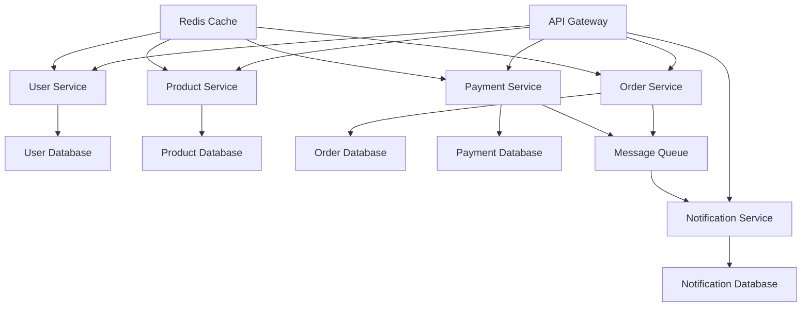

# 🚀 后端系统优化方案

> **文档版本**: v1.1
> **创建时间**: 2025-10-07
> **最后更新**: 2025-10-07
> **负责人**: 后端开发团队

## 📋 目录

- [1. 项目现状分析](#1-项目现状分析)
- [2. 高优先级问题与修复建议](#2-高优先级问题与修复建议)
- [3. 优化方案](#3-优化方案)
- [4. 实施计划](#4-实施计划)
- [5. 风险评估](#5-风险评估)
- [6. 成功指标](#6-成功指标)

---

## 1. 项目现状分析

### 1.1 技术栈概览
- **框架**: NestJS 11.x + TypeScript
- **数据库**: MySQL/PostgreSQL/SQLite/TiDB (多数据库支持)
- **缓存**: Redis (分布式锁 + 多层缓存)
- **消息队列**: Redpanda/Kafka
- **认证**: JWT (RS256/HS256)
- **监控**: Jaeger/Zipkin + Prometheus + Grafana
- **容器化**: Docker + Docker Compose

### 1.2 当前优势
✅ **架构设计**: DDD 四层架构，模块化程度高  
✅ **技术选型**: 现代化技术栈，社区活跃  
✅ **安全措施**: 全面的安全防护机制  
✅ **性能优化**: 多层缓存 + 分布式锁  
✅ **容器化**: 完整的 Docker 配置  

### 1.3 存在问题
❌ **测试覆盖率**: 仅 68.5%，低于行业标准
❌ **错误处理**: 缺少统一的异常处理机制
❌ **监控告警**: 监控体系不完整，缺少告警机制
❌ **文档完善**: API 文档和架构文档不足
❌ **CI/CD**: 自动化部署流水线不完整
❌ **模块系统不一致**: ESM/CJS 混用导致运行时错误
❌ **Docker 构建问题**: 构建阶段依赖安装错误
❌ **配置不匹配**: 健康检查路径、Swagger 导入等问题

---

## 2. 高优先级问题与修复建议

### 2.1 模块系统不一致问题

#### 问题描述
- [`package.json`](backend/package.json:2) 使用 `"type": "module"` (ESM)
- [`tsconfig.json`](backend/tsconfig.json:3) 配置 `"module": "commonjs"`
- [`main.ts`](backend/src/main.ts:199) 包含 `require(...)` 调用，在 ESM 环境下会崩溃

#### 解决方案 A: 切换到 CommonJS (推荐)
```json
// package.json 修改
{
  "type": "commonjs" // 删除或改为 "type": "commonjs"
}
```

```typescript
// tsconfig.json 保持不变
{
  "compilerOptions": {
    "module": "commonjs"
  }
}
```

```javascript
// jest.config.cjs 调整
module.exports = {
  // 如有冲突，将 extensionsToTreatAsEsm 去除或设为空
  extensionsToTreatAsEsm: []
}
```

#### 解决方案 B: 全面切为 ESM
```json
// package.json 保持
{
  "type": "module"
}
```

```json
// tsconfig.json 修改
{
  "compilerOptions": {
    "module": "ESNext"
  }
}
```

```typescript
// main.ts 修改
// 将所有 require 改为 import
import { writeFileSync, mkdirSync } from 'fs';
import { join } from 'path';
```

### 2.2 Docker 构建问题修复

#### 问题描述
- Builder 阶段使用 `npm ci --only=production`，但 `nest build` 需要 devDependencies
- 未复制 `nest-cli.json` 文件
- 健康检查路径不匹配 (`/health` vs `/api/health`)
- 镜像内包含 `.env` 文件

#### 修复后的 Dockerfile
```dockerfile
# 后端服务 Dockerfile
FROM node:18-alpine AS builder

# 安装构建依赖
RUN apk add --no-cache python3 make g++

# 设置工作目录
WORKDIR /app

# 复制配置文件
COPY package*.json ./
COPY tsconfig*.json ./
COPY nest-cli.json ./

# 安装全部依赖
RUN npm ci

# 复制源代码
COPY src/ ./src/

# 构建应用
RUN npm run build

# 生产环境裁剪
RUN npm prune --production

# 生产镜像
FROM node:18-alpine

# 安装运行时依赖
RUN apk add --no-cache dumb-init curl

# 创建非 root 用户
RUN addgroup -g 1001 -S nodejs && \
    adduser -S nestjs -u 1001

# 设置工作目录
WORKDIR /app

# 从构建阶段复制文件
COPY --from=builder --chown=nestjs:nodejs /app/package*.json ./
COPY --from=builder --chown=nestjs:nodejs /app/node_modules ./node_modules
COPY --from=builder --chown=nestjs:nodejs /app/dist ./dist

# 创建日志目录
RUN mkdir -p /app/logs && chown -R nestjs:nodejs /app/logs

# 切换到非 root 用户
USER nestjs

# 健康检查 - 修正路径
HEALTHCHECK --interval=30s --timeout=10s --start-period=30s --retries=3 \
    CMD curl -f http://localhost:3000/api/health || exit 1

# 暴露端口
EXPOSE 3000

# 启动命令
ENTRYPOINT ["dumb-init", "--"]
CMD ["node", "dist/main.js"]
```

### 2.3 Swagger 导入问题修复

#### 问题描述
- [`main.ts`](backend/src/main.ts:166) 使用 `require('./common/dto/api-response.dto')`
- 与 `"type": "module"` 冲突

#### 修复方案
```typescript
// main.ts 修改
import { ApiResponseDto, ErrorResponseDto, PaginatedResponseDto } from './common/dto/api-response.dto';

// 在创建文档时直接引用已导入的类
const document = SwaggerModule.createDocument(app, config, {
  extraModels: [ApiResponseDto, ErrorResponseDto, PaginatedResponseDto],
});
```

### 2.4 ESLint 配置问题修复

#### 问题描述
- [`.eslintrc.json`](backend/.eslintrc.json:41) 忽略规则包含 `'test/'`
- 但 files 匹配 `test/**/*`，导致冲突

#### 修复方案
```json
{
  "ignorePatterns": [
    "dist/**",
    "coverage/**",
    "node_modules/**",
    "**/*.d.ts"
    // 移除 'test/'，确保测试代码被 lint
  ]
}
```

### 2.5 ValidationPipe 配置修复

#### 问题描述
- [`main.ts`](backend/src/main.ts:89) 使用 `validateCustomDecorators: true`
- 该项并非标准属性

#### 修复方案
```typescript
// main.ts 修改
app.useGlobalPipes(
  new ValidationPipe({
    whitelist: true,
    forbidNonWhitelisted: true,
    transform: true,
    transformOptions: {
      enableImplicitConversion: true,
    },
  }),
);
```

### 2.6 中优先级问题

#### 生产安全与配置
- 不在镜像内包含 `.env` 文件
- 通过环境变量、K8s ConfigMap/Secret 或 Docker secrets 管理配置
- CORS allowedHeaders 扩展：`X-Requested-With`, `X-Trace-Id`

#### Jest 配置优化
- 确认 `test/setup.ts` 与 `jest.env.cjs` 存在
- 覆盖率阈值逐步提升
- 路径映射正确性验证

#### 依赖健康检查
- `"express": ^5.1.0` 为 5.x 版本，确认兼容性
- 必要时回退到 express 4 降低风险

---

## 3. 优化目标

### 3.1 紧急修复目标 (1周内)
- 🔥 修复模块系统不一致问题
- 🔥 修复 Docker 构建和健康检查问题
- 🔥 修复 Swagger 导入和 ESLint 配置问题
- 🔥 修复 ValidationPipe 配置问题

### 3.2 短期目标 (1个月内)
- 🎯 测试覆盖率提升至 85%+
- 🎯 完善全局异常处理机制
- 🎯 建立完整的监控告警体系
- 🎯 补充核心 API 文档

### 3.3 中期目标 (3个月内)
- 🎯 实现微服务化架构改造
- 🎯 建立完整的 CI/CD 流水线
- 🎯 完成云原生部署配置
- 🎯 性能提升 30%+

### 3.4 长期目标 (6个月内)
- 🎯 实现自动化运维体系
- 🎯 建立完善的灾备机制
- 🎯 完成安全审计和加固
- 🎯 实现智能化监控和预警

---

## 4. 优化方案

### 4.1 紧急修复方案

#### 4.1.1 模块系统统一修复
```bash
# 快速修复脚本
#!/bin/bash
# 修复 package.json
sed -i 's/"type": "module"/"type": "commonjs"/' package.json

# 修复 main.ts 中的 require 调用
sed -i 's/const fs = require('\''fs'\'');/import { writeFileSync, mkdirSync } from '\''fs'\'';/' src/main.ts
sed -i 's/const path = require('\''path'\'');/import { join } from '\''path'\'';/' src/main.ts
sed -i 's/fs.writeFileSync/writeFileSync/g' src/main.ts
sed -i 's/path.join/join/g' src/main.ts
sed -i 's/fs.mkdirSync/mkdirSync/g' src/main.ts
```

#### 4.1.2 Docker 构建修复验证
```bash
# 验证 Docker 构建
docker build -t caddy-shopping-backend:test .
docker run --rm -p 3000:3000 caddy-shopping-backend:test

# 验证健康检查
curl -f http://localhost:3000/api/health
```

#### 4.1.3 配置文件修复验证
```bash
# 验证 ESLint 配置
npx eslint src/ --ext .ts

# 验证 Jest 配置
npm run test -- --dry-run

# 验证应用启动
npm run build
npm run start:prod
```

### 4.2 测试质量提升方案

#### 3.1.1 测试基础设施优化
```typescript
// 更新 jest.config.cjs
module.exports = {
  coverageThreshold: {
    global: {
      branches: 80,
      functions: 80,
      lines: 80,
      statements: 80
    },
    // 核心业务模块要求更高覆盖率
    'src/auth/': {
      branches: 90,
      functions: 90,
      lines: 90,
      statements: 90
    },
    'src/users/': {
      branches: 85,
      functions: 85,
      lines: 85,
      statements: 85
    }
  },
  // 增加测试报告格式
  coverageReporters: ['text', 'lcov', 'html', 'json-summary', 'clover']
};
```

#### 3.1.2 测试工具链增强
```json
// package.json 新增依赖
{
  "devDependencies": {
    "@types/jest": "^29.5.0",
    "@types/supertest": "^2.0.12",
    "jest": "^29.5.0",
    "supertest": "^6.3.3",
    "ts-jest": "^29.1.0",
    "jest-html-reporters": "^3.1.5",
    "jest-junit": "^16.0.0"
  }
}
```

#### 3.1.3 测试用例模板
```typescript
// test/utils/test-helpers.ts
export const createTestUser = (overrides = {}) => ({
  id: 'test-user-id',
  username: 'testuser',
  email: 'test@example.com',
  password: 'hashedPassword',
  firstName: 'Test',
  lastName: 'User',
  isActive: true,
  createdAt: new Date(),
  updatedAt: new Date(),
  ...overrides
});

export const createTestProduct = (overrides = {}) => ({
  id: 'test-product-id',
  name: 'Test Product',
  description: 'Test Description',
  price: 99.99,
  stock: 10,
  sku: 'TEST-001',
  isActive: true,
  createdAt: new Date(),
  updatedAt: new Date(),
  ...overrides
});

// 测试数据库设置
export const setupTestDatabase = async () => {
  const module = await Test.createTestingModule({
    imports: [
      TypeOrmModule.forRoot({
        type: 'sqlite',
        database: ':memory:',
        entities: [User, Product, Order],
        synchronize: true,
        logging: false
      })
    ]
  }).compile();
  
  return module;
};
```

#### 3.1.4 测试执行计划
- **Week 1**: 修复现有测试问题，提升基础覆盖率
- **Week 2**: 补充核心业务逻辑测试
- **Week 3**: 完善集成测试和 E2E 测试
- **Week 4**: 性能测试和安全测试

### 4.3 错误处理机制优化

#### 3.2.1 全局异常过滤器
```typescript
// src/common/filters/global-exception.filter.ts
import {
  ExceptionFilter,
  Catch,
  ArgumentsHost,
  HttpException,
  HttpStatus,
  Logger
} from '@nestjs/common';
import { Request, Response } from 'express';

@Catch()
export class GlobalExceptionFilter implements ExceptionFilter {
  private readonly logger = new Logger(GlobalExceptionFilter.name);

  catch(exception: unknown, host: ArgumentsHost) {
    const ctx = host.switchToHttp();
    const response = ctx.getResponse<Response>();
    const request = ctx.getRequest<Request>();

    let status: HttpStatus;
    let message: string;
    let code: string;

    if (exception instanceof HttpException) {
      status = exception.getStatus();
      const exceptionResponse = exception.getResponse();
      message = typeof exceptionResponse === 'string' 
        ? exceptionResponse 
        : (exceptionResponse as any).message || exception.message;
      code = `HTTP_${status}`;
    } else {
      status = HttpStatus.INTERNAL_SERVER_ERROR;
      message = 'Internal server error';
      code = 'INTERNAL_SERVER_ERROR';
      
      // 记录未知错误
      this.logger.error(
        `Unhandled exception: ${exception}`,
        exception instanceof Error ? exception.stack : undefined
      );
    }

    const errorResponse = {
      code,
      message,
      timestamp: new Date().toISOString(),
      path: request.url,
      method: request.method,
      requestId: request.headers['x-request-id'] || 'unknown',
      ...(process.env.NODE_ENV === 'development' && { 
        stack: exception instanceof Error ? exception.stack : undefined 
      })
    };

    response.status(status).json(errorResponse);
  }
}
```

#### 3.2.2 业务异常类
```typescript
// src/common/exceptions/business.exception.ts
export class BusinessException extends HttpException {
  constructor(
    code: string,
    message: string,
    statusCode: HttpStatus = HttpStatus.BAD_REQUEST,
    details?: any
  ) {
    super(
      {
        code,
        message,
        details,
        timestamp: new Date().toISOString()
      },
      statusCode
    );
  }
}

// 使用示例
throw new BusinessException(
  'USER_NOT_FOUND',
  '用户不存在',
  HttpStatus.NOT_FOUND
);
```

### 3.3 监控告警体系优化

#### 3.3.1 Prometheus 指标配置
```typescript
// src/monitoring/metrics.service.ts
import { Injectable } from '@nestjs/common';
import { Counter, Histogram, Registry } from 'prom-client';

@Injectable()
export class MetricsService {
  private registry = new Registry();
  
  // 请求计数器
  private requestCounter = new Counter({
    name: 'http_requests_total',
    help: 'Total number of HTTP requests',
    labelNames: ['method', 'route', 'status_code'],
    registers: [this.registry]
  });

  // 请求延迟
  private requestDuration = new Histogram({
    name: 'http_request_duration_seconds',
    help: 'Duration of HTTP requests in seconds',
    labelNames: ['method', 'route'],
    buckets: [0.1, 0.3, 0.5, 0.7, 1, 3, 5, 7, 10],
    registers: [this.registry]
  });

  // 业务指标
  private businessCounter = new Counter({
    name: 'business_operations_total',
    help: 'Total number of business operations',
    labelNames: ['operation', 'status'],
    registers: [this.registry]
  });

  incrementRequestCounter(method: string, route: string, statusCode: number) {
    this.requestCounter.inc({ method, route, status_code: statusCode });
  }

  observeRequestDuration(method: string, route: string, duration: number) {
    this.requestDuration.observe({ method, route }, duration / 1000);
  }

  incrementBusinessCounter(operation: string, status: 'success' | 'failure') {
    this.businessCounter.inc({ operation, status });
  }

  getMetrics() {
    return this.registry.metrics();
  }
}
```

#### 3.3.2 Grafana 仪表板配置
```json
{
  "dashboard": {
    "title": "Caddy Shopping Backend",
    "panels": [
      {
        "title": "请求速率",
        "type": "graph",
        "targets": [
          {
            "expr": "rate(http_requests_total[5m])",
            "legendFormat": "{{method}} {{route}}"
          }
        ]
      },
      {
        "title": "请求延迟",
        "type": "graph",
        "targets": [
          {
            "expr": "histogram_quantile(0.95, rate(http_request_duration_seconds_bucket[5m]))",
            "legendFormat": "95th percentile"
          }
        ]
      },
      {
        "title": "错误率",
        "type": "singlestat",
        "targets": [
          {
            "expr": "rate(http_requests_total{status_code=~\"5..\"}[5m]) / rate(http_requests_total[5m])",
            "legendFormat": "Error Rate"
          }
        ]
      }
    ]
  }
}
```

#### 3.3.3 告警规则配置
```yaml
# monitoring/alerts.yml
groups:
  - name: backend-alerts
    rules:
      - alert: HighErrorRate
        expr: rate(http_requests_total{status_code=~"5.."}[5m]) / rate(http_requests_total[5m]) > 0.05
        for: 5m
        labels:
          severity: critical
        annotations:
          summary: "High error rate detected"
          description: "Error rate is above 5% for more than 5 minutes"

      - alert: HighLatency
        expr: histogram_quantile(0.95, rate(http_request_duration_seconds_bucket[5m])) > 1
        for: 5m
        labels:
          severity: warning
        annotations:
          summary: "High latency detected"
          description: "95th percentile latency is above 1 second"

      - alert: DatabaseConnectionFailure
        expr: up{job="database"} == 0
        for: 1m
        labels:
          severity: critical
        annotations:
          summary: "Database connection failure"
          description: "Database is down for more than 1 minute"
```

### 3.4 性能优化方案

#### 3.4.1 数据库优化
```sql
-- 添加复合索引优化查询性能
CREATE INDEX idx_cart_items_user_status ON cart_items(customer_user_id, select_flag, del_flag);
CREATE INDEX idx_products_category_active ON products(category_id, is_active);
CREATE INDEX idx_orders_user_status ON orders(user_id, status);

-- 分区表优化大数据量查询
CREATE TABLE orders (
  id VARCHAR(50) PRIMARY KEY,
  user_id VARCHAR(50) NOT NULL,
  total_amount DECIMAL(10,2) NOT NULL,
  status VARCHAR(20) NOT NULL,
  created_at TIMESTAMP DEFAULT CURRENT_TIMESTAMP,
  updated_at TIMESTAMP DEFAULT CURRENT_TIMESTAMP ON UPDATE CURRENT_TIMESTAMP
) PARTITION BY RANGE (YEAR(created_at)) (
  PARTITION p2023 VALUES LESS THAN (2024),
  PARTITION p2024 VALUES LESS THAN (2025),
  PARTITION p2025 VALUES LESS THAN (2026),
  PARTITION p_future VALUES LESS THAN MAXVALUE
);
```

#### 3.4.2 缓存策略优化
```typescript
// src/cache/advanced-cache.service.ts
import { Injectable } from '@nestjs/common';
import { Redis } from 'ioredis';

@Injectable()
export class AdvancedCacheService {
  constructor(private readonly redis: Redis) {}

  // 多层缓存策略
  async get<T>(key: string): Promise<T | null> {
    // L1: 内存缓存
    const memoryCache = this.getFromMemory<T>(key);
    if (memoryCache) return memoryCache;

    // L2: Redis 缓存
    const redisCache = await this.redis.get(key);
    if (redisCache) {
      const data = JSON.parse(redisCache);
      this.setToMemory(key, data, 60); // 内存缓存60秒
      return data;
    }

    return null;
  }

  async set(key: string, value: any, ttl: number = 3600): Promise<void> {
    // 同时设置内存和 Redis 缓存
    this.setToMemory(key, value, Math.min(ttl, 300)); // 内存缓存最多5分钟
    await this.redis.setex(key, ttl, JSON.stringify(value));
  }

  // 缓存预热
  async warmupCache(): Promise<void> {
    // 预加载热点数据
    const hotProducts = await this.getHotProducts();
    for (const product of hotProducts) {
      await this.set(`product:${product.id}`, product, 1800);
    }
  }

  // 缓存失效策略
  async invalidatePattern(pattern: string): Promise<void> {
    const keys = await this.redis.keys(pattern);
    if (keys.length > 0) {
      await this.redis.del(...keys);
    }
    this.clearMemoryPattern(pattern);
  }
}
```

#### 3.4.3 API 响应优化
```typescript
// src/common/interceptors/response-optimization.interceptor.ts
import { Injectable, NestInterceptor, ExecutionContext, CallHandler } from '@nestjs/common';
import { Observable } from 'rxjs';
import { map } from 'rxjs/operators';
import { compress } from 'lz4';

@Injectable()
export class ResponseOptimizationInterceptor implements NestInterceptor {
  intercept(context: ExecutionContext, next: CallHandler): Observable<any> {
    return next.handle().pipe(
      map(data => {
        // 数据压缩
        const compressed = this.compressResponse(data);
        
        // 添加缓存头
        const response = context.switchToHttp().getResponse();
        response.setHeader('X-Content-Compressed', 'lz4');
        response.setHeader('Cache-Control', 'public, max-age=300');
        
        return compressed;
      })
    );
  }

  private compressResponse(data: any): any {
    // 对大数据响应进行压缩
    if (JSON.stringify(data).length > 1024) {
      return {
        compressed: true,
        data: compress(Buffer.from(JSON.stringify(data))).toString('base64')
      };
    }
    return data;
  }
}
```

### 3.5 安全加固方案

#### 3.5.1 API 安全审计
```typescript
// src/security/security-audit.service.ts
import { Injectable } from '@nestjs/common';
import { Request } from 'express';

@Injectable()
export class SecurityAuditService {
  // API 访问审计
  async auditApiAccess(request: Request, response: any): Promise<void> {
    const auditLog = {
      timestamp: new Date().toISOString(),
      ip: this.getClientIP(request),
      userAgent: request.headers['user-agent'],
      method: request.method,
      url: request.url,
      statusCode: response.statusCode,
      userId: request.user?.id,
      requestId: request.headers['x-request-id'],
      sensitiveData: this.detectSensitiveData(request)
    };

    await this.saveAuditLog(auditLog);
    
    // 异常访问检测
    await this.detectAnomalousAccess(auditLog);
  }

  // 敏感数据检测
  private detectSensitiveData(request: Request): boolean {
    const sensitivePatterns = [
      /password/i,
      /token/i,
      /secret/i,
      /key/i,
      /credit/i,
      /ssn/i
    ];

    const requestBody = JSON.stringify(request.body);
    return sensitivePatterns.some(pattern => pattern.test(requestBody));
  }

  // 异常访问检测
  private async detectAnomalousAccess(auditLog: any): Promise<void> {
    // 检测异常访问模式
    const recentAccess = await this.getRecentAccess(auditLog.ip);
    
    if (recentAccess.length > 100) { // 5分钟内超过100次请求
      await this.triggerSecurityAlert('SUSPICIOUS_ACTIVITY', auditLog);
    }

    // 检测异常地理位置
    const geoLocation = await this.getGeoLocation(auditLog.ip);
    if (this.isAbnormalLocation(geoLocation, auditLog.userId)) {
      await this.triggerSecurityAlert('ABNORMAL_LOCATION', auditLog);
    }
  }
}
```

#### 3.5.2 数据脱敏增强
```typescript
// src/security/data-masking.service.ts
import { Injectable } from '@nestjs/common';

@Injectable()
export class DataMaskingService {
  // 敏感数据脱敏
  maskSensitiveData(data: any): any {
    if (!data || typeof data !== 'object') return data;

    const sensitiveFields = [
      'password', 'token', 'secret', 'key', 'signature',
      'cardNumber', 'cvv', 'pin', 'ssn', 'bankAccount'
    ];

    const maskedData = { ...data };

    for (const field of sensitiveFields) {
      if (maskedData[field]) {
        maskedData[field] = this.maskValue(maskedData[field]);
      }
    }

    // 递归处理嵌套对象
    for (const key in maskedData) {
      if (typeof maskedData[key] === 'object') {
        maskedData[key] = this.maskSensitiveData(maskedData[key]);
      }
    }

    return maskedData;
  }

  private maskValue(value: string): string {
    if (!value || typeof value !== 'string') return value;
    
    if (value.length <= 4) return '****';
    
    const start = value.substring(0, 2);
    const end = value.substring(value.length - 2);
    const middle = '*'.repeat(value.length - 4);
    
    return `${start}${middle}${end}`;
  }
}
```

### 3.6 微服务化改造方案

#### 3.6.1 服务拆分策略


#### 3.6.2 服务间通信
```typescript
// src/common/microservices/user-client.service.ts
import { Injectable } from '@nestjs/common';
import { ClientProxy, ClientProxyFactory, Transport } from '@nestjs/microservices';

@Injectable()
export class UserClientService {
  private client: ClientProxy;

  constructor() {
    this.client = ClientProxyFactory.create({
      transport: Transport.TCP,
      options: {
        host: 'user-service',
        port: 3001,
      },
    });
  }

  async getUserById(userId: string): Promise<any> {
    return this.client.send({ cmd: 'get_user_by_id' }, { userId }).toPromise();
  }

  async createUser(userData: any): Promise<any> {
    return this.client.send({ cmd: 'create_user' }, userData).toPromise();
  }
}
```

### 3.7 CI/CD 流水线配置

#### 3.7.1 GitHub Actions 配置
```yaml
# .github/workflows/ci-cd.yml
name: CI/CD Pipeline

on:
  push:
    branches: [main, develop]
  pull_request:
    branches: [main]

jobs:
  test:
    runs-on: ubuntu-latest
    services:
      mysql:
        image: mysql:8.0
        env:
          MYSQL_ROOT_PASSWORD: root
          MYSQL_DATABASE: test_db
        ports:
          - 3306:3306
        options: --health-cmd="mysqladmin ping" --health-interval=10s --health-timeout=5s --health-retries=3
      
      redis:
        image: redis:7-alpine
        ports:
          - 6379:6379
        options: --health-cmd="redis-cli ping" --health-interval=10s --health-timeout=5s --health-retries=3

    steps:
      - uses: actions/checkout@v3
      
      - name: Setup Node.js
        uses: actions/setup-node@v3
        with:
          node-version: '18'
          cache: 'npm'
          
      - name: Install dependencies
        run: npm ci
        
      - name: Run linting
        run: npm run lint
        
      - name: Run tests
        run: npm run test:coverage
        
      - name: Upload coverage
        uses: codecov/codecov-action@v3
        with:
          token: ${{ secrets.CODECOV_TOKEN }}
          file: ./coverage/lcov.info

  security:
    runs-on: ubuntu-latest
    steps:
      - uses: actions/checkout@v3
      
      - name: Setup Node.js
        uses: actions/setup-node@v3
        with:
          node-version: '18'
          
      - name: Install dependencies
        run: npm ci
        
      - name: Run security audit
        run: npm audit --audit-level=moderate
        
      - name: Run security check
        run: npm run security:check

  build:
    needs: [test, security]
    runs-on: ubuntu-latest
    steps:
      - uses: actions/checkout@v3
      
      - name: Setup Node.js
        uses: actions/setup-node@v3
        with:
          node-version: '18'
          
      - name: Install dependencies
        run: npm ci
        
      - name: Build application
        run: npm run build
        
      - name: Build Docker image
        run: |
          docker build -t caddy-shopping-backend:${{ github.sha }} .
          docker tag caddy-shopping-backend:${{ github.sha }} caddy-shopping-backend:latest
          
      - name: Push to registry
        if: github.ref == 'refs/heads/main'
        run: |
          echo ${{ secrets.DOCKER_PASSWORD }} | docker login -u ${{ secrets.DOCKER_USERNAME }} --password-stdin
          docker push caddy-shopping-backend:${{ github.sha }}
          docker push caddy-shopping-backend:latest

  deploy:
    needs: build
    runs-on: ubuntu-latest
    if: github.ref == 'refs/heads/main'
    steps:
      - name: Deploy to staging
        run: |
          # 部署到测试环境
          echo "Deploying to staging environment"
          
      - name: Run smoke tests
        run: |
          # 冒烟测试
          echo "Running smoke tests"
          
      - name: Deploy to production
        if: success()
        run: |
          # 部署到生产环境
          echo "Deploying to production environment"
```

---

## 5. 实施计划

### 5.0 紧急修复阶段 (Day 1-3): 关键问题修复
- [ ] 修复模块系统不一致问题 (ESM/CJS)
- [ ] 修复 Docker 构建和健康检查问题
- [ ] 修复 Swagger 导入和 ESLint 配置问题
- [ ] 修复 ValidationPipe 配置问题
- [ ] 验证应用正常启动和运行

### 5.1 第一阶段 (Week 1-2): 基础优化
- [ ] 修复现有测试问题
- [ ] 实现全局异常处理
- [ ] 配置基础监控指标
- [ ] 优化数据库查询性能

### 5.2 第二阶段 (Week 3-4): 质量提升
- [ ] 提升测试覆盖率至 85%+
- [ ] 完善安全审计机制
- [ ] 建立监控告警体系
- [ ] 优化缓存策略

### 5.3 第三阶段 (Week 5-8): 架构升级
- [ ] 微服务化改造
- [ ] 建立 CI/CD 流水线
- [ ] 实现云原生部署
- [ ] 完善文档和运维工具

### 5.4 第四阶段 (Week 9-12): 自动化运维
- [ ] 实现自动化运维
- [ ] 建立灾备机制
- [ ] 性能优化和调优
- [ ] 安全加固和审计

---

## 6. 风险评估

### 5.1 技术风险
| 风险 | 概率 | 影响 | 缓解措施 |
|------|------|------|----------|
| 微服务拆分复杂度 | 中 | 高 | 分阶段拆分，保持向后兼容 |
| 性能回归 | 中 | 中 | 性能基准测试，持续监控 |
| 数据迁移风险 | 低 | 高 | 详细迁移计划，回滚机制 |

### 5.2 业务风险
| 风险 | 概率 | 影响 | 缓解措施 |
|------|------|------|----------|
| 服务中断 | 低 | 高 | 蓝绿部署，健康检查 |
| 数据丢失 | 极低 | 极高 | 定期备份，多地存储 |
| 安全漏洞 | 中 | 高 | 安全审计，渗透测试 |

### 5.3 运维风险
| 风险 | 概率 | 影响 | 缓解措施 |
|------|------|------|----------|
| 监控盲区 | 中 | 中 | 多维度监控，告警测试 |
| 部署失败 | 中 | 中 | 自动化测试，回滚机制 |
| 资源不足 | 低 | 中 | 容量规划，自动扩缩容 |

---

## 7. 成功指标

### 6.1 技术指标
- **测试覆盖率**: 从 68.5% 提升至 85%+
- **系统可用性**: 99.9%+
- **平均响应时间**: < 200ms (95th percentile)
- **错误率**: < 0.1%
- **安全漏洞**: 0 个高危漏洞

### 6.2 业务指标
- **部署频率**: 从每周 1 次提升至每日多次
- **故障恢复时间**: < 30 分钟
- **开发效率**: 提升 30%+
- **运维成本**: 降低 20%+

### 6.3 质量指标
- **代码质量**: ESLint 评分 > 8.5
- **文档完整性**: 100% 核心 API 有文档
- **监控覆盖率**: 100% 关键指标监控
- **自动化率**: 90%+ 运维任务自动化

---

## 📞 联系方式

如有任何问题或建议，请联系：
- **技术负责人**: backend-lead@example.com
- **运维团队**: ops-team@example.com
- **项目经理**: pm@example.com

---

**文档维护**: 本文档将根据项目进展定期更新，确保内容的时效性和准确性。