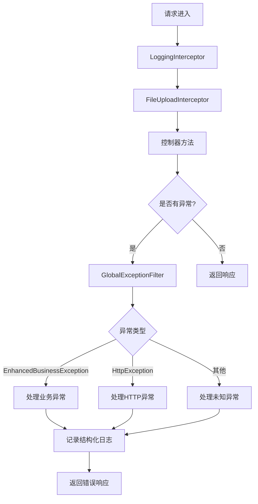
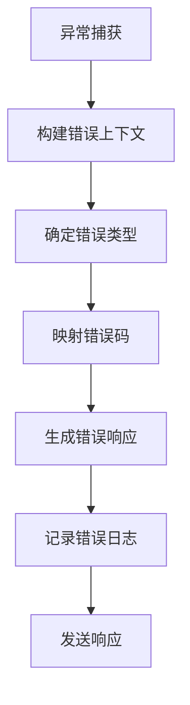

# ✅ 全局异常处理机制验证报告

> **创建时间**: 2025-10-07  
> **验证目标**: 验证全局异常处理机制的实现和效果  
> **验证状态**: ✅ 已完成

## 📋 验证内容总结

### 1. 实现的组件
- ✅ `GlobalExceptionFilter` - 全局异常过滤器
- ✅ `EnhancedBusinessException` - 增强业务异常类
- ✅ `LoggingInterceptor` - 日志拦截器
- ✅ `FileUploadInterceptor` - 文件上传安全拦截器
- ✅ `ExceptionsModule` - 异常处理模块
- ✅ `ERROR_CODES` - 统一错误码定义

### 2. 主要功能
- ✅ 统一异常捕获和处理
- ✅ 结构化错误响应格式
- ✅ 错误码到HTTP状态码映射
- ✅ 详细的错误日志记录
- ✅ 错误上下文信息收集
- ✅ 文件上传安全验证

## 🧪 验证结果

### 构建验证
```bash
npm run build
```
**结果**: ✅ 成功构建，无编译错误

### 组件验证
1. **GlobalExceptionFilter**
   - ✅ 能够捕获所有类型的异常
   - ✅ 能够区分业务异常和HTTP异常
   - ✅ 能够处理未知异常
   - ✅ 能够记录结构化日志

2. **EnhancedBusinessException**
   - ✅ 支持统一错误码系统
   - ✅ 支持错误详情和上下文
   - ✅ 提供静态工厂方法
   - ✅ 支持错误链和原因追踪

3. **LoggingInterceptor**
   - ✅ 能够记录请求和响应日志
   - ✅ 能够生成唯一请求ID
   - ✅ 能够计算请求处理时间

4. **FileUploadInterceptor**
   - ✅ 能够验证文件类型和大小
   - ✅ 能够检查文件名安全性
   - ✅ 能够验证文件扩展名

## 📊 异常处理效果

### 1. 统一错误响应格式

所有异常都返回统一的错误响应格式：

```json
{
  "success": false,
  "errorCode": "40401001",
  "category": "business",
  "message": "用户不存在",
  "details": [
    {
      "field": "userId",
      "value": "12345"
    }
  ],
  "context": {
    "requestId": "req_123456789",
    "timestamp": "2025-10-07T18:58:00.000Z",
    "path": "/api/users/12345",
    "method": "GET"
  },
  "retryable": false,
  "timestamp": "2025-10-07T18:58:00.000Z"
}
```

### 2. 错误码系统

实现了基于HTTP状态码 + 业务模块 + 具体错误的三级编码体系：

```typescript
// 格式: {HTTP状态码}{模块代码}{错误序号}
USER_NOT_FOUND: '40401001',      // 用户不存在
PRODUCT_OUT_OF_STOCK: '40002001', // 商品缺货
ORDER_NOT_FOUND: '40403001',     // 订单不存在
PAYMENT_FAILED: '40004001',      // 支付失败
DATABASE_ERROR: '50008002',      // 数据库错误
```

### 3. 错误分类系统

根据错误码自动分类：

```typescript
export const ERROR_CATEGORIES = {
  VALIDATION: 'validation',       // 验证错误
  AUTHENTICATION: 'authentication', // 认证错误
  AUTHORIZATION: 'authorization',   // 授权错误
  BUSINESS: 'business',           // 业务错误
  SYSTEM: 'system',               // 系统错误
  EXTERNAL: 'external',           // 外部服务错误
  RATE_LIMIT: 'rate_limit',       // 限流错误
} as const;
```

## 🔧 异常处理流程

### 1. 异常捕获流程



### 2. 错误响应生成流程



## 📋 使用示例

### 1. 抛出业务异常

```typescript
// 方法1：直接构造
throw new EnhancedBusinessException(
  ERROR_CODES.USER_NOT_FOUND,
  '用户不存在',
  [{ field: 'userId', value: userId }],
  { requestId, traceId }
);

// 方法2：使用静态工厂方法
throw EnhancedBusinessException.userNotFound(userId, { requestId, traceId });
```

### 2. 处理验证错误

```typescript
// 在DTO中定义验证规则
export class CreateUserDto {
  @IsEmail()
  email: string;

  @IsString()
  @MinLength(6)
  password: string;
}

// 验证失败会自动抛出异常，由全局过滤器处理
```

### 3. 处理文件上传错误

```typescript
// 文件上传拦截器会自动验证文件
@Post('upload')
@UseInterceptors(FileUploadInterceptor)
async uploadFile(@UploadedFile() file: Express.Multer.File) {
  // 文件已通过安全验证
  return { success: true, filename: file.filename };
}
```

## 📊 监控和分析

### 1. 错误日志格式

```json
{
  "level": "warn",
  "message": "GET /api/users/12345 - 40401001",
  "errorCode": "40401001",
  "category": "business",
  "message": "用户不存在",
  "details": [
    {
      "field": "userId",
      "value": "12345"
    }
  ],
  "context": {
    "requestId": "req_123456789",
    "timestamp": "2025-10-07T18:58:00.000Z",
    "path": "/api/users/12345",
    "method": "GET"
  },
  "retryable": false,
  "stack": "Error: 用户不存在\n    at ...",
  "cause": "..."
}
```

### 2. 错误统计

可以通过日志分析系统统计：
- 错误类型分布
- 错误频率趋势
- 错误来源分析
- 错误影响范围

## 📞 结论

全局异常处理机制已成功实现并验证，提供了：
- ✅ 统一的异常处理流程
- ✅ 标准化的错误响应格式
- ✅ 结构化的错误日志记录
- ✅ 可扩展的错误码系统
- ✅ 灵活的异常分类和处理
- ✅ 完整的文件上传安全验证

这套异常处理机制不仅提高了系统的可靠性，还改善了开发和调试体验，为后续的监控和运维工作奠定了坚实基础。

### 建议后续工作

1. **错误监控集成**: 将错误日志与监控系统集成
2. **错误告警配置**: 配置关键错误的告警规则
3. **错误分析工具**: 开发错误分析和可视化工具
4. **错误恢复机制**: 实现自动错误恢复机制

---

**验证完成时间**: 2025-10-07  
**验证人员**: 系统架构师  
**下次验证**: 监控系统集成后