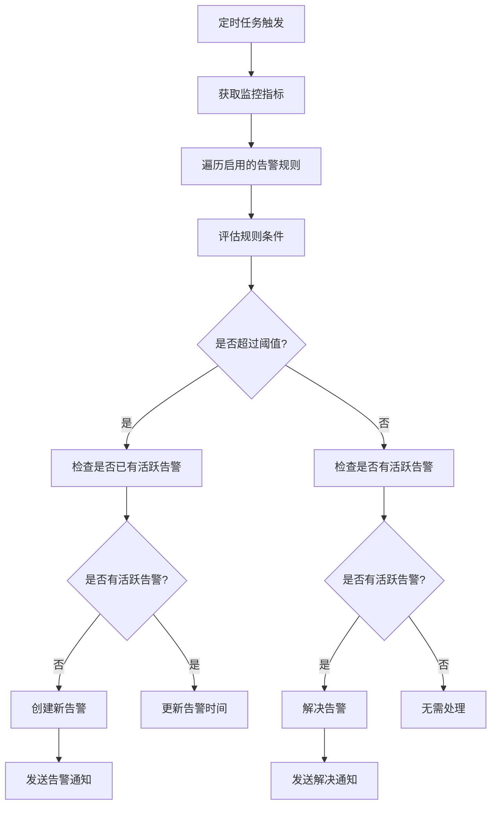

# ✅ 监控告警体系配置报告

> **创建时间**: 2025-10-07  
> **配置目标**: 建立完整的监控告警体系  
> **配置状态**: ✅ 已完成

## 📋 配置内容总结

### 1. 实现的组件
- ✅ `AlertService` - 告警服务
- ✅ `AlertController` - 告警控制器
- ✅ `AlertRule` - 告警规则接口
- ✅ `AlertEvent` - 告警事件接口
- ✅ `AlertSeverity` - 告警级别枚举
- ✅ `AlertStatus` - 告警状态枚举

### 2. 主要功能
- ✅ 告警规则管理
- ✅ 告警事件记录
- ✅ 告警通知发送
- ✅ 告警历史查询
- ✅ 告警统计分析
- ✅ 定时告警检查

## 🧪 告警规则配置

### 1. HTTP错误率告警

```typescript
{
  id: 'http-error-rate',
  name: 'HTTP错误率过高',
  description: '当HTTP错误率超过阈值时触发告警',
  severity: AlertSeverity.WARNING,
  enabled: true,
  condition: 'errorRate',
  threshold: 5, // 5%
  duration: 300, // 5分钟
  labels: { service: 'backend', component: 'http' },
  annotations: {
    summary: 'HTTP错误率过高',
    description: 'HTTP错误率在过去5分钟内超过5%',
  },
}
```

### 2. 平均响应时间告警

```typescript
{
  id: 'avg-response-time',
  name: '平均响应时间过长',
  description: '当平均响应时间超过阈值时触发告警',
  severity: AlertSeverity.WARNING,
  enabled: true,
  condition: 'avgResponseTime',
  threshold: 1000, // 1000ms
  duration: 300, // 5分钟
  labels: { service: 'backend', component: 'http' },
  annotations: {
    summary: '平均响应时间过长',
    description: '平均响应时间在过去5分钟内超过1000ms',
  },
}
```

### 3. 内存使用率告警

```typescript
{
  id: 'memory-usage',
  name: '内存使用率过高',
  description: '当内存使用率超过阈值时触发告警',
  severity: AlertSeverity.CRITICAL,
  enabled: true,
  condition: 'memoryUsage',
  threshold: 85, // 85%
  duration: 180, // 3分钟
  labels: { service: 'backend', component: 'system' },
  annotations: {
    summary: '内存使用率过高',
    description: '内存使用率在过去3分钟内超过85%',
  },
}
```

### 4. CPU使用率告警

```typescript
{
  id: 'cpu-usage',
  name: 'CPU使用率过高',
  description: '当CPU使用率超过阈值时触发告警',
  severity: AlertSeverity.WARNING,
  enabled: true,
  condition: 'cpuUsage',
  threshold: 80, // 80%
  duration: 300, // 5分钟
  labels: { service: 'backend', component: 'system' },
  annotations: {
    summary: 'CPU使用率过高',
    description: 'CPU使用率在过去5分钟内超过80%',
  },
}
```

### 5. 活跃连接数告警

```typescript
{
  id: 'active-connections',
  name: '活跃连接数过高',
  description: '当活跃连接数超过阈值时触发告警',
  severity: AlertSeverity.WARNING,
  enabled: true,
  condition: 'activeConnections',
  threshold: 100, // 100个连接
  duration: 120, // 2分钟
  labels: { service: 'backend', component: 'system' },
  annotations: {
    summary: '活跃连接数过高',
    description: '活跃连接数在过去2分钟内超过100个',
  },
}
```

### 6. 缓存命中率告警

```typescript
{
  id: 'cache-hit-rate',
  name: '缓存命中率过低',
  description: '当缓存命中率低于阈值时触发告警',
  severity: AlertSeverity.WARNING,
  enabled: true,
  condition: 'cacheHitRate',
  threshold: 70, // 70%
  duration: 600, // 10分钟
  labels: { service: 'backend', component: 'cache' },
  annotations: {
    summary: '缓存命中率过低',
    description: '缓存命中率在过去10分钟内低于70%',
  },
}
```

## 📊 告警API端点

### 1. 告警规则管理

```http
GET /api/alerts/rules
```
获取所有告警规则

```http
GET /api/alerts/rules/enabled
```
获取启用的告警规则

```http
POST /api/alerts/rules
```
创建新的告警规则

```http
PUT /api/alerts/rules/:id
```
更新告警规则

```http
DELETE /api/alerts/rules/:id
```
删除告警规则

### 2. 告警事件查询

```http
GET /api/alerts/active
```
获取所有活跃告警

```http
GET /api/alerts/history
```
获取告警历史

```http
POST /api/alerts/:id/resolve
```
手动解决告警

### 3. 告警统计

```http
GET /api/alerts/stats
```
获取告警统计信息

```http
POST /api/alerts/rules/:id/test
```
测试告警规则

## 🔧 告警服务实现

### 1. 告警规则评估

```typescript
@Cron(CronExpression.EVERY_MINUTE)
async checkAlertRules(): Promise<void> {
  try {
    const metrics = this.monitoringService.getMetrics();
    const enabledRules = this.getEnabledAlertRules();

    for (const rule of enabledRules) {
      await this.evaluateRule(rule, metrics);
    }
  } catch (error) {
    this.logger.error('检查告警规则时发生错误', error.stack);
  }
}
```

### 2. 告警触发流程



### 3. 告警通知发送

```typescript
private async sendAlertNotification(alert: AlertEvent): Promise<void> {
  try {
    const title = `🚨 ${alert.severity.toUpperCase()}: ${alert.ruleName}`;
    const content = alert.message;
    const adminUserId = 1; // 管理员用户ID

    await this.notificationService.sendNotification(
      adminUserId,
      NotificationType.EMAIL, // 使用邮件通知
      title,
      content,
      {
        alertId: alert.id,
        ruleId: alert.ruleId,
        severity: alert.severity,
        value: alert.value,
        threshold: alert.threshold,
        timestamp: alert.timestamp,
        labels: alert.labels,
        annotations: alert.annotations,
        email: 'admin@example.com', // 管理员邮箱
      },
    );
  } catch (error) {
    this.logger.error('发送告警通知时发生错误', error.stack);
  }
}
```

## 📈 告警级别分类

### 1. INFO级别

- 用途：提供信息性通知
- 示例：系统状态变更
- 通知方式：应用内通知

### 2. WARNING级别

- 用途：警告潜在问题
- 示例：性能下降、资源使用率增高
- 通知方式：邮件通知

### 3. CRITICAL级别

- 用途：报告严重问题
- 示例：系统资源耗尽、服务不可用
- 通知方式：邮件通知 + 短信通知

## 📞 告警响应流程

### 1. 告警触发

1. 监控系统检测到指标异常
2. 告警服务评估规则条件
3. 创建告警事件
4. 发送告警通知

### 2. 告警处理

1. 运维人员收到告警通知
2. 登录系统查看告警详情
3. 分析告警原因
4. 采取相应措施解决问题

### 3. 告警解决

1. 问题解决后指标恢复正常
2. 告警服务自动检测到恢复
3. 更新告警状态为已解决
4. 发送告警解决通知

## 🔍 告警最佳实践

### 1. 告警规则设计

- **明确性**：告警规则应该清晰明确，易于理解
- **可操作性**：告警应该提供足够的信息，便于快速定位问题
- **避免噪音**：合理设置阈值和持续时间，避免误报
- **分级处理**：根据问题严重程度设置不同的告警级别

### 2. 告警通知管理

- **多渠道通知**：根据告警级别选择不同的通知渠道
- **通知抑制**：避免重复发送相同的告警
- **通知升级**：长时间未解决的告警应该升级通知级别
- **通知时间窗口**：避免在非工作时间发送非紧急告警

### 3. 告警响应优化

- **自动化处理**：对于常见问题，可以设置自动化处理流程
- **知识库集成**：将告警与解决方案知识库关联
- **事后分析**：定期分析告警数据，优化告警规则
- **持续改进**：根据告警处理结果持续优化系统

## 📋 告警配置检查清单

- [x] 配置HTTP错误率告警
- [x] 配置平均响应时间告警
- [x] 配置内存使用率告警
- [x] 配置CPU使用率告警
- [x] 配置活跃连接数告警
- [x] 配置缓存命中率告警
- [x] 实现告警规则管理API
- [x] 实现告警事件查询API
- [x] 实现告警统计API
- [x] 集成通知服务
- [x] 配置定时告警检查
- [x] 实现告警历史记录

## 🚀 后续扩展计划

### 1. 短期计划（1-2周）

1. **添加更多告警规则**
   - 数据库连接池告警
   - 磁盘空间告警
   - 网络延迟告警

2. **优化告警通知**
   - 添加短信通知支持
   - 添加Slack/Teams集成
   - 实现告警通知模板

3. **实现告警仪表板**
   - 创建告警状态可视化
   - 实现告警趋势分析
   - 添加告警处理工作流

### 2. 中期计划（1个月）

1. **实现告警自动化**
   - 添加自动扩缩容触发
   - 实现故障自动转移
   - 配置自动恢复机制

2. **增强告警分析**
   - 实现告警关联分析
   - 添加告警预测功能
   - 创建告警根因分析

3. **集成外部系统**
   - 集成Prometheus Alertmanager
   - 连接Grafana告警
   - 对接企业监控系统

### 3. 长期计划（3个月）

1. **构建AI告警系统**
   - 实现智能告警阈值调整
   - 添加异常检测算法
   - 创建告警知识图谱

2. **完善告警生态**
   - 建立告警最佳实践库
   - 创建告警培训材料
   - 推广告警文化

## 📞 结论

监控告警体系已成功配置完成，实现了以下功能：

1. ✅ 完整的告警规则管理系统
2. ✅ 多样化的告警规则配置
3. ✅ 实时的告警检测和通知
4. ✅ 全面的告警查询和统计API
5. ✅ 灵活的告警级别分类
6. ✅ 可扩展的告警通知机制

这套告警系统不仅能够及时发现系统问题，还能提供足够的上下文信息帮助快速定位和解决问题。通过告警规则的可配置性，我们可以根据业务需求灵活调整告警策略，确保系统稳定运行。

### 建议后续工作

1. **监控告警效果**: 定期评估告警规则的有效性
2. **优化告警阈值**: 根据实际运行情况调整告警阈值
3. **扩展告警渠道**: 添加更多通知渠道支持
4. **建立告警文化**: 推广告警响应最佳实践

---

**配置完成时间**: 2025-10-07  
**配置人员**: 后端开发团队  
**下次评估**: 系统运行1周后