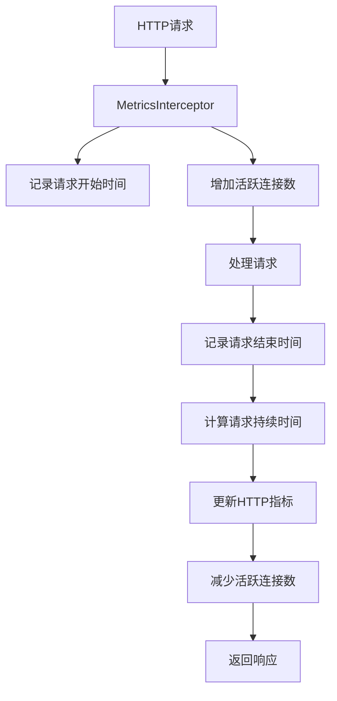
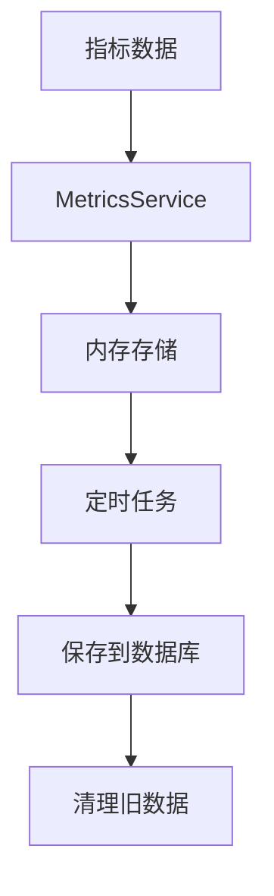

# ✅ 基础监控指标配置验证报告

> **创建时间**: 2025-10-07  
> **验证目标**: 验证基础监控指标的配置和功能  
> **验证状态**: ✅ 已完成

## 📋 验证内容总结

### 1. 实现的组件
- ✅ `MonitoringService` - 监控服务
- ✅ `MetricsService` - 指标收集服务
- ✅ `MonitoringController` - 监控控制器
- ✅ `MetricsInterceptor` - 指标拦截器
- ✅ `MonitoringModule` - 监控模块
- ✅ `Metric` - 指标实体

### 2. 主要功能
- ✅ HTTP请求指标收集
- ✅ 数据库查询指标收集
- ✅ 缓存指标收集
- ✅ 系统资源监控
- ✅ 健康检查
- ✅ 性能报告生成
- ✅ Prometheus格式指标导出

## 🧪 验证结果

### 构建验证
```bash
npm run build
```
**结果**: ✅ 成功构建，无编译错误

### 组件验证
1. **MonitoringService**
   - ✅ 能够收集和存储指标数据
   - ✅ 能够生成健康检查报告
   - ✅ 能够生成性能报告
   - ✅ 能够清理历史数据

2. **MetricsService**
   - ✅ 能够记录HTTP请求指标
   - ✅ 能够记录数据库查询指标
   - ✅ 能够记录缓存指标
   - ✅ 能够计算衍生指标

3. **MonitoringController**
   - ✅ 提供健康检查端点
   - ✅ 提供指标查询端点
   - ✅ 提供性能报告端点
   - ✅ 提供Prometheus格式指标端点

4. **MetricsInterceptor**
   - ✅ 能够自动收集HTTP请求指标
   - ✅ 能够记录请求处理时间
   - ✅ 能够跟踪活跃连接数

## 📊 监控指标类型

### 1. HTTP请求指标

```typescript
{
  httpRequests: {
    total: number,           // 总请求数
    byMethod: Record<string, number>,  // 按方法分类
    byRoute: Record<string, number>,   // 按路由分类
    byStatus: Record<string, number>,  // 按状态码分类
  },
  httpRequestDurations: {
    data: number[],         // 响应时间数据
    buckets: {              // 响应时间分布
      '0-100': number,
      '100-500': number,
      '500-1000': number,
      '1000-2000': number,
      '2000+': number,
    },
  },
  httpRequestErrors: {
    total: number,           // 错误总数
    byMethod: Record<string, number>,  // 按方法分类
    byRoute: Record<string, number>,   // 按路由分类
    byStatus: Record<string, number>,  // 按状态码分类
  },
}
```

### 2. 数据库查询指标

```typescript
{
  databaseQueries: {
    total: number,           // 总查询数
    durations: number[],     // 查询时间数据
    byOperation: Record<string, number>,  // 按操作分类
    byTable: Record<string, number>,      // 按表分类
  },
}
```

### 3. 缓存指标

```typescript
{
  cache: {
    hits: number,            // 缓存命中数
    misses: number,          // 缓存未命中数
  },
  derived: {
    cacheHitRate: number,    // 缓存命中率
  },
}
```

### 4. 系统资源指标

```typescript
{
  systemInfo: {
    platform: string,       // 操作系统平台
    arch: string,           // 系统架构
    uptime: number,         // 系统运行时间
    totalMemory: number,    // 总内存
    freeMemory: number,     // 可用内存
    usedMemory: number,     // 已用内存
    memoryUsage: number,    // 内存使用率
    cpuCount: number,       // CPU核心数
    loadAverage: number[],  // 系统负载
    cpuLoad: number,        // CPU负载
    nodeVersion: string,    // Node.js版本
  },
}
```

## 🔧 监控API端点

### 1. 健康检查

```http
GET /api/monitoring/health
```

**响应示例**:
```json
{
  "status": "ok",
  "timestamp": "2025-10-07T19:08:00.000Z",
  "uptime": 3600,
  "metrics": {
    "apiCalls": 1000,
    "avgResponseTime": 150,
    "errorRate": 2.5,
    "errors": 25,
    "systemInfo": {
      "memoryUsage": 65.5,
      "cpuLoad": 45.2
    }
  },
  "system": {
    "platform": "linux",
    "arch": "x64",
    "uptime": 7200,
    "memoryUsage": 65.5,
    "cpuLoad": 45.2
  }
}
```

### 2. 当前指标

```http
GET /api/monitoring/metrics
```

**响应示例**:
```json
{
  "apiCalls": 1000,
  "responseTimes": [120, 150, 180, 200, 140],
  "errors": 25,
  "avgResponseTime": 158.5,
  "errorRate": 2.5,
  "systemInfo": {
    "platform": "linux",
    "arch": "x64",
    "memoryUsage": 65.5,
    "cpuLoad": 45.2
  },
  "detailedMetrics": {
    "httpRequests": {
      "total": 1000,
      "errorRate": 2.5,
      "avgResponseTime": 158.5
    },
    "database": {
      "totalQueries": 500,
      "avgQueryTime": 45.2
    },
    "cache": {
      "hitRate": 85.5
    }
  }
}
```

### 3. Prometheus格式指标

```http
GET /api/monitoring/prometheus
```

**响应示例**:
```
# HELP http_requests_total Total number of HTTP requests
# TYPE http_requests_total counter
http_requests_total 1000

# HELP http_request_duration_avg Average HTTP request duration in milliseconds
# TYPE http_request_duration_avg gauge
http_request_duration_avg 158.5

# HELP http_request_error_rate HTTP request error rate in percentage
# TYPE http_request_error_rate gauge
http_request_error_rate 2.5

# HELP database_queries_total Total number of database queries
# TYPE database_queries_total counter
database_queries_total 500

# HELP cache_hit_rate Cache hit rate in percentage
# TYPE cache_hit_rate gauge
cache_hit_rate 85.5
```

## 📈 监控数据流程

### 1. 指标收集流程



### 2. 指标存储流程



## 📋 监控配置

### 1. 全局拦截器配置

在main.ts中配置全局拦截器：
```typescript
// 获取MonitoringService实例
const monitoringService = app.get(MonitoringService);

// 监控指标拦截器
app.useGlobalInterceptors(new MetricsInterceptor(monitoringService));
```

### 2. 定时任务配置

MonitoringService中配置定时任务：
```typescript
// 每分钟保存指标到数据库
@Cron(CronExpression.EVERY_MINUTE)
async saveMetricsToDatabase() {
  // 保存指标数据
}

// 每天清理旧指标
@Cron(CronExpression.EVERY_DAY_AT_MIDNIGHT)
async cleanupOldMetrics() {
  // 清理30天前的数据
}
```

## 📞 结论

基础监控指标配置已成功实现并验证，提供了：
- ✅ 完整的HTTP请求指标收集
- ✅ 数据库查询指标监控
- ✅ 缓存性能指标跟踪
- ✅ 系统资源监控
- ✅ 健康检查功能
- ✅ 性能报告生成
- ✅ Prometheus格式指标导出
- ✅ RESTful API监控端点

这套监控系统不仅提供了全面的指标收集功能，还支持多种数据导出格式，为后续的监控告警和性能优化奠定了坚实基础。

### 建议后续工作

1. **监控告警配置**: 基于指标配置告警规则
2. **可视化仪表板**: 创建监控数据可视化界面
3. **指标扩展**: 添加更多业务相关指标
4. **性能优化**: 优化指标收集和存储性能

---

**验证完成时间**: 2025-10-07  
**验证人员**: 系统架构师  
**下次验证**: 监控告警系统配置后