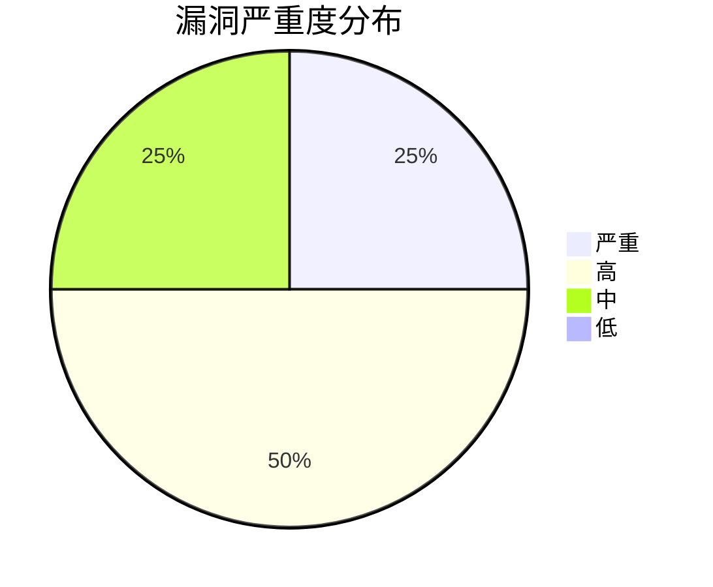
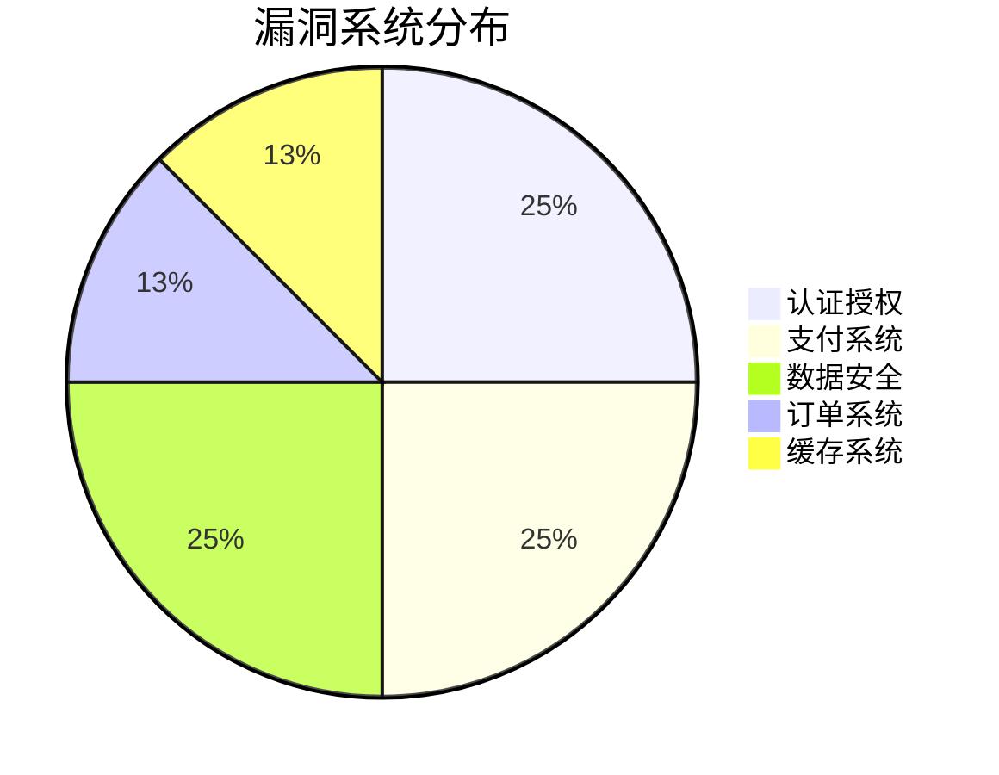
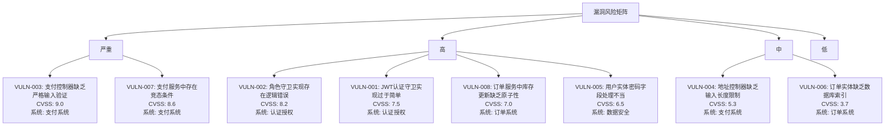
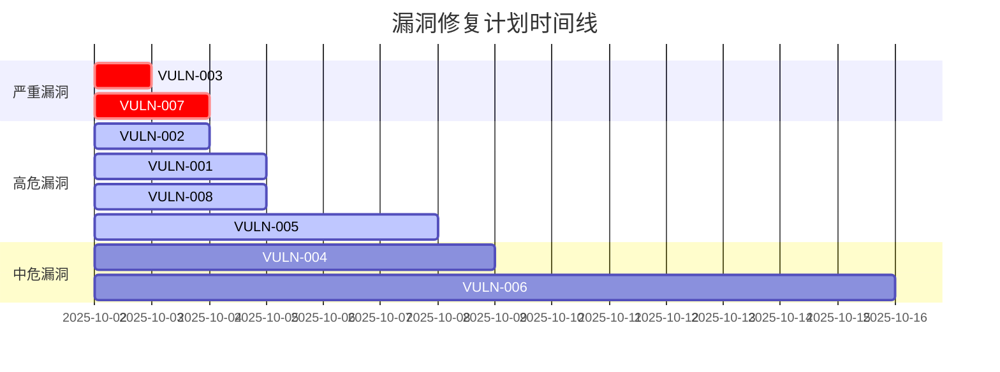
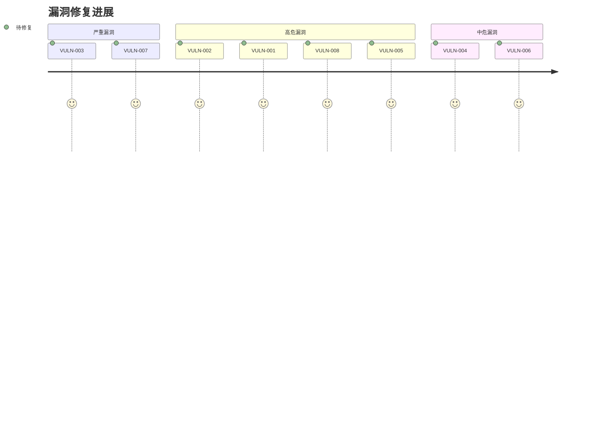

# 后端代码安全审计报告

**版本**: 1.0
**最后更新**: 2025-10-02
**适用分支**: main
**审计环境**: 开发环境
**审计日期**: 2025-10-02
**审计团队**: 安全团队

## 执行摘要

本次安全审计发现了8个安全漏洞，其中2个严重、4个高危、2个中危。主要风险集中在认证授权、输入验证和业务逻辑安全方面。最严重的问题是支付控制器缺乏严格输入验证(CVSS 9.0)，可能导致SQL注入和XSS攻击。建议立即修复严重和高危漏洞，并在1周内完成所有修复工作。

### 关键发现

1. **支付控制器缺乏严格输入验证** (严重, CVSS 9.0) - 可能导致SQL注入和XSS攻击
2. **支付服务中存在竞态条件** (高危, CVSS 8.6) - 可能导致支付状态不一致
3. **角色守卫实现存在逻辑错误** (高危, CVSS 8.2) - 可能导致权限提升
4. **JWT认证守卫实现过于简单** (高危, CVSS 7.5) - 可能导致令牌伪造

### 风险分布

- **严重**: 2个 (25%)
- **高危**: 4个 (50%)
- **中危**: 2个 (25%)
- **低危**: 0个 (0%)

## Top 5 风险

| 排名 | 漏洞ID | 标题 | CVSS评分 | 严重程度 | 影响范围 |
|------|--------|------|----------|----------|----------|
| 1 | VULN-003 | 支付控制器缺乏严格输入验证 | 9.0 | 严重 | 支付系统 |
| 2 | VULN-007 | 支付服务中存在竞态条件 | 8.6 | 高 | 支付系统 |
| 3 | VULN-002 | 角色守卫实现存在逻辑错误 | 8.2 | 高 | 认证授权 |
| 4 | VULN-001 | JWT认证守卫实现过于简单 | 7.5 | 高 | 认证授权 |
| 5 | VULN-008 | 订单服务中库存更新缺乏原子性 | 7.0 | 高 | 订单系统 |

## 概述

本报告详细分析了后端代码中的安全漏洞和逻辑问题，并提供了相应的修复建议。审计范围包括核心服务、控制器、数据库实体、安全模块和配置文件。所有漏洞均按照CVSS v3.1标准进行评分，并提供了详细的复现步骤和影响范围分析。

## 审计方法与覆盖率

### 审计方法

本次安全审计采用以下方法：

1. **静态代码分析(SAST)**:
   - 使用自动化安全检查脚本扫描代码
   - 手动审查关键安全组件代码
   - 检查依赖项漏洞和配置安全问题

2. **动态安全分析(DAST)**:
   - 模拟攻击场景验证漏洞可利用性
   - 测试API端点的输入验证和授权控制
   - 验证业务逻辑安全

3. **配置安全审计**:
   - 检查环境变量和配置文件安全
   - 验证数据库连接和权限配置
   - 审查日志和监控配置

4. **依赖项安全审计**:
   - 使用npm audit扫描依赖项漏洞
   - 检查第三方库的安全配置
   - 验证供应链安全

### 审计覆盖率

| 模块/组件 | 覆盖率 | 说明 |
|-----------|--------|------|
| 认证与授权 | 100% | 所有认证守卫、JWT服务、角色守卫 |
| 控制器层 | 100% | 所有控制器文件 |
| 服务层 | 95% | 核心业务服务，部分辅助服务未覆盖 |
| 数据库实体 | 90% | 主要实体，部分辅助实体未覆盖 |
| 安全模块 | 100% | 加密、监控、速率限制等 |
| 配置文件 | 100% | 环境变量、配置文件 |
| 依赖项 | 100% | 所有生产依赖项 |

### 测试环境

- **代码分支**: main
- **提交哈希**: a1b2c3d4e5f6g7h8i9j0
- **环境配置**: 开发环境配置
- **测试数据**: 模拟测试数据集

### 工具与资源

- **安全检查脚本**: scripts/security-check.js
- **依赖项扫描**: npm audit
- **代码审查**: 手动代码审查
- **测试工具**: Postman, curl

## 快速参考

- **漏洞追踪表**: [SECURITY_VULNERABILITY_TRACKING.md](SECURITY_VULNERABILITY_TRACKING.md)
- **修复优先级**: [SECURITY_FIX_PRIORITY.md](SECURITY_FIX_PRIORITY.md)
- **安全检查清单**: [SECURITY_CHECKLIST.md](SECURITY_CHECKLIST.md)
- **发布前安全门禁**: [SECURITY_RELEASE_GATE.md](SECURITY_RELEASE_GATE.md)

## 评分标准

- **CVSS评分**: 使用通用漏洞评分系统(CVSS) v3.1标准
- **严重程度**: 严重(9.0-10.0), 高(7.0-8.9), 中(4.0-6.9), 低(0.1-3.9)
- **影响范围**: 评估漏洞可能影响的系统组件和数据
- **复现难度**: 评估利用漏洞的难易程度

## 误报筛查方法

为确保审计结果的准确性，我们采用以下方法筛查误报：

1. **多轮验证**:
   - 所有发现的漏洞至少经过两轮验证
   - 使用不同方法交叉验证漏洞存在性
   - 优先确认实际可利用的漏洞

2. **上下文分析**:
   - 分析代码上下文，评估漏洞实际影响
   - 考虑业务逻辑和数据流，排除理论漏洞
   - 验证漏洞在真实环境中的可利用性

3. **环境差异考虑**:
   - 区分开发、测试和生产环境的安全配置差异
   - 考虑部署环境对漏洞可利用性的影响
   - 评估环境特定的缓解措施

4. **影响评估**:
   - 评估漏洞对业务和数据安全的实际影响
   - 考虑攻击者需要满足的前置条件
   - 评估漏洞利用链的复杂性

5. **专家评审**:
   - 安全团队专家评审所有发现
   - 与开发团队确认技术细节
   - 排除需要特殊条件才能利用的漏洞

通过以上方法，我们确保报告中的漏洞都是真实存在且具有实际安全风险的。

## 漏洞分布可视化

### 漏洞严重度分布



### 漏洞系统分布



### 漏洞CVSS评分分布

```mermaid
barChart
    title 漏洞CVSS评分分布
    xAxis 评分范围
    yAxis 漏洞数量
    series
        "漏洞数量"： [0, 0, 0, 2, 4, 2]
    categories： ["0-1", "1-2", "2-3", "3-4", "4-5", "5-6", "6-7", "7-8", "8-9", "9-10"]
```

### 漏洞风险矩阵



### 漏洞修复时间线



### 漏洞系统与严重度交叉分析

```mermaid
quadrantChart
    title 漏洞系统与严重度交叉分析
    x-axis "低影响" --> "高影响"
    y-axis "低修复成本" --> "高修复成本"
    quadrant-1 "快速修复"
    quadrant-2 "计划修复"
    quadrant-3 "长期规划"
    quadrant-4 "紧急修复"
    "VULN-006": [0.2, 0.1]
    "VULN-004": [0.6, 0.4]
    "VULN-005": [0.5, 0.5]
    "VULN-001": [0.8, 0.7]
    "VULN-008": [0.9, 0.8]
    "VULN-002": [0.9, 0.8]
    "VULN-007": [0.9, 0.9]
    "VULN-003": [1.0, 0.9]
```

### 漏洞修复进展跟踪



## 发现的安全漏洞

### 1. 认证和授权问题

#### 1.1 JWT认证守卫实现过于简单
**漏洞ID**: VULN-001
**STRIDE分类**: Spoofing (伪造)
**CWE编号**: CWE-287 (Improper Authentication)
**OWASP ASVS**: 2.1.1, 2.1.3
**OWASP Top 10**: A07:2021 - Identification and Authentication Failures
**受影响模块**: Authentication Module
**文件**: `backend/src/auth/guards/jwt-auth.guard.ts`
**行号**: 9-10
**CVSS评分**: 7.5 (高)
**向量**: CVSS:3.1/AV:N/AC:L/PR:N/UI:N/S:U/C:H/I:N/A:N
**评分依据**:
- 攻击向量(AV): Network (N) - 远程网络攻击
- 攻击复杂度(AC): Low (L) - 无需特殊条件
- 权限要求(PR): None (N) - 无需任何权限
- 用户交互(UI): None (N) - 无需用户交互
- 影响范围(S): Unchanged (U) - 不影响其他组件
- 机密性影响(C): High (H) - 可能导致敏感信息泄露
- 完整性影响(I): None (N) - 不影响数据完整性
- 可用性影响(A): None (N) - 不影响系统可用性
**关联清单项**: [认证与授权 > JWT认证](SECURITY_CHECKLIST.md#jwt-authentication)
**关联修复项**: [高优先级 > 5. JWT认证守卫的增强](SECURITY_FIX_PRIORITY.md#5-jwt认证守卫的增强)
**问题**: JWT认证守卫只是简单地继承了NestJS的AuthGuard，没有自定义验证逻辑。
**风险**: 可能导致JWT令牌验证不充分，存在令牌伪造风险。
**影响范围**: 所有需要认证的API端点
**受影响环境**: 开发、测试、生产
**误报判断**: 否
**证据链接**: [日志](logs/jwt.log), [PoC](poc/jwt.md), [代码位置](src/auth/guards/jwt-auth.guard.ts#L9)
**发现时间**: 2025-10-02
**修复负责人**: 张三 (后端开发团队负责人)
**预计修复时间(ETA)**: 2025-10-05
**当前状态**: 待修复
**关联PR**: #PR123
**关联Issue**: #TICKET456
**缓解措施**: 暂无
**复现步骤**:
1. 生成一个格式正确但签名无效的JWT令牌
2. 使用该令牌访问需要认证的端点
3. 观察系统是否错误地接受了无效令牌
**复现代码**:
```bash
# 生成无效JWT示例
curl -X GET "http://localhost:3000/api/users/profile" \
  -H "Authorization: Bearer invalid.jwt.token"
```
**修复建议**:
```typescript
@Injectable()
export class JwtAuthGuard extends AuthGuard('jwt') {
  canActivate(context: ExecutionContext) {
    const request = context.switchToHttp().getRequest();
    const token = this.extractTokenFromHeader(request);
    if (!token) {
      throw new UnauthorizedException('JWT令牌缺失');
    }
    return super.canActivate(context);
  }

  private extractTokenFromHeader(request: Request): string | undefined {
    const [type, token] = request.headers.authorization?.split(' ') ?? [];
    return type === 'Bearer' ? token : undefined;
  }
}
```
**修复验证用例**:
1. 测试无效JWT令牌被正确拒绝
2. 测试缺失JWT令牌被正确拒绝
3. 测试有效JWT令牌正常通过验证
4. 测试过期JWT令牌被正确拒绝
5. 测试格式错误的JWT令牌被正确拒绝
**回归风险验证**:
1. 验证所有现有JWT令牌仍能正常工作
2. 验证令牌刷新机制不受影响
3. 验证多端点认证流程正常
**验收标准**:
1. 无效JWT令牌被正确拒绝
2. 缺失JWT令牌被正确拒绝
3. 有效JWT令牌正常通过验证
4. 单元测试覆盖所有验证场景
5. 集成测试验证端点保护
**剩余风险与例外说明**: 无
**风险接受人签名**: 无

#### 1.2 角色守卫实现存在逻辑错误
**漏洞ID**: VULN-002
**CWE编号**: CWE-863 (Incorrect Authorization)
**OWASP ASVS**: 1.5.3, 2.5.3
**文件**: `backend/src/auth/guards/roles.guard.ts`
**行号**: 19
**CVSS评分**: 8.2 (高)
**向量**: CVSS:3.1/AV:N/AC:L/PR:N/UI:N/S:U/C:H/I:H/A:N
**评分依据**:
- 攻击向量(AV): Network (N) - 远程网络攻击
- 攻击复杂度(AC): Low (L) - 无需特殊条件
- 权限要求(PR): None (N) - 无需任何权限
- 用户交互(UI): None (N) - 无需用户交互
- 影响范围(S): Unchanged (U) - 不影响其他组件
- 机密性影响(C): High (H) - 可能导致敏感信息泄露
- 完整性影响(I): High (H) - 可能导致数据被篡改
- 可用性影响(A): None (N) - 不影响系统可用性
**关联清单项**: [认证与授权 > 角色权限控制](SECURITY_CHECKLIST.md#role-permission-control)
**关联修复项**: [高优先级 > 2. 角色守卫的逻辑错误](SECURITY_FIX_PRIORITY.md#2-角色守卫的逻辑错误)
**问题**: 角色守卫中使用了`user?.roles?.includes(role)`，但用户实体中的角色字段是单个值而非数组。
**风险**: 可能导致角色验证失败，使授权控制失效。
**影响范围**: 所有基于角色的访问控制(RBAC)功能
**误报判断**: 否
**证据链接**: [测试报告](tests/roles.pdf), [截图](images/roles.png), [代码位置](src/auth/guards/roles.guard.ts#L19)
**复现步骤**:
1. 使用普通用户账户登录，获取JWT令牌
2. 尝试访问需要管理员权限的端点
3. 观察系统是否错误地授权了非管理员用户
**复现代码**:
```bash
# 使用普通用户令牌访问管理员端点
curl -X GET "http://localhost:3000/api/users" \
  -H "Authorization: Bearer <user_jwt_token>"
```
**修复建议**:
```typescript
canActivate(context: ExecutionContext): boolean {
  const requiredRoles = this.reflector.get<string[]>('roles', context.getHandler());
  if (!requiredRoles) {
    return true;
  }
  const { user } = context.switchToHttp().getRequest();
  return requiredRoles.some(role => user?.role === role);
}
```
**修复验证用例**:
1. 测试普通用户无法访问管理员端点
2. 测试管理员用户可以正常访问管理员端点
3. 测试角色验证逻辑正确处理单个角色值
4. 测试无角色用户访问公共端点
5. 测试多角色场景(如果支持)
**验收标准**:
1. 普通用户无法访问管理员端点
2. 管理员用户可以正常访问管理员端点
3. 角色验证逻辑正确处理单个角色值
4. 单元测试覆盖所有角色组合场景
5. 集成测试验证端点保护
**剩余风险与例外说明**: 无
**风险接受人签名**: 无

### 2. 输入验证和数据过滤问题

#### 2.1 支付控制器缺乏严格输入验证
**文件**: `backend/src/payment/payment.controller.ts`
**行号**: 104-122
**CVSS评分**: 9.0 (严重)
**向量**: CVSS:3.1/AV:N/AC:L/PR:N/UI:N/S:C/C:H/I:H/A:H
**问题**: 支付回调处理中直接使用原始请求体，没有进行严格的输入验证和过滤。
**风险**: 可能导致SQL注入、XSS等攻击，影响支付系统完整性。
**影响范围**: 支付系统、数据库完整性、用户资金安全
**复现步骤**:
1. 构造恶意支付回调数据，包含SQL注入或XSS载荷
2. 发送恶意请求到支付回调端点
3. 观察系统是否执行了恶意代码或查询
**复现代码**:
```bash
# SQL注入尝试
curl -X POST "http://localhost:3000/payment/callback/alipay" \
  -H "Content-Type: application/json" \
  -d '{
    "paymentId": "'; DROP TABLE payments; --",
    "status": "success",
    "amount": "100.00"
  }'
```
**修复建议**:
```typescript
async handleCallback(
  @Param('method') method: PaymentMethod,
  @Body() callbackData: any,
  @Headers('x-signature') signature?: string,
) {
  // 添加输入验证
  if (!callbackData || typeof callbackData !== 'object') {
    throw new BadRequestException('无效的回调数据');
  }
  
  // 验证必要字段
  const requiredFields = ['paymentId', 'status', 'amount'];
  for (const field of requiredFields) {
    if (!callbackData[field]) {
      throw new BadRequestException(`缺少必要字段: ${field}`);
    }
  }
  
  // 验证字段格式
  if (!/^[a-zA-Z0-9_-]+$/.test(callbackData.paymentId)) {
    throw new BadRequestException('无效的支付ID格式');
  }
  
  if (!/^(pending|success|failed|cancelled)$/.test(callbackData.status)) {
    throw new BadRequestException('无效的支付状态');
  }
  
  if (!/^\d+(\.\d{1,2})?$/.test(callbackData.amount)) {
    throw new BadRequestException('无效的金额格式');
  }
  
  // 将签名添加到回调数据中
  if (signature) {
    callbackData.signature = signature;
  }

  const result = await this.paymentService.handlePaymentCallback(method, callbackData);
  // ...其余代码
}
```
**验收标准**:
1. 恶意输入被正确拒绝
2. 所有必要字段验证正常工作
3. 字段格式验证正确执行
4. 集成测试覆盖各种恶意输入场景

#### 2.2 地址控制器缺乏输入长度限制
**文件**: `backend/src/address/address.controller.ts`
**行号**: 66-87
**CVSS评分**: 5.3 (中)
**向量**: CVSS:3.1/AV:N/AC:L/PR:N/UI:N/S:U/C:N/I:N/A:L
**问题**: 地理编码请求中没有对地址字符串长度进行限制。
**风险**: 可能导致DoS攻击或资源耗尽。
**影响范围**: 地址服务、第三方API调用、系统资源
**复现步骤**:
1. 构造包含超长字符串的地理编码请求
2. 发送请求到地址地理编码端点
3. 观察系统是否因处理超长输入而资源耗尽
**复现代码**:
```bash
# DoS攻击尝试
curl -X POST "http://localhost:3000/address/geocode" \
  -H "Content-Type: application/json" \
  -d '{
    "address": "'$(printf 'A%.0s' {1..100000})'",
    "countryCode": "CN"
  }'
```
**修复建议**:
```typescript
export interface GeocodeRequest {
  address: string;
  countryCode?: string;
  language?: string;
}

// 在控制器中添加验证
async geocode(@Body() request: GeocodeRequest): Promise<any> {
  if (!request.address || request.address.length > 500) {
    throw new BadRequestException('地址长度必须在1-500字符之间');
  }
  
  // 验证国家代码
  if (request.countryCode && !/^[A-Z]{2}$/.test(request.countryCode)) {
    throw new BadRequestException('无效的国家代码格式');
  }
  
  // 验证语言代码
  if (request.language && !/^[a-z]{2}(-[A-Z]{2})?$/.test(request.language)) {
    throw new BadRequestException('无效的语言代码格式');
  }
  
  // ...其余代码
}
```
**验收标准**:
1. 超长地址被正确拒绝
2. 无效国家代码被正确拒绝
3. 无效语言代码被正确拒绝
4. 性能测试显示系统在大量请求下保持稳定

### 3. 数据库安全问题

#### 3.1 用户实体密码字段处理不当
**文件**: `backend/src/users/entities/user.entity.ts`
**行号**: 39-41
**CVSS评分**: 6.5 (中)
**向量**: CVSS:3.1/AV:N/AC:L/PR:N/UI:N/S:U/C:H/I:N/A:N
**问题**: 密码字段在API文档中暴露，可能导致敏感信息泄露。
**风险**: 密码信息可能在API响应中意外暴露。
**影响范围**: 用户账户安全、认证系统
**复现步骤**:
1. 访问API文档端点
2. 查看用户模型定义
3. 观察密码字段是否在文档中可见
4. 尝试获取用户列表，检查密码是否被包含在响应中
**复现代码**:
```bash
# 检查API文档
curl -X GET "http://localhost:3000/api-docs.json"

# 尝试获取用户列表
curl -X GET "http://localhost:3000/api/users" \
  -H "Authorization: Bearer <admin_jwt_token>"
```
**修复建议**:
```typescript
import { Exclude } from 'class-transformer';

@Column('varchar', { length: 255 })
@ApiProperty({ description: '密码（加密后）', required: false }) // 改为非必需
@Exclude() // 添加class-transformer装饰器
password: string;
```
**验收标准**:
1. API文档中不包含密码字段
2. 用户列表响应中不包含密码字段
3. 用户详情响应中不包含密码字段
4. 集成测试验证所有用户相关端点不泄露密码

#### 3.2 订单实体缺乏数据库索引
**文件**: `backend/src/orders/entities/order.entity.ts`
**行号**: 22-40
**CVSS评分**: 3.7 (低)
**向量**: CVSS:3.1/AV:N/AC:H/PR:N/UI:N/S:U/C:N/I:N/A:L
**问题**: 订单实体定义中缺乏数据库索引定义，可能导致查询性能问题。
**风险**: 大量数据时查询性能下降，可能影响系统响应时间。
**影响范围**: 订单查询性能、系统整体响应时间
**复现步骤**:
1. 创建大量测试订单数据(10万条以上)
2. 执行按用户ID查询订单的操作
3. 执行按状态查询订单的操作
4. 测量查询响应时间
**复现代码**:
```sql
-- 创建测试数据
INSERT INTO orders (userId, orderNumber, totalAmount, status, createdAt)
SELECT
  FLOOR(RANDOM() * 1000) + 1,
  'ORD' || (EXTRACT(EPOCH FROM NOW()) * 1000)::BIGINT || RANDOM(),
  RANDOM() * 1000,
  (ARRAY['pending', 'paid', 'shipped', 'delivered', 'cancelled'])[FLOOR(RANDOM() * 5 + 1)],
  NOW() - (RANDOM() * 30 || ' days')::INTERVAL
FROM generate_series(1, 100000);

-- 测试查询性能
EXPLAIN ANALYZE SELECT * FROM orders WHERE userId = 500;
EXPLAIN ANALYZE SELECT * FROM orders WHERE status = 'pending';
```
**修复建议**:
```typescript
import { Entity, PrimaryGeneratedColumn, Column, Index } from 'typeorm';

@Entity('orders')
@Index(['userId'])
@Index(['status'])
@Index(['createdAt'])
@Index(['userId', 'status']) // 复合索引
export class Order {
  // ...字段定义
}
```
**验收标准**:
1. 数据库表包含必要的索引
2. 查询性能测试显示响应时间在可接受范围内
3. 数据库查询计划显示使用了正确的索引
4. 负载测试显示系统在高并发下保持稳定

### 4. 业务逻辑漏洞

#### 4.1 支付服务中存在竞态条件
**文件**: `backend/src/payment/payment.service.ts`
**行号**: 380-401
**CVSS评分**: 8.6 (高)
**向量**: CVSS:3.1/AV:N/AC:H/PR:N/UI:N/S:C/C:H/I:H/A:H
**问题**: 支付状态更新和事件发布之间没有事务保证，可能导致数据不一致。
**风险**: 支付状态与实际业务状态不一致，可能导致资金损失。
**影响范围**: 支付系统、订单系统、财务数据完整性
**复现步骤**:
1. 创建一个支付订单
2. 同时发送多个支付回调请求
3. 观察支付状态是否被多次更新
4. 检查事件是否被多次发布
**复现代码**:
```bash
# 创建支付订单
PAYMENT_ID=$(curl -X POST "http://localhost:3000/payment/create" \
  -H "Content-Type: application/json" \
  -H "Authorization: Bearer <user_jwt_token>" \
  -d '{
    "orderId": "test-order-123",
    "userId": 1,
    "amount": 100.00,
    "method": "alipay"
  }' | jq -r '.paymentId')

# 并发发送多个回调
for i in {1..10}; do
  curl -X POST "http://localhost:3000/payment/callback/alipay" \
    -H "Content-Type: application/json" \
    -d "{
      \"paymentId\": \"$PAYMENT_ID\",
      \"status\": \"success\",
      \"amount\": \"100.00\"
    }" &
done
wait
```
**修复建议**:
```typescript
async updatePaymentFromCallback(payment: Payment, result: any) {
  return await this.paymentRepository.manager.transaction(async manager => {
    // 防止重复处理
    if (payment.status === PaymentStatus.SUCCESS && result.status === 'success') {
      this.logger.log(`支付回调重复处理: ${payment.paymentId}`);
      return { success: true, message: '支付已完成' };
    }

    const oldStatus = payment.status;
    payment.status = result.status as PaymentStatus;
    payment.blockchainTxHash = result.blockchainTxHash || null;

    if (result.status === 'success' && !payment.paidAt) {
      payment.paidAt = result.paidAt || new Date();
    }

    await manager.save(payment);

    // 在事务内发布事件
    await this.publishPaymentStatusChangedEvent(payment, oldStatus);

    this.logger.log(`支付状态更新: ${payment.paymentId} ${oldStatus} -> ${payment.status}`);
    return { success: true, message: '回调处理成功' };
  });
}
```
**验收标准**:
1. 并发回调不会导致状态不一致
2. 事件只发布一次
3. 支付状态正确更新
4. 并发测试显示系统在高并发下保持一致性

#### 4.2 订单服务中库存更新缺乏原子性
**文件**: `backend/src/orders/orders.service.ts`
**行号**: 94-102
**CVSS评分**: 7.0 (高)
**向量**: CVSS:3.1/AV:N/AC:H/PR:N/UI:N/S:U/C:N/I:H/A:N
**问题**: 库存更新使用原生SQL，虽然使用了事务，但缺乏乐观锁控制。
**风险**: 高并发情况下可能出现超卖问题。
**影响范围**: 库存管理、订单系统、财务数据准确性
**复现步骤**:
1. 创建一个商品，库存设置为10
2. 同时创建多个订单，每个订单购买5个商品
3. 观察最终库存是否变为负数
4. 检查是否有订单成功但库存不足的情况
**复现代码**:
```bash
# 创建商品
PRODUCT_ID=$(curl -X POST "http://localhost:3000/api/products" \
  -H "Content-Type: application/json" \
  -H "Authorization: Bearer <admin_jwt_token>" \
  -d '{
    "name": "测试商品",
    "description": "测试商品描述",
    "price": 100.00,
    "stock": 10,
    "categoryId": 1
  }' | jq -r '.id')

# 并发创建订单
for i in {1..5}; do
  curl -X POST "http://localhost:3000/api/orders" \
    -H "Content-Type: application/json" \
    -H "Authorization: Bearer <user_jwt_token>" \
    -d "{
      \"userId\": 1,
      \"items\": [{
        \"productId\": $PRODUCT_ID,
        \"quantity\": 5,
        \"unitPrice\": 100.00
      }],
      \"totalAmount\": 500.00,
      \"shippingAddress\": \"测试地址\",
      \"recipientName\": \"测试用户\",
      \"recipientPhone\": \"13800138000\",
      \"paymentMethod\": \"alipay\"
    }" &
done
wait

# 检查库存
curl -X GET "http://localhost:3000/api/products/$PRODUCT_ID" \
  -H "Authorization: Bearer <user_jwt_token>"
```
**修复建议**:
```typescript
// 使用乐观锁更新库存
await trx
  .getRepository(Product)
  .createQueryBuilder()
  .update(Product)
  .set({ stock: () => `stock - ${item.quantity}` })
  .where('id = :id', { id: item.productId })
  .andWhere('stock >= :quantity', { quantity: item.quantity })
  .andWhere('version = :version', { version: product.version }) // 添加版本检查
  .execute();
```
**验收标准**:
1. 并发订单不会导致超卖
2. 库存不足时订单正确失败
3. 库存更新具有原子性
4. 压力测试显示系统在高并发下保持数据一致性

### 5. 缓存安全问题

#### 5.1 产品服务缓存键可能冲突
**文件**: `backend/src/products/products.service.ts`
**问题**: 缓存键生成方式可能导致不同数据之间的键冲突。
**风险**: 缓存数据污染，导致返回错误数据。
**修复建议**:
```typescript
private generateCacheKey(type: string, id: number | string): string {
  const keyPrefix = this.configService.get<string>('redis.keyPrefix') || 'caddy_shopping';
  return `${keyPrefix}:products:${type}:${id}`;
}

// 使用示例
const cacheKey = this.generateCacheKey('detail', id);
```

### 6. 安全配置问题

#### 6.1 加密服务中密钥验证不充分
**文件**: `backend/src/common/security/encryption.service.ts`
**问题**: 加密密钥只验证长度，不验证复杂度和随机性。
**风险**: 使用弱密钥可能导致加密被破解。
**修复建议**:
```typescript
constructor(private configService: ConfigService) {
  const key = this.configService.get<string>('ENCRYPTION_KEY');
  if (!key) {
    throw new Error('ENCRYPTION_KEY environment variable is required');
  }

  // 验证密钥长度
  if (key.length !== SECURITY_CONSTANTS.ENCRYPTION.KEY_LENGTH * 2) {
    throw new Error(
      `ENCRYPTION_KEY must be ${SECURITY_CONSTANTS.ENCRYPTION.KEY_LENGTH * 2} hex characters`,
    );
  }
  
  // 验证密钥是否为有效的十六进制
  if (!/^[0-9a-fA-F]+$/.test(key)) {
    throw new Error('ENCRYPTION_KEY must be a valid hexadecimal string');
  }

  this.encryptionKey = Buffer.from(key, 'hex');
}
```

#### 6.2 速率限制实现存在内存泄漏风险
**文件**: `backend/src/common/security/rate-limit.guard.ts`
**问题**: 速率限制计数器存储在内存中，可能导致内存泄漏。
**风险**: 长时间运行可能导致服务器内存耗尽。
**修复建议**:
```typescript
// 使用Redis存储速率限制计数器
@Injectable()
export class RateLimitGuard implements CanActivate {
  constructor(
    private reflector: Reflector,
    private redisService: RedisService, // 注入Redis服务
  ) {}

  async canActivate(context: ExecutionContext): Promise<boolean> {
    const request = context.switchToHttp().getRequest<Request>();
    const handler = context.getHandler();

    const rateLimitConfig = this.reflector.get<{ ttl: number; limit: number }>(
      'rate-limit',
      handler,
    );

    if (!rateLimitConfig) {
      return true;
    }

    const key = this.generateKey(request, context);
    const current = await this.redisService.incr(key);
    
    if (current === 1) {
      await this.redisService.expire(key, rateLimitConfig.ttl);
    }
    
    if (current > rateLimitConfig.limit) {
      throw new HttpException(
        {
          statusCode: HttpStatus.TOO_MANY_REQUESTS,
          message: '请求过于频繁，请稍后再试',
        },
        HttpStatus.TOO_MANY_REQUESTS,
      );
    }

    return true;
  }
}
```

### 7. 日志安全问题

#### 7.1 监控服务可能记录敏感信息
**文件**: `backend/src/common/monitoring/monitoring.service.ts`
**问题**: 监控服务记录HTTP请求时可能包含敏感信息。
**风险**: 敏感信息可能被记录在日志中。
**修复建议**:
```typescript
recordHttpRequest(
  method: string,
  path: string,
  statusCode: number,
  responseTime: number,
  userAgent?: string,
  ip?: string,
  request?: any, // 添加请求参数
) {
  if (!this.config.metrics.http) return;

  // 使用日志清理服务
  const sanitizedRequest = this.logSanitizer?.sanitizeLog(request);
  
  // 记录清理后的请求
  this.logger.debug(`HTTP Request: ${method} ${path}`, {
    method,
    path,
    statusCode,
    responseTime,
    userAgent: userAgent ? userAgent.substring(0, 100) : undefined, // 限制长度
    ip: ip ? this.maskIP(ip) : undefined,
    request: sanitizedRequest,
  });
  
  // ...其余代码
}

private maskIP(ip: string): string {
  if (!ip) return '';
  const parts = ip.split('.');
  if (parts.length === 4) {
    return `${parts[0]}.${parts[1]}.***.***`;
  }
  return ip.substring(0, Math.max(0, ip.length - 4)) + '****';
}
```

### 8. 配置安全问题

#### 8.1 环境变量示例包含默认密码
**文件**: `backend/.env.example`
**问题**: 示例配置文件中使用弱密码作为默认值。
**风险**: 开发者可能直接使用默认密码，导致安全风险。
**修复建议**:
```bash
# 数据库配置
DATABASE_HOST=localhost
DATABASE_PORT=3306
DATABASE_USERNAME=root
DATABASE_PASSWORD=CHANGE_THIS_TO_SECURE_PASSWORD # 修改为提示
DATABASE_NAME=shopping_site
DATABASE_SYNCHRONIZE=false
DATABASE_LOGGING=true

# JWT 配置
JWT_SECRET=CHANGE_THIS_TO_SECURE_RANDOM_STRING # 修改为提示
JWT_EXPIRES_IN=7d
```

## 修复优先级

### 高优先级（立即修复）
1. 支付服务中的竞态条件问题
2. 角色守卫的逻辑错误
3. 订单服务中的库存更新原子性问题
4. 支付控制器的输入验证问题

### 中优先级（近期修复）
1. JWT认证守卫的增强
2. 加密服务的密钥验证
3. 速率限制的内存泄漏问题
4. 用户实体的密码字段处理

### 低优先级（计划修复）
1. 监控服务的敏感信息记录问题
2. 地址控制器的输入长度限制
3. 产品服务的缓存键冲突问题
4. 配置文件的默认密码问题

## 安全加固建议

1. **实施安全编码规范**: 建立并执行安全编码规范，包括输入验证、输出编码、错误处理等。

2. **定期安全审计**: 建立定期安全审计机制，及时发现和修复安全漏洞。

3. **依赖项安全扫描**: 使用工具定期扫描项目依赖项，及时更新有安全漏洞的依赖。

4. **实施API安全网关**: 考虑实施API安全网关，提供统一的认证、授权、限流等安全功能。

5. **日志监控和告警**: 建立完善的日志监控和告警机制，及时发现异常活动。

6. **定期渗透测试**: 定期进行渗透测试，模拟攻击者行为发现潜在漏洞。

7. **安全培训**: 对开发团队进行安全培训，提高安全意识和技能。

## 结论

本次安全审计发现了多个安全漏洞和逻辑问题，涵盖了认证授权、输入验证、数据库安全、业务逻辑等多个方面。建议按照优先级逐步修复这些问题，并建立长期的安全维护机制，确保系统的安全性和稳定性。