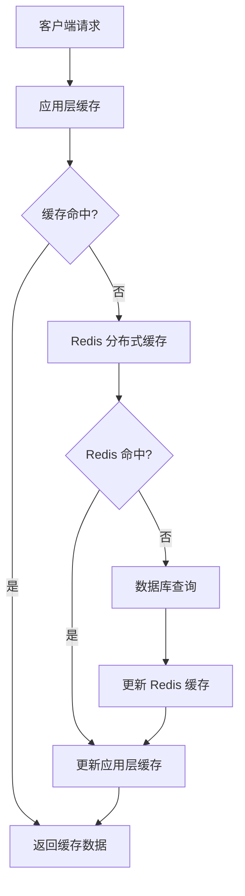

# 🚀 缓存配置详细指南

本文档提供了完整的缓存系统配置指南，包括 Redis 配置、缓存策略、性能优化和监控方案。

## 📋 目录

- [缓存架构概览](#缓存架构概览)
- [Redis 配置](#redis-配置)
- [缓存策略](#缓存策略)
- [缓存键管理](#缓存键管理)
- [性能优化](#性能优化)
- [监控与告警](#监控与告警)
- [故障排除](#故障排除)
- [最佳实践](#最佳实践)

---

## 🏗️ 缓存架构概览

### 多层缓存架构



### 缓存层级说明

| 层级 | 类型 | 用途 | TTL | 容量 |
|------|------|------|-----|------|
| **L1** | 应用内存 | 热点数据 | 5-30分钟 | 100MB |
| **L2** | Redis 本地 | 会话数据 | 1-24小时 | 2GB |
| **L3** | Redis 集群 | 业务数据 | 1-7天 | 50GB |
| **L4** | CDN | 静态资源 | 30天 | 无限 |

---

## ⚙️ Redis 配置

### 基础配置文件

创建 `config/redis.conf`：

```conf
# Redis 6.2+ 生产环境配置
# 基础设置
bind 127.0.0.1 ::1
port 6379
timeout 300
tcp-keepalive 300

# 内存管理
maxmemory 2gb
maxmemory-policy allkeys-lru
maxmemory-samples 5

# 持久化配置
save 900 1
save 300 10
save 60 10000

# AOF 配置
appendonly yes
appendfilename "appendonly.aof"
appendfsync everysec
no-appendfsync-on-rewrite no
auto-aof-rewrite-percentage 100
auto-aof-rewrite-min-size 64mb

# 安全配置
requirepass your_strong_password_here
rename-command FLUSHDB ""
rename-command FLUSHALL ""
rename-command DEBUG ""

# 网络配置
tcp-backlog 511
databases 16

# 日志配置
loglevel notice
logfile "/var/log/redis/redis-server.log"
syslog-enabled yes
syslog-ident redis

# 慢查询日志
slowlog-log-slower-than 10000
slowlog-max-len 128

# 客户端配置
maxclients 10000
```

### NestJS Redis 配置

创建 `src/config/cache.config.ts`：

```typescript
import { CacheModuleOptions } from '@nestjs/cache-manager';
import { ConfigService } from '@nestjs/config';
import * as redisStore from 'cache-manager-redis-store';

export const cacheConfig = (configService: ConfigService): CacheModuleOptions => ({
  store: redisStore,
  host: configService.get('REDIS_HOST', 'localhost'),
  port: configService.get('REDIS_PORT', 6379),
  password: configService.get('REDIS_PASSWORD'),
  db: configService.get('REDIS_DB', 0),
  ttl: configService.get('CACHE_TTL', 300), // 5分钟默认TTL
  max: configService.get('CACHE_MAX_ITEMS', 1000),
  
  // 连接池配置
  socket: {
    connectTimeout: 5000,
    lazyConnect: true,
    keepAlive: true,
  },
  
  // 重试配置
  retryDelayOnFailover: 100,
  enableReadyCheck: true,
  maxRetriesPerRequest: 3,
  
  // 集群配置（如果使用 Redis 集群）
  enableOfflineQueue: false,
  
  // 序列化配置
  serialize: JSON.stringify,
  deserialize: JSON.parse,
});

// 多 Redis 实例配置
export const multiCacheConfig = {
  // 会话缓存
  session: {
    host: process.env.REDIS_SESSION_HOST || 'localhost',
    port: parseInt(process.env.REDIS_SESSION_PORT) || 6379,
    db: 0,
    ttl: 1800, // 30分钟
  },
  
  // 业务数据缓存
  business: {
    host: process.env.REDIS_BUSINESS_HOST || 'localhost',
    port: parseInt(process.env.REDIS_BUSINESS_PORT) || 6380,
    db: 1,
    ttl: 3600, // 1小时
  },
  
  // 临时数据缓存
  temp: {
    host: process.env.REDIS_TEMP_HOST || 'localhost',
    port: parseInt(process.env.REDIS_TEMP_PORT) || 6381,
    db: 2,
    ttl: 300, // 5分钟
  },
};
```

### 环境变量配置

```env
# Redis 基础配置
REDIS_HOST=localhost
REDIS_PORT=6379
REDIS_PASSWORD=your_strong_password
REDIS_DB=0

# 缓存配置
CACHE_TTL=300
CACHE_MAX_ITEMS=1000
CACHE_ENABLE=true

# 多实例配置
REDIS_SESSION_HOST=redis-session
REDIS_SESSION_PORT=6379
REDIS_BUSINESS_HOST=redis-business
REDIS_BUSINESS_PORT=6380
REDIS_TEMP_HOST=redis-temp
REDIS_TEMP_PORT=6381

# 集群配置
REDIS_CLUSTER_ENABLED=false
REDIS_CLUSTER_NODES=redis-1:6379,redis-2:6379,redis-3:6379

# 监控配置
REDIS_MONITOR_ENABLED=true
REDIS_SLOW_LOG_THRESHOLD=10000
```

---

## 🎯 缓存策略

### 缓存模式

#### 1. Cache-Aside（旁路缓存）

```typescript
@Injectable()
export class ProductService {
  constructor(
    @Inject(CACHE_MANAGER) private cacheManager: Cache,
    private productRepository: ProductRepository,
  ) {}

  async getProduct(id: string): Promise<Product> {
    const cacheKey = `product:${id}`;
    
    // 1. 先查缓存
    let product = await this.cacheManager.get<Product>(cacheKey);
    
    if (product) {
      return product;
    }
    
    // 2. 缓存未命中，查数据库
    product = await this.productRepository.findById(id);
    
    if (product) {
      // 3. 更新缓存
      await this.cacheManager.set(cacheKey, product, 3600);
    }
    
    return product;
  }

  async updateProduct(id: string, data: UpdateProductDto): Promise<Product> {
    const product = await this.productRepository.update(id, data);
    
    // 更新后删除缓存，下次访问时重新加载
    await this.cacheManager.del(`product:${id}`);
    
    return product;
  }
}
```

#### 2. Write-Through（写穿透）

```typescript
@Injectable()
export class UserService {
  async updateUser(id: string, data: UpdateUserDto): Promise<User> {
    // 1. 更新数据库
    const user = await this.userRepository.update(id, data);
    
    // 2. 同步更新缓存
    const cacheKey = `user:${id}`;
    await this.cacheManager.set(cacheKey, user, 1800);
    
    return user;
  }
}
```

#### 3. Write-Behind（写回）

```typescript
@Injectable()
export class AnalyticsService {
  private writeQueue = new Map<string, any>();
  
  constructor(
    @Inject(CACHE_MANAGER) private cacheManager: Cache,
    private analyticsRepository: AnalyticsRepository,
  ) {
    // 定期批量写入数据库
    setInterval(() => this.flushToDatabase(), 30000);
  }

  async recordEvent(event: AnalyticsEvent): Promise<void> {
    const cacheKey = `analytics:${event.id}`;
    
    // 1. 立即写入缓存
    await this.cacheManager.set(cacheKey, event, 3600);
    
    // 2. 加入写队列
    this.writeQueue.set(event.id, event);
  }

  private async flushToDatabase(): Promise<void> {
    if (this.writeQueue.size === 0) return;
    
    const events = Array.from(this.writeQueue.values());
    await this.analyticsRepository.batchInsert(events);
    
    this.writeQueue.clear();
  }
}
```

### 缓存预热策略

```typescript
@Injectable()
export class CacheWarmupService {
  constructor(
    @Inject(CACHE_MANAGER) private cacheManager: Cache,
    private productService: ProductService,
    private userService: UserService,
  ) {}

  @Cron('0 2 * * *') // 每天凌晨2点执行
  async warmupCache(): Promise<void> {
    console.log('开始缓存预热...');
    
    // 预热热门商品
    await this.warmupHotProducts();
    
    // 预热活跃用户
    await this.warmupActiveUsers();
    
    // 预热系统配置
    await this.warmupSystemConfig();
    
    console.log('缓存预热完成');
  }

  private async warmupHotProducts(): Promise<void> {
    const hotProducts = await this.productService.getHotProducts(100);
    
    for (const product of hotProducts) {
      const cacheKey = `product:${product.id}`;
      await this.cacheManager.set(cacheKey, product, 7200);
    }
  }

  private async warmupActiveUsers(): Promise<void> {
    const activeUsers = await this.userService.getActiveUsers(500);
    
    for (const user of activeUsers) {
      const cacheKey = `user:${user.id}`;
      await this.cacheManager.set(cacheKey, user, 3600);
    }
  }

  private async warmupSystemConfig(): Promise<void> {
    const configs = await this.configService.getAllConfigs();
    await this.cacheManager.set('system:config', configs, 86400);
  }
}
```

---

## 🔑 缓存键管理

### 缓存键管理器

参考现有的 <mcfile name="cache-key-manager.ts" path="d:\codes\onlinestore\caddy-style-shopping-site\backend\src\config\cache-key-manager.ts"></mcfile>，扩展功能：

```typescript
export class CacheKeyManager {
  // 基础键前缀
  private static readonly PREFIXES = {
    USER: 'user',
    PRODUCT: 'product',
    ORDER: 'order',
    SESSION: 'session',
    CONFIG: 'config',
    ANALYTICS: 'analytics',
    SEARCH: 'search',
    CART: 'cart',
  } as const;

  // 环境前缀
  private static readonly ENV_PREFIX = process.env.NODE_ENV || 'dev';

  /**
   * 生成用户相关缓存键
   */
  static user = {
    profile: (userId: string) => 
      `${this.ENV_PREFIX}:${this.PREFIXES.USER}:profile:${userId}`,
    
    permissions: (userId: string) => 
      `${this.ENV_PREFIX}:${this.PREFIXES.USER}:permissions:${userId}`,
    
    preferences: (userId: string) => 
      `${this.ENV_PREFIX}:${this.PREFIXES.USER}:preferences:${userId}`,
    
    loginAttempts: (ip: string) => 
      `${this.ENV_PREFIX}:${this.PREFIXES.USER}:login_attempts:${ip}`,
  };

  /**
   * 生成商品相关缓存键
   */
  static product = {
    detail: (productId: string) => 
      `${this.ENV_PREFIX}:${this.PREFIXES.PRODUCT}:detail:${productId}`,
    
    list: (category: string, page: number, limit: number) => 
      `${this.ENV_PREFIX}:${this.PREFIXES.PRODUCT}:list:${category}:${page}:${limit}`,
    
    hot: (limit: number) => 
      `${this.ENV_PREFIX}:${this.PREFIXES.PRODUCT}:hot:${limit}`,
    
    inventory: (productId: string) => 
      `${this.ENV_PREFIX}:${this.PREFIXES.PRODUCT}:inventory:${productId}`,
  };

  /**
   * 生成订单相关缓存键
   */
  static order = {
    detail: (orderId: string) => 
      `${this.ENV_PREFIX}:${this.PREFIXES.ORDER}:detail:${orderId}`,
    
    userOrders: (userId: string, status?: string) => 
      `${this.ENV_PREFIX}:${this.PREFIXES.ORDER}:user:${userId}${status ? `:${status}` : ''}`,
    
    statistics: (date: string) => 
      `${this.ENV_PREFIX}:${this.PREFIXES.ORDER}:stats:${date}`,
  };

  /**
   * 生成会话相关缓存键
   */
  static session = {
    token: (tokenId: string) => 
      `${this.ENV_PREFIX}:${this.PREFIXES.SESSION}:token:${tokenId}`,
    
    user: (userId: string) => 
      `${this.ENV_PREFIX}:${this.PREFIXES.SESSION}:user:${userId}`,
    
    refresh: (refreshToken: string) => 
      `${this.ENV_PREFIX}:${this.PREFIXES.SESSION}:refresh:${refreshToken}`,
  };

  /**
   * 生成搜索相关缓存键
   */
  static search = {
    query: (query: string, filters: string) => 
      `${this.ENV_PREFIX}:${this.PREFIXES.SEARCH}:query:${this.hashString(query + filters)}`,
    
    suggestions: (prefix: string) => 
      `${this.ENV_PREFIX}:${this.PREFIXES.SEARCH}:suggestions:${prefix}`,
    
    trending: () => 
      `${this.ENV_PREFIX}:${this.PREFIXES.SEARCH}:trending`,
  };

  /**
   * 生成购物车相关缓存键
   */
  static cart = {
    items: (userId: string) => 
      `${this.ENV_PREFIX}:${this.PREFIXES.CART}:items:${userId}`,
    
    count: (userId: string) => 
      `${this.ENV_PREFIX}:${this.PREFIXES.CART}:count:${userId}`,
  };

  /**
   * 生成配置相关缓存键
   */
  static config = {
    system: () => 
      `${this.ENV_PREFIX}:${this.PREFIXES.CONFIG}:system`,
    
    feature: (featureName: string) => 
      `${this.ENV_PREFIX}:${this.PREFIXES.CONFIG}:feature:${featureName}`,
    
    rate_limit: (endpoint: string) => 
      `${this.ENV_PREFIX}:${this.PREFIXES.CONFIG}:rate_limit:${endpoint}`,
  };

  /**
   * 批量删除缓存键
   */
  static async deletePattern(
    cacheManager: Cache, 
    pattern: string
  ): Promise<void> {
    // 注意：这需要 Redis 支持，不是所有缓存实现都支持
    const redis = (cacheManager as any).store.getClient();
    const keys = await redis.keys(pattern);
    
    if (keys.length > 0) {
      await redis.del(...keys);
    }
  }

  /**
   * 生成哈希字符串
   */
  private static hashString(str: string): string {
    let hash = 0;
    for (let i = 0; i < str.length; i++) {
      const char = str.charCodeAt(i);
      hash = ((hash << 5) - hash) + char;
      hash = hash & hash; // 转换为32位整数
    }
    return Math.abs(hash).toString(36);
  }

  /**
   * 获取键的TTL建议
   */
  static getTTL(keyType: string): number {
    const ttlMap: Record<string, number> = {
      'user:profile': 3600,        // 1小时
      'user:permissions': 1800,    // 30分钟
      'product:detail': 7200,      // 2小时
      'product:list': 1800,        // 30分钟
      'product:hot': 3600,         // 1小时
      'order:detail': 1800,        // 30分钟
      'session:token': 86400,      // 24小时
      'search:query': 1800,        // 30分钟
      'config:system': 86400,      // 24小时
      'cart:items': 604800,        // 7天
    };

    return ttlMap[keyType] || 300; // 默认5分钟
  }
}
```

### 缓存装饰器

```typescript
import { SetMetadata } from '@nestjs/common';

export const CACHE_KEY_METADATA = 'cache_key';
export const CACHE_TTL_METADATA = 'cache_ttl';

/**
 * 缓存装饰器
 */
export function Cacheable(key: string, ttl?: number) {
  return function (target: any, propertyName: string, descriptor: PropertyDescriptor) {
    SetMetadata(CACHE_KEY_METADATA, key)(target, propertyName, descriptor);
    if (ttl) {
      SetMetadata(CACHE_TTL_METADATA, ttl)(target, propertyName, descriptor);
    }
    return descriptor;
  };
}

/**
 * 缓存拦截器
 */
@Injectable()
export class CacheInterceptor implements NestInterceptor {
  constructor(@Inject(CACHE_MANAGER) private cacheManager: Cache) {}

  async intercept(context: ExecutionContext, next: CallHandler): Promise<Observable<any>> {
    const handler = context.getHandler();
    const cacheKey = Reflect.getMetadata(CACHE_KEY_METADATA, handler);
    const cacheTTL = Reflect.getMetadata(CACHE_TTL_METADATA, handler);

    if (!cacheKey) {
      return next.handle();
    }

    // 构建完整的缓存键
    const request = context.switchToHttp().getRequest();
    const fullCacheKey = this.buildCacheKey(cacheKey, request);

    // 尝试从缓存获取
    const cachedResult = await this.cacheManager.get(fullCacheKey);
    if (cachedResult) {
      return of(cachedResult);
    }

    // 执行方法并缓存结果
    return next.handle().pipe(
      tap(async (result) => {
        await this.cacheManager.set(fullCacheKey, result, cacheTTL || 300);
      }),
    );
  }

  private buildCacheKey(template: string, request: any): string {
    return template
      .replace(':userId', request.user?.id || 'anonymous')
      .replace(':id', request.params?.id || '')
      .replace(':query', JSON.stringify(request.query || {}));
  }
}

// 使用示例
@Controller('products')
export class ProductController {
  @Get(':id')
  @Cacheable('product:detail:${id}', 3600)
  async getProduct(@Param('id') id: string) {
    return this.productService.findById(id);
  }

  @Get()
  @Cacheable('product:list:${query}', 1800)
  async getProducts(@Query() query: any) {
    return this.productService.findAll(query);
  }
}
```

---

## 📊 性能优化

### 连接池优化

```typescript
// Redis 连接池配置
export const redisPoolConfig = {
  // 连接池大小
  poolSize: 10,
  
  // 连接超时
  connectTimeout: 5000,
  
  // 命令超时
  commandTimeout: 3000,
  
  // 重试配置
  retryDelayOnFailover: 100,
  maxRetriesPerRequest: 3,
  
  // 保持连接
  keepAlive: true,
  
  // 懒连接
  lazyConnect: true,
  
  // 离线队列
  enableOfflineQueue: false,
};
```

### 批量操作优化

```typescript
@Injectable()
export class BatchCacheService {
  constructor(@Inject(CACHE_MANAGER) private cacheManager: Cache) {}

  /**
   * 批量获取缓存
   */
  async mget(keys: string[]): Promise<Record<string, any>> {
    const redis = (this.cacheManager as any).store.getClient();
    const values = await redis.mget(...keys);
    
    const result: Record<string, any> = {};
    keys.forEach((key, index) => {
      if (values[index]) {
        result[key] = JSON.parse(values[index]);
      }
    });
    
    return result;
  }

  /**
   * 批量设置缓存
   */
  async mset(data: Record<string, any>, ttl: number = 300): Promise<void> {
    const redis = (this.cacheManager as any).store.getClient();
    const pipeline = redis.pipeline();
    
    Object.entries(data).forEach(([key, value]) => {
      pipeline.setex(key, ttl, JSON.stringify(value));
    });
    
    await pipeline.exec();
  }

  /**
   * 批量删除缓存
   */
  async mdel(keys: string[]): Promise<void> {
    if (keys.length === 0) return;
    
    const redis = (this.cacheManager as any).store.getClient();
    await redis.del(...keys);
  }
}
```

### 缓存压缩

```typescript
import * as zlib from 'zlib';
import { promisify } from 'util';

const gzip = promisify(zlib.gzip);
const gunzip = promisify(zlib.gunzip);

@Injectable()
export class CompressedCacheService {
  constructor(@Inject(CACHE_MANAGER) private cacheManager: Cache) {}

  async setCompressed(key: string, value: any, ttl: number = 300): Promise<void> {
    const serialized = JSON.stringify(value);
    
    // 只有数据较大时才压缩
    if (serialized.length > 1024) {
      const compressed = await gzip(serialized);
      await this.cacheManager.set(`${key}:compressed`, compressed, ttl);
    } else {
      await this.cacheManager.set(key, value, ttl);
    }
  }

  async getCompressed(key: string): Promise<any> {
    // 先尝试获取压缩版本
    const compressed = await this.cacheManager.get(`${key}:compressed`);
    if (compressed) {
      const decompressed = await gunzip(compressed as Buffer);
      return JSON.parse(decompressed.toString());
    }
    
    // 回退到普通版本
    return this.cacheManager.get(key);
  }
}
```

---

## 📈 监控与告警

### 缓存指标收集

```typescript
@Injectable()
export class CacheMetricsService {
  private hitCount = 0;
  private missCount = 0;
  private errorCount = 0;

  constructor(@Inject(CACHE_MANAGER) private cacheManager: Cache) {}

  async get(key: string): Promise<any> {
    try {
      const value = await this.cacheManager.get(key);
      
      if (value !== undefined) {
        this.hitCount++;
      } else {
        this.missCount++;
      }
      
      return value;
    } catch (error) {
      this.errorCount++;
      throw error;
    }
  }

  getMetrics() {
    const total = this.hitCount + this.missCount;
    return {
      hitCount: this.hitCount,
      missCount: this.missCount,
      errorCount: this.errorCount,
      hitRate: total > 0 ? (this.hitCount / total) * 100 : 0,
      totalRequests: total,
    };
  }

  resetMetrics() {
    this.hitCount = 0;
    this.missCount = 0;
    this.errorCount = 0;
  }
}
```

### Prometheus 指标导出

```typescript
import { register, Counter, Histogram, Gauge } from 'prom-client';

@Injectable()
export class CachePrometheusService {
  private cacheHits = new Counter({
    name: 'cache_hits_total',
    help: 'Total number of cache hits',
    labelNames: ['cache_type', 'key_prefix'],
  });

  private cacheMisses = new Counter({
    name: 'cache_misses_total',
    help: 'Total number of cache misses',
    labelNames: ['cache_type', 'key_prefix'],
  });

  private cacheOperationDuration = new Histogram({
    name: 'cache_operation_duration_seconds',
    help: 'Duration of cache operations',
    labelNames: ['operation', 'cache_type'],
    buckets: [0.001, 0.005, 0.01, 0.05, 0.1, 0.5, 1],
  });

  private cacheSize = new Gauge({
    name: 'cache_size_bytes',
    help: 'Current cache size in bytes',
    labelNames: ['cache_type'],
  });

  recordHit(cacheType: string, keyPrefix: string) {
    this.cacheHits.inc({ cache_type: cacheType, key_prefix: keyPrefix });
  }

  recordMiss(cacheType: string, keyPrefix: string) {
    this.cacheMisses.inc({ cache_type: cacheType, key_prefix: keyPrefix });
  }

  recordOperationDuration(operation: string, cacheType: string, duration: number) {
    this.cacheOperationDuration
      .labels({ operation, cache_type: cacheType })
      .observe(duration);
  }

  updateCacheSize(cacheType: string, size: number) {
    this.cacheSize.set({ cache_type: cacheType }, size);
  }
}
```

### 健康检查

```typescript
@Injectable()
export class CacheHealthService {
  constructor(@Inject(CACHE_MANAGER) private cacheManager: Cache) {}

  async checkHealth(): Promise<{
    status: 'healthy' | 'unhealthy';
    details: any;
  }> {
    try {
      const testKey = 'health_check_' + Date.now();
      const testValue = { timestamp: Date.now() };
      
      // 测试写入
      const writeStart = Date.now();
      await this.cacheManager.set(testKey, testValue, 10);
      const writeTime = Date.now() - writeStart;
      
      // 测试读取
      const readStart = Date.now();
      const retrieved = await this.cacheManager.get(testKey);
      const readTime = Date.now() - readStart;
      
      // 测试删除
      await this.cacheManager.del(testKey);
      
      // 检查 Redis 信息
      const redis = (this.cacheManager as any).store.getClient();
      const info = await redis.info();
      
      return {
        status: 'healthy',
        details: {
          writeTime,
          readTime,
          dataIntegrity: JSON.stringify(retrieved) === JSON.stringify(testValue),
          redisInfo: this.parseRedisInfo(info),
        },
      };
    } catch (error) {
      return {
        status: 'unhealthy',
        details: {
          error: error.message,
          timestamp: new Date().toISOString(),
        },
      };
    }
  }

  private parseRedisInfo(info: string): any {
    const lines = info.split('\r\n');
    const result: any = {};
    
    for (const line of lines) {
      if (line.includes(':')) {
        const [key, value] = line.split(':');
        result[key] = value;
      }
    }
    
    return {
      version: result.redis_version,
      uptime: result.uptime_in_seconds,
      connected_clients: result.connected_clients,
      used_memory: result.used_memory_human,
      keyspace_hits: result.keyspace_hits,
      keyspace_misses: result.keyspace_misses,
    };
  }
}
```

---

## 🔧 故障排除

### 常见问题诊断

#### 1. 缓存穿透

```typescript
@Injectable()
export class CachePenetrationProtection {
  private bloomFilter = new Set<string>(); // 简化的布隆过滤器

  async getWithProtection(key: string, fetcher: () => Promise<any>): Promise<any> {
    // 1. 检查布隆过滤器
    if (!this.bloomFilter.has(key)) {
      return null; // 数据肯定不存在
    }

    // 2. 查询缓存
    let value = await this.cacheManager.get(key);
    if (value !== undefined) {
      return value === null ? null : value;
    }

    // 3. 查询数据库
    value = await fetcher();
    
    // 4. 缓存结果（包括 null 值）
    await this.cacheManager.set(key, value, value ? 3600 : 300);
    
    return value;
  }

  addToBloomFilter(key: string) {
    this.bloomFilter.add(key);
  }
}
```

#### 2. 缓存雪崩

```typescript
@Injectable()
export class CacheAvalancheProtection {
  async setWithJitter(key: string, value: any, baseTTL: number): Promise<void> {
    // 添加随机抖动，避免同时过期
    const jitter = Math.random() * 0.2 * baseTTL; // 20% 抖动
    const finalTTL = baseTTL + jitter;
    
    await this.cacheManager.set(key, value, finalTTL);
  }

  async getWithFallback(
    key: string, 
    fetcher: () => Promise<any>,
    fallback: any = null
  ): Promise<any> {
    try {
      let value = await this.cacheManager.get(key);
      
      if (value === undefined) {
        value = await fetcher();
        await this.setWithJitter(key, value, 3600);
      }
      
      return value;
    } catch (error) {
      console.error('Cache operation failed:', error);
      return fallback;
    }
  }
}
```

#### 3. 缓存击穿

```typescript
@Injectable()
export class CacheBreakthroughProtection {
  private lockMap = new Map<string, Promise<any>>();

  async getWithLock(key: string, fetcher: () => Promise<any>): Promise<any> {
    // 1. 尝试获取缓存
    let value = await this.cacheManager.get(key);
    if (value !== undefined) {
      return value;
    }

    // 2. 检查是否已有请求在处理
    if (this.lockMap.has(key)) {
      return this.lockMap.get(key);
    }

    // 3. 创建新的请求
    const promise = this.fetchAndCache(key, fetcher);
    this.lockMap.set(key, promise);

    try {
      value = await promise;
      return value;
    } finally {
      this.lockMap.delete(key);
    }
  }

  private async fetchAndCache(key: string, fetcher: () => Promise<any>): Promise<any> {
    const value = await fetcher();
    await this.cacheManager.set(key, value, 3600);
    return value;
  }
}
```

### 性能调优

```typescript
@Injectable()
export class CachePerformanceTuner {
  async analyzeKeyDistribution(): Promise<any> {
    const redis = (this.cacheManager as any).store.getClient();
    
    // 获取所有键
    const keys = await redis.keys('*');
    
    // 分析键分布
    const distribution: Record<string, number> = {};
    for (const key of keys) {
      const prefix = key.split(':')[0];
      distribution[prefix] = (distribution[prefix] || 0) + 1;
    }
    
    return {
      totalKeys: keys.length,
      distribution,
      recommendations: this.generateRecommendations(distribution),
    };
  }

  private generateRecommendations(distribution: Record<string, number>): string[] {
    const recommendations: string[] = [];
    const total = Object.values(distribution).reduce((a, b) => a + b, 0);
    
    for (const [prefix, count] of Object.entries(distribution)) {
      const percentage = (count / total) * 100;
      
      if (percentage > 50) {
        recommendations.push(`${prefix} 键占比过高 (${percentage.toFixed(1)}%)，考虑分片`);
      }
      
      if (count > 10000) {
        recommendations.push(`${prefix} 键数量过多 (${count})，考虑清理策略`);
      }
    }
    
    return recommendations;
  }
}
```

---

## 🎯 最佳实践

### 1. 缓存设计原则

- **单一职责**：每个缓存键只存储一种类型的数据
- **命名规范**：使用统一的命名约定，便于管理和监控
- **TTL 策略**：根据数据特性设置合适的过期时间
- **版本控制**：在键名中包含版本信息，便于缓存更新

### 2. 性能优化建议

- **批量操作**：使用 pipeline 和 mget/mset 减少网络往返
- **数据压缩**：对大数据进行压缩存储
- **连接池**：合理配置连接池大小
- **监控告警**：实时监控缓存性能指标

### 3. 安全考虑

- **访问控制**：配置 Redis 密码和网络访问限制
- **数据加密**：敏感数据加密后存储
- **审计日志**：记录缓存操作日志
- **备份策略**：定期备份重要缓存数据

### 4. 运维建议

- **容量规划**：根据业务增长预估缓存容量需求
- **故障恢复**：制定缓存故障的应急预案
- **版本升级**：定期升级 Redis 版本，获取性能和安全改进
- **文档维护**：及时更新缓存配置和使用文档

---

## 🔗 相关链接

- [Redis 官方文档](https://redis.io/documentation)
- [NestJS 缓存模块](https://docs.nestjs.com/techniques/caching)
- [缓存模式最佳实践](https://docs.aws.amazon.com/whitepapers/latest/database-caching-strategies-using-redis/caching-patterns.html)
- [Redis 性能调优指南](https://redis.io/topics/memory-optimization)

---

**最后更新**：2025-01-26  
**配置版本**：v1.0.0  
**维护团队**：后端开发团队