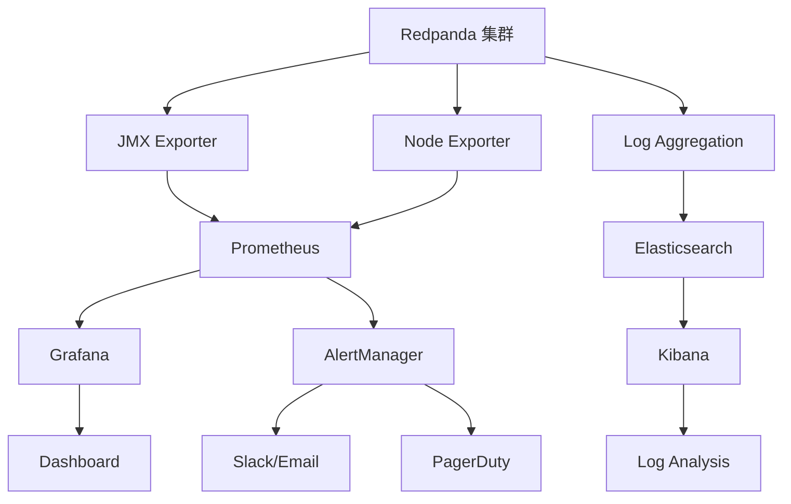

# 📊 消息队列监控指南

本文档提供了完整的消息队列监控方案，包括 Redpanda/Kafka 集群监控、性能指标、告警配置和故障排除。

## 📋 目录

- [监控架构概览](#监控架构概览)
- [核心指标](#核心指标)
- [Prometheus 配置](#prometheus-配置)
- [Grafana 仪表板](#grafana-仪表板)
- [告警规则](#告警规则)
- [日志监控](#日志监控)
- [性能调优](#性能调优)
- [故障排除](#故障排除)

---

## 🏗️ 监控架构概览

### 监控组件架构



### 监控层级

| 层级 | 组件 | 监控内容 | 工具 |
|------|------|----------|------|
| **基础设施** | 服务器/容器 | CPU、内存、磁盘、网络 | Node Exporter |
| **应用层** | Redpanda/Kafka | 吞吐量、延迟、分区状态 | JMX Exporter |
| **业务层** | 消息处理 | 消息积压、处理速度、错误率 | 自定义指标 |
| **用户体验** | 端到端 | 消息传递延迟、可用性 | 合成监控 |

---

## 📈 核心指标

### 1. 集群健康指标

#### Broker 状态指标

```yaml
# Broker 在线状态
kafka_server_broker_state:
  description: "Broker 状态 (0=离线, 1=在线)"
  type: gauge
  labels: [broker_id, cluster]

# 控制器状态
kafka_controller_active_controller_count:
  description: "活跃控制器数量"
  type: gauge
  expected_value: 1

# 分区领导者数量
kafka_server_replica_manager_leader_count:
  description: "当前 Broker 作为领导者的分区数"
  type: gauge
  labels: [broker_id]

# 未同步副本数量
kafka_server_replica_manager_under_replicated_partitions:
  description: "未完全同步的分区数量"
  type: gauge
  labels: [broker_id]
  alert_threshold: "> 0"
```

#### 集群级别指标

```yaml
# 总分区数
kafka_server_broker_topic_metrics_partition_count:
  description: "集群总分区数"
  type: gauge

# 离线分区数
kafka_controller_offline_partitions_count:
  description: "离线分区数量"
  type: gauge
  alert_threshold: "> 0"

# 首选副本不平衡率
kafka_controller_preferred_replica_imbalance_count:
  description: "首选副本不平衡的分区数"
  type: gauge
```

### 2. 性能指标

#### 吞吐量指标

```yaml
# 消息生产速率
kafka_server_broker_topic_metrics_messages_in_per_sec:
  description: "每秒接收消息数"
  type: rate
  labels: [topic, broker_id]

# 字节生产速率
kafka_server_broker_topic_metrics_bytes_in_per_sec:
  description: "每秒接收字节数"
  type: rate
  labels: [topic, broker_id]

# 消息消费速率
kafka_server_broker_topic_metrics_bytes_out_per_sec:
  description: "每秒发送字节数"
  type: rate
  labels: [topic, broker_id]

# 请求处理速率
kafka_network_request_metrics_request_rate:
  description: "每秒请求数"
  type: rate
  labels: [request_type, broker_id]
```

#### 延迟指标

```yaml
# 生产者请求延迟
kafka_network_request_metrics_total_time_ms:
  description: "请求总处理时间"
  type: histogram
  labels: [request_type, broker_id]
  percentiles: [50, 95, 99]

# 消费者拉取延迟
kafka_server_fetch_session_cache_eviction_rate:
  description: "拉取会话缓存逐出率"
  type: rate

# 端到端延迟
kafka_producer_record_queue_time_avg:
  description: "消息在生产者队列中的平均等待时间"
  type: gauge
```

### 3. 资源使用指标

#### 内存使用

```yaml
# JVM 堆内存使用
jvm_memory_bytes_used:
  description: "JVM 内存使用量"
  type: gauge
  labels: [area, broker_id]

# 页缓存命中率
kafka_log_log_size:
  description: "日志文件大小"
  type: gauge
  labels: [topic, partition, broker_id]

# 网络缓冲区使用
kafka_server_socket_server_metrics_network_processor_avg_idle_percent:
  description: "网络处理器平均空闲百分比"
  type: gauge
```

#### 磁盘使用

```yaml
# 磁盘使用率
node_filesystem_avail_bytes:
  description: "可用磁盘空间"
  type: gauge
  labels: [device, mountpoint]

# 磁盘 I/O
node_disk_io_time_seconds_total:
  description: "磁盘 I/O 时间"
  type: counter
  labels: [device]

# 日志段数量
kafka_log_num_log_segments:
  description: "日志段数量"
  type: gauge
  labels: [topic, partition]
```

---

## ⚙️ Prometheus 配置

### 1. JMX Exporter 配置

创建 `jmx_exporter_config.yml`：

```yaml
# JMX Exporter 配置文件
startDelaySeconds: 0
ssl: false
lowercaseOutputName: false
lowercaseOutputLabelNames: false

# 白名单规则
whitelistObjectNames:
  - "kafka.server:type=BrokerTopicMetrics,name=*"
  - "kafka.server:type=ReplicaManager,name=*"
  - "kafka.server:type=KafkaRequestHandlerPool,name=*"
  - "kafka.network:type=RequestMetrics,name=*"
  - "kafka.controller:type=KafkaController,name=*"
  - "kafka.server:type=SessionExpireListener,name=*"
  - "kafka.log:type=LogFlushStats,name=*"
  - "java.lang:type=Memory"
  - "java.lang:type=GarbageCollector,name=*"

# 黑名单规则
blacklistObjectNames:
  - "kafka.consumer:type=*,id=*"
  - "kafka.producer:type=*,id=*"

# 指标转换规则
rules:
  # Broker Topic Metrics
  - pattern: kafka.server<type=BrokerTopicMetrics, name=(.+), topic=(.+)><>Count
    name: kafka_server_broker_topic_metrics_$1_total
    labels:
      topic: "$2"
    type: COUNTER

  - pattern: kafka.server<type=BrokerTopicMetrics, name=(.+), topic=(.+)><>OneMinuteRate
    name: kafka_server_broker_topic_metrics_$1_per_sec
    labels:
      topic: "$2"
    type: GAUGE

  # Request Metrics
  - pattern: kafka.network<type=RequestMetrics, name=(.+), request=(.+)><>Count
    name: kafka_network_request_metrics_$1_total
    labels:
      request: "$2"
    type: COUNTER

  - pattern: kafka.network<type=RequestMetrics, name=(.+), request=(.+)><>OneMinuteRate
    name: kafka_network_request_metrics_$1_per_sec
    labels:
      request: "$2"
    type: GAUGE

  # Controller Metrics
  - pattern: kafka.controller<type=KafkaController, name=(.+)><>Value
    name: kafka_controller_$1
    type: GAUGE

  # Replica Manager
  - pattern: kafka.server<type=ReplicaManager, name=(.+)><>Value
    name: kafka_server_replica_manager_$1
    type: GAUGE

  # JVM Metrics
  - pattern: java.lang<type=Memory><HeapMemoryUsage>(.+)
    name: jvm_memory_heap_$1
    type: GAUGE

  - pattern: java.lang<type=Memory><NonHeapMemoryUsage>(.+)
    name: jvm_memory_nonheap_$1
    type: GAUGE

  - pattern: java.lang<type=GarbageCollector, name=(.+)><>CollectionCount
    name: jvm_gc_collection_count_total
    labels:
      gc: "$1"
    type: COUNTER
```

### 2. Prometheus 抓取配置

```yaml
# prometheus.yml
global:
  scrape_interval: 15s
  evaluation_interval: 15s

rule_files:
  - "kafka_alerts.yml"

scrape_configs:
  # Redpanda/Kafka JMX 指标
  - job_name: 'kafka-jmx'
    static_configs:
      - targets: 
          - 'kafka-1:9308'
          - 'kafka-2:9308'
          - 'kafka-3:9308'
    scrape_interval: 10s
    metrics_path: /metrics

  # Node Exporter 指标
  - job_name: 'kafka-nodes'
    static_configs:
      - targets:
          - 'kafka-1:9100'
          - 'kafka-2:9100'
          - 'kafka-3:9100'
    scrape_interval: 15s

  # 自定义应用指标
  - job_name: 'kafka-lag-exporter'
    static_configs:
      - targets: ['kafka-lag-exporter:9999']
    scrape_interval: 30s

  # Redpanda 特定指标
  - job_name: 'redpanda-admin'
    static_configs:
      - targets: 
          - 'redpanda-1:9644'
          - 'redpanda-2:9644'
          - 'redpanda-3:9644'
    metrics_path: /metrics
    scrape_interval: 15s

alerting:
  alertmanagers:
    - static_configs:
        - targets:
          - alertmanager:9093
```

### 3. Kafka Lag Exporter 配置

```yaml
# kafka-lag-exporter.yml
clusters:
  - name: "production-cluster"
    bootstrap-brokers: "kafka-1:9092,kafka-2:9092,kafka-3:9092"
    group-whitelist:
      - "user-service-group"
      - "order-service-group"
      - "notification-service-group"
    topic-whitelist:
      - "user-events"
      - "order-events"
      - "notification-events"
    consumer-properties:
      security.protocol: "PLAINTEXT"
    admin-client-properties:
      security.protocol: "PLAINTEXT"

watchers:
  strimzi: false

metric-whitelist:
  - "kafka_consumer_lag_sum"
  - "kafka_consumer_lag_max"
  - "kafka_consumer_current_offset"
  - "kafka_consumer_log_end_offset"

poll-interval: 30
lookup-table-size: 120
```

---

## 📊 Grafana 仪表板

### 1. 集群概览仪表板

```json
{
  "dashboard": {
    "title": "Kafka 集群概览",
    "panels": [
      {
        "title": "集群健康状态",
        "type": "stat",
        "targets": [
          {
            "expr": "kafka_server_broker_state",
            "legendFormat": "Broker {{broker_id}}"
          }
        ],
        "fieldConfig": {
          "defaults": {
            "color": {
              "mode": "thresholds"
            },
            "thresholds": {
              "steps": [
                {"color": "red", "value": 0},
                {"color": "green", "value": 1}
              ]
            }
          }
        }
      },
      {
        "title": "消息吞吐量",
        "type": "graph",
        "targets": [
          {
            "expr": "sum(rate(kafka_server_broker_topic_metrics_messages_in_per_sec[5m]))",
            "legendFormat": "Messages In/sec"
          },
          {
            "expr": "sum(rate(kafka_server_broker_topic_metrics_bytes_in_per_sec[5m]))",
            "legendFormat": "Bytes In/sec"
          }
        ],
        "yAxes": [
          {
            "label": "Messages/sec",
            "min": 0
          },
          {
            "label": "Bytes/sec",
            "min": 0
          }
        ]
      },
      {
        "title": "分区状态",
        "type": "stat",
        "targets": [
          {
            "expr": "kafka_controller_offline_partitions_count",
            "legendFormat": "离线分区"
          },
          {
            "expr": "sum(kafka_server_replica_manager_under_replicated_partitions)",
            "legendFormat": "未同步分区"
          }
        ],
        "fieldConfig": {
          "defaults": {
            "color": {
              "mode": "thresholds"
            },
            "thresholds": {
              "steps": [
                {"color": "green", "value": 0},
                {"color": "red", "value": 1}
              ]
            }
          }
        }
      }
    ]
  }
}
```

### 2. 性能监控仪表板

```json
{
  "dashboard": {
    "title": "Kafka 性能监控",
    "panels": [
      {
        "title": "请求延迟分布",
        "type": "heatmap",
        "targets": [
          {
            "expr": "histogram_quantile(0.95, rate(kafka_network_request_metrics_total_time_ms_bucket[5m]))",
            "legendFormat": "95th percentile"
          },
          {
            "expr": "histogram_quantile(0.99, rate(kafka_network_request_metrics_total_time_ms_bucket[5m]))",
            "legendFormat": "99th percentile"
          }
        ]
      },
      {
        "title": "消费者延迟",
        "type": "graph",
        "targets": [
          {
            "expr": "kafka_consumer_lag_sum by (group, topic)",
            "legendFormat": "{{group}} - {{topic}}"
          }
        ],
        "alert": {
          "conditions": [
            {
              "query": {"queryType": "", "refId": "A"},
              "reducer": {"type": "last", "params": []},
              "evaluator": {"params": [1000], "type": "gt"}
            }
          ],
          "executionErrorState": "alerting",
          "noDataState": "no_data",
          "frequency": "10s",
          "handler": 1,
          "name": "消费者延迟过高",
          "message": "消费者组 {{group}} 在主题 {{topic}} 上的延迟超过 1000 条消息"
        }
      },
      {
        "title": "磁盘使用率",
        "type": "graph",
        "targets": [
          {
            "expr": "(1 - node_filesystem_avail_bytes{mountpoint=\"/kafka-logs\"} / node_filesystem_size_bytes{mountpoint=\"/kafka-logs\"}) * 100",
            "legendFormat": "{{instance}}"
          }
        ],
        "yAxes": [
          {
            "label": "使用率 (%)",
            "min": 0,
            "max": 100
          }
        ]
      }
    ]
  }
}
```

### 3. 业务监控仪表板

```json
{
  "dashboard": {
    "title": "业务消息监控",
    "panels": [
      {
        "title": "各主题消息量",
        "type": "graph",
        "targets": [
          {
            "expr": "sum(rate(kafka_server_broker_topic_metrics_messages_in_per_sec[5m])) by (topic)",
            "legendFormat": "{{topic}}"
          }
        ]
      },
      {
        "title": "错误消息率",
        "type": "stat",
        "targets": [
          {
            "expr": "sum(rate(kafka_server_broker_topic_metrics_failed_produce_requests_per_sec[5m]))",
            "legendFormat": "生产失败率"
          },
          {
            "expr": "sum(rate(kafka_server_broker_topic_metrics_failed_fetch_requests_per_sec[5m]))",
            "legendFormat": "消费失败率"
          }
        ],
        "fieldConfig": {
          "defaults": {
            "unit": "reqps",
            "color": {
              "mode": "thresholds"
            },
            "thresholds": {
              "steps": [
                {"color": "green", "value": 0},
                {"color": "yellow", "value": 1},
                {"color": "red", "value": 10}
              ]
            }
          }
        }
      }
    ]
  }
}
```

---

## 🚨 告警规则

### 1. 集群健康告警

```yaml
# kafka_alerts.yml
groups:
  - name: kafka.cluster.health
    rules:
      - alert: KafkaBrokerDown
        expr: kafka_server_broker_state == 0
        for: 1m
        labels:
          severity: critical
          service: kafka
        annotations:
          summary: "Kafka Broker 离线"
          description: "Broker {{ $labels.broker_id }} 已离线超过 1 分钟"

      - alert: KafkaControllerDown
        expr: kafka_controller_active_controller_count == 0
        for: 30s
        labels:
          severity: critical
          service: kafka
        annotations:
          summary: "Kafka 控制器不可用"
          description: "集群中没有活跃的控制器"

      - alert: KafkaOfflinePartitions
        expr: kafka_controller_offline_partitions_count > 0
        for: 1m
        labels:
          severity: critical
          service: kafka
        annotations:
          summary: "Kafka 分区离线"
          description: "有 {{ $value }} 个分区处于离线状态"

      - alert: KafkaUnderReplicatedPartitions
        expr: sum(kafka_server_replica_manager_under_replicated_partitions) > 0
        for: 5m
        labels:
          severity: warning
          service: kafka
        annotations:
          summary: "Kafka 分区副本不足"
          description: "有 {{ $value }} 个分区的副本数不足"
```

### 2. 性能告警

```yaml
  - name: kafka.performance
    rules:
      - alert: KafkaHighProducerLatency
        expr: histogram_quantile(0.99, rate(kafka_network_request_metrics_total_time_ms_bucket{request="Produce"}[5m])) > 1000
        for: 5m
        labels:
          severity: warning
          service: kafka
        annotations:
          summary: "Kafka 生产者延迟过高"
          description: "99th 百分位生产者延迟为 {{ $value }}ms，超过阈值"

      - alert: KafkaHighConsumerLag
        expr: kafka_consumer_lag_sum > 10000
        for: 5m
        labels:
          severity: warning
          service: kafka
        annotations:
          summary: "Kafka 消费者延迟过高"
          description: "消费者组 {{ $labels.group }} 在主题 {{ $labels.topic }} 上的延迟为 {{ $value }} 条消息"

      - alert: KafkaLowThroughput
        expr: sum(rate(kafka_server_broker_topic_metrics_messages_in_per_sec[5m])) < 100
        for: 10m
        labels:
          severity: info
          service: kafka
        annotations:
          summary: "Kafka 吞吐量较低"
          description: "集群消息吞吐量为 {{ $value }} 消息/秒，低于预期"
```

### 3. 资源告警

```yaml
  - name: kafka.resources
    rules:
      - alert: KafkaHighMemoryUsage
        expr: (jvm_memory_heap_used / jvm_memory_heap_max) * 100 > 85
        for: 5m
        labels:
          severity: warning
          service: kafka
        annotations:
          summary: "Kafka JVM 内存使用率过高"
          description: "Broker {{ $labels.instance }} JVM 堆内存使用率为 {{ $value }}%"

      - alert: KafkaHighDiskUsage
        expr: (1 - node_filesystem_avail_bytes{mountpoint="/kafka-logs"} / node_filesystem_size_bytes{mountpoint="/kafka-logs"}) * 100 > 80
        for: 5m
        labels:
          severity: warning
          service: kafka
        annotations:
          summary: "Kafka 磁盘使用率过高"
          description: "节点 {{ $labels.instance }} 磁盘使用率为 {{ $value }}%"

      - alert: KafkaHighCPUUsage
        expr: 100 - (avg by(instance) (irate(node_cpu_seconds_total{mode="idle"}[5m])) * 100) > 80
        for: 10m
        labels:
          severity: warning
          service: kafka
        annotations:
          summary: "Kafka 节点 CPU 使用率过高"
          description: "节点 {{ $labels.instance }} CPU 使用率为 {{ $value }}%"
```

---

## 📝 日志监控

### 1. 日志收集配置

#### Filebeat 配置

```yaml
# filebeat.yml
filebeat.inputs:
  - type: log
    enabled: true
    paths:
      - /var/log/kafka/server.log
      - /var/log/kafka/controller.log
      - /var/log/kafka/kafka-request.log
    fields:
      service: kafka
      environment: production
    fields_under_root: true
    multiline.pattern: '^\d{4}-\d{2}-\d{2}'
    multiline.negate: true
    multiline.match: after

  - type: log
    enabled: true
    paths:
      - /var/log/redpanda/redpanda.log
    fields:
      service: redpanda
      environment: production
    fields_under_root: true

output.elasticsearch:
  hosts: ["elasticsearch:9200"]
  index: "kafka-logs-%{+yyyy.MM.dd}"

processors:
  - add_host_metadata:
      when.not.contains.tags: forwarded
  - add_docker_metadata: ~
  - add_kubernetes_metadata: ~

logging.level: info
logging.to_files: true
logging.files:
  path: /var/log/filebeat
  name: filebeat
  keepfiles: 7
  permissions: 0644
```

#### Logstash 配置

```ruby
# logstash.conf
input {
  beats {
    port => 5044
  }
}

filter {
  if [service] == "kafka" {
    grok {
      match => { 
        "message" => "\[%{TIMESTAMP_ISO8601:timestamp}\] %{LOGLEVEL:level} %{GREEDYDATA:message_content} \(%{DATA:logger}\)"
      }
    }
    
    date {
      match => [ "timestamp", "yyyy-MM-dd HH:mm:ss,SSS" ]
    }
    
    if [level] == "ERROR" {
      mutate {
        add_tag => [ "error" ]
      }
    }
    
    if [level] == "WARN" {
      mutate {
        add_tag => [ "warning" ]
      }
    }
  }
  
  if [service] == "redpanda" {
    json {
      source => "message"
    }
  }
}

output {
  elasticsearch {
    hosts => ["elasticsearch:9200"]
    index => "%{service}-logs-%{+YYYY.MM.dd}"
  }
  
  if "error" in [tags] {
    slack {
      url => "${SLACK_WEBHOOK_URL}"
      channel => "#kafka-alerts"
      username => "Kafka Monitor"
      icon_emoji => ":warning:"
      format => "Kafka Error: %{message_content}"
    }
  }
}
```

### 2. 日志分析查询

#### Elasticsearch 查询示例

```json
{
  "query": {
    "bool": {
      "must": [
        {
          "range": {
            "@timestamp": {
              "gte": "now-1h"
            }
          }
        },
        {
          "term": {
            "service": "kafka"
          }
        },
        {
          "term": {
            "level": "ERROR"
          }
        }
      ]
    }
  },
  "aggs": {
    "error_types": {
      "terms": {
        "field": "logger.keyword",
        "size": 10
      }
    },
    "error_timeline": {
      "date_histogram": {
        "field": "@timestamp",
        "interval": "5m"
      }
    }
  }
}
```

#### Kibana 仪表板配置

```json
{
  "version": "7.15.0",
  "objects": [
    {
      "id": "kafka-error-dashboard",
      "type": "dashboard",
      "attributes": {
        "title": "Kafka 错误监控",
        "panelsJSON": "[{\"version\":\"7.15.0\",\"panelIndex\":\"1\",\"gridData\":{\"x\":0,\"y\":0,\"w\":24,\"h\":15},\"panelRefName\":\"panel_1\",\"embeddableConfig\":{},\"id\":\"kafka-error-timeline\",\"type\":\"visualization\"},{\"version\":\"7.15.0\",\"panelIndex\":\"2\",\"gridData\":{\"x\":24,\"y\":0,\"w\":24,\"h\":15},\"panelRefName\":\"panel_2\",\"embeddableConfig\":{},\"id\":\"kafka-error-types\",\"type\":\"visualization\"}]"
      }
    }
  ]
}
```

---

## ⚡ 性能调优

### 1. 监控驱动的调优

#### 基于指标的调优建议

```typescript
@Injectable()
export class KafkaPerformanceTuner {
  constructor(
    private prometheusService: PrometheusService,
    private configService: ConfigService,
  ) {}

  async analyzePerformance(): Promise<TuningRecommendations> {
    const metrics = await this.collectMetrics();
    const recommendations: TuningRecommendations = {
      broker: [],
      producer: [],
      consumer: [],
      cluster: [],
    };

    // 分析生产者性能
    if (metrics.producerLatencyP99 > 1000) {
      recommendations.producer.push({
        parameter: 'batch.size',
        currentValue: await this.getConfigValue('batch.size'),
        recommendedValue: '32768',
        reason: '高延迟，建议增加批次大小以提高吞吐量',
      });
    }

    // 分析消费者延迟
    if (metrics.maxConsumerLag > 10000) {
      recommendations.consumer.push({
        parameter: 'fetch.min.bytes',
        currentValue: await this.getConfigValue('fetch.min.bytes'),
        recommendedValue: '1048576',
        reason: '消费延迟过高，建议增加拉取批次大小',
      });
    }

    // 分析磁盘使用
    if (metrics.diskUsagePercent > 80) {
      recommendations.broker.push({
        parameter: 'log.retention.hours',
        currentValue: await this.getConfigValue('log.retention.hours'),
        recommendedValue: '168',
        reason: '磁盘使用率过高，建议减少日志保留时间',
      });
    }

    return recommendations;
  }

  private async collectMetrics(): Promise<PerformanceMetrics> {
    const queries = {
      producerLatencyP99: 'histogram_quantile(0.99, rate(kafka_network_request_metrics_total_time_ms_bucket{request="Produce"}[5m]))',
      maxConsumerLag: 'max(kafka_consumer_lag_sum)',
      diskUsagePercent: 'max((1 - node_filesystem_avail_bytes{mountpoint="/kafka-logs"} / node_filesystem_size_bytes{mountpoint="/kafka-logs"}) * 100)',
      memoryUsagePercent: 'max((jvm_memory_heap_used / jvm_memory_heap_max) * 100)',
      throughputMsgPerSec: 'sum(rate(kafka_server_broker_topic_metrics_messages_in_per_sec[5m]))',
    };

    const results: PerformanceMetrics = {};
    
    for (const [key, query] of Object.entries(queries)) {
      const result = await this.prometheusService.query(query);
      results[key] = parseFloat(result.data.result[0]?.value[1] || '0');
    }

    return results;
  }
}

interface TuningRecommendations {
  broker: TuningRecommendation[];
  producer: TuningRecommendation[];
  consumer: TuningRecommendation[];
  cluster: TuningRecommendation[];
}

interface TuningRecommendation {
  parameter: string;
  currentValue: string;
  recommendedValue: string;
  reason: string;
}

interface PerformanceMetrics {
  [key: string]: number;
}
```

### 2. 自动化调优

```typescript
@Injectable()
export class AutoTuningService {
  private readonly TUNING_RULES = [
    {
      condition: (metrics: PerformanceMetrics) => metrics.producerLatencyP99 > 1000,
      action: async () => {
        await this.updateBrokerConfig('num.network.threads', '8');
        await this.updateBrokerConfig('num.io.threads', '16');
      },
      description: '增加网络和 I/O 线程数以降低延迟',
    },
    {
      condition: (metrics: PerformanceMetrics) => metrics.memoryUsagePercent > 85,
      action: async () => {
        await this.updateBrokerConfig('log.segment.bytes', '536870912'); // 512MB
        await this.triggerLogCompaction();
      },
      description: '减少日志段大小并触发压缩以释放内存',
    },
  ];

  @Cron('0 */6 * * *') // 每6小时执行一次
  async performAutoTuning(): Promise<void> {
    const metrics = await this.collectCurrentMetrics();
    const appliedTunings: string[] = [];

    for (const rule of this.TUNING_RULES) {
      if (rule.condition(metrics)) {
        try {
          await rule.action();
          appliedTunings.push(rule.description);
          
          // 等待配置生效
          await this.sleep(30000);
        } catch (error) {
          console.error(`自动调优失败: ${rule.description}`, error);
        }
      }
    }

    if (appliedTunings.length > 0) {
      await this.notifyTuningActions(appliedTunings);
    }
  }

  private async updateBrokerConfig(key: string, value: string): Promise<void> {
    // 使用 Kafka Admin API 更新配置
    const admin = this.kafkaService.admin();
    await admin.alterConfigs({
      validateOnly: false,
      resources: [{
        type: 2, // BROKER
        name: '0',
        configEntries: [{
          name: key,
          value: value,
        }],
      }],
    });
  }
}
```

---

## 🔧 故障排除

### 1. 常见问题诊断

#### 消费者延迟问题

```bash
#!/bin/bash
# 消费者延迟诊断脚本

echo "=== 消费者延迟诊断 ==="

# 1. 检查消费者组状态
kafka-consumer-groups.sh --bootstrap-server localhost:9092 \
  --describe --group user-service-group

# 2. 检查主题分区分布
kafka-topics.sh --bootstrap-server localhost:9092 \
  --describe --topic user-events

# 3. 检查生产者性能
kafka-producer-perf-test.sh --topic user-events \
  --num-records 10000 --record-size 1024 \
  --throughput 1000 --producer-props bootstrap.servers=localhost:9092

# 4. 检查消费者性能
kafka-consumer-perf-test.sh --topic user-events \
  --messages 10000 --bootstrap-server localhost:9092

# 5. 分析日志中的错误
grep -i "error\|exception\|timeout" /var/log/kafka/server.log | tail -20
```

#### 分区不平衡问题

```bash
#!/bin/bash
# 分区重平衡脚本

echo "=== 分区重平衡诊断 ==="

# 1. 生成重平衡计划
kafka-reassign-partitions.sh --bootstrap-server localhost:9092 \
  --topics-to-move-json-file topics.json \
  --broker-list "0,1,2" --generate

# 2. 执行重平衡
kafka-reassign-partitions.sh --bootstrap-server localhost:9092 \
  --reassignment-json-file reassignment.json --execute

# 3. 验证重平衡状态
kafka-reassign-partitions.sh --bootstrap-server localhost:9092 \
  --reassignment-json-file reassignment.json --verify

# 4. 检查首选副本选举
kafka-leader-election.sh --bootstrap-server localhost:9092 \
  --election-type preferred --all-topic-partitions
```

### 2. 自动化故障恢复

```typescript
@Injectable()
export class KafkaHealthChecker {
  constructor(
    private kafkaService: KafkaService,
    private alertService: AlertService,
  ) {}

  @Cron('*/5 * * * *') // 每5分钟检查一次
  async performHealthCheck(): Promise<void> {
    const healthStatus = await this.checkClusterHealth();
    
    if (!healthStatus.healthy) {
      await this.attemptAutoRecovery(healthStatus.issues);
    }
  }

  private async checkClusterHealth(): Promise<HealthStatus> {
    const issues: HealthIssue[] = [];
    
    try {
      // 检查 Broker 连接
      const admin = this.kafkaService.admin();
      const metadata = await admin.fetchTopicMetadata();
      
      // 检查离线分区
      const offlinePartitions = metadata.topics
        .flatMap(topic => topic.partitions)
        .filter(partition => partition.leader === -1);
      
      if (offlinePartitions.length > 0) {
        issues.push({
          type: 'offline_partitions',
          severity: 'critical',
          count: offlinePartitions.length,
          details: offlinePartitions,
        });
      }

      // 检查未同步副本
      const underReplicatedPartitions = metadata.topics
        .flatMap(topic => topic.partitions)
        .filter(partition => partition.isr.length < partition.replicas.length);
      
      if (underReplicatedPartitions.length > 0) {
        issues.push({
          type: 'under_replicated_partitions',
          severity: 'warning',
          count: underReplicatedPartitions.length,
          details: underReplicatedPartitions,
        });
      }

    } catch (error) {
      issues.push({
        type: 'connection_error',
        severity: 'critical',
        error: error.message,
      });
    }

    return {
      healthy: issues.length === 0,
      issues,
      timestamp: new Date(),
    };
  }

  private async attemptAutoRecovery(issues: HealthIssue[]): Promise<void> {
    for (const issue of issues) {
      switch (issue.type) {
        case 'offline_partitions':
          await this.recoverOfflinePartitions();
          break;
        case 'under_replicated_partitions':
          await this.triggerPreferredReplicaElection();
          break;
        case 'connection_error':
          await this.restartKafkaService();
          break;
      }
    }
  }

  private async recoverOfflinePartitions(): Promise<void> {
    // 触发分区恢复逻辑
    console.log('尝试恢复离线分区...');
    // 实现分区恢复逻辑
  }

  private async triggerPreferredReplicaElection(): Promise<void> {
    // 触发首选副本选举
    console.log('触发首选副本选举...');
    // 实现副本选举逻辑
  }

  private async restartKafkaService(): Promise<void> {
    // 重启 Kafka 服务（谨慎操作）
    console.log('尝试重启 Kafka 服务...');
    await this.alertService.sendCriticalAlert('Kafka 服务重启');
  }
}

interface HealthStatus {
  healthy: boolean;
  issues: HealthIssue[];
  timestamp: Date;
}

interface HealthIssue {
  type: string;
  severity: 'info' | 'warning' | 'critical';
  count?: number;
  details?: any;
  error?: string;
}
```

---

## 📚 最佳实践

### 1. 监控策略

- **分层监控**：基础设施 → 应用 → 业务指标
- **主动监控**：预测性告警，而非被动响应
- **端到端监控**：从生产者到消费者的完整链路
- **业务关联**：将技术指标与业务影响关联

### 2. 告警设计

- **分级告警**：Critical → Warning → Info
- **智能降噪**：避免告警风暴
- **上下文信息**：提供足够的故障排除信息
- **自动恢复**：能自动恢复的问题不应该告警

### 3. 性能优化

- **基准测试**：建立性能基线
- **持续监控**：监控性能趋势变化
- **容量规划**：基于监控数据进行容量规划
- **自动调优**：基于指标自动调整配置

---

## 🔗 相关链接

- [Kafka 监控指南](https://kafka.apache.org/documentation/#monitoring)
- [Redpanda 监控文档](https://docs.redpanda.com/docs/manage/monitoring/)
- [Prometheus Kafka Exporter](https://github.com/danielqsj/kafka_exporter)
- [Grafana Kafka 仪表板](https://grafana.com/grafana/dashboards/721)

---

**最后更新**：2025-01-26  
**配置版本**：v1.0.0  
**维护团队**：DevOps 团队