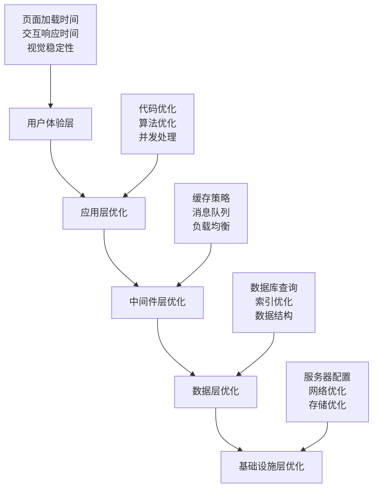

# ⚡ 性能调优指南

本文档提供了完整的系统性能调优方案，涵盖前端、后端、数据库、缓存、消息队列等各个层面的优化策略。

## 📋 目录

- [性能调优概览](#性能调优概览)
- [前端性能优化](#前端性能优化)
- [后端性能优化](#后端性能优化)
- [数据库性能优化](#数据库性能优化)
- [缓存性能优化](#缓存性能优化)
- [网络性能优化](#网络性能优化)
- [监控与分析](#监控与分析)
- [自动化调优](#自动化调优)

---

## 🎯 性能调优概览

### 性能优化金字塔



### 性能指标体系

| 层级 | 关键指标 | 目标值 | 监控工具 |
|------|----------|--------|----------|
| **用户体验** | FCP, LCP, CLS, FID | <1.5s, <2.5s, <0.1, <100ms | Lighthouse, WebVitals |
| **应用层** | 响应时间, 吞吐量, 错误率 | <200ms, >1000 RPS, <0.1% | APM, 自定义指标 |
| **中间件** | 缓存命中率, 队列延迟 | >95%, <10ms | Redis Monitor, Kafka JMX |
| **数据库** | 查询时间, 连接数, 锁等待 | <50ms, <80%, <1s | TiDB Dashboard |
| **基础设施** | CPU, 内存, 磁盘, 网络 | <70%, <80%, <80%, <100ms | Prometheus, Node Exporter |

---

## 🌐 前端性能优化

### 1. 资源加载优化

#### 代码分割与懒加载

```javascript
// 路由级别的代码分割
const routes = [
  {
    path: '/products',
    component: () => import('./views/ProductList.vue'),
    meta: { preload: true }
  },
  {
    path: '/orders',
    component: () => import('./views/OrderHistory.vue'),
    meta: { lazy: true }
  }
];

// 组件级别的懒加载
const LazyProductCard = defineAsyncComponent({
  loader: () => import('./components/ProductCard.vue'),
  loadingComponent: ProductCardSkeleton,
  errorComponent: ProductCardError,
  delay: 200,
  timeout: 3000
});

// 图片懒加载
class ImageLazyLoader {
  constructor() {
    this.observer = new IntersectionObserver(this.handleIntersection.bind(this), {
      rootMargin: '50px 0px',
      threshold: 0.1
    });
  }

  observe(element) {
    this.observer.observe(element);
  }

  handleIntersection(entries) {
    entries.forEach(entry => {
      if (entry.isIntersecting) {
        const img = entry.target;
        const src = img.dataset.src;
        
        if (src) {
          img.src = src;
          img.classList.add('loaded');
          this.observer.unobserve(img);
        }
      }
    });
  }
}

// 使用示例
const lazyLoader = new ImageLazyLoader();
document.querySelectorAll('img[data-src]').forEach(img => {
  lazyLoader.observe(img);
});
```

#### 资源预加载策略

```javascript
// 智能预加载管理器
class ResourcePreloader {
  constructor() {
    this.preloadQueue = new Map();
    this.loadedResources = new Set();
    this.networkInfo = navigator.connection || {};
  }

  // 根据网络状况决定预加载策略
  shouldPreload(priority = 'low') {
    const { effectiveType, saveData } = this.networkInfo;
    
    if (saveData) return false;
    
    const networkPriority = {
      'slow-2g': 0,
      '2g': 1,
      '3g': 2,
      '4g': 3
    };

    const priorityThreshold = {
      'high': 1,
      'medium': 2,
      'low': 3
    };

    return networkPriority[effectiveType] >= priorityThreshold[priority];
  }

  // 预加载关键资源
  preloadCriticalResources() {
    const criticalResources = [
      { url: '/api/products/featured', type: 'fetch', priority: 'high' },
      { url: '/css/critical.css', type: 'style', priority: 'high' },
      { url: '/js/vendor.js', type: 'script', priority: 'medium' }
    ];

    criticalResources.forEach(resource => {
      if (this.shouldPreload(resource.priority)) {
        this.preload(resource);
      }
    });
  }

  // 预加载实现
  preload(resource) {
    if (this.loadedResources.has(resource.url)) return;

    const link = document.createElement('link');
    link.rel = 'preload';
    link.href = resource.url;
    
    switch (resource.type) {
      case 'style':
        link.as = 'style';
        break;
      case 'script':
        link.as = 'script';
        break;
      case 'fetch':
        link.as = 'fetch';
        link.crossOrigin = 'anonymous';
        break;
    }

    link.onload = () => {
      this.loadedResources.add(resource.url);
    };

    document.head.appendChild(link);
  }

  // 预测性预加载
  predictivePreload() {
    // 基于用户行为预测下一步操作
    const userBehavior = this.analyzeUserBehavior();
    
    if (userBehavior.likelyToViewProducts) {
      this.preload({ url: '/api/products', type: 'fetch', priority: 'medium' });
    }
    
    if (userBehavior.likelyToCheckout) {
      this.preload({ url: '/api/cart', type: 'fetch', priority: 'high' });
    }
  }

  analyzeUserBehavior() {
    // 简化的用户行为分析
    const currentPath = window.location.pathname;
    const timeOnPage = Date.now() - window.performance.timing.navigationStart;
    
    return {
      likelyToViewProducts: currentPath === '/' && timeOnPage > 3000,
      likelyToCheckout: currentPath.includes('/cart') && timeOnPage > 1000
    };
  }
}
```

### 2. 自动化调优系统

```typescript
// 智能性能调优服务
@Injectable()
export class AutoPerformanceTuningService {
  private readonly tuningHistory = new Map<string, TuningRecord[]>();
  private readonly activeExperiments = new Map<string, Experiment>();

  constructor(
    private monitoringService: PerformanceMonitoringService,
    private configService: ConfigService,
    private logger: Logger,
  ) {}

  // 启动自动调优
  @Cron('0 */6 * * *') // 每6小时执行一次
  async performAutoTuning(): Promise<void> {
    this.logger.log('开始自动性能调优...');

    try {
      // 收集性能数据
      const metrics = await this.collectPerformanceMetrics();
      
      // 分析性能瓶颈
      const bottlenecks = await this.analyzeBottlenecks(metrics);
      
      // 生成调优建议
      const recommendations = await this.generateTuningRecommendations(bottlenecks);
      
      // 执行安全的调优操作
      for (const recommendation of recommendations) {
        if (recommendation.safety === 'safe') {
          await this.applyTuning(recommendation);
        } else {
          await this.scheduleExperiment(recommendation);
        }
      }

      this.logger.log('自动性能调优完成');
    } catch (error) {
      this.logger.error('自动调优失败', error);
    }
  }

  // 收集性能指标
  private async collectPerformanceMetrics(): Promise<PerformanceMetrics> {
    const timeRange = {
      start: Date.now() - 6 * 60 * 60 * 1000, // 过去6小时
      end: Date.now(),
    };

    return {
      responseTime: await this.getAverageResponseTime(timeRange),
      throughput: await this.getThroughput(timeRange),
      errorRate: await this.getErrorRate(timeRange),
      cpuUsage: await this.getCpuUsage(timeRange),
      memoryUsage: await this.getMemoryUsage(timeRange),
      dbPerformance: await this.getDatabasePerformance(timeRange),
      cachePerformance: await this.getCachePerformance(timeRange),
    };
  }

  // 分析性能瓶颈
  private async analyzeBottlenecks(metrics: PerformanceMetrics): Promise<Bottleneck[]> {
    const bottlenecks: Bottleneck[] = [];

    // 响应时间分析
    if (metrics.responseTime > 500) {
      bottlenecks.push({
        type: 'response_time',
        severity: metrics.responseTime > 1000 ? 'high' : 'medium',
        value: metrics.responseTime,
        threshold: 500,
        impact: 'user_experience',
      });
    }

    // 吞吐量分析
    if (metrics.throughput < 100) {
      bottlenecks.push({
        type: 'throughput',
        severity: metrics.throughput < 50 ? 'high' : 'medium',
        value: metrics.throughput,
        threshold: 100,
        impact: 'scalability',
      });
    }

    // 错误率分析
    if (metrics.errorRate > 0.01) {
      bottlenecks.push({
        type: 'error_rate',
        severity: metrics.errorRate > 0.05 ? 'high' : 'medium',
        value: metrics.errorRate,
        threshold: 0.01,
        impact: 'reliability',
      });
    }

    // 资源使用分析
    if (metrics.cpuUsage > 80) {
      bottlenecks.push({
        type: 'cpu_usage',
        severity: metrics.cpuUsage > 90 ? 'high' : 'medium',
        value: metrics.cpuUsage,
        threshold: 80,
        impact: 'resource_efficiency',
      });
    }

    if (metrics.memoryUsage > 85) {
      bottlenecks.push({
        type: 'memory_usage',
        severity: metrics.memoryUsage > 95 ? 'high' : 'medium',
        value: metrics.memoryUsage,
        threshold: 85,
        impact: 'resource_efficiency',
      });
    }

    // 数据库性能分析
    if (metrics.dbPerformance.avgQueryTime > 100) {
      bottlenecks.push({
        type: 'database_performance',
        severity: metrics.dbPerformance.avgQueryTime > 500 ? 'high' : 'medium',
        value: metrics.dbPerformance.avgQueryTime,
        threshold: 100,
        impact: 'data_access',
      });
    }

    // 缓存性能分析
    if (metrics.cachePerformance.hitRate < 0.8) {
      bottlenecks.push({
        type: 'cache_performance',
        severity: metrics.cachePerformance.hitRate < 0.6 ? 'high' : 'medium',
        value: metrics.cachePerformance.hitRate,
        threshold: 0.8,
        impact: 'data_access',
      });
    }

    return bottlenecks;
  }

  // 生成调优建议
  private async generateTuningRecommendations(bottlenecks: Bottleneck[]): Promise<TuningRecommendation[]> {
    const recommendations: TuningRecommendation[] = [];

    for (const bottleneck of bottlenecks) {
      switch (bottleneck.type) {
        case 'response_time':
          recommendations.push(...this.getResponseTimeTuning(bottleneck));
          break;
        case 'throughput':
          recommendations.push(...this.getThroughputTuning(bottleneck));
          break;
        case 'cpu_usage':
          recommendations.push(...this.getCpuTuning(bottleneck));
          break;
        case 'memory_usage':
          recommendations.push(...this.getMemoryTuning(bottleneck));
          break;
        case 'database_performance':
          recommendations.push(...this.getDatabaseTuning(bottleneck));
          break;
        case 'cache_performance':
          recommendations.push(...this.getCacheTuning(bottleneck));
          break;
      }
    }

    return recommendations;
  }

  // 响应时间调优建议
  private getResponseTimeTuning(bottleneck: Bottleneck): TuningRecommendation[] {
    return [
      {
        id: `response_time_${Date.now()}`,
        type: 'config_change',
        target: 'connection_pool',
        action: 'increase_pool_size',
        parameters: {
          current: await this.configService.get('database.pool.max'),
          recommended: Math.min(50, await this.configService.get('database.pool.max') * 1.5),
        },
        safety: 'safe',
        expectedImprovement: 0.2,
        rollbackPlan: 'restore_previous_pool_size',
      },
      {
        id: `response_time_cache_${Date.now()}`,
        type: 'cache_optimization',
        target: 'redis_cache',
        action: 'increase_cache_ttl',
        parameters: {
          current: await this.configService.get('cache.ttl'),
          recommended: await this.configService.get('cache.ttl') * 2,
        },
        safety: 'safe',
        expectedImprovement: 0.15,
        rollbackPlan: 'restore_previous_ttl',
      },
    ];
  }

  // 吞吐量调优建议
  private getThroughputTuning(bottleneck: Bottleneck): TuningRecommendation[] {
    return [
      {
        id: `throughput_${Date.now()}`,
        type: 'scaling',
        target: 'application_instances',
        action: 'horizontal_scale',
        parameters: {
          current: await this.getCurrentInstanceCount(),
          recommended: await this.getCurrentInstanceCount() + 1,
        },
        safety: 'experimental',
        expectedImprovement: 0.5,
        rollbackPlan: 'scale_down_instances',
      },
    ];
  }

  // 应用调优配置
  private async applyTuning(recommendation: TuningRecommendation): Promise<void> {
    this.logger.log(`应用调优: ${recommendation.id}`);

    try {
      // 记录调优前状态
      const beforeMetrics = await this.collectPerformanceMetrics();

      // 执行调优操作
      await this.executeTuningAction(recommendation);

      // 等待配置生效
      await this.sleep(30000); // 30秒

      // 验证调优效果
      const afterMetrics = await this.collectPerformanceMetrics();
      const improvement = this.calculateImprovement(beforeMetrics, afterMetrics, recommendation.type);

      // 记录调优历史
      const record: TuningRecord = {
        recommendation,
        beforeMetrics,
        afterMetrics,
        improvement,
        timestamp: Date.now(),
        success: improvement > 0,
      };

      this.recordTuningHistory(recommendation.target, record);

      if (improvement < recommendation.expectedImprovement * 0.5) {
        this.logger.warn(`调优效果不佳，考虑回滚: ${recommendation.id}`);
        await this.rollbackTuning(recommendation);
      }

    } catch (error) {
      this.logger.error(`调优失败: ${recommendation.id}`, error);
      await this.rollbackTuning(recommendation);
    }
  }

  // 执行调优操作
  private async executeTuningAction(recommendation: TuningRecommendation): Promise<void> {
    switch (recommendation.action) {
      case 'increase_pool_size':
        await this.configService.set('database.pool.max', recommendation.parameters.recommended);
        break;
      case 'increase_cache_ttl':
        await this.configService.set('cache.ttl', recommendation.parameters.recommended);
        break;
      case 'horizontal_scale':
        await this.scaleApplication(recommendation.parameters.recommended);
        break;
      // 更多调优操作...
    }
  }

  // 计算改进效果
  private calculateImprovement(before: PerformanceMetrics, after: PerformanceMetrics, type: string): number {
    switch (type) {
      case 'config_change':
        return (before.responseTime - after.responseTime) / before.responseTime;
      case 'cache_optimization':
        return (after.cachePerformance.hitRate - before.cachePerformance.hitRate);
      case 'scaling':
        return (after.throughput - before.throughput) / before.throughput;
      default:
        return 0;
    }
  }

  // 回滚调优
  private async rollbackTuning(recommendation: TuningRecommendation): Promise<void> {
    this.logger.log(`回滚调优: ${recommendation.id}`);

    switch (recommendation.rollbackPlan) {
      case 'restore_previous_pool_size':
        await this.configService.set('database.pool.max', recommendation.parameters.current);
        break;
      case 'restore_previous_ttl':
        await this.configService.set('cache.ttl', recommendation.parameters.current);
        break;
      case 'scale_down_instances':
        await this.scaleApplication(recommendation.parameters.current);
        break;
    }
  }

  private sleep(ms: number): Promise<void> {
    return new Promise(resolve => setTimeout(resolve, ms));
  }
}

// A/B 测试性能优化
@Injectable()
export class PerformanceExperimentService {
  private readonly experiments = new Map<string, PerformanceExperiment>();

  // 创建性能实验
  async createExperiment(config: ExperimentConfig): Promise<string> {
    const experimentId = `perf_exp_${Date.now()}`;
    
    const experiment: PerformanceExperiment = {
      id: experimentId,
      config,
      status: 'running',
      startTime: Date.now(),
      controlGroup: new Map(),
      treatmentGroup: new Map(),
      results: null,
    };

    this.experiments.set(experimentId, experiment);
    
    // 启动实验监控
    this.startExperimentMonitoring(experimentId);
    
    return experimentId;
  }

  // 分配用户到实验组
  assignUserToExperiment(experimentId: string, userId: string): 'control' | 'treatment' {
    const experiment = this.experiments.get(experimentId);
    if (!experiment || experiment.status !== 'running') {
      return 'control';
    }

    // 使用用户ID哈希来确保一致性分配
    const hash = this.hashUserId(userId);
    const group = hash % 100 < experiment.config.trafficSplit ? 'treatment' : 'control';
    
    if (group === 'control') {
      experiment.controlGroup.set(userId, Date.now());
    } else {
      experiment.treatmentGroup.set(userId, Date.now());
    }

    return group;
  }

  // 记录实验指标
  recordExperimentMetric(experimentId: string, userId: string, metric: string, value: number): void {
    const experiment = this.experiments.get(experimentId);
    if (!experiment) return;

    const group = experiment.controlGroup.has(userId) ? 'control' : 'treatment';
    const key = `${group}_${metric}`;
    
    if (!experiment.results) {
      experiment.results = new Map();
    }

    if (!experiment.results.has(key)) {
      experiment.results.set(key, []);
    }

    experiment.results.get(key).push(value);
  }

  // 分析实验结果
  async analyzeExperiment(experimentId: string): Promise<ExperimentResults> {
    const experiment = this.experiments.get(experimentId);
    if (!experiment || !experiment.results) {
      throw new Error('实验不存在或无结果数据');
    }

    const results: ExperimentResults = {
      experimentId,
      duration: Date.now() - experiment.startTime,
      controlGroupSize: experiment.controlGroup.size,
      treatmentGroupSize: experiment.treatmentGroup.size,
      metrics: new Map(),
      significance: new Map(),
      recommendation: 'continue',
    };

    // 分析每个指标
    for (const [key, values] of experiment.results.entries()) {
      const [group, metric] = key.split('_');
      const otherGroup = group === 'control' ? 'treatment' : 'control';
      const otherKey = `${otherGroup}_${metric}`;
      const otherValues = experiment.results.get(otherKey) || [];

      if (otherValues.length > 0) {
        const controlMean = this.calculateMean(group === 'control' ? values : otherValues);
        const treatmentMean = this.calculateMean(group === 'treatment' ? values : otherValues);
        const improvement = (treatmentMean - controlMean) / controlMean;
        const pValue = this.calculateTTest(values, otherValues);

        results.metrics.set(metric, {
          controlMean,
          treatmentMean,
          improvement,
          pValue,
        });

        results.significance.set(metric, pValue < 0.05);
      }
    }

    // 生成建议
    results.recommendation = this.generateExperimentRecommendation(results);

    return results;
  }

  private hashUserId(userId: string): number {
    let hash = 0;
    for (let i = 0; i < userId.length; i++) {
      const char = userId.charCodeAt(i);
      hash = ((hash << 5) - hash) + char;
      hash = hash & hash; // 转换为32位整数
    }
    return Math.abs(hash);
  }

  private calculateMean(values: number[]): number {
    return values.reduce((sum, value) => sum + value, 0) / values.length;
  }

  private calculateTTest(group1: number[], group2: number[]): number {
    // 简化的t检验实现
    const mean1 = this.calculateMean(group1);
    const mean2 = this.calculateMean(group2);
    const variance1 = this.calculateVariance(group1, mean1);
    const variance2 = this.calculateVariance(group2, mean2);
    
    const pooledVariance = ((group1.length - 1) * variance1 + (group2.length - 1) * variance2) / 
                          (group1.length + group2.length - 2);
    
    const standardError = Math.sqrt(pooledVariance * (1/group1.length + 1/group2.length));
    const tStatistic = (mean1 - mean2) / standardError;
    
    // 简化的p值计算（实际应用中应使用更精确的方法）
    return 2 * (1 - this.normalCDF(Math.abs(tStatistic)));
  }

  private calculateVariance(values: number[], mean: number): number {
    const squaredDiffs = values.map(value => Math.pow(value - mean, 2));
    return squaredDiffs.reduce((sum, diff) => sum + diff, 0) / (values.length - 1);
  }

  private normalCDF(x: number): number {
    // 简化的正态分布累积分布函数
    return 0.5 * (1 + this.erf(x / Math.sqrt(2)));
  }

  private erf(x: number): number {
    // 简化的误差函数实现
    const a1 =  0.254829592;
    const a2 = -0.284496736;
    const a3 =  1.421413741;
    const a4 = -1.453152027;
    const a5 =  1.061405429;
    const p  =  0.3275911;

    const sign = x >= 0 ? 1 : -1;
    x = Math.abs(x);

    const t = 1.0 / (1.0 + p * x);
    const y = 1.0 - (((((a5 * t + a4) * t) + a3) * t + a2) * t + a1) * t * Math.exp(-x * x);

    return sign * y;
  }

  private generateExperimentRecommendation(results: ExperimentResults): 'adopt' | 'reject' | 'continue' {
    let significantImprovements = 0;
    let significantRegressions = 0;

    for (const [metric, data] of results.metrics.entries()) {
      if (results.significance.get(metric)) {
        if (data.improvement > 0.05) { // 5%以上改进
          significantImprovements++;
        } else if (data.improvement < -0.05) { // 5%以上退化
          significantRegressions++;
        }
      }
    }

    if (significantImprovements > 0 && significantRegressions === 0) {
      return 'adopt';
    } else if (significantRegressions > 0) {
      return 'reject';
    } else {
      return 'continue';
    }
  }
}
```

---

## 🎯 最佳实践

### 1. 性能优化原则

```typescript
// 性能优化最佳实践指南
export class PerformanceOptimizationPrinciples {
  
  // 1. 测量驱动优化
  static readonly MEASUREMENT_FIRST = {
    principle: "先测量，后优化",
    description: "没有测量就没有优化，建立完善的监控体系",
    implementation: [
      "建立基准性能指标",
      "持续监控关键指标",
      "A/B测试验证优化效果",
      "定期性能回归测试"
    ]
  };

  // 2. 渐进式优化
  static readonly INCREMENTAL_OPTIMIZATION = {
    principle: "渐进式优化",
    description: "小步快跑，持续改进",
    implementation: [
      "识别最大瓶颈点",
      "单点突破，逐步优化",
      "验证每次优化效果",
      "避免过度优化"
    ]
  };

  // 3. 用户体验优先
  static readonly USER_EXPERIENCE_FIRST = {
    principle: "用户体验优先",
    description: "优化应该以提升用户体验为目标",
    implementation: [
      "关注Web Vitals指标",
      "优化首屏加载时间",
      "减少交互延迟",
      "提供加载状态反馈"
    ]
  };

  // 4. 成本效益平衡
  static readonly COST_BENEFIT_BALANCE = {
    principle: "成本效益平衡",
    description: "优化投入应该与收益成正比",
    implementation: [
      "评估优化成本",
      "量化优化收益",
      "优先高收益低成本项目",
      "避免过度工程化"
    ]
  };
}

// 性能优化检查清单
export class PerformanceOptimizationChecklist {
  
  // 前端优化检查清单
  static readonly FRONTEND_CHECKLIST = [
    {
      category: "资源优化",
      items: [
        "✅ 启用Gzip/Brotli压缩",
        "✅ 优化图片格式和大小",
        "✅ 使用CDN加速静态资源",
        "✅ 实现资源懒加载",
        "✅ 代码分割和按需加载"
      ]
    },
    {
      category: "渲染优化",
      items: [
        "✅ 减少DOM操作",
        "✅ 使用虚拟滚动",
        "✅ 避免强制同步布局",
        "✅ 优化CSS选择器",
        "✅ 使用CSS3硬件加速"
      ]
    },
    {
      category: "网络优化",
      items: [
        "✅ 减少HTTP请求数量",
        "✅ 使用HTTP/2",
        "✅ 实现请求合并",
        "✅ 启用浏览器缓存",
        "✅ 使用Service Worker"
      ]
    }
  ];

  // 后端优化检查清单
  static readonly BACKEND_CHECKLIST = [
    {
      category: "数据库优化",
      items: [
        "✅ 优化SQL查询",
        "✅ 添加合适索引",
        "✅ 使用连接池",
        "✅ 实现读写分离",
        "✅ 数据库分片"
      ]
    },
    {
      category: "缓存优化",
      items: [
        "✅ 多层缓存策略",
        "✅ 缓存预热",
        "✅ 缓存更新策略",
        "✅ 缓存监控",
        "✅ 缓存雪崩防护"
      ]
    },
    {
      category: "服务优化",
      items: [
        "✅ 异步处理",
        "✅ 批量操作",
        "✅ 连接池优化",
        "✅ 负载均衡",
        "✅ 服务降级"
      ]
    }
  ];
}

// 性能监控最佳实践
export class PerformanceMonitoringBestPractices {
  
  // 监控指标体系
  static readonly MONITORING_METRICS = {
    business: [
      "页面访问量 (PV)",
      "独立访客数 (UV)", 
      "转化率",
      "用户留存率",
      "业务成功率"
    ],
    technical: [
      "响应时间",
      "吞吐量",
      "错误率",
      "可用性",
      "资源使用率"
    ],
    userExperience: [
      "首次内容绘制 (FCP)",
      "最大内容绘制 (LCP)",
      "首次输入延迟 (FID)",
      "累积布局偏移 (CLS)",
      "首字节时间 (TTFB)"
    ]
  };

  // 告警策略
  static readonly ALERTING_STRATEGY = {
    levels: [
      {
        level: "P0 - 紧急",
        criteria: "服务完全不可用",
        response: "立即响应，5分钟内",
        escalation: "自动升级到值班经理"
      },
      {
        level: "P1 - 严重",
        criteria: "核心功能受影响",
        response: "15分钟内响应",
        escalation: "30分钟后升级"
      },
      {
        level: "P2 - 一般",
        criteria: "性能下降明显",
        response: "1小时内响应",
        escalation: "工作时间处理"
      },
      {
        level: "P3 - 轻微",
        criteria: "轻微性能问题",
        response: "工作日处理",
        escalation: "周报告"
      }
    ]
  };
}
```

### 2. 相关链接

- [Web Performance Working Group](https://www.w3.org/webperf/)
- [Core Web Vitals](https://web.dev/vitals/)
- [Performance API](https://developer.mozilla.org/en-US/docs/Web/API/Performance)
- [NestJS Performance](https://docs.nestjs.com/techniques/performance)
- [TiDB Performance Tuning](https://docs.pingcap.com/tidb/stable/performance-tuning)
- [Redis Performance Optimization](https://redis.io/docs/management/optimization/)
- [Prometheus Monitoring](https://prometheus.io/docs/practices/naming/)
- [Grafana Best Practices](https://grafana.com/docs/grafana/latest/best-practices/)

---

**文档版本**: v1.0.0  
**最后更新**: 2024-01-26  
**维护者**: 性能优化团队  
**审核者**: 架构师团队

### 2. 渲染性能优化

#### 虚拟滚动实现

```javascript
// 高性能虚拟滚动组件
class VirtualScroller {
  constructor(container, options = {}) {
    this.container = container;
    this.itemHeight = options.itemHeight || 50;
    this.bufferSize = options.bufferSize || 5;
    this.items = options.items || [];
    this.renderItem = options.renderItem;
    
    this.scrollTop = 0;
    this.containerHeight = 0;
    this.visibleStart = 0;
    this.visibleEnd = 0;
    
    this.init();
  }

  init() {
    this.container.style.position = 'relative';
    this.container.style.overflow = 'auto';
    
    // 创建滚动容器
    this.scrollContainer = document.createElement('div');
    this.scrollContainer.style.height = `${this.items.length * this.itemHeight}px`;
    this.container.appendChild(this.scrollContainer);
    
    // 创建可见项容器
    this.visibleContainer = document.createElement('div');
    this.visibleContainer.style.position = 'absolute';
    this.visibleContainer.style.top = '0';
    this.visibleContainer.style.width = '100%';
    this.scrollContainer.appendChild(this.visibleContainer);
    
    this.container.addEventListener('scroll', this.handleScroll.bind(this));
    this.updateVisibleItems();
  }

  handleScroll() {
    this.scrollTop = this.container.scrollTop;
    this.updateVisibleItems();
  }

  updateVisibleItems() {
    this.containerHeight = this.container.clientHeight;
    
    // 计算可见范围
    this.visibleStart = Math.floor(this.scrollTop / this.itemHeight);
    this.visibleEnd = Math.min(
      this.visibleStart + Math.ceil(this.containerHeight / this.itemHeight),
      this.items.length - 1
    );
    
    // 添加缓冲区
    const bufferStart = Math.max(0, this.visibleStart - this.bufferSize);
    const bufferEnd = Math.min(this.items.length - 1, this.visibleEnd + this.bufferSize);
    
    this.renderVisibleItems(bufferStart, bufferEnd);
  }

  renderVisibleItems(start, end) {
    // 清空现有内容
    this.visibleContainer.innerHTML = '';
    
    // 设置容器位置
    this.visibleContainer.style.transform = `translateY(${start * this.itemHeight}px)`;
    
    // 渲染可见项
    for (let i = start; i <= end; i++) {
      const item = this.items[i];
      const element = this.renderItem(item, i);
      element.style.height = `${this.itemHeight}px`;
      this.visibleContainer.appendChild(element);
    }
  }

  updateItems(newItems) {
    this.items = newItems;
    this.scrollContainer.style.height = `${this.items.length * this.itemHeight}px`;
    this.updateVisibleItems();
  }
}

// 使用示例
const productList = new VirtualScroller(
  document.getElementById('product-list'),
  {
    itemHeight: 120,
    bufferSize: 3,
    items: products,
    renderItem: (product, index) => {
      const div = document.createElement('div');
      div.className = 'product-item';
      div.innerHTML = `
        
        <h3>${product.name}</h3>
        <p>$${product.price}</p>
      `;
      return div;
    }
  }
);
```

#### 防抖和节流优化

```javascript
// 高级防抖节流工具
class PerformanceOptimizer {
  // 智能防抖：根据输入频率自适应延迟
  static smartDebounce(func, baseDelay = 300, maxDelay = 1000) {
    let timeoutId;
    let lastCallTime = 0;
    let callCount = 0;
    
    return function(...args) {
      const now = Date.now();
      const timeSinceLastCall = now - lastCallTime;
      
      // 计算自适应延迟
      if (timeSinceLastCall < 100) {
        callCount++;
      } else {
        callCount = 1;
      }
      
      const adaptiveDelay = Math.min(
        baseDelay + (callCount * 50),
        maxDelay
      );
      
      clearTimeout(timeoutId);
      timeoutId = setTimeout(() => {
        func.apply(this, args);
        callCount = 0;
      }, adaptiveDelay);
      
      lastCallTime = now;
    };
  }

  // 带立即执行的节流
  static throttleWithImmediate(func, delay = 100) {
    let timeoutId;
    let lastExecTime = 0;
    
    return function(...args) {
      const now = Date.now();
      
      if (now - lastExecTime > delay) {
        func.apply(this, args);
        lastExecTime = now;
      } else {
        clearTimeout(timeoutId);
        timeoutId = setTimeout(() => {
          func.apply(this, args);
          lastExecTime = Date.now();
        }, delay - (now - lastExecTime));
      }
    };
  }

  // 请求去重
  static requestDeduplicator() {
    const pendingRequests = new Map();
    
    return function(url, options = {}) {
      const key = `${url}:${JSON.stringify(options)}`;
      
      if (pendingRequests.has(key)) {
        return pendingRequests.get(key);
      }
      
      const promise = fetch(url, options)
        .finally(() => {
          pendingRequests.delete(key);
        });
      
      pendingRequests.set(key, promise);
      return promise;
    };
  }
}

// 搜索优化示例
const optimizedSearch = PerformanceOptimizer.smartDebounce(
  async (query) => {
    if (query.length < 2) return;
    
    const results = await fetch(`/api/search?q=${encodeURIComponent(query)}`);
    const data = await results.json();
    updateSearchResults(data);
  },
  300,
  800
);

// 滚动优化示例
const optimizedScroll = PerformanceOptimizer.throttleWithImmediate(
  () => {
    updateScrollPosition();
    checkVisibleElements();
  },
  16 // 60fps
);
```

### 3. 缓存策略优化

#### Service Worker 缓存

```javascript
// 智能缓存策略
class SmartCacheStrategy {
  constructor() {
    this.cacheName = 'smart-cache-v1';
    this.maxCacheSize = 50 * 1024 * 1024; // 50MB
    this.cacheStrategies = new Map();
    
    this.initStrategies();
  }

  initStrategies() {
    // API 数据：网络优先，缓存备用
    this.cacheStrategies.set('/api/', {
      strategy: 'networkFirst',
      maxAge: 5 * 60 * 1000, // 5分钟
      maxEntries: 100
    });

    // 静态资源：缓存优先
    this.cacheStrategies.set('/assets/', {
      strategy: 'cacheFirst',
      maxAge: 24 * 60 * 60 * 1000, // 24小时
      maxEntries: 200
    });

    // 图片：缓存优先，网络备用
    this.cacheStrategies.set('/images/', {
      strategy: 'cacheFirst',
      maxAge: 7 * 24 * 60 * 60 * 1000, // 7天
      maxEntries: 500
    });
  }

  async handleRequest(request) {
    const url = new URL(request.url);
    const strategy = this.getStrategy(url.pathname);
    
    switch (strategy.strategy) {
      case 'networkFirst':
        return this.networkFirst(request, strategy);
      case 'cacheFirst':
        return this.cacheFirst(request, strategy);
      case 'staleWhileRevalidate':
        return this.staleWhileRevalidate(request, strategy);
      default:
        return fetch(request);
    }
  }

  async networkFirst(request, strategy) {
    try {
      const networkResponse = await fetch(request);
      
      if (networkResponse.ok) {
        await this.putInCache(request, networkResponse.clone(), strategy);
      }
      
      return networkResponse;
    } catch (error) {
      const cachedResponse = await this.getFromCache(request);
      
      if (cachedResponse) {
        return cachedResponse;
      }
      
      throw error;
    }
  }

  async cacheFirst(request, strategy) {
    const cachedResponse = await this.getFromCache(request);
    
    if (cachedResponse && !this.isExpired(cachedResponse, strategy)) {
      return cachedResponse;
    }
    
    try {
      const networkResponse = await fetch(request);
      
      if (networkResponse.ok) {
        await this.putInCache(request, networkResponse.clone(), strategy);
      }
      
      return networkResponse;
    } catch (error) {
      if (cachedResponse) {
        return cachedResponse;
      }
      
      throw error;
    }
  }

  async staleWhileRevalidate(request, strategy) {
    const cachedResponse = await this.getFromCache(request);
    
    // 异步更新缓存
    const networkPromise = fetch(request).then(response => {
      if (response.ok) {
        this.putInCache(request, response.clone(), strategy);
      }
      return response;
    });

    if (cachedResponse) {
      return cachedResponse;
    }
    
    return networkPromise;
  }

  async putInCache(request, response, strategy) {
    const cache = await caches.open(this.cacheName);
    
    // 检查缓存大小
    await this.manageCacheSize(cache, strategy);
    
    // 添加时间戳
    const responseWithTimestamp = new Response(response.body, {
      status: response.status,
      statusText: response.statusText,
      headers: {
        ...response.headers,
        'sw-cache-timestamp': Date.now().toString()
      }
    });
    
    await cache.put(request, responseWithTimestamp);
  }

  async getFromCache(request) {
    const cache = await caches.open(this.cacheName);
    return cache.match(request);
  }

  isExpired(response, strategy) {
    const timestamp = response.headers.get('sw-cache-timestamp');
    
    if (!timestamp) return true;
    
    const age = Date.now() - parseInt(timestamp);
    return age > strategy.maxAge;
  }

  getStrategy(pathname) {
    for (const [pattern, strategy] of this.cacheStrategies) {
      if (pathname.startsWith(pattern)) {
        return strategy;
      }
    }
    
    return { strategy: 'networkOnly' };
  }

  async manageCacheSize(cache, strategy) {
    const requests = await cache.keys();
    
    if (requests.length >= strategy.maxEntries) {
      // 删除最旧的条目
      const oldestRequest = requests[0];
      await cache.delete(oldestRequest);
    }
  }
}

// Service Worker 注册
if ('serviceWorker' in navigator) {
  navigator.serviceWorker.register('/sw.js')
    .then(registration => {
      console.log('Service Worker 注册成功');
    })
    .catch(error => {
      console.error('Service Worker 注册失败:', error);
    });
}
```

---

## 🚀 后端性能优化

### 1. NestJS 应用优化

#### 连接池和资源管理

```typescript
// 数据库连接池优化
@Module({
  imports: [
    TypeOrmModule.forRootAsync({
      useFactory: (configService: ConfigService) => ({
        type: 'mysql',
        host: configService.get('DB_HOST'),
        port: configService.get('DB_PORT'),
        username: configService.get('DB_USERNAME'),
        password: configService.get('DB_PASSWORD'),
        database: configService.get('DB_DATABASE'),
        
        // 连接池配置
        extra: {
          connectionLimit: 20,
          acquireTimeout: 60000,
          timeout: 60000,
          reconnect: true,
          
          // 连接池优化
          idleTimeout: 300000, // 5分钟
          maxLifetime: 1800000, // 30分钟
          
          // 性能优化
          charset: 'utf8mb4',
          timezone: '+08:00',
          
          // 连接验证
          testOnBorrow: true,
          validationQuery: 'SELECT 1',
        },
        
        // 查询优化
        logging: process.env.NODE_ENV === 'development',
        maxQueryExecutionTime: 1000,
        
        // 实体缓存
        cache: {
          type: 'redis',
          options: {
            host: configService.get('REDIS_HOST'),
            port: configService.get('REDIS_PORT'),
          },
          duration: 30000, // 30秒
        },
      }),
      inject: [ConfigService],
    }),
  ],
})
export class DatabaseModule {}

// Redis 连接池优化
@Injectable()
export class RedisService {
  private readonly redis: Redis;
  private readonly cluster: Cluster;

  constructor(private configService: ConfigService) {
    const redisConfig = {
      // 连接池配置
      lazyConnect: true,
      maxRetriesPerRequest: 3,
      retryDelayOnFailover: 100,
      enableReadyCheck: true,
      maxLoadingTimeout: 5000,
      
      // 性能优化
      keepAlive: 30000,
      commandTimeout: 5000,
      
      // 连接池大小
      family: 4,
      db: 0,
    };

    if (this.configService.get('REDIS_CLUSTER_ENABLED')) {
      this.cluster = new Redis.Cluster([
        {
          host: this.configService.get('REDIS_HOST_1'),
          port: this.configService.get('REDIS_PORT_1'),
        },
        {
          host: this.configService.get('REDIS_HOST_2'),
          port: this.configService.get('REDIS_PORT_2'),
        },
      ], {
        ...redisConfig,
        clusterRetryDelayOnFailover: 100,
        clusterRetryDelayOnClusterDown: 300,
        clusterMaxRedirections: 6,
        scaleReads: 'slave',
      });
    } else {
      this.redis = new Redis({
        host: this.configService.get('REDIS_HOST'),
        port: this.configService.get('REDIS_PORT'),
        ...redisConfig,
      });
    }
  }

  getClient(): Redis | Cluster {
    return this.cluster || this.redis;
  }

  async healthCheck(): Promise<boolean> {
    try {
      const client = this.getClient();
      const result = await client.ping();
      return result === 'PONG';
    } catch (error) {
      return false;
    }
  }
}
```

#### 查询优化和缓存

```typescript
// 智能查询缓存装饰器
export function SmartCache(options: SmartCacheOptions = {}) {
  return function (target: any, propertyName: string, descriptor: PropertyDescriptor) {
    const method = descriptor.value;
    
    descriptor.value = async function (...args: any[]) {
      const cacheKey = generateCacheKey(target.constructor.name, propertyName, args);
      const redis = this.redisService.getClient();
      
      // 尝试从缓存获取
      const cached = await redis.get(cacheKey);
      if (cached && !options.bypassCache) {
        return JSON.parse(cached);
      }
      
      // 执行原方法
      const result = await method.apply(this, args);
      
      // 缓存结果
      if (result !== null && result !== undefined) {
        const ttl = options.ttl || 300; // 默认5分钟
        await redis.setex(cacheKey, ttl, JSON.stringify(result));
        
        // 设置缓存标签用于批量清除
        if (options.tags) {
          for (const tag of options.tags) {
            await redis.sadd(`cache:tag:${tag}`, cacheKey);
            await redis.expire(`cache:tag:${tag}`, ttl);
          }
        }
      }
      
      return result;
    };
  };
}

// 使用示例
@Injectable()
export class ProductService {
  constructor(
    @InjectRepository(Product)
    private productRepository: Repository<Product>,
    private redisService: RedisService,
  ) {}

  @SmartCache({
    ttl: 600, // 10分钟
    tags: ['products', 'featured'],
  })
  async getFeaturedProducts(): Promise<Product[]> {
    return this.productRepository.find({
      where: { featured: true, active: true },
      order: { createdAt: 'DESC' },
      take: 10,
      relations: ['category', 'images'],
    });
  }

  @SmartCache({
    ttl: 300,
    tags: ['products'],
  })
  async getProductById(id: string): Promise<Product> {
    return this.productRepository.findOne({
      where: { id },
      relations: ['category', 'images', 'reviews'],
    });
  }

  // 缓存失效
  async invalidateProductCache(productId?: string): Promise<void> {
    const redis = this.redisService.getClient();
    
    if (productId) {
      // 清除特定产品缓存
      const pattern = `*:getProductById:${productId}*`;
      const keys = await redis.keys(pattern);
      if (keys.length > 0) {
        await redis.del(...keys);
      }
    } else {
      // 清除所有产品相关缓存
      const productKeys = await redis.smembers('cache:tag:products');
      if (productKeys.length > 0) {
        await redis.del(...productKeys);
        await redis.del('cache:tag:products');
      }
    }
  }
}

// 批量操作优化
@Injectable()
export class BatchOperationService {
  constructor(
    @InjectRepository(Product)
    private productRepository: Repository<Product>,
    private dataSource: DataSource,
  ) {}

  // 批量插入优化
  async batchCreateProducts(products: CreateProductDto[]): Promise<Product[]> {
    const batchSize = 100;
    const results: Product[] = [];
    
    for (let i = 0; i < products.length; i += batchSize) {
      const batch = products.slice(i, i + batchSize);
      
      await this.dataSource.transaction(async manager => {
        const productEntities = batch.map(dto => 
          manager.create(Product, dto)
        );
        
        const savedProducts = await manager.save(Product, productEntities);
        results.push(...savedProducts);
      });
    }
    
    return results;
  }

  // 批量更新优化
  async batchUpdateProducts(updates: Array<{ id: string; data: Partial<Product> }>): Promise<void> {
    const queries = updates.map(({ id, data }) => 
      this.productRepository
        .createQueryBuilder()
        .update(Product)
        .set(data)
        .where('id = :id', { id })
        .getQuery()
    );
    
    // 批量执行更新
    await this.dataSource.transaction(async manager => {
      for (const query of queries) {
        await manager.query(query);
      }
    });
  }
}
```

### 2. 异步处理优化

#### 队列和任务调度

```typescript
// 高性能队列处理器
@Processor('high-performance-queue')
export class HighPerformanceQueueProcessor {
  private readonly logger = new Logger(HighPerformanceQueueProcessor.name);
  private readonly concurrencyMap = new Map<string, number>();

  constructor(
    private readonly productService: ProductService,
    private readonly notificationService: NotificationService,
  ) {
    // 设置不同任务类型的并发数
    this.concurrencyMap.set('email', 5);
    this.concurrencyMap.set('image-processing', 3);
    this.concurrencyMap.set('data-sync', 2);
    this.concurrencyMap.set('report-generation', 1);
  }

  @Process({
    name: 'process-order',
    concurrency: 10,
  })
  async processOrder(job: Job<OrderProcessingData>): Promise<void> {
    const { orderId, userId, items } = job.data;
    
    try {
      // 使用进度跟踪
      await job.progress(10);
      
      // 验证库存
      await this.validateInventory(items);
      await job.progress(30);
      
      // 处理支付
      await this.processPayment(orderId);
      await job.progress(60);
      
      // 更新库存
      await this.updateInventory(items);
      await job.progress(80);
      
      // 发送通知
      await this.sendOrderConfirmation(userId, orderId);
      await job.progress(100);
      
      this.logger.log(`订单 ${orderId} 处理完成`);
    } catch (error) {
      this.logger.error(`订单 ${orderId} 处理失败:`, error);
      throw error;
    }
  }

  @Process({
    name: 'batch-email',
    concurrency: 5,
  })
  async processBatchEmail(job: Job<BatchEmailData>): Promise<void> {
    const { emails, template, data } = job.data;
    const batchSize = 50;
    
    for (let i = 0; i < emails.length; i += batchSize) {
      const batch = emails.slice(i, i + batchSize);
      
      // 并行发送邮件
      const promises = batch.map(email => 
        this.notificationService.sendEmail(email, template, data)
          .catch(error => {
            this.logger.error(`邮件发送失败 ${email}:`, error);
            return null; // 不中断批次处理
          })
      );
      
      await Promise.allSettled(promises);
      
      // 更新进度
      const progress = Math.round(((i + batchSize) / emails.length) * 100);
      await job.progress(Math.min(progress, 100));
    }
  }

  // 动态并发控制
  @Process({
    name: 'adaptive-task',
  })
  async processAdaptiveTask(job: Job<AdaptiveTaskData>): Promise<void> {
    const { taskType, data } = job.data;
    const concurrency = this.getConcurrency(taskType);
    
    // 根据系统负载调整并发数
    const systemLoad = await this.getSystemLoad();
    const adjustedConcurrency = Math.max(1, Math.floor(concurrency * (1 - systemLoad)));
    
    await this.processWithConcurrency(data, adjustedConcurrency);
  }

  private async getSystemLoad(): Promise<number> {
    // 获取系统负载指标
    const cpuUsage = await this.getCpuUsage();
    const memoryUsage = await this.getMemoryUsage();
    const queueLength = await this.getQueueLength();
    
    // 计算综合负载
    return Math.max(cpuUsage, memoryUsage, queueLength / 1000);
  }

  private getConcurrency(taskType: string): number {
    return this.concurrencyMap.get(taskType) || 1;
  }
}

// 智能重试策略
@Injectable()
export class SmartRetryService {
  private readonly retryStrategies = new Map<string, RetryStrategy>();

  constructor() {
    // 配置不同类型任务的重试策略
    this.retryStrategies.set('network', {
      maxAttempts: 5,
      baseDelay: 1000,
      maxDelay: 30000,
      backoffFactor: 2,
      jitter: true,
    });

    this.retryStrategies.set('database', {
      maxAttempts: 3,
      baseDelay: 500,
      maxDelay: 5000,
      backoffFactor: 1.5,
      jitter: false,
    });

    this.retryStrategies.set('external-api', {
      maxAttempts: 4,
      baseDelay: 2000,
      maxDelay: 60000,
      backoffFactor: 2.5,
      jitter: true,
    });
  }

  async executeWithRetry<T>(
    operation: () => Promise<T>,
    strategyType: string,
    context?: any,
  ): Promise<T> {
    const strategy = this.retryStrategies.get(strategyType) || this.getDefaultStrategy();
    let lastError: Error;
    
    for (let attempt = 1; attempt <= strategy.maxAttempts; attempt++) {
      try {
        return await operation();
      } catch (error) {
        lastError = error;
        
        if (attempt === strategy.maxAttempts) {
          break;
        }
        
        if (!this.shouldRetry(error, strategyType)) {
          throw error;
        }
        
        const delay = this.calculateDelay(attempt, strategy);
        await this.sleep(delay);
      }
    }
    
    throw new Error(`操作失败，已重试 ${strategy.maxAttempts} 次: ${lastError.message}`);
  }

  private shouldRetry(error: Error, strategyType: string): boolean {
    // 根据错误类型和策略类型决定是否重试
    if (strategyType === 'network') {
      return error.message.includes('ECONNRESET') || 
             error.message.includes('ETIMEDOUT') ||
             error.message.includes('ENOTFOUND');
    }
    
    if (strategyType === 'database') {
      return error.message.includes('connection') ||
             error.message.includes('timeout') ||
             error.message.includes('deadlock');
    }
    
    return true;
  }

  private calculateDelay(attempt: number, strategy: RetryStrategy): number {
    let delay = strategy.baseDelay * Math.pow(strategy.backoffFactor, attempt - 1);
    delay = Math.min(delay, strategy.maxDelay);
    
    if (strategy.jitter) {
      delay = delay * (0.5 + Math.random() * 0.5);
    }
    
    return Math.floor(delay);
  }

  private sleep(ms: number): Promise<void> {
    return new Promise(resolve => setTimeout(resolve, ms));
  }

  private getDefaultStrategy(): RetryStrategy {
    return {
      maxAttempts: 3,
      baseDelay: 1000,
      maxDelay: 10000,
      backoffFactor: 2,
      jitter: true,
    };
  }
}

interface RetryStrategy {
  maxAttempts: number;
  baseDelay: number;
  maxDelay: number;
  backoffFactor: number;
  jitter: boolean;
}
```

---

## 🗄️ 数据库性能优化

### 1. TiDB 查询优化

#### 索引策略优化

```sql
-- 复合索引优化
-- 原始查询：经常按用户ID和时间范围查询订单
SELECT * FROM orders 
WHERE user_id = ? 
  AND created_at BETWEEN ? AND ? 
  AND status IN ('pending', 'processing')
ORDER BY created_at DESC;

-- 优化索引
CREATE INDEX idx_orders_user_time_status ON orders (
  user_id,
  status,
  created_at DESC
);

-- 覆盖索引优化
-- 原始查询：获取产品基本信息
SELECT id, name, price, category_id 
FROM products 
WHERE category_id = ? 
  AND active = true 
ORDER BY price;

-- 覆盖索引（包含所有查询字段）
CREATE INDEX idx_products_category_active_price_covering ON products (
  category_id,
  active,
  price
) INCLUDE (id, name);

-- 分区表索引优化
-- 按时间分区的订单表
CREATE TABLE orders_partitioned (
  id BIGINT PRIMARY KEY,
  user_id BIGINT NOT NULL,
  created_at TIMESTAMP NOT NULL,
  status VARCHAR(20) NOT NULL,
  total_amount DECIMAL(10,2) NOT NULL,
  INDEX idx_user_status (user_id, status),
  INDEX idx_created_at (created_at)
) PARTITION BY RANGE (YEAR(created_at)) (
  PARTITION p2023 VALUES LESS THAN (2024),
  PARTITION p2024 VALUES LESS THAN (2025),
  PARTITION p2025 VALUES LESS THAN (2026),
  PARTITION p_future VALUES LESS THAN MAXVALUE
);

-- 函数索引优化
-- 针对 JSON 字段查询
CREATE INDEX idx_product_attrs_brand ON products (
  (JSON_UNQUOTE(JSON_EXTRACT(attributes, '$.brand')))
);

-- 针对计算字段
CREATE INDEX idx_order_items_subtotal ON order_items (
  (quantity * unit_price)
);
```

#### 查询重写优化

```sql
-- 子查询优化：EXISTS vs IN
-- 低效查询
SELECT * FROM products p
WHERE p.category_id IN (
  SELECT c.id FROM categories c 
  WHERE c.parent_id = 1
);

-- 优化后
SELECT p.* FROM products p
WHERE EXISTS (
  SELECT 1 FROM categories c 
  WHERE c.id = p.category_id 
    AND c.parent_id = 1
);

-- 分页优化：避免大偏移量
-- 低效分页
SELECT * FROM products 
ORDER BY created_at DESC 
LIMIT 10000, 20;

-- 游标分页优化
SELECT * FROM products 
WHERE created_at < '2024-01-01 12:00:00'
ORDER BY created_at DESC 
LIMIT 20;

-- 聚合查询优化
-- 原始查询：统计每个分类的产品数量和平均价格
SELECT 
  c.name,
  COUNT(p.id) as product_count,
  AVG(p.price) as avg_price
FROM categories c
LEFT JOIN products p ON c.id = p.category_id
WHERE p.active = true
GROUP BY c.id, c.name;

-- 优化：使用物化视图
CREATE VIEW category_stats AS
SELECT 
  c.id,
  c.name,
  COALESCE(ps.product_count, 0) as product_count,
  COALESCE(ps.avg_price, 0) as avg_price
FROM categories c
LEFT JOIN (
  SELECT 
    category_id,
    COUNT(*) as product_count,
    AVG(price) as avg_price
  FROM products 
  WHERE active = true
  GROUP BY category_id
) ps ON c.id = ps.category_id;

-- 复杂 JOIN 优化
-- 原始查询：获取用户订单详情
SELECT 
  u.name as user_name,
  o.id as order_id,
  o.total_amount,
  oi.product_id,
  p.name as product_name,
  oi.quantity,
  oi.unit_price
FROM users u
JOIN orders o ON u.id = o.user_id
JOIN order_items oi ON o.id = oi.order_id
JOIN products p ON oi.product_id = p.id
WHERE u.id = ?
  AND o.created_at >= DATE_SUB(NOW(), INTERVAL 30 DAY);

-- 优化：分步查询减少 JOIN 复杂度
-- 第一步：获取订单
SELECT id, total_amount, created_at
FROM orders 
WHERE user_id = ? 
  AND created_at >= DATE_SUB(NOW(), INTERVAL 30 DAY);

-- 第二步：批量获取订单项
SELECT oi.order_id, oi.product_id, oi.quantity, oi.unit_price, p.name
FROM order_items oi
JOIN products p ON oi.product_id = p.id
WHERE oi.order_id IN (?, ?, ?);
```

### 2. 连接池和事务优化

```typescript
// 数据库连接池监控和优化
@Injectable()
export class DatabaseOptimizationService {
  private readonly logger = new Logger(DatabaseOptimizationService.name);
  private connectionMetrics = new Map<string, ConnectionMetrics>();

  constructor(
    private dataSource: DataSource,
    private configService: ConfigService,
  ) {
    this.startConnectionMonitoring();
  }

  // 连接池监控
  private startConnectionMonitoring(): void {
    setInterval(async () => {
      const metrics = await this.collectConnectionMetrics();
      this.analyzeConnectionUsage(metrics);
    }, 30000); // 每30秒检查一次
  }

  private async collectConnectionMetrics(): Promise<ConnectionMetrics> {
    const driver = this.dataSource.driver as any;
    const pool = driver.pool;

    return {
      totalConnections: pool.config.connectionLimit,
      activeConnections: pool._allConnections.length,
      idleConnections: pool._freeConnections.length,
      queuedRequests: pool._connectionQueue.length,
      acquireTime: await this.measureAcquireTime(),
      timestamp: new Date(),
    };
  }

  private async measureAcquireTime(): Promise<number> {
    const start = Date.now();
    const connection = await this.dataSource.createQueryRunner();
    const acquireTime = Date.now() - start;
    await connection.release();
    return acquireTime;
  }

  private analyzeConnectionUsage(metrics: ConnectionMetrics): void {
    const utilizationRate = metrics.activeConnections / metrics.totalConnections;
    
    if (utilizationRate > 0.8) {
      this.logger.warn(`数据库连接池使用率过高: ${(utilizationRate * 100).toFixed(1)}%`);
      this.suggestConnectionPoolOptimization(metrics);
    }

    if (metrics.acquireTime > 1000) {
      this.logger.warn(`连接获取时间过长: ${metrics.acquireTime}ms`);
    }

    if (metrics.queuedRequests > 10) {
      this.logger.warn(`连接队列积压: ${metrics.queuedRequests} 个请求`);
    }
  }

  private suggestConnectionPoolOptimization(metrics: ConnectionMetrics): void {
    const suggestions = [];

    if (metrics.activeConnections === metrics.totalConnections) {
      suggestions.push('考虑增加连接池大小');
    }

    if (metrics.queuedRequests > 0) {
      suggestions.push('考虑优化查询性能或增加连接数');
    }

    this.logger.log(`连接池优化建议: ${suggestions.join(', ')}`);
  }

  // 智能事务管理
  async executeInOptimizedTransaction<T>(
    operation: (manager: EntityManager) => Promise<T>,
    options: TransactionOptions = {},
  ): Promise<T> {
    const isolationLevel = options.isolationLevel || 'READ_COMMITTED';
    const timeout = options.timeout || 30000;
    const retryCount = options.retryCount || 3;

    let attempt = 0;
    while (attempt < retryCount) {
      try {
        return await this.dataSource.transaction(isolationLevel, async manager => {
          // 设置事务超时
          await manager.query(`SET SESSION innodb_lock_wait_timeout = ${timeout / 1000}`);
          
          const startTime = Date.now();
          const result = await operation(manager);
          const duration = Date.now() - startTime;

          // 记录长事务
          if (duration > 5000) {
            this.logger.warn(`长事务检测: ${duration}ms`);
          }

          return result;
        });
      } catch (error) {
        attempt++;
        
        if (this.isRetryableError(error) && attempt < retryCount) {
          const delay = Math.pow(2, attempt) * 1000; // 指数退避
          await this.sleep(delay);
          continue;
        }
        
        throw error;
      }
    }
  }

  private isRetryableError(error: any): boolean {
    const retryableErrors = [
      'ER_LOCK_WAIT_TIMEOUT',
      'ER_LOCK_DEADLOCK',
      'ER_LOCK_TABLE_FULL',
    ];

    return retryableErrors.some(code => error.code === code);
  }

  private sleep(ms: number): Promise<void> {
    return new Promise(resolve => setTimeout(resolve, ms));
  }

  // 查询性能分析
  async analyzeSlowQueries(): Promise<SlowQueryAnalysis[]> {
    const slowQueries = await this.dataSource.query(`
      SELECT 
        sql_text,
        exec_count,
        avg_timer_wait / 1000000000 as avg_duration_seconds,
        max_timer_wait / 1000000000 as max_duration_seconds,
        sum_rows_examined / exec_count as avg_rows_examined
      FROM performance_schema.events_statements_summary_by_digest
      WHERE avg_timer_wait > 1000000000  -- 超过1秒的查询
      ORDER BY avg_timer_wait DESC
      LIMIT 20
    `);

    return slowQueries.map(query => ({
      sqlText: query.sql_text,
      executionCount: query.exec_count,
      averageDuration: query.avg_duration_seconds,
      maxDuration: query.max_duration_seconds,
      averageRowsExamined: query.avg_rows_examined,
      optimizationSuggestions: this.generateOptimizationSuggestions(query),
    }));
  }

  private generateOptimizationSuggestions(query: any): string[] {
    const suggestions = [];

    if (query.avg_rows_examined > 10000) {
      suggestions.push('考虑添加索引以减少扫描行数');
    }

    if (query.avg_duration_seconds > 5) {
      suggestions.push('查询执行时间过长，需要优化');
    }

    if (query.sql_text.includes('SELECT *')) {
      suggestions.push('避免使用 SELECT *，只查询需要的字段');
    }

    return suggestions;
  }
}

interface ConnectionMetrics {
  totalConnections: number;
  activeConnections: number;
  idleConnections: number;
  queuedRequests: number;
  acquireTime: number;
  timestamp: Date;
}

interface TransactionOptions {
  isolationLevel?: 'READ_UNCOMMITTED' | 'READ_COMMITTED' | 'REPEATABLE_READ' | 'SERIALIZABLE';
  timeout?: number;
  retryCount?: number;
}

interface SlowQueryAnalysis {
  sqlText: string;
  executionCount: number;
  averageDuration: number;
  maxDuration: number;
  averageRowsExamined: number;
  optimizationSuggestions: string[];
}
```

---

## 🚀 缓存性能优化

### 1. 多级缓存架构

```typescript
// 智能多级缓存管理器
@Injectable()
export class MultiLevelCacheManager {
  private readonly l1Cache: Map<string, CacheEntry> = new Map(); // 内存缓存
  private readonly l2Cache: Redis; // Redis 缓存
  private readonly l3Cache: Redis; // 分布式缓存集群

  constructor(
    private redisService: RedisService,
    private configService: ConfigService,
  ) {
    this.l2Cache = this.redisService.getClient();
    this.l3Cache = this.redisService.getClusterClient();
    
    this.startCacheMaintenanceTasks();
  }

  async get<T>(key: string, options: CacheGetOptions = {}): Promise<T | null> {
    const cacheKey = this.buildCacheKey(key, options.namespace);
    
    // L1 缓存查找
    const l1Result = this.getFromL1Cache<T>(cacheKey);
    if (l1Result !== null) {
      this.recordCacheHit('L1', cacheKey);
      return l1Result;
    }

    // L2 缓存查找
    const l2Result = await this.getFromL2Cache<T>(cacheKey);
    if (l2Result !== null) {
      this.recordCacheHit('L2', cacheKey);
      // 回填 L1 缓存
      this.setToL1Cache(cacheKey, l2Result, options.l1Ttl || 60);
      return l2Result;
    }

    // L3 缓存查找
    if (options.useL3Cache) {
      const l3Result = await this.getFromL3Cache<T>(cacheKey);
      if (l3Result !== null) {
        this.recordCacheHit('L3', cacheKey);
        // 回填 L2 和 L1 缓存
        await this.setToL2Cache(cacheKey, l3Result, options.l2Ttl || 300);
        this.setToL1Cache(cacheKey, l3Result, options.l1Ttl || 60);
        return l3Result;
      }
    }

    this.recordCacheMiss(cacheKey);
    return null;
  }

  async set<T>(
    key: string, 
    value: T, 
    options: CacheSetOptions = {}
  ): Promise<void> {
    const cacheKey = this.buildCacheKey(key, options.namespace);
    
    // 并行设置多级缓存
    const promises: Promise<any>[] = [];

    // L1 缓存
    if (options.l1Ttl && options.l1Ttl > 0) {
      this.setToL1Cache(cacheKey, value, options.l1Ttl);
    }

    // L2 缓存
    if (options.l2Ttl && options.l2Ttl > 0) {
      promises.push(this.setToL2Cache(cacheKey, value, options.l2Ttl));
    }

    // L3 缓存
    if (options.useL3Cache && options.l3Ttl && options.l3Ttl > 0) {
      promises.push(this.setToL3Cache(cacheKey, value, options.l3Ttl));
    }

    await Promise.all(promises);
  }

  async invalidate(key: string, options: CacheInvalidateOptions = {}): Promise<void> {
    const cacheKey = this.buildCacheKey(key, options.namespace);
    
    // 并行清除多级缓存
    const promises: Promise<any>[] = [
      this.invalidateL1Cache(cacheKey),
      this.invalidateL2Cache(cacheKey),
    ];

    if (options.useL3Cache) {
      promises.push(this.invalidateL3Cache(cacheKey));
    }

    await Promise.all(promises);
  }

  // 批量预热缓存
  async warmupCache(keys: string[], loader: (key: string) => Promise<any>): Promise<void> {
    const batchSize = 10;
    
    for (let i = 0; i < keys.length; i += batchSize) {
      const batch = keys.slice(i, i + batchSize);
      
      const promises = batch.map(async (key) => {
        try {
          const value = await loader(key);
          if (value !== null && value !== undefined) {
            await this.set(key, value, {
              l1Ttl: 300,
              l2Ttl: 1800,
              l3Ttl: 3600,
              useL3Cache: true,
            });
          }
        } catch (error) {
          console.error(`缓存预热失败 ${key}:`, error);
        }
      });

      await Promise.allSettled(promises);
    }
  }

  // 智能缓存策略
  async getWithFallback<T>(
    key: string,
    loader: () => Promise<T>,
    options: CacheWithFallbackOptions = {}
  ): Promise<T> {
    // 尝试从缓存获取
    let result = await this.get<T>(key, options);
    
    if (result !== null) {
      // 异步刷新策略
      if (options.refreshAhead && this.shouldRefreshAhead(key)) {
        this.refreshCacheAsync(key, loader, options);
      }
      return result;
    }

    // 缓存未命中，从数据源加载
    try {
      result = await loader();
      
      if (result !== null && result !== undefined) {
        // 异步设置缓存，不阻塞返回
        this.set(key, result, options).catch(error => {
          console.error(`缓存设置失败 ${key}:`, error);
        });
      }
      
      return result;
    } catch (error) {
      // 如果数据源加载失败，尝试返回过期的缓存数据
      if (options.returnStaleOnError) {
        const staleResult = await this.getStaleData<T>(key);
        if (staleResult !== null) {
          return staleResult;
        }
      }
      
      throw error;
    }
  }

  private getFromL1Cache<T>(key: string): T | null {
    const entry = this.l1Cache.get(key);
    
    if (!entry) return null;
    
    if (Date.now() > entry.expireAt) {
      this.l1Cache.delete(key);
      return null;
    }
    
    return entry.value as T;
  }

  private async getFromL2Cache<T>(key: string): Promise<T | null> {
    try {
      const result = await this.l2Cache.get(key);
      return result ? JSON.parse(result) : null;
    } catch (error) {
      console.error(`L2 缓存读取失败 ${key}:`, error);
      return null;
    }
  }

  private async getFromL3Cache<T>(key: string): Promise<T | null> {
    try {
      const result = await this.l3Cache.get(key);
      return result ? JSON.parse(result) : null;
    } catch (error) {
      console.error(`L3 缓存读取失败 ${key}:`, error);
      return null;
    }
  }

  private setToL1Cache<T>(key: string, value: T, ttlSeconds: number): void {
    const expireAt = Date.now() + (ttlSeconds * 1000);
    this.l1Cache.set(key, { value, expireAt });
  }

  private async setToL2Cache<T>(key: string, value: T, ttlSeconds: number): Promise<void> {
    try {
      await this.l2Cache.setex(key, ttlSeconds, JSON.stringify(value));
    } catch (error) {
      console.error(`L2 缓存设置失败 ${key}:`, error);
    }
  }

  private async setToL3Cache<T>(key: string, value: T, ttlSeconds: number): Promise<void> {
    try {
      await this.l3Cache.setex(key, ttlSeconds, JSON.stringify(value));
    } catch (error) {
      console.error(`L3 缓存设置失败 ${key}:`, error);
    }
  }

  private buildCacheKey(key: string, namespace?: string): string {
    const prefix = this.configService.get('CACHE_PREFIX', 'app');
    const ns = namespace || 'default';
    return `${prefix}:${ns}:${key}`;
  }

  private shouldRefreshAhead(key: string): boolean {
    // 基于访问频率和时间决定是否提前刷新
    const accessCount = this.getAccessCount(key);
    const lastAccess = this.getLastAccessTime(key);
    
    return accessCount > 10 && (Date.now() - lastAccess) < 60000;
  }

  private async refreshCacheAsync<T>(
    key: string,
    loader: () => Promise<T>,
    options: CacheWithFallbackOptions
  ): Promise<void> {
    try {
      const newValue = await loader();
      await this.set(key, newValue, options);
    } catch (error) {
      console.error(`异步缓存刷新失败 ${key}:`, error);
    }
  }

  private startCacheMaintenanceTasks(): void {
    // L1 缓存清理任务
    setInterval(() => {
      this.cleanupL1Cache();
    }, 60000); // 每分钟清理一次

    // 缓存统计报告
    setInterval(() => {
      this.reportCacheStatistics();
    }, 300000); // 每5分钟报告一次
  }

  private cleanupL1Cache(): void {
    const now = Date.now();
    let cleanedCount = 0;
    
    for (const [key, entry] of this.l1Cache.entries()) {
      if (now > entry.expireAt) {
        this.l1Cache.delete(key);
        cleanedCount++;
      }
    }
    
    if (cleanedCount > 0) {
      console.log(`L1 缓存清理: 删除 ${cleanedCount} 个过期条目`);
    }
  }
}

// 缓存接口定义
interface CacheEntry {
  value: any;
  expireAt: number;
}

interface CacheGetOptions {
  namespace?: string;
  l1Ttl?: number;
  useL3Cache?: boolean;
}

interface CacheSetOptions {
  namespace?: string;
  l1Ttl?: number;
  l2Ttl?: number;
  l3Ttl?: number;
  useL3Cache?: boolean;
}

interface CacheInvalidateOptions {
  namespace?: string;
  useL3Cache?: boolean;
}

interface CacheWithFallbackOptions extends CacheSetOptions {
  refreshAhead?: boolean;
  returnStaleOnError?: boolean;
}
```

---

## 🌐 网络性能优化

### 1. HTTP/2 和压缩优化

```typescript
// HTTP/2 服务器配置优化
@Injectable()
export class HttpOptimizationService {
  constructor(private configService: ConfigService) {}

  configureHttp2Server(app: NestExpressApplication): void {
    // 启用 HTTP/2 服务器推送
    app.use((req, res, next) => {
      if (req.httpVersion === '2.0') {
        this.handleHttp2Push(req, res);
      }
      next();
    });

    // 配置压缩中间件
    app.use(compression({
      level: 6, // 压缩级别 (1-9)
      threshold: 1024, // 只压缩大于 1KB 的响应
      filter: (req, res) => {
        // 自定义压缩过滤器
        if (req.headers['x-no-compression']) {
          return false;
        }
        return compression.filter(req, res);
      },
    }));

    // 配置静态资源缓存
    app.use('/static', express.static('public', {
      maxAge: '1y',
      etag: true,
      lastModified: true,
      setHeaders: (res, path) => {
        if (path.endsWith('.html')) {
          res.setHeader('Cache-Control', 'no-cache');
        }
      },
    }));
  }

  private handleHttp2Push(req: any, res: any): void {
    // 智能资源推送
    const pushResources = this.getPushResources(req.path);
    
    pushResources.forEach(resource => {
      if (res.push) {
        const pushStream = res.push(resource.path, {
          ':method': 'GET',
          ':path': resource.path,
        });
        
        pushStream.on('error', (err) => {
          console.error('HTTP/2 推送错误:', err);
        });
        
        pushStream.end(resource.content);
      }
    });
  }

  private getPushResources(path: string): Array<{ path: string; content: Buffer }> {
    const resources = [];
    
    // 根据页面路径推送关键资源
    if (path === '/') {
      resources.push(
        { path: '/css/critical.css', content: this.getCriticalCSS() },
        { path: '/js/vendor.js', content: this.getVendorJS() }
      );
    } else if (path.startsWith('/products')) {
      resources.push(
        { path: '/css/product.css', content: this.getProductCSS() },
        { path: '/js/product.js', content: this.getProductJS() }
      );
    }
    
    return resources;
  }
}

// CDN 和边缘缓存优化
@Injectable()
export class CDNOptimizationService {
  constructor(private configService: ConfigService) {}

  // 智能 CDN 缓存策略
  setCacheHeaders(res: Response, resourceType: string, path: string): void {
    const cacheStrategies = {
      'static-assets': {
        maxAge: 31536000, // 1年
        immutable: true,
        public: true,
      },
      'api-data': {
        maxAge: 300, // 5分钟
        staleWhileRevalidate: 600, // 10分钟
        public: false,
      },
      'user-content': {
        maxAge: 0,
        noCache: true,
        private: true,
      },
      'images': {
        maxAge: 2592000, // 30天
        public: true,
        vary: 'Accept',
      },
    };

    const strategy = cacheStrategies[resourceType] || cacheStrategies['api-data'];
    
    let cacheControl = [];
    
    if (strategy.public) {
      cacheControl.push('public');
    } else if (strategy.private) {
      cacheControl.push('private');
    }
    
    if (strategy.noCache) {
      cacheControl.push('no-cache');
    } else {
      cacheControl.push(`max-age=${strategy.maxAge}`);
    }
    
    if (strategy.immutable) {
      cacheControl.push('immutable');
    }
    
    if (strategy.staleWhileRevalidate) {
      cacheControl.push(`stale-while-revalidate=${strategy.staleWhileRevalidate}`);
    }
    
    res.setHeader('Cache-Control', cacheControl.join(', '));
    
    if (strategy.vary) {
      res.setHeader('Vary', strategy.vary);
    }
    
    // 设置 ETag
    if (resourceType === 'static-assets' || resourceType === 'images') {
      const etag = this.generateETag(path);
      res.setHeader('ETag', etag);
    }
  }

  // 图片优化和自适应格式
  async optimizeImage(
    imagePath: string,
    options: ImageOptimizationOptions
  ): Promise<Buffer> {
    const { width, height, quality, format, webpSupport } = options;
    
    // 根据客户端支持选择最优格式
    const targetFormat = this.selectOptimalFormat(format, webpSupport);
    
    // 使用 Sharp 进行图片处理
    let pipeline = sharp(imagePath);
    
    // 调整尺寸
    if (width || height) {
      pipeline = pipeline.resize(width, height, {
        fit: 'inside',
        withoutEnlargement: true,
      });
    }
    
    // 设置质量和格式
    switch (targetFormat) {
      case 'webp':
        pipeline = pipeline.webp({ quality: quality || 80 });
        break;
      case 'avif':
        pipeline = pipeline.avif({ quality: quality || 70 });
        break;
      case 'jpeg':
        pipeline = pipeline.jpeg({ 
          quality: quality || 85,
          progressive: true,
        });
        break;
      case 'png':
        pipeline = pipeline.png({ 
          compressionLevel: 9,
          progressive: true,
        });
        break;
    }
    
    return pipeline.toBuffer();
  }

  private selectOptimalFormat(
    requestedFormat: string,
    webpSupport: boolean
  ): string {
    // 优先级：AVIF > WebP > 原格式
    if (webpSupport) {
      return 'webp';
    }
    
    return requestedFormat || 'jpeg';
  }

  private generateETag(path: string): string {
    const stats = fs.statSync(path);
    return `"${stats.mtime.getTime()}-${stats.size}"`;
  }
}

interface ImageOptimizationOptions {
  width?: number;
  height?: number;
  quality?: number;
  format?: string;
  webpSupport?: boolean;
}

---

## 📊 监控与分析

### 1. 性能监控系统

```typescript
// 综合性能监控服务
@Injectable()
export class PerformanceMonitoringService {
  private readonly metrics = new Map<string, PerformanceMetric[]>();
  private readonly alerts = new Map<string, AlertRule>();

  constructor(
    private prometheusService: PrometheusService,
    private notificationService: NotificationService,
  ) {
    this.initializeMetrics();
    this.startMonitoring();
  }

  // 应用性能指标收集
  recordMetric(name: string, value: number, labels: Record<string, string> = {}): void {
    const metric: PerformanceMetric = {
      name,
      value,
      labels,
      timestamp: Date.now(),
    };

    if (!this.metrics.has(name)) {
      this.metrics.set(name, []);
    }

    const metricArray = this.metrics.get(name);
    metricArray.push(metric);

    // 保持最近1000个数据点
    if (metricArray.length > 1000) {
      metricArray.shift();
    }

    // 发送到 Prometheus
    this.prometheusService.recordMetric(name, value, labels);

    // 检查告警规则
    this.checkAlertRules(name, value, labels);
  }

  // Web Vitals 监控
  recordWebVitals(vitals: WebVitalsData): void {
    const metrics = [
      { name: 'web_vitals_fcp', value: vitals.fcp },
      { name: 'web_vitals_lcp', value: vitals.lcp },
      { name: 'web_vitals_fid', value: vitals.fid },
      { name: 'web_vitals_cls', value: vitals.cls },
      { name: 'web_vitals_ttfb', value: vitals.ttfb },
    ];

    metrics.forEach(metric => {
      this.recordMetric(metric.name, metric.value, {
        page: vitals.page,
        device: vitals.device,
        connection: vitals.connection,
      });
    });
  }

  // API 性能监控
  recordApiMetrics(endpoint: string, method: string, duration: number, status: number): void {
    this.recordMetric('api_request_duration', duration, {
      endpoint,
      method,
      status: status.toString(),
    });

    this.recordMetric('api_request_count', 1, {
      endpoint,
      method,
      status: status.toString(),
    });

    // 记录错误率
    if (status >= 400) {
      this.recordMetric('api_error_count', 1, {
        endpoint,
        method,
        status: status.toString(),
      });
    }
  }

  // 数据库性能监控
  recordDatabaseMetrics(operation: string, duration: number, rowsAffected: number): void {
    this.recordMetric('db_query_duration', duration, {
      operation,
    });

    this.recordMetric('db_rows_affected', rowsAffected, {
      operation,
    });

    // 慢查询检测
    if (duration > 1000) {
      this.recordMetric('db_slow_query_count', 1, {
        operation,
      });
    }
  }

  // 缓存性能监控
  recordCacheMetrics(operation: string, hit: boolean, duration: number): void {
    this.recordMetric('cache_operation_duration', duration, {
      operation,
      result: hit ? 'hit' : 'miss',
    });

    this.recordMetric('cache_hit_rate', hit ? 1 : 0, {
      operation,
    });
  }

  // 性能分析报告
  async generatePerformanceReport(timeRange: TimeRange): Promise<PerformanceReport> {
    const report: PerformanceReport = {
      timeRange,
      summary: await this.generateSummary(timeRange),
      webVitals: await this.analyzeWebVitals(timeRange),
      apiPerformance: await this.analyzeApiPerformance(timeRange),
      databasePerformance: await this.analyzeDatabasePerformance(timeRange),
      cachePerformance: await this.analyzeCachePerformance(timeRange),
      recommendations: await this.generateRecommendations(timeRange),
    };

    return report;
  }

  private async generateSummary(timeRange: TimeRange): Promise<PerformanceSummary> {
    const queries = [
      'avg(api_request_duration)',
      'rate(api_request_count[5m])',
      'rate(api_error_count[5m]) / rate(api_request_count[5m])',
      'avg(db_query_duration)',
      'avg(cache_hit_rate)',
    ];

    const results = await Promise.all(
      queries.map(query => this.prometheusService.query(query, timeRange))
    );

    return {
      avgResponseTime: results[0],
      requestRate: results[1],
      errorRate: results[2],
      avgDbQueryTime: results[3],
      cacheHitRate: results[4],
    };
  }

  private async analyzeWebVitals(timeRange: TimeRange): Promise<WebVitalsAnalysis> {
    const vitalsQueries = {
      fcp: 'histogram_quantile(0.95, web_vitals_fcp)',
      lcp: 'histogram_quantile(0.95, web_vitals_lcp)',
      fid: 'histogram_quantile(0.95, web_vitals_fid)',
      cls: 'histogram_quantile(0.95, web_vitals_cls)',
    };

    const results = await Promise.all(
      Object.entries(vitalsQueries).map(([key, query]) =>
        this.prometheusService.query(query, timeRange).then(value => [key, value])
      )
    );

    const vitals = Object.fromEntries(results);

    return {
      scores: vitals,
      grade: this.calculateWebVitalsGrade(vitals),
      improvements: this.suggestWebVitalsImprovements(vitals),
    };
  }

  private calculateWebVitalsGrade(vitals: Record<string, number>): string {
    const thresholds = {
      fcp: { good: 1800, poor: 3000 },
      lcp: { good: 2500, poor: 4000 },
      fid: { good: 100, poor: 300 },
      cls: { good: 0.1, poor: 0.25 },
    };

    let score = 0;
    let total = 0;

    Object.entries(vitals).forEach(([metric, value]) => {
      const threshold = thresholds[metric];
      if (threshold) {
        if (value <= threshold.good) {
          score += 100;
        } else if (value <= threshold.poor) {
          score += 50;
        }
        total += 100;
      }
    });

    const percentage = (score / total) * 100;
    
    if (percentage >= 90) return 'A';
    if (percentage >= 80) return 'B';
    if (percentage >= 70) return 'C';
    if (percentage >= 60) return 'D';
    return 'F';
  }

  private checkAlertRules(name: string, value: number, labels: Record<string, string>): void {
    const alertKey = `${name}:${JSON.stringify(labels)}`;
    const rule = this.alerts.get(alertKey);

    if (rule && this.shouldTriggerAlert(rule, value)) {
      this.triggerAlert(rule, value, labels);
    }
  }

  private shouldTriggerAlert(rule: AlertRule, value: number): boolean {
    switch (rule.condition) {
      case 'greater_than':
        return value > rule.threshold;
      case 'less_than':
        return value < rule.threshold;
      case 'equals':
        return value === rule.threshold;
      default:
        return false;
    }
  }

  private async triggerAlert(rule: AlertRule, value: number, labels: Record<string, string>): Promise<void> {
    const alert: Alert = {
      rule: rule.name,
      value,
      labels,
      timestamp: Date.now(),
      severity: rule.severity,
    };

    await this.notificationService.sendAlert(alert);
  }
}

// 实时性能监控装饰器
export function MonitorPerformance(metricName?: string) {
  return function (target: any, propertyName: string, descriptor: PropertyDescriptor) {
    const method = descriptor.value;
    const finalMetricName = metricName || `${target.constructor.name}.${propertyName}`;

    descriptor.value = async function (...args: any[]) {
      const startTime = Date.now();
      const monitoringService = this.performanceMonitoringService;

      try {
        const result = await method.apply(this, args);
        const duration = Date.now() - startTime;

        if (monitoringService) {
          monitoringService.recordMetric(`${finalMetricName}_duration`, duration);
          monitoringService.recordMetric(`${finalMetricName}_success`, 1);
        }

        return result;
      } catch (error) {
        const duration = Date.now() - startTime;

        if (monitoringService) {
          monitoringService.recordMetric(`${finalMetricName}_duration`, duration);
          monitoringService.recordMetric(`${finalMetricName}_error`, 1);
        }

        throw error;
      }
    };
  };
}
```
```