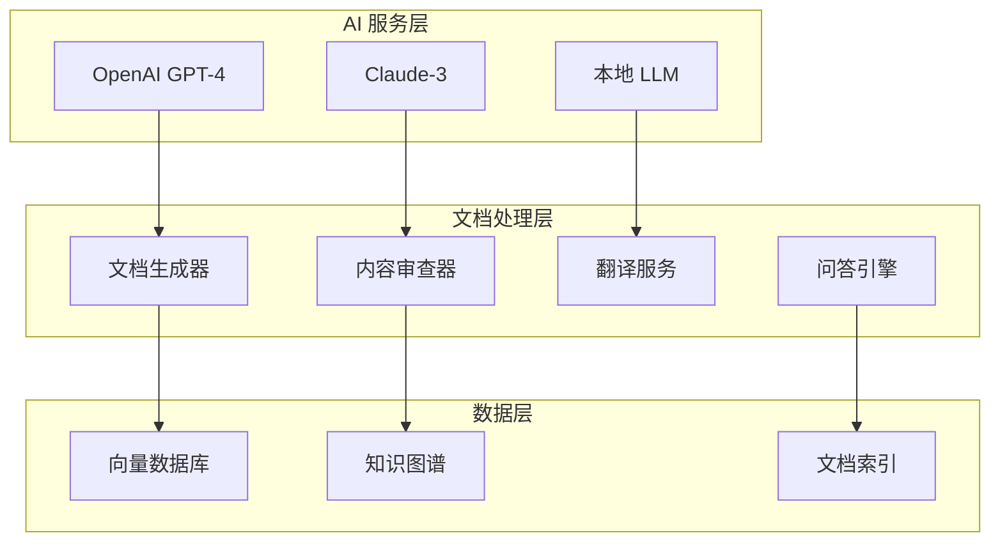

# 🤖 AI 驱动的智能文档系统

## 📋 概述

本文档介绍如何集成 AI 技术来提升文档系统的智能化水平，包括自动生成、智能审查、内容优化和用户交互等功能。

---

## 🎯 AI 集成目标

### 主要功能
1. **智能文档生成** - 基于代码自动生成高质量文档
2. **内容智能审查** - AI 辅助的文档质量检查和改进建议
3. **智能问答系统** - 基于文档内容的智能客服机器人
4. **个性化推荐** - 根据用户角色和行为推荐相关文档
5. **多语言支持** - 自动翻译和本地化

### 技术架构


---

## 🔧 实现方案

### 1. 智能文档生成

#### 代码注释增强
```typescript
/**
 * AI 文档生成服务
 * 
 * 使用 GPT-4 分析代码结构和注释，自动生成完整的技术文档
 * 
 * @ai-generate-docs true
 * @ai-template comprehensive
 * @ai-audience developers
 */
@Injectable()
export class AIDocGeneratorService {
  constructor(
    private readonly openaiService: OpenAIService,
    private readonly codeAnalyzer: CodeAnalyzerService,
  ) {}

  /**
   * 生成模块文档
   * 
   * @ai-prompt "分析以下 TypeScript 模块，生成包含架构说明、API文档、使用示例的完整文档"
   * @ai-format markdown
   * @ai-language zh-CN
   */
  async generateModuleDoc(modulePath: string): Promise<string> {
    const codeAnalysis = await this.codeAnalyzer.analyzeModule(modulePath);
    
    const prompt = `
      请为以下 NestJS 模块生成完整的技术文档：
      
      模块信息：
      ${JSON.stringify(codeAnalysis, null, 2)}
      
      要求：
      1. 包含模块概述和架构说明
      2. 详细的 API 文档和参数说明
      3. 实用的代码示例
      4. 常见问题和故障排查
      5. 使用中文，格式为 Markdown
    `;

    return await this.openaiService.generateText(prompt, {
      model: 'gpt-4-turbo-preview',
      maxTokens: 4000,
      temperature: 0.3,
    });
  }
}
```

### 2. 配置和部署

#### 环境配置
```env
# AI 服务配置
OPENAI_API_KEY=your_openai_api_key
ANTHROPIC_API_KEY=your_claude_api_key
AI_MODEL_PREFERENCE=gpt-4-turbo-preview
AI_MAX_TOKENS=4000
AI_TEMPERATURE=0.3

# 向量数据库配置
VECTOR_DB_URL=http://localhost:6333
VECTOR_DB_COLLECTION=docs_knowledge_base
EMBEDDING_MODEL=text-embedding-ada-002

# 缓存配置
AI_CACHE_TTL=86400
AI_RATE_LIMIT=100
```

#### Docker 配置
```yaml
# docker-compose.ai.yml
version: '3.8'
services:
  ai-doc-service:
    build: 
      context: .
      dockerfile: Dockerfile.ai
    environment:
      - OPENAI_API_KEY=${OPENAI_API_KEY}
      - VECTOR_DB_URL=http://qdrant:6333
    depends_on:
      - qdrant
      - redis
    ports:
      - "3001:3001"

  qdrant:
    image: qdrant/qdrant:latest
    ports:
      - "6333:6333"
    volumes:
      - qdrant_data:/qdrant/storage

  redis:
    image: redis:7-alpine
    ports:
      - "6379:6379"

volumes:
  qdrant_data:
```

---

## 📊 使用指南

### 快速开始
```bash
# 1. 安装 AI 依赖
npm install openai @anthropic-ai/sdk qdrant-js

# 2. 配置环境变量
cp .env.ai.example .env.ai

# 3. 启动 AI 服务
docker-compose -f docker-compose.ai.yml up -d

# 4. 初始化知识库
npm run docs:ai:init

# 5. 生成 AI 文档
npm run docs:ai:generate
```

### 主要命令
```bash
# AI 文档生成
npm run docs:ai:generate          # 生成所有模块文档
npm run docs:ai:generate:module   # 生成指定模块文档
npm run docs:ai:generate:api      # 生成 API 文档

# 文档审查
npm run docs:ai:review            # 智能文档审查
npm run docs:ai:review:batch      # 批量审查
npm run docs:ai:improve           # 生成改进建议

# 问答系统
npm run docs:ai:chat:init         # 初始化问答系统
npm run docs:ai:chat:test         # 测试问答功能

# 多语言支持
npm run docs:ai:translate         # 翻译文档
npm run docs:ai:translate:en      # 翻译为英文
npm run docs:ai:translate:ja      # 翻译为日文
```

---

## 🎯 最佳实践

### 1. 提示词优化
```typescript
const PROMPT_TEMPLATES = {
  API_DOC: `
请为以下 API 接口生成详细文档：
- 接口描述和用途
- 请求参数详细说明
- 响应格式和状态码
- 使用示例（curl 和 JavaScript）
- 错误处理和注意事项
`,
  
  MODULE_DOC: `
请为以下 NestJS 模块生成技术文档：
- 模块概述和职责
- 架构设计和依赖关系
- 核心功能和特性
- 配置和使用方法
- 最佳实践和注意事项
`,
  
  TROUBLESHOOTING: `
请基于以下错误信息生成故障排查文档：
- 问题描述和症状
- 可能的原因分析
- 详细的解决步骤
- 预防措施和建议
- 相关资源链接
`
};
```

### 2. 质量控制
```typescript
interface AIDocQuality {
  completeness: number;    // 完整性评分 (0-100)
  accuracy: number;        // 准确性评分 (0-100)
  clarity: number;         // 清晰度评分 (0-100)
  usefulness: number;      // 实用性评分 (0-100)
  suggestions: string[];   // 改进建议
}

const QUALITY_THRESHOLDS = {
  MINIMUM_SCORE: 70,
  EXCELLENT_SCORE: 90,
  AUTO_APPROVE_SCORE: 85,
};
```

---

## 🚀 进阶功能

### 智能问答 API
```typescript
@Controller('docs/ai')
export class AIDocController {
  @Post('ask')
  async askQuestion(@Body() dto: AskQuestionDto) {
    return this.aiService.askQuestion(dto.question);
  }
  
  @Post('improve')
  async improveDoc(@Body() dto: ImproveDocDto) {
    return this.aiService.improveDocument(dto.docPath);
  }
  
  @Post('translate')
  async translateDoc(@Body() dto: TranslateDocDto) {
    return this.aiService.translateDocument(dto.docPath, dto.targetLang);
  }
}
```

### 监控和分析
```typescript
interface AIUsageMetrics {
  totalRequests: number;
  successRate: number;
  averageResponseTime: number;
  tokenUsage: number;
  costTracking: number;
  userSatisfaction: number;
}
```

---

**最后更新**: 2025年10月5日  
**文档版本**: v1.0.0  
**维护团队**: AI 团队 + 文档团队