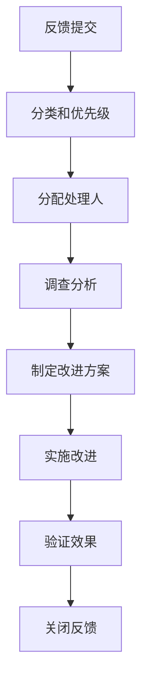

# 文档改进建议收集

## 📋 概述
本文档收集用户对文档系统的反馈和建议，持续改进文档质量和用户体验。

## 🎯 收集目标

### 反馈渠道
- **用户反馈**: 使用体验和改进建议
- **团队建议**: 内部使用反馈
- **质量检查**: 自动化检查结果
- **外部评审**: 第三方评审意见

### 改进重点
```typescript
interface ImprovementFocus {
  clarity: boolean;              // 清晰度改进
  completeness: boolean;         // 完整性改进  
  accuracy: boolean;            // 准确性改进
  usability: boolean;           // 可用性改进
}
```

## 📊 反馈分类

### 内容质量反馈
```markdown
## 准确性反馈
- [ ] 技术概念描述错误
- [ ] 代码示例不准确
- [ ] 版本信息过时
- [ ] 配置参数错误

## 完整性反馈  
- [ ] 缺少关键步骤说明
- [ ] 故障排除指南缺失
- [ ] 最佳实践未覆盖
- [ ] 相关链接缺失
```

### 用户体验反馈
```markdown
## 可读性反馈
- [ ] 语言表达晦涩
- [ ] 结构层次混乱
- [ ] 示例代码复杂
- [ ] 图表使用不当

## 导航体验反馈
- [ ] 查找信息困难
- [ ] 链接指向错误
- [ ] 搜索功能不足
- [ ] 目录结构不合理
```

## 🔄 处理流程

### 反馈收集流程


### 优先级评估
```markdown
## 优先级标准
- **P0 - 紧急**: 严重错误、安全风险
- **P1 - 高**: 核心功能文档错误
- **P2 - 中**: 用户体验问题
- **P3 - 低**: 优化建议
```

## 📈 改进跟踪

### 改进效果评估
```typescript
interface ImprovementMetrics {
  feedbackCount: number;         // 反馈数量
  resolutionRate: number;        // 解决率
  averageResolutionTime: number; // 平均解决时间
  userSatisfaction: number;      // 用户满意度
}
```

### 改进成果展示
```markdown
## 近期改进成果
### 🎯 准确性提升
- **修复技术错误**: 15处
- **更新代码示例**: 8个
- **修正配置参数**: 12项

### 📚 完整性增强  
- **补充故障排除**: 6个章节
- **添加最佳实践**: 4个主题
- **完善相关链接**: 20+个

### 👥 用户体验优化
- **优化语言表达**: 全文档
- **重构目录结构**: 3个模块
- **增强搜索功能**: 新增标签系统
```

## 🛠️ 改进工具

### 自动化检查工具
```json
{
  "scripts": {
    "docs:feedback-analysis": "node scripts/feedback-analysis.js",
    "docs:improvement-tracking": "node scripts/improvement-tracking.js"
  }
}
```

### 反馈收集表单
```markdown
## 反馈提交表单
**反馈类型**
- [ ] 内容错误
- [ ] 内容缺失
- [ ] 用户体验
- [ ] 其他建议

**具体描述**
详细描述问题或建议

**相关文档**
涉及的文档链接

**改进建议**
具体的改进方案

**联系方式** (可选)
便于进一步沟通
```

## 📚 最佳实践

### 反馈处理规范
```markdown
## 响应时间要求
- **P0 反馈**: 4小时内响应
- **P1 反馈**: 8小时内响应
- **P2 反馈**: 24小时内响应  
- **P3 反馈**: 48小时内响应

## 处理质量要求
- [ ] 根本原因分析
- [ ] 全面影响评估
- [ ] 相关文档更新
- [ ] 用户满意度确认
```

### 改进实施标准
```markdown
## 改进验收标准
- [ ] 问题完全解决
- [ ] 相关文档同步更新
- [ ] 测试验证通过
- [ ] 用户确认满意
```

## 🔄 持续优化

### 反馈分析报告
```markdown
## 月度分析报告
### 反馈统计
- **总反馈量**: 45个
- **已解决**: 38个 (84%)
- **平均解决时间**: 2.3天

### 改进效果
- **用户满意度**: 提升 15%
- **文档质量评分**: 提升 8分
- **问题重开率**: 降低 5%
```

### 优化方向
```markdown
## 下一阶段重点
1. **搜索体验优化**
   - 实现全文搜索
   - 添加搜索建议
   - 优化搜索结果排序

2. **移动端适配**
   - 响应式设计优化
   - 触摸交互改进
   - 离线阅读支持

3. **个性化推荐**
   - 基于使用历史推荐
   - 智能内容关联
   - 学习路径建议
```

## 📞 支持资源

### 内部资源
- [文档规范](../standards/documentation-standards.md)
- [质量检查工具](../scripts/)
- [更新流程](../maintenance/update-process.md)

### 外部参考
- [技术写作最佳实践](https://developers.google.com/tech-writing)
- [用户体验设计原则](https://www.nngroup.com/articles/usability-101-introduction-to-usability/)

*最后更新: 2025年10月5日*