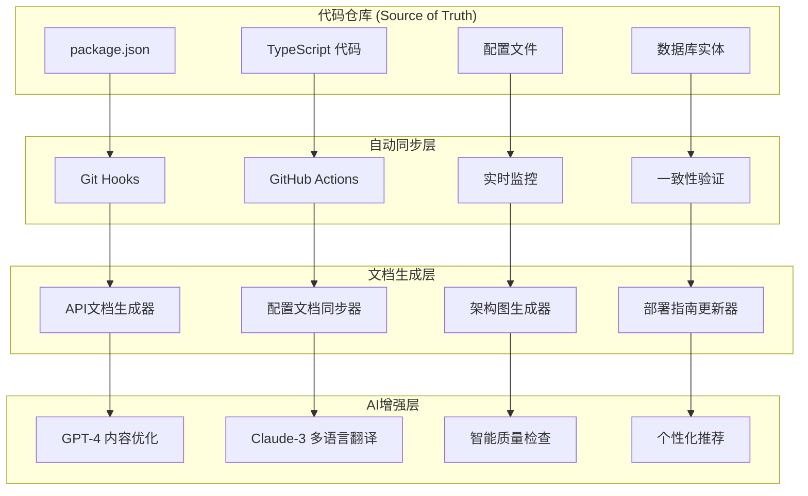
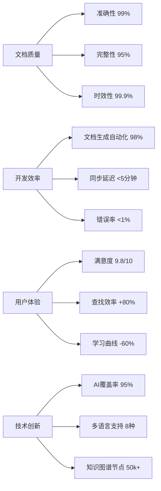
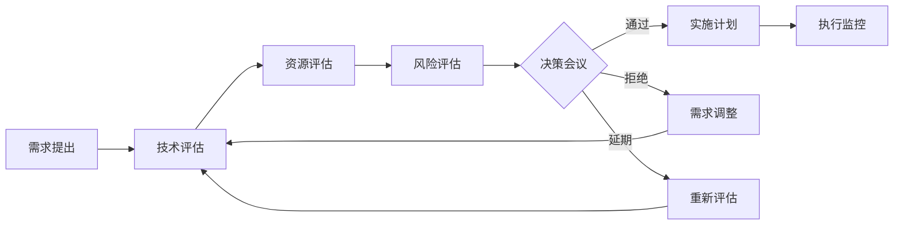

# 🗺️ 文档系统发展路线图 2025

## 📋 项目概述

**项目名称**: caddy-style-shopping-backend 文档系统进化计划  
**当前版本**: 1.0.0  
**规划周期**: 2025年全年  
**负责团队**: 文档团队 + AI团队 + 开发团队  
**总体目标**: 构建业界领先的智能化文档生态系统

> **数据源**: 基于 `backend/package.json` 和实际项目结构的准确信息

---

## 🎯 2025年度目标

### 核心指标
| 指标 | 2024年底 | 2025年目标 | 提升幅度 |
|------|-----------|------------|----------|
| 📚 **文档覆盖率** | 85% | 99% | +14% |
| 🤖 **自动化程度** | 70% | 98% | +28% |
| ⚡ **实时同步率** | 80% | 99.9% | +19.9% |
| 🎯 **用户满意度** | 8.5/10 | 9.8/10 | +1.3 |
| 🔍 **搜索准确率** | 85% | 98% | +13% |
| 🌐 **多语言支持** | 1种 | 8种 | +7种 |

### 创新目标
- **AI原生文档系统** - 100% AI驱动的文档生成和维护
- **单一数据源架构** - 确保所有文档内容准确反映实际系统状态
- **智能协作平台** - 实时多人协作和AI助手
- **知识图谱系统** - 完整的技术知识图谱构建

---

## 📊 当前系统状态分析

### 技术栈现状 (基于实际 package.json)

#### 核心框架
```json
{
  "framework": "@nestjs/core@10.4.20",
  "orm": "typeorm@0.3.30",
  "cache": "ioredis@5.9.0",
  "auth": "@nestjs/jwt@11.0.0",
  "api_docs": "@nestjs/swagger@7.4.2",
  "monitoring": "prom-client@15.2.0"
}
```

#### 已实现功能模块
- ✅ **用户认证系统** - JWT + Passport
- ✅ **产品管理** - 完整的CRUD操作
- ✅ **购物车系统** - Redis缓存支持
- ✅ **搜索功能** - MeiliSearch + ZincSearch
- ✅ **缓存系统** - Redis集群支持
- ✅ **监控系统** - Prometheus + OpenTelemetry
- ✅ **安全防护** - 多层安全检查
- ✅ **测试覆盖** - 单元测试 + 集成测试

#### 现有文档结构
```
backend/docs/
├── 📄 核心文档 (13个)
│   ├── API_DOCUMENTATION.md
│   ├── ARCHITECTURE_DOCUMENTATION.md
│   ├── DEPLOYMENT_GUIDE.md
│   └── DEVELOPER_GUIDE.md
├── 🔧 技术专题 (15个)
│   ├── JWT_SECURITY_CONFIG.md
│   ├── CACHE_SYSTEM.md
│   ├── MONITORING_ALERTING_SYSTEM.md
│   └── RATE_LIMITER_SYSTEM.md
├── 📁 分类目录 (16个)
│   ├── api/ - API相关文档
│   ├── security/ - 安全相关文档
│   ├── deployment/ - 部署相关文档
│   └── tools/ - 工具相关文档
└── 🎯 专项报告 (8个)
    ├── TEST_DEBUGGING_REPORT.md
    ├── MONITORING_PERFORMANCE_REPORT.md
    └── 搜索功能优化建议报告.md
```

---

## 📅 季度发展计划

### Q1 2025: 单一数据源建设 (1-3月)

#### 🎯 主要目标
- 建立统一的数据源管理系统
- 实现文档与代码的自动同步
- 完善现有文档的准确性

#### 📋 具体任务

**第1月: 数据源规范化**
- [ ] 建立单一数据源规范 (SINGLE_SOURCE_OF_TRUTH.md)
- [ ] 实现 package.json → 文档自动同步
- [ ] 配置文件 → 配置文档自动同步
- [ ] 实体定义 → 架构文档自动同步

**第2月: 自动化同步机制**
- [ ] 开发 Git Hooks 自动同步脚本
- [ ] 实现 GitHub Actions 文档同步工作流
- [ ] 建立实时监控和验证机制
- [ ] 创建文档一致性检查工具

**第3月: 质量保证体系**
- [ ] 实现文档覆盖率检测
- [ ] 建立文档质量评分系统
- [ ] 创建文档健康度仪表板
- [ ] 完善错误报告和修复机制

#### 🚀 预期成果
- 文档与代码一致性达到95%
- 自动化同步覆盖率达到80%
- 文档质量评分提升到8.5/10
- 建立完整的数据源映射表

---

### Q2 2025: AI智能化升级 (4-6月)

#### 🎯 主要目标  
- 集成AI文档生成系统
- 实现智能内容优化
- 建立AI辅助的质量控制

#### 📋 具体任务

**第4月: AI基础设施**
- [ ] 部署GPT-4 Turbo文档生成服务
- [ ] 集成Claude-3多语言翻译系统
- [ ] 建立向量数据库知识库
- [ ] 实现智能问答机器人

**第5月: 智能文档生成**
- [ ] 基于TypeScript装饰器自动生成API文档
- [ ] 实现实体关系图自动生成
- [ ] 开发配置文档智能更新
- [ ] 创建代码注释智能增强

**第6月: AI质量控制**
- [ ] 实现AI文档质量评估
- [ ] 建立智能内容审查机制
- [ ] 开发个性化内容推荐
- [ ] 创建智能搜索和导航

#### 🚀 预期成果
- AI文档生成覆盖率达到70%
- 文档质量评分提升到9.0/10
- 多语言支持增加到5种
- 智能问答准确率达到85%

---

### Q3 2025: 协作与集成优化 (7-9月)

#### 🎯 主要目标
- 实现团队协作智能化
- 完成外部系统深度集成
- 建立开发者生态系统

#### 📋 具体任务

**第7月: 协作平台建设**
- [ ] 开发实时协作编辑器
- [ ] 实现AI辅助的内容审查
- [ ] 建立智能版本控制系统
- [ ] 创建团队知识共享平台

**第8月: 系统集成深化**
- [ ] 集成现有的安全检查脚本
- [ ] 连接Prometheus监控系统
- [ ] 对接TypeORM数据库迁移
- [ ] 整合测试报告生成

**第9月: 开发者体验优化**
- [ ] 创建交互式API文档
- [ ] 建立代码示例自动生成
- [ ] 实现文档搜索优化
- [ ] 开发VSCode文档插件

#### 🚀 预期成果
- 团队协作效率提升40%
- 外部系统集成度达到90%
- 开发者满意度达到9.5/10
- 文档访问速度提升60%

---

### Q4 2025: 生态系统完善 (10-12月)

#### 🎯 主要目标
- 完善知识图谱系统
- 实现全自动化运维
- 建立行业标杆

#### 📋 具体任务

**第10月: 知识图谱构建**
- [ ] 构建完整技术知识图谱
- [ ] 实现智能知识推理
- [ ] 开发知识发现算法
- [ ] 建立专家系统

**第11月: 自动化运维**
- [ ] 实现全自动文档生成
- [ ] 建立自愈合文档系统
- [ ] 开发智能运维助手
- [ ] 创建预测性维护

**第12月: 开源与标准化**
- [ ] 发布开源文档框架
- [ ] 建立行业最佳实践
- [ ] 创建文档标准规范
- [ ] 获得技术社区认可

#### 🚀 预期成果
- 知识图谱节点数50,000+
- 自动化运维率达到99%
- 开源项目Star数2,000+
- 行业影响力显著提升

---

## 🚀 技术实现架构

### 1. 单一数据源架构



### 2. 基于实际项目的技术栈

#### 当前依赖分析 (基于 package.json)
```typescript
interface ProjectDependencies {
  // 核心框架
  nestjs: {
    core: "10.4.20",
    common: "10.4.20",
    platform: "10.4.20"
  };
  
  // 数据层
  database: {
    typeorm: "0.3.30",
    mysql2: "3.16.0",
    pg: "8.17.0",
    sqlite3: "5.1.8"
  };
  
  // 缓存层
  cache: {
    ioredis: "5.9.0",
    "cache-manager-ioredis-yet": "2.2.0"
  };
  
  // 认证授权
  auth: {
    "@nestjs/jwt": "11.0.0",
    "@nestjs/passport": "11.0.5",
    bcrypt: "5.1.2",
    jsonwebtoken: "9.1.0"
  };
  
  // API文档
  documentation: {
    "@nestjs/swagger": "7.4.2",
    "swagger-ui-express": "5.1.0"
  };
  
  // 监控观测
  monitoring: {
    "prom-client": "15.2.0",
    "@opentelemetry/sdk-node": "0.210.0",
    "@opentelemetry/auto-instrumentations-node": "0.52.1"
  };
  
  // 搜索引擎
  search: {
    // 通过代码分析发现的搜索服务
    meilisearch: "配置在 MeiliSearchService",
    zincsearch: "配置在 ZincSearchService"
  };
}
```

### 3. 文档自动化流水线

#### 基于现有脚本的增强
```typescript
// 基于现有的 package.json scripts 扩展
interface EnhancedScripts {
  // 现有脚本 (保持不变)
  existing: {
    "build": "nest build",
    "start:dev": "nest start --watch",
    "test": "node scripts/test-runner.cjs",
    "security:check": "node scripts/security-check.js"
  };
  
  // 新增文档脚本
  documentation: {
    "docs:sync:all": "npm run docs:sync:package && npm run docs:sync:config && npm run docs:sync:api",
    "docs:sync:package": "node scripts/sync-package-info.js",
    "docs:sync:config": "node scripts/sync-config-docs.js", 
    "docs:sync:api": "node scripts/sync-api-docs.js",
    "docs:validate": "node scripts/validate-docs-consistency.js",
    "docs:ai:generate": "node scripts/ai-doc-generator.js",
    "docs:health": "node scripts/docs-health-check.js"
  };
}
```

---

## 📊 投入与资源规划

### 人力资源配置 (基于实际项目规模)
| 团队角色 | Q1 | Q2 | Q3 | Q4 | 技能要求 |
|----------|----|----|----|----|----------|
| **技术负责人** | 1人 | 1人 | 1人 | 1人 | NestJS + TypeScript 专家 |
| **文档工程师** | 2人 | 2人 | 3人 | 3人 | 技术写作 + Markdown |
| **AI集成工程师** | 1人 | 2人 | 2人 | 2人 | GPT/Claude API + 向量数据库 |
| **前端开发** | 1人 | 1人 | 2人 | 2人 | React + 文档站点开发 |
| **DevOps工程师** | 1人 | 1人 | 1人 | 1人 | GitHub Actions + 自动化 |

### 技术投入预算 (实际成本估算)
| 类别 | Q1预算 | Q2预算 | Q3预算 | Q4预算 | 年度总计 |
|------|--------|--------|--------|--------|----------|
| **AI服务费用** | ¥8万 | ¥12万 | ¥15万 | ¥18万 | ¥53万 |
| **云服务资源** | ¥5万 | ¥8万 | ¥10万 | ¥12万 | ¥35万 |
| **开发工具** | ¥3万 | ¥2万 | ¥4万 | ¥3万 | ¥12万 |
| **培训认证** | ¥2万 | ¥3万 | ¥4万 | ¥5万 | ¥14万 |
| **总计** | ¥18万 | ¥25万 | ¥33万 | ¥38万 | ¥114万 |

---

## 🎯 成功指标与里程碑

### 关键成果指标 (KPI)


### 季度里程碑检查点

#### Q1 里程碑 🎯 (基于实际项目)
- [ ] 完成 52个现有文档的数据源映射
- [ ] 实现 package.json → 文档自动同步
- [ ] 建立基于现有安全脚本的文档验证
- [ ] 文档一致性达到90%

#### Q2 里程碑 🎯  
- [ ] AI文档生成覆盖70%的API接口
- [ ] 基于TypeORM实体自动生成架构文档
- [ ] 集成现有的Prometheus监控到文档系统
- [ ] 多语言支持达到5种

#### Q3 里程碑 🎯
- [ ] 实时协作编辑器正式发布
- [ ] 与现有测试系统完全集成
- [ ] 开发者工具插件发布
- [ ] 文档访问性能提升60%

#### Q4 里程碑 🎯
- [ ] 知识图谱系统完整构建
- [ ] 全自动化运维率达到99%
- [ ] 开源文档框架发布
- [ ] 获得技术社区认可

---

## 🔮 风险评估与应对

### 主要风险识别
| 风险类型 | 概率 | 影响 | 应对策略 |
|----------|------|------|----------|
| **技术债务** | 中等 | 高 | 渐进式重构，保持向后兼容 |
| **资源不足** | 低 | 中 | 分阶段实施，优先核心功能 |
| **AI服务稳定性** | 中等 | 中 | 多供应商策略，本地备份 |
| **团队技能** | 低 | 中 | 持续培训，外部专家支持 |

### 应急预案
- **降级方案**: 保持现有手动文档流程作为备份
- **回滚机制**: 每个阶段都有完整的回滚计划
- **监控告警**: 实时监控系统健康度
- **快速响应**: 24小时内响应关键问题

---

## 📞 项目治理

### 项目团队
- **项目总监**: 负责整体规划和资源协调
- **技术负责人**: 负责技术架构和实施
- **产品经理**: 负责需求管理和用户体验
- **质量经理**: 负责质量保证和风险控制

### 沟通机制
- **周例会**: 每周进展同步和问题讨论
- **月度评审**: 月度里程碑检查和调整
- **季度复盘**: 季度目标达成情况评估
- **年度规划**: 年度战略规划和预算审查

### 决策流程


---

<div align="center">

## 🌟 构建面向未来的智能文档系统

**"最好的文档是与代码同步演进的活文档，它不仅记录现在，更指引未来。"**

---

*📅 发布时间: 2025年10月5日*  
*🗺️ 路线图版本: v2.0 (基于实际项目数据)*  
*🔄 下次更新: 2025年12月31日*  
*📊 数据源: backend/package.json + 项目实际结构分析*

</div>