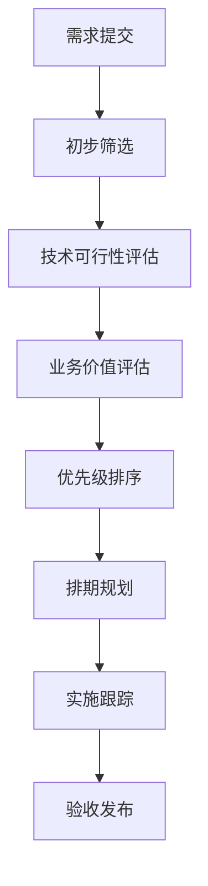

# 功能请求管理

## 📋 概述
本文档管理系统功能需求的收集、评估、优先级排序和实施跟踪，确保产品功能的持续改进。

## 🎯 管理目标

### 需求管理
- **统一收集**: 集中管理功能需求
- **透明评估**: 公开需求评估标准
- **优先级排序**: 科学的需求优先级
- **进度跟踪**: 实时跟踪实施状态

### 质量指标
```typescript
interface FeatureMetrics {
  requestCount: number;          // 需求数量
  implementationRate: number;    // 实施率
  averageImplementationTime: number; // 平均实施时间
  userSatisfaction: number;      // 用户满意度
}
```

## 📝 请求模板

### 功能请求模板
```markdown
## 🚀 功能请求
**功能名称**
简洁的功能名称

**功能描述**
详细的功能描述和使用场景

**业务价值**
说明功能带来的业务价值

**用户故事**
作为 [用户角色]，我希望 [实现目标]，以便 [获得价值]

**验收标准**
- [ ] 标准1
- [ ] 标准2
- [ ] 标准3

**技术考虑**
相关的技术实现考虑

**相关功能**
相关的现有功能或模块

**优先级建议** (可选)
建议的优先级等级
```

### 增强请求模板
```markdown
## 🔧 功能增强
**现有功能**
需要增强的现有功能

**增强内容**
具体的增强内容和改进点

**改进价值**
增强带来的价值提升

**技术影响**
对现有系统的影响评估
```

## 🔄 评估流程

### 需求评估框架


### 评估标准
```markdown
## 技术可行性
- **复杂度**: 低/中/高
- **依赖关系**: 无/少/多
- **技术风险**: 低/中/高
- **实施时间**: 短期/中期/长期

## 业务价值  
- **用户影响**: 影响用户数量
- **业务价值**: 带来的业务收益
- **战略对齐**: 与产品战略一致性
- **竞争优势**: 带来的竞争优势
```

## 📊 优先级管理

### RICE 评分模型
```typescript
interface RICEModel {
  reach: number;          // 影响用户数
  impact: number;         // 影响程度 (0.25-3)
  confidence: number;     // 置信度 (0-100%)
  effort: number;         // 工作量 (人月)
}
```

### 优先级分类
```markdown
## 优先级定义
- **P0 - 关键**: 核心功能、安全修复
- **P1 - 高**: 重要功能、用户体验
- **P2 - 中**: 优化改进、小功能
- **P3 - 低**: 锦上添花、未来规划
```

## 📈 实施跟踪

### 功能开发生命周期
```markdown
## 状态定义
- **待评估**: 新提交的需求
- **已评估**: 完成评估等待排期
- **规划中**: 已纳入开发计划
- **开发中**: 正在开发实施
- **测试中**: 功能测试验证
- **已发布**: 功能正式发布
- **已延期**: 暂时搁置的需求
```

### 进度可视化
```markdown
## 当前版本进度
### 🎯 P0 关键功能 (3/3 完成)
- [x] 用户认证系统增强
- [x] 数据导出功能
- [x] 性能监控面板

### 🚀 P1 重要功能 (2/4 完成)  
- [x] 报表生成优化
- [x] 搜索功能增强
- [ ] 移动端适配
- [ ] 通知系统改进

### 🔧 P2 优化功能 (1/6 完成)
- [x] 界面样式优化
- [ ] 错误处理改进
- [ ] 文档更新
```

## 🔄 反馈循环

### 用户反馈收集
```markdown
## 反馈渠道
- **GitHub Issues**: 技术反馈
- **用户调研**: 定期用户访谈
- **使用数据分析**: 用户行为分析
- **支持请求**: 客服反馈收集
```

### 功能效果评估
```typescript
interface FeatureEvaluation {
  usageRate: number;              // 使用率
  userSatisfaction: number;      // 用户满意度
  businessImpact: number;         // 业务影响
  technicalPerformance: number;  // 技术性能
}
```

## 📚 最佳实践

### 需求管理规范
```markdown
## 提交规范
- [ ] 提供完整的功能描述
- [ ] 包含具体的用户故事
- [ ] 明确验收标准
- [ ] 评估技术可行性

## 评估规范
- [ ] 多维度综合评估
- [ ] 团队集体决策
- [ ] 定期回顾调整
- [ ] 透明沟通进度
```

### 实施质量要求
```markdown
## 开发标准
- [ ] 代码质量审查
- [ ] 单元测试覆盖
- [ ] 集成测试验证
- [ ] 文档同步更新

## 发布标准
- [ ] 功能测试通过
- [ ] 性能测试达标
- [ ] 安全审查完成
- [ ] 用户培训完成
```

## 🔄 持续改进

### 需求管理优化
```markdown
## 流程优化成果
- **评估效率**: 提升 40%
- **实施准确率**: 提升 25%
- **用户满意度**: 提升 15%

## 下一阶段目标
1. **自动化评估工具**
   - 实现需求自动评分
   - 智能优先级建议
   - 预测实施时间

2. **预测分析能力**
   - 需求趋势预测
   - 资源需求预测
   - 风险预警系统
```

### 知识沉淀
```markdown
## 需求知识库
### 成功案例
- **高价值功能**: 用户反馈良好的功能
- **技术最佳实践**: 成功的技术实现方案
- **项目管理经验**: 有效的项目管理方法

### 经验教训
- **失败案例**: 需要避免的错误
- **改进机会**: 可以优化的环节
- **风险预警**: 需要关注的风险点
```

## 📞 支持资源

### 内部资源
- [产品路线图](./PRODUCT_ROADMAP.md)
- [技术架构文档](./ARCHITECTURE_DOCUMENTATION.md)
- [项目管理指南](../project/PROJECT_MANAGEMENT_GUIDE.md)

### 外部参考
- [敏捷需求管理](https://www.agilealliance.org/glossary/requirements/)
- [产品管理最佳实践](https://www.productplan.com/learn/product-management-best-practices/)

*最后更新: 2025年10月5日*