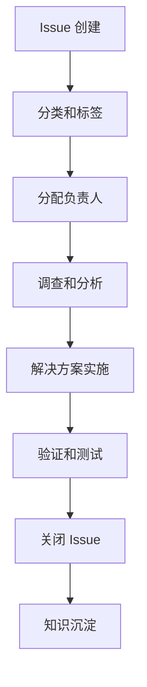

# GitHub Issues 管理指南

## 📋 概述
本文档规范 GitHub Issues 的创建、分类、跟踪和解决流程，确保问题管理的效率和透明度。

## 🎯 管理目标

### 流程标准化
- **统一模板**: 问题描述格式统一
- **分类明确**: 问题类型和优先级清晰
- **跟踪透明**: 解决进度实时可见
- **知识沉淀**: 解决方案归档共享

### 质量指标
```typescript
interface IssueMetrics {
  openCount: number;            // 未解决问题数量
  averageResolutionTime: number; // 平均解决时间
  reopenRate: number;           // 问题重开率
  satisfactionScore: number;    // 用户满意度
}
```

## 📝 Issue 模板

### Bug 报告模板
```markdown
## 🐛 Bug 描述
**问题描述**
清晰描述遇到的问题

**重现步骤**
1. 第一步
2. 第二步  
3. 第三步

**期望行为**
期望的正常行为

**实际行为**
实际观察到的行为

**环境信息**
- 系统版本: 
- 浏览器版本:
- 发生时间:

**截图/日志**
相关截图或错误日志

**附加信息**
其他相关信息
```

### 功能请求模板
```markdown
## 🚀 功能请求
**功能描述**
详细描述期望的功能

**使用场景**
说明功能的使用场景和价值

**替代方案**
当前是否有替代方案

**附加信息**
相关参考资料或示例
```

### 文档改进模板
```markdown
## 📚 文档改进
**改进内容**
描述文档需要改进的部分

**当前问题**
当前文档存在的问题

**改进建议**
具体的改进建议

**相关文档**
涉及的文档链接
```

## 🔧 工作流程

### Issue 生命周期


### 优先级管理
```markdown
## 优先级定义
- **P0 - 紧急**: 系统崩溃、安全漏洞
- **P1 - 高**: 核心功能故障
- **P2 - 中**: 功能缺陷、体验问题  
- **P3 - 低**: 优化建议、文档改进
```

## 🏷️ 标签系统

### 分类标签
```markdown
## 问题类型
- `bug` - 缺陷修复
- `enhancement` - 功能增强
- `documentation` - 文档改进
- `question` - 问题咨询

## 优先级
- `priority: critical` - 紧急
- `priority: high` - 高
- `priority: medium` - 中
- `priority: low` - 低

## 状态
- `status: investigating` - 调查中
- `status: in progress` - 进行中
- `status: needs review` - 待审查
- `status: resolved` - 已解决
```

## 📊 统计分析

### 问题趋势分析
```markdown
## 月度统计
- **新增问题**: 25个
- **解决问题**: 20个  
- **平均解决时间**: 3.2天
- **重开率**: 8%

## 分类统计
- **Bug 修复**: 45%
- **功能增强**: 30%
- **文档改进**: 15%
- **其他**: 10%
```

### 团队绩效
```markdown
## 解决效率排名
1. **开发A**: 15个问题 (平均2.1天)
2. **开发B**: 12个问题 (平均2.8天)  
3. **开发C**: 10个问题 (平均3.5天)
```

## 🔄 自动化集成

### GitHub Actions 集成
```yaml
# Issue 自动分配
- name: Auto Assign Issue
  uses: actions/github-script@v6
  with:
    script: |
      // 根据标签自动分配负责人
```

### 状态同步
```yaml
# PR 与 Issue 关联
- name: Link PR to Issue
  uses: actions/github-script@v6
  with:
    script: |
      // 自动关联 PR 和 Issue
```

## 📚 最佳实践

### Issue 创建规范
```markdown
## 创建前检查
- [ ] 搜索是否已有类似问题
- [ ] 提供详细的重现步骤
- [ ] 包含环境信息和日志
- [ ] 添加适当的标签

## 响应时间要求
- **P0**: 2小时内响应
- **P1**: 4小时内响应  
- **P2**: 8小时内响应
- **P3**: 24小时内响应
```

### 解决质量要求
```markdown
## 解决标准
- [ ] 问题根本原因分析
- [ ] 解决方案验证
- [ ] 相关文档更新
- [ ] 测试用例补充
```

## 📞 支持资源

### 内部资源
- [代码审查指南](../standards/CODE_REVIEW_GUIDE.md)
- [测试指南](../testing/TESTING_GUIDE.md)
- [部署流程](./DEPLOYMENT_GUIDE.md)

### 外部参考
- [GitHub Issues 文档](https://docs.github.com/en/issues)
- [项目管理最佳实践](https://docs.github.com/en/issues/planning-and-tracking-with-projects)

*最后更新: 2025年10月5日*