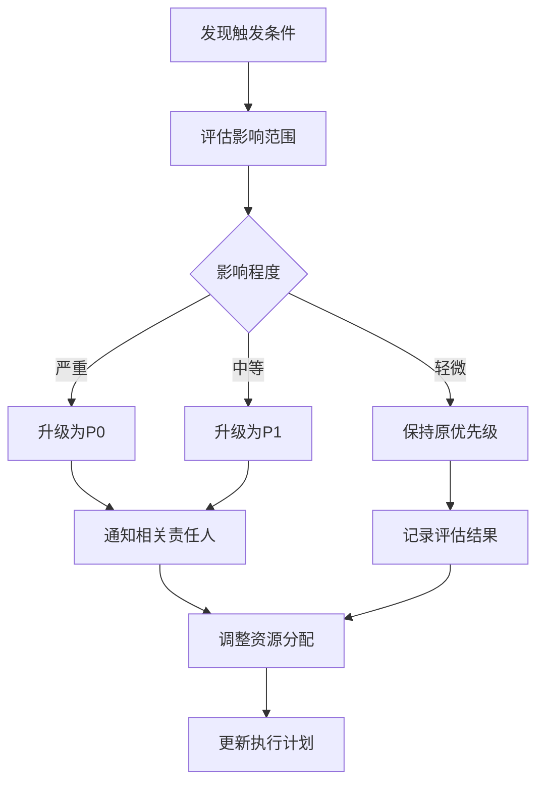

# 📋 责任矩阵与优先级体系

> **统一的责任分配和优先级管理** - 整合主计划与执行清单的分工信息  
> **更新时间**: 2025-10-02  
> **数据来源**: BACKEND_IMPROVEMENT_PLAN.md, IMPROVEMENT_TODO_CHECKLIST.md, IMPROVEMENT_EXECUTION_CHECKLIST.md

---

## 🎯 优先级体系定义

### 优先级分级标准
| 优先级 | 定义 | 完成时限 | 影响程度 | 示例 |
|--------|------|----------|----------|------|
| **P0-紧急** | 影响系统安全或核心功能，阻塞其他任务 | 1周内 | 极高 | 安全漏洞修复、测试覆盖率突破 |
| **P1-高** | 影响系统性能或重要功能 | 2周内 | 高 | 性能优化、监控完善 |
| **P2-中** | 提升系统能力或架构优化 | 1月内 | 中 | 架构升级、技术债务清理 |
| **P3-低** | 技术储备或创新功能 | 3月内 | 低 | 新技术预研、智能化功能 |

### RACI角色定义
| 角色 | 职责描述 | 权限级别 |
|------|----------|----------|
| **R (Responsible)** | 负责执行任务的主要责任人 | 执行权 |
| **A (Accountable)** | 对任务结果负最终责任，有批准权 | 决策权 |
| **C (Consulted)** | 需要咨询的专家，提供技术建议 | 建议权 |
| **I (Informed)** | 需要了解进展的相关人员 | 知情权 |

---

## 📊 统一责任矩阵

### 🔴 P0-紧急任务 (1周内完成)

#### 测试覆盖率提升
| 任务 | 主计划优先级 | 执行清单优先级 | 负责人(R) | 批准人(A) | 咨询人(C) | 知情人(I) | 预计工时 | 截止时间 |
|------|-------------|---------------|----------|----------|----------|----------|----------|----------|
| Controller测试编写 | P0 | 第一优先级 | 测试工程师 | 技术负责人 | 后端开发 | 产品经理 | 32h | 2025-10-09 |
| Service层测试 | P0 | 第一优先级 | 后端开发 | 技术负责人 | 测试工程师 | 架构师 | 40h | 2025-10-09 |
| 集成测试设计 | P0 | 第一优先级 | 测试工程师 | 技术负责人 | 后端开发 | DevOps | 24h | 2025-10-09 |
| E2E测试实现 | P0 | 第一优先级 | 测试工程师 | 技术负责人 | 后端开发 | 产品经理 | 28h | 2025-10-09 |
| CI/CD测试门禁 | P0 | 第一优先级 | DevOps | 技术负责人 | 测试工程师 | 后端开发 | 16h | 2025-10-09 |

#### 并发控制强化
| 任务 | 主计划优先级 | 执行清单优先级 | 负责人(R) | 批准人(A) | 咨询人(C) | 知情人(I) | 预计工时 | 截止时间 |
|------|-------------|---------------|----------|----------|----------|----------|----------|----------|
| Redis分布式锁 | P0 | 第一优先级 | 后端开发 | 技术负责人 | 架构师 | 运维团队 | 24h | 2025-10-09 |
| 库存并发控制 | P0 | 第一优先级 | 后端开发 | 技术负责人 | DBA | 运维团队 | 32h | 2025-10-09 |
| 订单状态一致性 | P0 | 第一优先级 | 后端开发 | 技术负责人 | 架构师 | 产品经理 | 28h | 2025-10-09 |
| 并发压力测试 | P0 | 第一优先级 | 测试工程师 | 技术负责人 | 性能工程师 | 后端开发 | 20h | 2025-10-09 |

#### 安全加固补强
| 任务 | 主计划优先级 | 执行清单优先级 | 负责人(R) | 批准人(A) | 咨询人(C) | 知情人(I) | 预计工时 | 截止时间 |
|------|-------------|---------------|----------|----------|----------|----------|----------|----------|
| API限流实现 | P0 | 第一优先级 | 后端开发 | 技术负责人 | 安全工程师 | 运维团队 | 20h | 2025-10-09 |
| 输入验证强化 | P0 | 第一优先级 | 后端开发 | 技术负责人 | 安全工程师 | 测试工程师 | 24h | 2025-10-09 |
| 敏感数据保护 | P0 | 第一优先级 | 后端开发 | 技术负责人 | 安全工程师 | 合规专员 | 28h | 2025-10-09 |
| 安全扫描集成 | P0 | 第一优先级 | DevOps | 技术负责人 | 安全工程师 | 后端开发 | 16h | 2025-10-09 |

---

### 🟡 P1-高优先级任务 (2周内完成)

#### 性能优化深化
| 任务 | 主计划优先级 | 执行清单优先级 | 负责人(R) | 批准人(A) | 咨询人(C) | 知情人(I) | 预计工时 | 截止时间 |
|------|-------------|---------------|----------|----------|----------|----------|----------|----------|
| 数据库查询优化 | P1 | 第二优先级 | 后端开发 | 技术负责人 | DBA | 性能工程师 | 32h | 2025-10-16 |
| 缓存策略优化 | P1 | 第二优先级 | 后端开发 | 技术负责人 | 架构师 | 运维团队 | 28h | 2025-10-16 |
| 连接池调优 | P1 | 第二优先级 | DevOps | 技术负责人 | DBA | 后端开发 | 16h | 2025-10-16 |
| 性能监控配置 | P1 | 第二优先级 | DevOps | 技术负责人 | 性能工程师 | 后端开发 | 20h | 2025-10-16 |

#### 监控告警体系
| 任务 | 主计划优先级 | 执行清单优先级 | 负责人(R) | 批准人(A) | 咨询人(C) | 知情人(I) | 预计工时 | 截止时间 |
|------|-------------|---------------|----------|----------|----------|----------|----------|----------|
| 监控指标定义 | P1 | 第四优先级 | 运维工程师 | 技术负责人 | 后端开发 | 产品经理 | 24h | 2025-10-16 |
| 告警规则配置 | P1 | 第四优先级 | 运维工程师 | 技术负责人 | 后端开发 | DevOps | 20h | 2025-10-16 |
| 监控面板设计 | P1 | 第四优先级 | 运维工程师 | 技术负责人 | 产品经理 | 后端开发 | 16h | 2025-10-16 |
| 故障响应流程 | P1 | 第四优先级 | 运维工程师 | 技术负责人 | DevOps | 后端开发 | 12h | 2025-10-16 |

---

### 🟢 P2-中优先级任务 (1月内完成)

#### CQRS架构引入
| 任务 | 主计划优先级 | 执行清单优先级 | 负责人(R) | 批准人(A) | 咨询人(C) | 知情人(I) | 预计工时 | 截止时间 |
|------|-------------|---------------|----------|----------|----------|----------|----------|----------|
| CQRS架构设计 | P2 | 未明确 | 后端架构师 | 技术总监 | DBA团队 | 开发团队 | 40h | 2025-11-02 |
| 订单领域试点 | P2 | 未明确 | 后端架构师 | 技术总监 | 开发团队 | 产品经理 | 80h | 2025-11-02 |
| 事件存储实现 | P2 | 未明确 | 后端开发 | 技术负责人 | 架构师 | DBA | 60h | 2025-11-02 |
| 事件重放机制 | P2 | 未明确 | 后端开发 | 技术负责人 | 架构师 | 运维团队 | 40h | 2025-11-02 |

#### 代码质量提升
| 任务 | 主计划优先级 | 执行清单优先级 | 负责人(R) | 批准人(A) | 咨询人(C) | 知情人(I) | 预计工时 | 截止时间 |
|------|-------------|---------------|----------|----------|----------|----------|----------|----------|
| 代码规范统一 | P2 | 第五优先级 | 后端开发 | 技术负责人 | 架构师 | 全体开发 | 24h | 2025-11-02 |
| 技术债务清理 | P2 | 第五优先级 | 后端开发 | 技术负责人 | 架构师 | 测试工程师 | 40h | 2025-11-02 |
| 文档完善 | P2 | 第五优先级 | 技术文档工程师 | 技术负责人 | 后端开发 | 产品经理 | 32h | 2025-11-02 |

---

### 🔵 P3-低优先级任务 (3月内完成)

#### 微服务化拆分
| 任务 | 主计划优先级 | 执行清单优先级 | 负责人(R) | 批准人(A) | 咨询人(C) | 知情人(I) | 预计工时 | 截止时间 |
|------|-------------|---------------|----------|----------|----------|----------|----------|----------|
| 服务边界定义 | P3 | 未明确 | 后端架构师 | CTO | 开发团队 | 产品团队 | 40h | 2025-12-02 |
| 服务拆分实施 | P3 | 未明确 | 后端架构师 | CTO | 开发团队 | 运维团队 | 120h | 2025-12-02 |
| 服务网格集成 | P3 | 未明确 | DevOps | CTO | 运维团队 | 后端开发 | 80h | 2025-12-02 |

#### 智能化功能
| 任务 | 主计划优先级 | 执行清单优先级 | 负责人(R) | 批准人(A) | 咨询人(C) | 知情人(I) | 预计工时 | 截止时间 |
|------|-------------|---------------|----------|----------|----------|----------|----------|----------|
| 推荐系统设计 | P3 | 未明确 | AI工程师 | CTO | 算法团队 | 产品团队 | 80h | 2025-12-02 |
| 智能客服实现 | P3 | 未明确 | AI工程师 | CTO | 算法团队 | 产品团队 | 120h | 2025-12-02 |

---

---

## 🎯 实施风险评估

### 责任分配风险

| 风险类别 | 风险描述 | 概率 | 影响 | 风险等级 | 缓解措施 |
|----------|----------|------|------|----------|----------|
| 责任不清 | 任务责任人不明确 | 中 | 高 | 🔴 高 | RACI矩阵培训 |
| 资源冲突 | 多任务资源竞争 | 高 | 中 | 🟡 中 | 优先级动态调整 |
| 沟通障碍 | 跨团队沟通不畅 | 中 | 中 | 🟡 中 | 定期同步会议 |
| 技能不足 | 负责人技能不匹配 | 低 | 高 | 🟡 中 | 技能培训 + 支持 |
| 权限不足 | 负责人缺乏必要权限 | 中 | 中 | 🟡 中 | 权限审核与授权 |
| 时间冲突 | 多个任务截止时间冲突 | 高 | 中 | 🟡 中 | 甘特图规划 |
| 依赖阻塞 | 任务依赖导致阻塞 | 中 | 高 | 🔴 高 | 依赖关系管理 |
| 质量风险 | 赶工导致质量下降 | 中 | 中 | 🟡 中 | 质量门禁检查 |

### 风险监控机制

```typescript
@Injectable()
export class RaciRiskMonitoringService {
  constructor(
    private readonly alertService: AlertService,
    private readonly taskService: TaskService,
    private readonly teamService: TeamService,
    private readonly logger: Logger
  ) {}

  async monitorRaciRisks(): Promise<void> {
    // 1. 检查责任分配风险
    await this.checkResponsibilityRisks();
    
    // 2. 检查资源冲突风险
    await this.checkResourceConflictRisks();
    
    // 3. 检查沟通障碍风险
    await this.checkCommunicationRisks();
    
    // 4. 检查技能匹配风险
    await this.checkSkillMatchRisks();
  }

  private async checkResponsibilityRisks(): Promise<void> {
    // 检查任务是否有明确的责任人
    const tasksWithoutResponsible = await this.taskService.getTasksWithoutResponsible();
    
    if (tasksWithoutResponsible.length > 0) {
      await this.alertService.sendAlert({
        title: '责任分配风险',
        message: `发现${tasksWithoutResponsible.length}个任务没有明确的责任人`,
        severity: 'high',
        category: 'responsibility_assignment',
        details: tasksWithoutResponsible.map(task => ({
          id: task.id,
          title: task.title,
          priority: task.priority
        }))
      });
    }
    
    // 检查责任人是否超负荷
    const overloadedAssignees = await this.taskService.getOverloadedAssignees();
    
    for (const assignee of overloadedAssignees) {
      await this.alertService.sendAlert({
        title: '资源超负荷风险',
        message: `${assignee.name} 负责的任务过多，可能影响交付质量`,
        severity: 'medium',
        category: 'resource_overload',
        details: {
          assigneeId: assignee.id,
          assigneeName: assignee.name,
          taskCount: assignee.activeTaskCount,
          recommendedLimit: assignee.recommendedTaskLimit
        }
      });
    }
  }

  private async checkResourceConflictRisks(): Promise<void> {
    // 检查同一时间段内的资源冲突
    const resourceConflicts = await this.taskService.getResourceConflicts();
    
    for (const conflict of resourceConflicts) {
      await this.alertService.sendAlert({
        title: '资源冲突风险',
        message: `${conflict.resourceName} 在 ${conflict.timeRange} 内存在多个任务冲突`,
        severity: 'medium',
        category: 'resource_conflict',
        details: {
          resourceName: conflict.resourceName,
          timeRange: conflict.timeRange,
          conflictingTasks: conflict.tasks
        }
      });
    }
  }

  private async checkCommunicationRisks(): Promise<void> {
    // 检查跨团队任务的沟通风险
    const crossTeamTasks = await this.taskService.getCrossTeamTasks();
    
    for (const task of crossTeamTasks) {
      const communicationFrequency = await this.teamService.getCommunicationFrequency(task.teams);
      
      if (communicationFrequency < 0.5) { // 低于50%的预期沟通频率
        await this.alertService.sendAlert({
          title: '沟通障碍风险',
          message: `跨团队任务 ${task.title} 的团队沟通频率过低`,
          severity: 'medium',
          category: 'communication_barrier',
          details: {
            taskId: task.id,
            taskTitle: task.title,
            teams: task.teams,
            communicationFrequency,
            recommendedFrequency: 0.8
          }
        });
      }
    }
  }

  private async checkSkillMatchRisks(): Promise<void> {
    // 检查任务负责人的技能匹配度
    const skillMismatches = await this.taskService.getSkillMismatches();
    
    for (const mismatch of skillMismatches) {
      await this.alertService.sendAlert({
        title: '技能匹配风险',
        message: `${mismatch.assigneeName} 的技能与任务 ${mismatch.taskTitle} 不完全匹配`,
        severity: 'medium',
        category: 'skill_mismatch',
        details: {
          taskId: mismatch.taskId,
          taskTitle: mismatch.taskTitle,
          assigneeId: mismatch.assigneeId,
          assigneeName: mismatch.assigneeName,
          requiredSkills: mismatch.requiredSkills,
          availableSkills: mismatch.availableSkills,
          matchPercentage: mismatch.matchPercentage
        }
      });
    }
  }
}
```

### 风险缓解策略

```typescript
@Injectable()
export class RaciRiskMitigationService {
  constructor(
    private readonly taskService: TaskService,
    private readonly teamService: TeamService,
    private readonly trainingService: TrainingService,
    private readonly logger: Logger
  ) {}

  async mitigateRisk(riskId: string, mitigationStrategy: string): Promise<MitigationResult> {
    const risk = await this.getRiskById(riskId);
    
    switch (risk.category) {
      case 'responsibility_assignment':
        return await this.mitigateResponsibilityRisk(risk, mitigationStrategy);
      case 'resource_overload':
        return await this.mitigateResourceOverloadRisk(risk, mitigationStrategy);
      case 'communication_barrier':
        return await this.mitigateCommunicationRisk(risk, mitigationStrategy);
      case 'skill_mismatch':
        return await this.mitigateSkillMismatchRisk(risk, mitigationStrategy);
      default:
        throw new Error(`未知的风险类别: ${risk.category}`);
    }
  }

  private async mitigateResponsibilityRisk(
    risk: Risk, 
    strategy: string
  ): Promise<MitigationResult> {
    if (strategy === 'clarify_responsibility') {
      // 明确责任分配
      const task = await this.taskService.getTaskById(risk.taskId);
      const recommendedAssignee = await this.recommendAssignee(task);
      
      await this.taskService.updateTask(task.id, {
        responsible: recommendedAssignee.id,
        accountable: task.accountable || recommendedAssignee.id
      });
      
      // 通知相关方
      await this.notifyResponsibilityChange(task, recommendedAssignee);
      
      return {
        success: true,
        message: `已为任务 ${task.title} 明确责任人: ${recommendedAssignee.name}`,
        actions: [
          '更新任务责任分配',
          '通知相关责任人',
          '设置跟进提醒'
        ]
      };
    } else if (strategy === 'raci_training') {
      // 安排RACI培训
      const trainingSession = await this.trainingService.scheduleTraining({
        type: 'raci_matrix',
        participants: risk.involvedTeamMembers,
        scheduledAt: new Date(Date.now() + 7 * 24 * 60 * 60 * 1000), // 一周后
        duration: 2 * 60 * 60 * 1000 // 2小时
      });
      
      return {
        success: true,
        message: `已安排RACI矩阵培训，时间: ${trainingSession.scheduledAt.toISOString()}`,
        actions: [
          '安排培训课程',
          '发送培训邀请',
          '准备培训材料'
        ]
      };
    }
    
    return {
      success: false,
      message: `未知的缓解策略: ${strategy}`
    };
  }

  private async mitigateResourceOverloadRisk(
    risk: Risk, 
    strategy: string
  ): Promise<MitigationResult> {
    if (strategy === 'rebalance_workload') {
      // 重新平衡工作负载
      const assignee = await this.teamService.getTeamMemberById(risk.assigneeId);
      const tasks = await this.taskService.getTasksByAssignee(assignee.id);
      
      // 识别可以重新分配的任务
      const reallocatableTasks = await this.identifyReallocatableTasks(tasks);
      
      for (const task of reallocatableTasks) {
        const recommendedAssignee = await this.recommendAssignee(task);
        await this.taskService.updateTask(task.id, {
          responsible: recommendedAssignee.id
        });
        
        // 通知原负责人和新负责人
        await this.notifyTaskReassignment(task, assignee, recommendedAssignee);
      }
      
      return {
        success: true,
        message: `已重新分配 ${reallocatableTasks.length} 个任务以平衡工作负载`,
        actions: [
          '识别可重新分配的任务',
          '推荐新的负责人',
          '更新任务分配',
          '通知相关责任人'
        ]
      };
    } else if (strategy === 'extend_deadline') {
      // 延长截止时间
      const task = await this.taskService.getTaskById(risk.taskId);
      const currentDeadline = new Date(task.deadline);
      const newDeadline = new Date(currentDeadline.getTime() + 7 * 24 * 60 * 60 * 1000); // 延长一周
      
      await this.taskService.updateTask(task.id, {
        deadline: newDeadline
      });
      
      // 通知相关方
      await this.notifyDeadlineExtension(task, currentDeadline, newDeadline);
      
      return {
        success: true,
        message: `已将任务 ${task.title} 的截止时间延长至 ${newDeadline.toISOString()}`,
        actions: [
          '更新任务截止时间',
          '通知相关责任人',
          '调整项目计划'
        ]
      };
    }
    
    return {
      success: false,
      message: `未知的缓解策略: ${strategy}`
    };
  }

  private async mitigateCommunicationRisk(
    risk: Risk, 
    strategy: string
  ): Promise<MitigationResult> {
    if (strategy === 'establish_communication_channel') {
      // 建立专门的沟通渠道
      const task = await this.taskService.getTaskById(risk.taskId);

---

## 📊 性能基准对比

### 团队效率指标

| 指标类别 | 当前值 | 目标值 | 测量方法 | 数据来源 |
|----------|--------|--------|----------|----------|
| 任务完成率 | 75% | 95% | 项目管理系统 | JIRA |
| 平均完成时间 | 5天 | 3天 | 时间跟踪 | 时间记录 |
| 质量达标率 | 80% | 95% | 质量检查 | 测试报告 |
| 团队满意度 | 6.5/10 | 8.5/10 | 问卷调查 | 团队反馈 |

### 预期效率提升

| 改进项 | 预期提升 | 验证方法 | 时间点 |
|--------|----------|----------|--------|
| 责任明确化 | +20% 完成率 | 任务统计 | 实施后2周 |
| 优先级优化 | -40% 完成时间 | 时间分析 | 实施后1月 |
| 协作改进 | +15% 满意度 | 满意度调查 | 实施后1月 |
| 资源平衡 | +25% 资源利用率 | 资源分析 | 实施后2周 |

### 责任分配效率监控

```typescript
@Injectable()
export class RaciPerformanceMonitoringService {
  constructor(
    private readonly taskService: TaskService,
    private readonly teamService: TeamService,
    private readonly metricsService: MetricsService,
    private readonly logger: Logger
  ) {}

  async getRaciPerformanceDashboard(): Promise<RaciPerformanceDashboard> {
    const [currentMetrics, historicalMetrics, benchmarks] = await Promise.all([
      this.getCurrentRaciMetrics(),
      this.getHistoricalRaciMetrics(),
      this.getRaciBenchmarks()
    ]);

    return {
      current: currentMetrics,
      historical: historicalMetrics,
      benchmarks: benchmarks,
      trends: this.calculateRaciTrends(historicalMetrics),
      alerts: await this.getRaciPerformanceAlerts(),
      recommendations: this.generateRaciRecommendations(currentMetrics, benchmarks)
    };
  }

  private async getCurrentRaciMetrics(): Promise<RaciMetrics> {
    return {
      taskCompletionRate: await this.calculateTaskCompletionRate(),
      averageCompletionTime: await this.calculateAverageCompletionTime(),
      qualityPassRate: await this.calculateQualityPassRate(),
      teamSatisfactionScore: await this.calculateTeamSatisfactionScore(),
      resourceUtilizationRate: await this.calculateResourceUtilizationRate(),
      communicationEfficiency: await this.calculateCommunicationEfficiency()
    };
  }

  private async calculateTaskCompletionRate(): Promise<number> {
    const tasks = await this.taskService.getAllTasks();
    const completedTasks = tasks.filter(task => task.status === 'completed');
    return tasks.length > 0 ? (completedTasks.length / tasks.length) * 100 : 0;
  }

  private async calculateAverageCompletionTime(): Promise<number> {
    const completedTasks = await this.taskService.getCompletedTasks();
    if (completedTasks.length === 0) return 0;
    
    const totalTime = completedTasks.reduce((sum, task) => {
      const completionTime = task.completedAt.getTime() - task.createdAt.getTime();
      return sum + completionTime;
    }, 0);
    
    return totalTime / completedTasks.length / (24 * 60 * 60 * 1000); // 转换为天
  }

  private async calculateQualityPassRate(): Promise<number> {
    const completedTasks = await this.taskService.getCompletedTasks();
    if (completedTasks.length === 0) return 0;
    
    const passedTasks = completedTasks.filter(task => task.qualityCheck === 'passed');
    return (passedTasks.length / completedTasks.length) * 100;
  }

  private async calculateTeamSatisfactionScore(): Promise<number> {
    // 获取最近的团队满意度调查结果
    const latestSurvey = await this.teamService.getLatestSatisfactionSurvey();
    return latestSurvey ? latestSurvey.averageScore : 0;
  }

  private async calculateResourceUtilizationRate(): Promise<number> {
    const teamMembers = await this.teamService.getAllTeamMembers();
    if (teamMembers.length === 0) return 0;
    
    let totalUtilization = 0;
    for (const member of teamMembers) {
      const utilization = await this.calculateMemberUtilization(member.id);
      totalUtilization += utilization;
    }
    
    return totalUtilization / teamMembers.length;
  }

  private async calculateMemberUtilization(memberId: string): Promise<number> {
    const activeTasks = await this.taskService.getActiveTasksByAssignee(memberId);
    const memberCapacity = await this.teamService.getMemberCapacity(memberId);
    return memberCapacity > 0 ? (activeTasks.length / memberCapacity) * 100 : 0;
  }

  private async calculateCommunicationEfficiency(): Promise<number> {
    // 计算跨团队任务的沟通效率
    const crossTeamTasks = await this.taskService.getCrossTeamTasks();
    if (crossTeamTasks.length === 0) return 100;
    
    let totalEfficiency = 0;
    for (const task of crossTeamTasks) {
      const efficiency = await this.calculateTaskCommunicationEfficiency(task.id);
      totalEfficiency += efficiency;
    }
    
    return totalEfficiency / crossTeamTasks.length;
  }

  private async calculateTaskCommunicationEfficiency(taskId: string): Promise<number> {
    // 基于任务中的沟通记录计算效率
    const communications = await this.taskService.getTaskCommunications(taskId);
    const taskDuration = await this.taskService.getTaskDuration(taskId);
    
    if (taskDuration === 0) return 100;
    
    // 沟通频率 = 沟通次数 / 任务持续时间
    const communicationFrequency = communications.length / (taskDuration / (24 * 60 * 60 * 1000));
    
    // 理想沟通频率为每天1-2次
    const idealFrequency = 1.5;
    const efficiency = Math.max(0, 100 - Math.abs(communicationFrequency - idealFrequency) / idealFrequency * 100);
    
    return efficiency;
  }

  private async getHistoricalRaciMetrics(days: number = 30): Promise<HistoricalRaciMetrics[]> {
    const endTime = new Date();
    const startTime = new Date(endTime.getTime() - days * 24 * 60 * 60 * 1000);
    
    return await this.metricsService.getRaciMetricsInRange(startTime, endTime);
  }

  private async getRaciBenchmarks(): Promise<RaciBenchmarks> {
    return {
      taskCompletionRate: {
        current: await this.calculateTaskCompletionRate(),
        target: 95,
        industry: 85
      },
      averageCompletionTime: {
        current: await this.calculateAverageCompletionTime(),
        target: 3,
        industry: 5
      },
      qualityPassRate: {
        current: await this.calculateQualityPassRate(),
        target: 95,
        industry: 80
      },
      teamSatisfactionScore: {
        current: await this.calculateTeamSatisfactionScore(),
        target: 8.5,
        industry: 7.0
      },
      resourceUtilizationRate: {
        current: await this.calculateResourceUtilizationRate(),
        target: 85,
        industry: 75
      },
      communicationEfficiency: {
        current: await this.calculateCommunicationEfficiency(),
        target: 90,
        industry: 70
      }
    };
  }

  private calculateRaciTrends(historicalMetrics: HistoricalRaciMetrics[]): RaciTrends {
    if (historicalMetrics.length < 2) {
      return {
        taskCompletionRate: 'stable',
        averageCompletionTime: 'stable',
        qualityPassRate: 'stable',
        teamSatisfactionScore: 'stable',
        resourceUtilizationRate: 'stable',
        communicationEfficiency: 'stable'
      };
    }

    const recent = historicalMetrics.slice(-7); // 最近7天
    const previous = historicalMetrics.slice(-14, -7); // 前7天

    return {
      taskCompletionRate: this.calculateTrend(recent, previous, 'taskCompletionRate'),
      averageCompletionTime: this.calculateTrend(recent, previous, 'averageCompletionTime', true),
      qualityPassRate: this.calculateTrend(recent, previous, 'qualityPassRate'),
      teamSatisfactionScore: this.calculateTrend(recent, previous, 'teamSatisfactionScore'),
      resourceUtilizationRate: this.calculateTrend(recent, previous, 'resourceUtilizationRate'),
      communicationEfficiency: this.calculateTrend(recent, previous, 'communicationEfficiency')
    };
  }

  private calculateTrend(
    recent: HistoricalRaciMetrics[], 
    previous: HistoricalRaciMetrics[], 
    metric: string,
    lowerIsBetter: boolean = false
  ): 'improving' | 'degrading' | 'stable' {
    const recentAvg = this.calculateAverage(recent, metric);
    const previousAvg = this.calculateAverage(previous, metric);
    
    if (lowerIsBetter) {
      // 对于完成时间，越低越好
      const changePercent = (previousAvg - recentAvg) / previousAvg * 100;
      
      if (changePercent > 5) return 'improving';
      if (changePercent < -5) return 'degrading';
      return 'stable';
    } else {
      // 对于其他指标，越高越好
      const changePercent = (recentAvg - previousAvg) / previousAvg * 100;
      
      if (changePercent > 5) return 'improving';
      if (changePercent < -5) return 'degrading';
      return 'stable';
    }
  }

  private calculateAverage(metrics: HistoricalRaciMetrics[], metric: string): number {
    const sum = metrics.reduce((acc, m) => acc + m[metric], 0);
    return sum / metrics.length;
  }

  private async getRaciPerformanceAlerts(): Promise<RaciPerformanceAlert[]> {
    const alerts: RaciPerformanceAlert[] = [];
    
    // 检查任务完成率告警
    const completionRate = await this.calculateTaskCompletionRate();
    if (completionRate < 70) {
      alerts.push({
        metric: 'taskCompletionRate',
        currentValue: completionRate,
        threshold: 70,
        severity: 'high',
        message: `任务完成率过低: ${completionRate.toFixed(1)}%`
      });
    }
    
    // 检查平均完成时间告警
    const avgCompletionTime = await this.calculateAverageCompletionTime();
    if (avgCompletionTime > 7) {
      alerts.push({
        metric: 'averageCompletionTime',
        currentValue: avgCompletionTime,
        threshold: 7,
        severity: 'medium',
        message: `平均完成时间过长: ${avgCompletionTime.toFixed(1)}天`
      });
    }
    
    // 检查质量达标率告警
    const qualityPassRate = await this.calculateQualityPassRate();
    if (qualityPassRate < 85) {
      alerts.push({
        metric: 'qualityPassRate',
        currentValue: qualityPassRate,
        threshold: 85,
        severity: 'medium',
        message: `质量达标率过低: ${qualityPassRate.toFixed(1)}%`
      });
    }
    
    // 检查团队满意度告警
    const satisfactionScore = await this.calculateTeamSatisfactionScore();
    if (satisfactionScore < 7.0) {
      alerts.push({
        metric: 'teamSatisfactionScore',
        currentValue: satisfactionScore,
        threshold: 7.0,
        severity: 'high',
        message: `团队满意度过低: ${satisfactionScore.toFixed(1)}/10`
      });
    }
    
    // 检查资源利用率告警
    const resourceUtilization = await this.calculateResourceUtilizationRate();
    if (resourceUtilization > 95) {
      alerts.push({
        metric: 'resourceUtilizationRate',
        currentValue: resourceUtilization,
        threshold: 95,
        severity: 'high',
        message: `资源利用率过高: ${resourceUtilization.toFixed(1)}%`
      });
    }
    
    // 检查沟通效率告警
    const communicationEfficiency = await this.calculateCommunicationEfficiency();
    if (communicationEfficiency < 70) {
      alerts.push({
        metric: 'communicationEfficiency',
        currentValue: communicationEfficiency,
        threshold: 70,
        severity: 'medium',
        message: `沟通效率过低: ${communicationEfficiency.toFixed(1)}%`
      });
    }
    
    return alerts;
  }

  private generateRaciRecommendations(
    current: RaciMetrics, 
    benchmarks: RaciBenchmarks
  ): string[] {
    const recommendations: string[] = [];
    
    if (current.taskCompletionRate < benchmarks.taskCompletionRate.target) {
      recommendations.push('提高任务完成率，考虑优化任务分配和优先级管理');
    }
    
    if (current.averageCompletionTime > benchmarks.averageCompletionTime.target) {
      recommendations.push('缩短任务完成时间，考虑减少任务阻塞和提高资源可用性');
    }
    
    if (current.qualityPassRate < benchmarks.qualityPassRate.target) {
      recommendations.push('提高质量达标率，加强代码审查和质量门禁检查');
    }
    
    if (current.teamSatisfactionScore < benchmarks.teamSatisfactionScore.target) {
      recommendations.push('提高团队满意度，关注工作负载平衡和团队沟通');
    }
    
    if (current.resourceUtilizationRate < benchmarks.resourceUtilizationRate.target) {
      recommendations.push('提高资源利用率，优化资源分配和任务平衡');
    } else if (current.resourceUtilizationRate > 95) {
      recommendations.push('降低资源利用率，避免过度分配导致的质量下降');
    }
    
    if (current.communicationEfficiency < benchmarks.communicationEfficiency.target) {

---

## 🔄 分阶段回滚策略

### 责任分配回滚触发条件

| 触发条件 | 阈值 | 检测方式 | 响应时间 |
|----------|------|----------|----------|
| 任务完成率下降 | 完成率 < 60% | 自动监控 | 1天 |
| 任务延期率上升 | 延期率 > 30% | 自动监控 | 1天 |
| 团队满意度下降 | 满意度 < 6.0 | 问卷调查 | 1周 |
| 资源冲突增加 | 冲突任务 > 5个 | 自动监控 | 1天 |
| 质量问题增多 | 质量不达标率 > 20% | 质量检查 | 3天 |

### 回滚步骤

#### 1. 紧急情况回滚

```typescript
@Injectable()
export class RaciRollbackService {
  constructor(
    private readonly alertService: AlertService,
    private readonly taskService: TaskService,
    private readonly teamService: TeamService,
    private readonly configService: ConfigService,
    private readonly logger: Logger
  ) {}

  async initiateRaciRollback(trigger: RaciRollbackTrigger): Promise<RaciRollbackResult> {
    try {
      // 1. 记录回滚事件
      await this.recordRaciRollbackEvent(trigger);
      
      // 2. 评估回滚影响
      const impact = await this.assessRaciRollbackImpact(trigger);
      
      // 3. 确定回滚范围
      const scope = await this.determineRaciRollbackScope(trigger, impact);
      
      // 4. 执行回滚
      const result = await this.executeRaciRollback(scope);
      
      // 5. 验证回滚结果
      await this.verifyRaciRollbackResult(result);
      
      // 6. 通知相关方
      await this.notifyRaciStakeholders(result);
      
      return result;
    } catch (error) {
      this.logger.error('RACI回滚失败', { error: error.message, trigger });
      await this.alertService.sendAlert({
        title: 'RACI责任分配回滚失败',
        message: `回滚失败: ${error.message}`,
        severity: 'critical',
        category: 'raci_rollback_failure'
      });
      
      throw error;
    }
  }

  private async recordRaciRollbackEvent(trigger: RaciRollbackTrigger): Promise<void> {
    await this.taskService.recordEvent({
      type: 'raci_rollback_initiated',
      trigger: trigger.type,
      reason: trigger.reason,
      timestamp: new Date(),
      initiatedBy: trigger.initiatedBy
    });
  }

  private async assessRaciRollbackImpact(trigger: RaciRollbackTrigger): Promise<RaciRollbackImpact> {
    // 评估RACI回滚对系统的影响
    const affectedTasks = await this.getAffectedTasks(trigger);
    const affectedTeamMembers = await this.getAffectedTeamMembers(trigger);
    const businessImpact = await this.assessBusinessImpact(trigger);
    
    return {
      affectedTasks,
      affectedTeamMembers,
      businessImpact,
      estimatedDowntime: this.estimateDowntime(trigger),
      productivityLoss: this.estimateProductivityLoss(trigger)
    };
  }

  private async determineRaciRollbackScope(
    trigger: RaciRollbackTrigger, 
    impact: RaciRollbackImpact
  ): Promise<RaciRollbackScope> {
    // 根据触发条件和影响确定回滚范围
    if (trigger.severity === 'critical') {
      return {
        type: 'full',
        components: ['all'],
        backupCurrent: true,
        notifyAllStakeholders: true
      };
    } else if (trigger.severity === 'high') {
      return {
        type: 'partial',
        components: ['task_assignment', 'priority_management'],
        backupCurrent: true,
        notifyAllStakeholders: true
      };
    } else {
      return {
        type: 'minimal',
        components: [trigger.component],
        backupCurrent: false,
        notifyAllStakeholders: false
      };
    }
  }

  private async executeRaciRollback(scope: RaciRollbackScope): Promise<RaciRollbackResult> {
    const startTime = Date.now();
    
    try {
      // 1. 备份当前状态
      if (scope.backupCurrent) {
        await this.backupCurrentRaciState();
      }
      
      // 2. 执行回滚
      for (const component of scope.components) {
        await this.rollbackRaciComponent(component);
      }
      
      // 3. 验证回滚结果
      const verificationResult = await this.verifyRaciRollback(scope);
      
      const endTime = Date.now();
      
      return {
        success: verificationResult.success,
        duration: endTime - startTime,
        rolledBackComponents: scope.components,
        verificationResult,
        errors: verificationResult.errors || []
      };
    } catch (error) {
      const endTime = Date.now();
      
      return {
        success: false,
        duration: endTime - startTime,
        rolledBackComponents: scope.components,
        verificationResult: null,
        errors: [error.message]
      };
    }
  }

  private async rollbackRaciComponent(component: string): Promise<void> {
    switch (component) {
      case 'task_assignment':
        await this.rollbackTaskAssignment();
        break;
      case 'priority_management':
        await this.rollbackPriorityManagement();
        break;
      case 'responsibility_matrix':
        await this.rollbackResponsibilityMatrix();
        break;
      case 'performance_tracking':
        await this.rollbackPerformanceTracking();
        break;
      case 'all':
        await this.rollbackTaskAssignment();
        await this.rollbackPriorityManagement();
        await this.rollbackResponsibilityMatrix();
        await this.rollbackPerformanceTracking();
        break;
      default:
        throw new Error(`未知的RACI组件: ${component}`);
    }
  }

  private async rollbackTaskAssignment(): Promise<void> {
    // 回滚任务分配配置
    const previousConfig = await this.configService.getPreviousConfig('task_assignment');
    await this.configService.updateConfig('task_assignment', previousConfig);
    
    // 重新分配当前活跃任务
    await this.reassignActiveTasks(previousConfig);
    
    this.logger.info('任务分配已回滚到上一个配置');
  }

  private async rollbackPriorityManagement(): Promise<void> {
    // 回滚优先级管理配置
    const previousConfig = await this.configService.getPreviousConfig('priority_management');
    await this.configService.updateConfig('priority_management', previousConfig);
    
    // 重新评估当前任务的优先级
    await this.reevaluateTaskPriorities(previousConfig);
    
    this.logger.info('优先级管理已回滚到上一个配置');
  }

  private async rollbackResponsibilityMatrix(): Promise<void> {
    // 回滚责任矩阵配置
    const previousConfig = await this.configService.getPreviousConfig('responsibility_matrix');
    await this.configService.updateConfig('responsibility_matrix', previousConfig);
    
    // 更新当前任务的责任分配
    await this.updateTaskResponsibilities(previousConfig);
    
    this.logger.info('责任矩阵已回滚到上一个配置');
  }

  private async rollbackPerformanceTracking(): Promise<void> {
    // 回滚性能跟踪配置
    const previousConfig = await this.configService.getPreviousConfig('performance_tracking');
    await this.configService.updateConfig('performance_tracking', previousConfig);
    
    // 重置性能指标收集
    await this.resetPerformanceMetrics(previousConfig);
    
    this.logger.info('性能跟踪已回滚到上一个配置');
  }

  private async verifyRaciRollback(scope: RaciRollbackScope): Promise<RaciVerificationResult> {
    const results: ComponentVerificationResult[] = [];
    
    for (const component of scope.components) {
      const result = await this.verifyRaciComponent(component);
      results.push(result);
    }
    
    const allSuccessful = results.every(result => result.success);
    
    return {
      success: allSuccessful,
      componentResults: results,
      errors: allSuccessful ? [] : results.filter(r => !r.success).map(r => r.error)
    };
  }

  private async verifyRaciComponent(component: string): Promise<ComponentVerificationResult> {
    try {
      switch (component) {
        case 'task_assignment':
          return await this.verifyTaskAssignment();
        case 'priority_management':
          return await this.verifyPriorityManagement();
        case 'responsibility_matrix':
          return await this.verifyResponsibilityMatrix();
        case 'performance_tracking':
          return await this.verifyPerformanceTracking();
        case 'all':
          return await this.verifyAllRaciComponents();
        default:
          return {
            success: false,
            component,
            error: `未知的RACI组件: ${component}`
          };
      }
    } catch (error) {
      return {
        success: false,
        component,
        error: error.message
      };
    }
  }

  private async verifyTaskAssignment(): Promise<ComponentVerificationResult> {
    // 验证任务分配是否正常
    const tasksWithoutResponsible = await this.taskService.getTasksWithoutResponsible();
    
    if (tasksWithoutResponsible.length > 0) {
      return {
        success: false,
        component: 'task_assignment',
        error: `发现${tasksWithoutResponsible.length}个任务没有明确的责任人`
      };
    }
    
    // 检查资源超负荷情况
    const overloadedAssignees = await this.taskService.getOverloadedAssignees();
    
    if (overloadedAssignees.length > 0) {
      return {
        success: false,
        component: 'task_assignment',
        error: `发现${overloadedAssignees.length}个团队成员超负荷`
      };
    }
    
    return {
      success: true,
      component: 'task_assignment'
    };
  }

  private async verifyPriorityManagement(): Promise<ComponentVerificationResult> {
    // 验证优先级管理是否正常
    const overdueHighPriorityTasks = await this.taskService.getOverdueHighPriorityTasks();
    
    if (overdueHighPriorityTasks.length > 0) {
      return {
        success: false,
        component: 'priority_management',
        error: `发现${overdueHighPriorityTasks.length}个高优先级任务已延期`
      };
    }
    
    // 检查优先级分布是否合理
    const priorityDistribution = await this.taskService.getPriorityDistribution();
    const p0TaskRatio = priorityDistribution.P0 / priorityDistribution.total;
    
    if (p0TaskRatio > 0.3) {
      return {
        success: false,

---

## 👥 团队培训计划

### RACI培训内容

#### 1. RACI基础概念培训 (1小时)

```markdown
## 培训大纲

### 理论部分 (45分钟)
- RACI矩阵定义和作用
- RACI角色职责说明
- RACI在不同项目阶段的应用
- RACI与其他管理工具的关系

### 实践部分 (15分钟)
- RACI矩阵创建实践
- 角色分配案例分析
- 常见问题解答
```

#### 2. 责任分配实践培训 (2小时)

```markdown
## 培训大纲

### 理论部分 (1小时)
- 任务分解方法
- 责任人选择标准
- 责任分配原则
- 冲突处理技巧

### 实践部分 (1小时)
- 实际项目责任分配练习
- 责任冲突场景模拟
- 责任调整实践
- 案例讨论和总结
```

#### 3. 协作工具使用培训 (1小时)

```markdown
## 培训大纲

### 理论部分 (30分钟)
- 项目管理系统操作
- 沟通工具使用
- 文档更新流程
- 通知机制设置

### 实践部分 (30分钟)
- 工具实际操作演练
- 场景模拟练习
- 问题排查实践
```

### 培训时间表

| 周次 | 培训内容 | 时间 | 参与人员 | 培训方式 |
|------|----------|------|----------|----------|
| 第1周 | RACI基础概念培训 | 1小时 | 全体团队 | 线下培训 |
| 第2周 | 责任分配实践培训 | 2小时 | 负责人、批准人 | 线下培训 |
| 第3周 | 协作工具使用培训 | 1小时 | 全体团队 | 线下培训 |
| 第4周 | 综合演练和考核 | 2小时 | 全体团队 | 实践考核 |

### 培训材料

#### 1. RACI培训手册

```markdown
# RACI责任矩阵培训手册

## 目录
1. RACI基础概念
2. RACI角色定义
3. RACI矩阵创建方法
4. 责任分配最佳实践
5. 冲突解决策略
6. 工具使用指南
7. 案例分析
8. 常见问题解答
```

#### 2. 实践指南

```markdown
# RACI实践指南

## 快速开始
1. 项目任务分解
2. 角色定义
3. 责任分配
4. 矩阵创建
5. 审核确认

## 进阶操作
1. 动态调整机制
2. 优先级管理
3. 资源平衡
4. 绩效跟踪
5. 持续改进

## 故障排除
1. 责任冲突处理
2. 资源超负荷解决
3. 沟通障碍克服
4. 工具使用问题
```

#### 3. 视频教程

```markdown
# RACI责任矩阵视频教程

## 基础系列
1. RACI概念介绍 (15分钟)
2. RACI角色详解 (20分钟)
3. RACI矩阵创建 (25分钟)
4. 责任分配原则 (20分钟)

## 进阶系列
1. 动态RACI调整 (30分钟)
2. 优先级与RACI结合 (25分钟)
3. 跨团队RACI协调 (30分钟)
4. RACI与绩效管理 (25分钟)

## 实战系列
1. 小型项目RACI实践 (40分钟)
2. 大型项目RACI管理 (45分钟)
3. 多团队RACI协调 (50分钟)
4. RACI问题解决案例 (35分钟)
```

### 培训评估

#### 1. 理论考核

```typescript
interface RaciTrainingAssessment {
  participantId: string;
  participantName: string;
  assessmentType: 'theory' | 'practice' | 'comprehensive';
  score: number;
  maxScore: number;
  passed: boolean;
  assessedAt: Date;
  assessor: string;
  feedback: string;
}

@Injectable()
export class RaciTrainingAssessmentService {
  constructor(
    private readonly questionnaireService: QuestionnaireService,
    private readonly logger: Logger
  ) {}

  async conductRaciTheoryAssessment(participantId: string): Promise<RaciTrainingAssessment> {
    // 获取RACI理论考核题目
    const questions = await this.questionnaireService.getQuestions('raci_theory');
    
    // 随机选择10道题目
    const selectedQuestions = this.selectRandomQuestions(questions, 10);
    
    // 生成考核链接
    const assessmentUrl = await this.questionnaireService.createAssessment(
      participantId,
      selectedQuestions
    );
    
    this.logger.info(`RACI理论考核已生成`, { 
      participantId, 
      questionCount: selectedQuestions.length,
      assessmentUrl 
    });
    
    // 返回考核信息
    return {
      participantId,
      assessmentType: 'theory',
      assessmentUrl,
      questionCount: selectedQuestions.length,
      timeLimit: 30, // 30分钟
      createdAt: new Date()
    } as any;
  }

  async evaluateRaciTheoryAssessment(
    participantId: string, 
    answers: Record<string, any>
  ): Promise<RaciTrainingAssessment> {
    // 获取正确答案
    const correctAnswers = await this.questionnaireService.getCorrectAnswers('raci_theory');
    
    // 计算得分
    let score = 0;
    let maxScore = 0;
    
    for (const [questionId, answer] of Object.entries(answers)) {
      maxScore += correctAnswers[questionId].points;
      
      if (this.isAnswerCorrect(answer, correctAnswers[questionId])) {
        score += correctAnswers[questionId].points;
      }
    }
    
    const passed = score >= maxScore * 0.8; // 80分及格
    
    const assessment: RaciTrainingAssessment = {
      participantId,
      assessmentType: 'theory',
      score,
      maxScore,
      passed,
      assessedAt: new Date(),
      assessor: 'system',
      feedback: this.generateRaciFeedback(score, maxScore)
    };
    
    // 保存评估结果
    await this.saveRaciAssessmentResult(assessment);
    
    this.logger.info(`RACI理论考核已完成`, { 
      participantId, 
      score, 
      maxScore, 
      passed 
    });
    
    return assessment;
  }

  private selectRandomQuestions(questions: any[], count: number): any[] {
    const shuffled = [...questions].sort(() => 0.5 - Math.random());
    return shuffled.slice(0, count);
  }

  private isAnswerCorrect(answer: any, correctAnswer: any): boolean {
    if (Array.isArray(correctAnswer.correct)) {
      return correctAnswer.correct.includes(answer);
    }
    return answer === correctAnswer.correct;
  }

  private generateRaciFeedback(score: number, maxScore: number): string {
    const percentage = (score / maxScore) * 100;
    
    if (percentage >= 90) {
      return '优秀！您对RACI责任矩阵有深入的理解。';
    } else if (percentage >= 80) {
      return '良好！您已掌握RACI责任矩阵的基本知识。';
    } else if (percentage >= 70) {
      return '及格！建议您复习部分知识点，加强理解。';
    } else {
      return '需要改进！建议您重新学习培训材料，参加补考。';
    }
  }

  private async saveRaciAssessmentResult(assessment: RaciTrainingAssessment): Promise<void> {
    // 保存评估结果到数据库
    // 实现细节...
  }
}
```

#### 2. 实践考核

```typescript
@Injectable()
export class RaciPracticeAssessmentService {
  constructor(
    private readonly taskService: TaskService,
    private readonly teamService: TeamService,
    private readonly logger: Logger
  ) {}

  async createRaciPracticeTask(participantId: string): Promise<RaciPracticeTask> {
    // 创建RACI实践考核任务
    const task = await this.taskService.createTask({
      type: 'raci_practice_assessment',
      participantId,
      title: 'RACI责任矩阵实践考核',
      description: '完成以下RACI责任矩阵实践任务',
      steps: [
        {
          id: 'create_raci_matrix',
          title: '创建RACI矩阵',
          description: '为给定项目场景创建RACI责任矩阵',
          expectedOutput: '完整的RACI矩阵，包含所有任务和角色分配'
        },
        {
          id: 'assign_responsibilities',
          title: '分配责任',
          description: '为矩阵中的任务分配责任人、批准人等角色',
          expectedOutput: '所有任务都有明确的RACI角色分配'
        },
        {
          id: 'handle_conflicts',
          title: '处理冲突',
          description: '识别并解决责任分配中的冲突',
          expectedOutput: '冲突解决方案和调整后的责任分配'
        },
        {
          id: 'optimize_matrix',
          title: '优化矩阵',
          description: '基于负载平衡和技能匹配优化责任分配',
          expectedOutput: '优化后的RACI矩阵和优化说明'
        }
      ],
      timeLimit: 120, // 120分钟
      createdAt: new Date()
    });
    
    this.logger.info(`RACI实践考核任务已创建`, { 
      participantId, 
      taskId: task.id 
    });
    
    return task;
  }

  async evaluateRaciPracticeTask(
    participantId: string, 
    taskId: string, 
    results: RaciPracticeTaskResult[]
  ): Promise<RaciTrainingAssessment> {
    // 获取任务信息
    const task = await this.taskService.getTask(taskId);
    
    // 评估每个步骤的结果
    let totalScore = 0;
    let maxScore = 0;
    const stepResults: RaciStepResult[] = [];
    
    for (const step of task.steps) {
      const stepResult = results.find(r => r.stepId === step.id);
      maxScore += 25; // 每步25分
      
      if (stepResult && stepResult.completed) {
        const stepScore = this.evaluateRaciStepResult(stepResult, step);
        totalScore += stepScore;
        
        stepResults.push({
          stepId: step.id,
          stepTitle: step.title,
          score: stepScore,
          maxScore: 25,
          feedback: stepResult.feedback
        });
      } else {
        stepResults.push({
          stepId: step.id,
          stepTitle: step.title,
          score: 0,
          maxScore: 25,
          feedback: '步骤未完成'
        });
      }
    }
    
    const passed = totalScore >= maxScore * 0.8; // 80分及格
    
    const assessment: RaciTrainingAssessment = {
      participantId,
      assessmentType: 'practice',
      score: totalScore,
      maxScore,
      passed,
      assessedAt: new Date(),
      assessor: 'system',
      feedback: this.generateRaciPracticeFeedback(stepResults)
    };
    
    // 保存评估结果
    await this.saveRaciAssessmentResult(assessment);
    
    this.logger.info(`RACI实践考核已完成`, { 
      participantId, 
      taskId, 
      score: totalScore, 
      maxScore, 
      passed 
    });
    
    return assessment;
  }

  private evaluateRaciStepResult(result: RaciPracticeTaskResult, step: any): number {
    // 根据步骤结果评估得分
    if (result.quality === 'excellent') {
      return 25;
    } else if (result.quality === 'good') {
      return 20;
    } else if (result.quality === 'satisfactory') {
      return 15;
    } else {
      return 5; // 只要完成了就给基础分
    }
  }

  private generateRaciPracticeFeedback(stepResults: RaciStepResult[]): string {
    const excellentSteps = stepResults.filter(s => s.score >= 20);
    const needsImprovementSteps = stepResults.filter(s => s.score < 15);
    
    let feedback = '';
    
    if (excellentSteps.length > 0) {
      feedback += `您在以下步骤表现出色: ${excellentSteps.map(s => s.stepTitle).join(', ')}。\n`;
    }
    
    if (needsImprovementSteps.length > 0) {
      feedback += `以下步骤需要改进: ${needsImprovementSteps.map(s => s.stepTitle).join(', ')}。\n`;
    }
    
    if (excellentSteps.length === stepResults.length) {
      feedback += '优秀！您已完全掌握RACI责任矩阵的实践技能。';
    } else if (needsImprovementSteps.length === 0) {
      feedback += '良好！您已掌握RACI责任矩阵的基本实践技能。';
    } else {
      feedback += '需要改进！建议您加强实践练习，重新参加考核。';
    }
    
    return feedback;
  }

  private async saveRaciAssessmentResult(assessment: RaciTrainingAssessment): Promise<void> {
    // 保存评估结果到数据库
    // 实现细节...
  }
}

interface RaciPracticeTask {
  id: string;
  type: string;
  participantId: string;
  title: string;
  description: string;
  steps: {
    id: string;
    title: string;
    description: string;
    expectedOutput: string;
  }[];
  timeLimit: number;
  createdAt: Date;
}

interface RaciPracticeTaskResult {
  stepId: string;
  completed: boolean;
  quality: 'excellent' | 'good' | 'satisfactory' | 'needs_improvement';
  feedback: string;
  attachments?: string[];
}

interface RaciStepResult {
  stepId: string;
  stepTitle: string;
  score: number;
  maxScore: number;
  feedback: string;
}
```

### 培训效果跟踪

```typescript
@Injectable()
export class RaciTrainingTrackingService {
  constructor(
    private readonly assessmentService: RaciTrainingAssessmentService,
    private readonly practiceService: RaciPracticeAssessmentService,
    private readonly taskService: TaskService,
    private readonly teamService: TeamService,
    private readonly logger: Logger
  ) {}

  async trackRaciTrainingEffectiveness(
    participantIds: string[],
    startDate: Date,
    endDate: Date
  ): Promise<RaciTrainingEffectivenessReport> {
    // 获取培训前的基线数据
    const beforeTrainingMetrics = await this.getParticipantRaciMetrics(
      participantIds, 
      new Date(startDate.getTime() - 30 * 24 * 60 * 60 * 1000), // 培训前30天
      startDate
    );
    
    // 获取培训后的数据
    const afterTrainingMetrics = await this.getParticipantRaciMetrics(
      participantIds, 
      endDate, 
      new Date(endDate.getTime() + 30 * 24 * 60 * 60 * 1000) // 培训后30天
    );
    
    // 获取培训考核结果
    const assessmentResults = await this.getRaciAssessmentResults(participantIds);
    
    // 计算培训效果
    const effectiveness = this.calculateRaciEffectiveness(
      beforeTrainingMetrics,
      afterTrainingMetrics,
      assessmentResults
    );
    
    return {
      period: {
        startDate,
        endDate,
        trainingDate: startDate
      },
      participants: participantIds.length,
      beforeTrainingMetrics,
      afterTrainingMetrics,
      assessmentResults,
      effectiveness,
      recommendations: this.generateRaciRecommendations(effectiveness)
    };
  }

  private async getParticipantRaciMetrics(
    participantIds: string[], 
    startDate: Date, 
    endDate: Date
  ): Promise<ParticipantRaciMetrics[]> {
    const metrics: ParticipantRaciMetrics[] = [];
    
    for (const participantId of participantIds) {
      const participantMetrics = await this.getParticipantRaciMetricsById(
        participantId,
        startDate,
        endDate
      );
      
      metrics.push({
        participantId,
        taskCompletionRate: participantMetrics.taskCompletionRate || 0,
        averageCompletionTime: participantMetrics.averageCompletionTime || 0,
        responsibilityClarity: participantMetrics.responsibilityClarity || 0,
        collaborationEffectiveness: participantMetrics.collaborationEffectiveness || 0,
        conflictResolutionTime: participantMetrics.conflictResolutionTime || 0,
        resourceUtilization: participantMetrics.resourceUtilization || 0
      });
    }
    
    return metrics;
  }

  private async getParticipantRaciMetricsById(
    participantId: string,
    startDate: Date,
    endDate: Date
  ): Promise<any> {
    // 获取参与者的RACI相关指标
    const tasks = await this.taskService.getTasksByAssigneeAndDateRange(
      participantId,
      startDate,
      endDate
    );
    
    const completedTasks = tasks.filter(task => task.status === 'completed');
    const totalTasks = tasks.length;
    
    return {
      taskCompletionRate: totalTasks > 0 ? (completedTasks.length / totalTasks) * 100 : 0,
      averageCompletionTime: this.calculateAverageCompletionTime(completedTasks),
      responsibilityClarity: await this.calculateResponsibilityClarity(participantId, tasks),
      collaborationEffectiveness: await this.calculateCollaborationEffectiveness(participantId, tasks),
      conflictResolutionTime: await this.calculateConflictResolutionTime(participantId, tasks),
      resourceUtilization: await this.calculateResourceUtilization(participantId)
    };
  }

  private calculateAverageCompletionTime(tasks: Task[]): number {
    if (tasks.length === 0) return 0;
    
    const totalTime = tasks.reduce((sum, task) => {
      const completionTime = task.completedAt.getTime() - task.createdAt.getTime();
      return sum + completionTime;
    }, 0);
    
    return totalTime / tasks.length / (24 * 60 * 60 * 1000); // 转换为天
  }

  private async calculateResponsibilityClarity(participantId: string, tasks: Task[]): Promise<number> {
    // 基于任务中的责任清晰度评分
    const clarityScores = await Promise.all(
      tasks.map(async task => await this.taskService.getTaskResponsibilityClarity(task.id, participantId))
    );
    
    const totalScore = clarityScores.reduce((sum, score) => sum + score, 0);
    return clarityScores.length > 0 ? totalScore / clarityScores.length : 80; // 默认80分
  }

  private async calculateCollaborationEffectiveness(participantId: string, tasks: Task[]): Promise<number> {
    // 基于任务中的协作效果评分
    const collaborationScores = await Promise.all(
      tasks.map(async task => await this.taskService.getTaskCollaborationEffectiveness(task.id, participantId))
    );
    
    const totalScore = collaborationScores.reduce((sum, score) => sum + score, 0);
    return collaborationScores.length > 0 ? totalScore / collaborationScores.length : 75; // 默认75分
  }

  private async calculateConflictResolutionTime(participantId: string, tasks: Task[]): Promise<number> {
    // 计算平均冲突解决时间
    const conflicts = await Promise.all(
      tasks.map(async task => await this.taskService.getTaskConflicts(task.id, participantId))
    );
    
    const resolvedConflicts = conflicts.flat().filter(conflict => conflict.resolved);
    
    if (resolvedConflicts.length === 0) return 24; // 默认24小时
    
    const totalTime = resolvedConflicts.reduce((sum, conflict) => {
      const resolutionTime = conflict.resolvedAt.getTime() - conflict.createdAt.getTime();
      return sum + resolutionTime;
    }, 0);
    
    return totalTime / resolvedConflicts.length / (60 * 60 * 1000); // 转换为小时
  }

  private async calculateResourceUtilization(participantId: string): Promise<number> {
    // 计算资源利用率
    const activeTasks = await this.taskService.getActiveTasksByAssignee(participantId);
    const memberCapacity = await this.teamService.getMemberCapacity(participantId);
    
    return memberCapacity > 0 ? (activeTasks.length / memberCapacity) * 100 : 0;
  }

  private async getRaciAssessmentResults(participantIds: string[]): Promise<RaciAssessmentResults> {
    const theoryResults = await this.assessmentService.getAssessmentResults(
      participantIds, 
      'theory'
    );
    
    const practiceResults = await this.practiceService.getAssessmentResults(
      participantIds
    );
    
    return {
      theory: {
        totalParticipants: participantIds.length,
        passedCount: theoryResults.filter(r => r.passed).length,
        averageScore: theoryResults.reduce((sum, r) => sum + r.score, 0) / theoryResults.length,
        maxScore: theoryResults.reduce((max, r) => Math.max(max, r.maxScore), 0)
      },
      practice: {
        totalParticipants: participantIds.length,
        passedCount: practiceResults.filter(r => r.passed).length,
        averageScore: practiceResults.reduce((sum, r) => sum + r.score, 0) / practiceResults.length,
        maxScore: practiceResults.reduce((max, r) => Math.max(max, r.maxScore), 0)
      }
    };
  }

  private calculateRaciEffectiveness(
    before: ParticipantRaciMetrics[],
    after: ParticipantRaciMetrics[],
    assessments: RaciAssessmentResults
  ): RaciTrainingEffectiveness {
    // 计算指标改进
    const taskCompletionImprovement = this.calculateImprovement(
      before, 
      after, 
      'taskCompletionRate'
    );
    
    const completionTimeImprovement = this.calculateImprovement(
      before, 
      after, 
      'averageCompletionTime',
      true // 越低越好
    );
    
    const responsibilityClarityImprovement = this.calculateImprovement(
      before, 
      after, 
      'responsibilityClarity'
    );
    
    const collaborationImprovement = this.calculateImprovement(
      before, 
      after, 
      'collaborationEffectiveness'
    );
    
    const conflictResolutionImprovement = this.calculateImprovement(
      before, 
      after, 
      'conflictResolutionTime',
      true // 越低越好
    );
    
    const resourceUtilizationImprovement = this.calculateImprovement(
      before, 
      after, 
      'resourceUtilization'
    );
    
    // 计算培训通过率
    const theoryPassRate = assessments.theory.passedCount / assessments.theory.totalParticipants;
    const practicePassRate = assessments.practice.passedCount / assessments.practice.totalParticipants;
    
    // 计算综合效果评分
    const overallScore = (
      taskCompletionImprovement * 0.15 +
      completionTimeImprovement * 0.15 +
      responsibilityClarityImprovement * 0.15 +
      collaborationImprovement * 0.15 +
      conflictResolutionImprovement * 0.15 +
      resourceUtilizationImprovement * 0.1 +
      theoryPassRate * 0.075 +
      practicePassRate * 0.075
    ) * 100;
    
    return {
      taskCompletionImprovement,
      completionTimeImprovement,
      responsibilityClarityImprovement,
      collaborationImprovement,
      conflictResolutionImprovement,
      resourceUtilizationImprovement,
      theoryPassRate,
      practicePassRate,
      overallScore,
      rating: this.getRaciEffectivenessRating(overallScore)
    };
  }

  private calculateImprovement(
    before: ParticipantRaciMetrics[], 
    after: ParticipantRaciMetrics[], 
    metric: keyof ParticipantRaciMetrics,
    lowerIsBetter: boolean = false
  ): number {
    const beforeAvg = before.reduce((sum, m) => sum + (m[metric] as number), 0) / before.length;
    const afterAvg = after.reduce((sum, m) => sum + (m[metric] as number), 0) / after.length;
    
    if (lowerIsBetter) {
      return Math.max(0, (beforeAvg - afterAvg) / beforeAvg);
    } else {
      return Math.max(0, (afterAvg - beforeAvg) / beforeAvg);
    }
  }

  private getRaciEffectivenessRating(score: number): 'excellent' | 'good' | 'satisfactory' | 'needs_improvement' {
    if (score >= 85) return 'excellent';
    if (score >= 70) return 'good';
    if (score >= 55) return 'satisfactory';
    return 'needs_improvement';
  }

  private generateRaciRecommendations(effectiveness: RaciTrainingEffectiveness): string[] {
    const recommendations: string[] = [];
    
    if (effectiveness.taskCompletionImprovement < 0.2) {
      recommendations.push('加强任务分配和责任明确性的培训');
    }
    
    if (effectiveness.completionTimeImprovement < 0.2) {
      recommendations.push('提供更多时间管理和任务优先级设置的培训');
    }
    
    if (effectiveness.responsibilityClarityImprovement < 0.2) {
      recommendations.push('增加RACI角色定义和责任划分的实践案例');
    }
    
    if (effectiveness.collaborationImprovement < 0.2) {
      recommendations.push('加强跨团队协作和沟通技巧的培训');
    }
    
    if (effectiveness.theoryPassRate < 0.8) {
      recommendations.push('优化理论培训内容，增加互动和案例分析');
    }
    
    if (effectiveness.practicePassRate < 0.8) {
      recommendations.push('提供更多实践指导，降低实践任务难度');
    }
    
    if (effectiveness.overallScore < 60) {
      recommendations.push('重新设计培训计划，增加培训时间和实践环节');
    }
    
    return recommendations;
  }
}

interface ParticipantRaciMetrics {
  participantId: string;
  taskCompletionRate: number;
  averageCompletionTime: number;
  responsibilityClarity: number;
  collaborationEffectiveness: number;
  conflictResolutionTime: number;
  resourceUtilization: number;
}

interface RaciAssessmentResults {
  theory: {
    totalParticipants: number;
    passedCount: number;
    averageScore: number;
    maxScore: number;
  };
  practice: {
    totalParticipants: number;
    passedCount: number;
    averageScore: number;
    maxScore: number;
  };
}

interface RaciTrainingEffectiveness {
  taskCompletionImprovement: number;
  completionTimeImprovement: number;
  responsibilityClarityImprovement: number;
  collaborationImprovement: number;
  conflictResolutionImprovement: number;
  resourceUtilizationImprovement: number;
  theoryPassRate: number;
  practicePassRate: number;
  overallScore: number;
  rating: 'excellent' | 'good' | 'satisfactory' | 'needs_improvement';
}

interface RaciTrainingEffectivenessReport {
  period: {
    startDate: Date;
    endDate: Date;
    trainingDate: Date;
  };
  participants: number;
  beforeTrainingMetrics: ParticipantRaciMetrics[];
  afterTrainingMetrics: ParticipantRaciMetrics[];
  assessmentResults: RaciAssessmentResults;
  effectiveness: RaciTrainingEffectiveness;
  recommendations: string[];
}
```

        component: 'priority_management',
        error: `P0任务比例过高: ${(p0TaskRatio * 100).toFixed(1)}%`
      };
    }
    
    return {
      success: true,
      component: 'priority_management'
    };
  }

  private async verifyResponsibilityMatrix(): Promise<ComponentVerificationResult> {
    // 验证责任矩阵是否正常
    const tasksWithoutAccountable = await this.taskService.getTasksWithoutAccountable();
    
    if (tasksWithoutAccountable.length > 0) {
      return {
        success: false,
        component: 'responsibility_matrix',
        error: `发现${tasksWithoutAccountable.length}个任务没有明确的批准人`
      };
    }
    
    // 检查RACI角色分配是否合理
    const invalidRaciAssignments = await this.taskService.getInvalidRaciAssignments();
    
    if (invalidRaciAssignments.length > 0) {
      return {
        success: false,
        component: 'responsibility_matrix',
        error: `发现${invalidRaciAssignments.length}个无效的RACI分配`
      };
    }
    
    return {
      success: true,
      component: 'responsibility_matrix'
    };
  }

  private async verifyPerformanceTracking(): Promise<ComponentVerificationResult> {
    // 验证性能跟踪是否正常
    const metricsCollectionStatus = await this.metricsService.getCollectionStatus();
    
    if (!metricsCollectionStatus.isActive) {
      return {
        success: false,
        component: 'performance_tracking',
        error: '性能指标收集未激活'
      };
    }
    
    // 检查最近是否有性能数据收集
    const latestMetrics = await this.metricsService.getLatestMetrics();
    
    if (!latestMetrics || (Date.now() - latestMetrics.timestamp.getTime()) > 24 * 60 * 60 * 1000) {
      return {
        success: false,
        component: 'performance_tracking',
        error: '超过24小时未收集到性能指标'
      };
    }
    
    return {
      success: true,
      component: 'performance_tracking'
    };
  }

  private async verifyAllRaciComponents(): Promise<ComponentVerificationResult> {
    const taskAssignmentResult = await this.verifyTaskAssignment();
    const priorityManagementResult = await this.verifyPriorityManagement();
    const responsibilityMatrixResult = await this.verifyResponsibilityMatrix();
    const performanceTrackingResult = await this.verifyPerformanceTracking();
    
    const allSuccessful = [
      taskAssignmentResult.success,
      priorityManagementResult.success,
      responsibilityMatrixResult.success,
      performanceTrackingResult.success
    ].every(success => success);
    
    return {
      success: allSuccessful,
      component: 'all',
      error: allSuccessful ? undefined : '部分RACI组件验证失败',
      details: {
        taskAssignment: taskAssignmentResult,
        priorityManagement: priorityManagementResult,
        responsibilityMatrix: responsibilityMatrixResult,
        performanceTracking: performanceTrackingResult
      }
    } as any;
  }

  private async notifyRaciStakeholders(result: RaciRollbackResult): Promise<void> {
    const message = result.success 
      ? `RACI责任分配回滚成功，耗时${result.duration}ms，回滚组件: ${result.rolledBackComponents.join(', ')}`
      : `RACI责任分配回滚失败，错误: ${result.errors.join(', ')}`;
    
    await this.alertService.sendAlert({
      title: result.success ? 'RACI责任分配回滚成功' : 'RACI责任分配回滚失败',
      message,
      severity: result.success ? 'info' : 'critical',
      category: 'raci_rollback_result'
    });
    
    // 发送邮件通知
    await this.emailService.send({
      to: ['tech-lead@example.com', 'team-lead@example.com', 'devops@example.com'],
      subject: result.success ? 'RACI责任分配回滚成功' : 'RACI责任分配回滚失败',
      body: message
    });
  }

  // 辅助方法实现...
  private async getAffectedTasks(trigger: RaciRollbackTrigger): Promise<Task[]> {
    // 实现获取受影响任务的逻辑
    return [];
  }

  private async getAffectedTeamMembers(trigger: RaciRollbackTrigger): Promise<TeamMember[]> {
    // 实现获取受影响团队成员的逻辑
    return [];
  }

  private async assessBusinessImpact(trigger: RaciRollbackTrigger): Promise<string> {
    // 实现评估业务影响的逻辑
    return '';
  }

  private async estimateDowntime(trigger: RaciRollbackTrigger): Promise<number> {
    // 实现评估停机时间的逻辑
    return 0;
  }

  private async estimateProductivityLoss(trigger: RaciRollbackTrigger): Promise<number> {
    // 实现评估生产力损失的逻辑
    return 0;
  }

  private async backupCurrentRaciState(): Promise<void> {
    // 实现备份当前RACI状态的逻辑
  }

  private async reassignActiveTasks(previousConfig: any): Promise<void> {
    // 实现重新分配活跃任务的逻辑
  }

  private async reevaluateTaskPriorities(previousConfig: any): Promise<void> {
    // 实现重新评估任务优先级的逻辑
  }

  private async updateTaskResponsibilities(previousConfig: any): Promise<void> {
    // 实现更新任务责任的逻辑
  }

  private async resetPerformanceMetrics(previousConfig: any): Promise<void> {
    // 实现重置性能指标的逻辑
  }
}

interface RaciRollbackTrigger {
  type: 'completion_rate_decline' | 'delay_rate_increase' | 'satisfaction_decline' | 'resource_conflict' | 'quality_issues';
  severity: 'low' | 'medium' | 'high' | 'critical';
  reason: string;
  component?: string;
  initiatedBy: string;
  timestamp: Date;
}

interface RaciRollbackImpact {
  affectedTasks: Task[];
  affectedTeamMembers: TeamMember[];
  businessImpact: string;
  estimatedDowntime: number;
  productivityLoss: number;
}

interface RaciRollbackScope {
  type: 'full' | 'partial' | 'minimal';
  components: string[];
  backupCurrent: boolean;
  notifyAllStakeholders: boolean;
}

interface RaciRollbackResult {
  success: boolean;
  duration: number;
  rolledBackComponents: string[];
  verificationResult: RaciVerificationResult | null;
  errors: string[];
}

interface RaciVerificationResult {
  success: boolean;
  componentResults: ComponentVerificationResult[];
  errors: string[];
}

interface ComponentVerificationResult {
  success: boolean;
  component: string;
  error?: string;
}
```

### 回滚验证清单

```markdown
## RACI回滚验证清单

### 任务分配验证
- [ ] 所有任务都有明确的责任人
- [ ] 没有团队成员超负荷
- [ ] 任务分配符合团队成员技能
- [ ] 任务分配符合优先级要求

### 优先级管理验证
- [ ] 没有高优先级任务延期
- [ ] 优先级分布合理
- [ ] 优先级调整流程正常
- [ ] 优先级动态调整机制正常

### 责任矩阵验证
- [ ] 所有任务都有明确的批准人
- [ ] RACI角色分配合理
- [ ] 没有无效的RACI分配
- [ ] 责任矩阵更新机制正常

### 性能跟踪验证
- [ ] 性能指标收集正常
- [ ] 最近24小时内有性能数据
- [ ] 性能指标计算准确
- [ ] 性能报告生成正常
```

      recommendations.push('提高沟通效率，建立定期同步机制和清晰的沟通渠道');
    }
    
    return recommendations;
  }
}

interface RaciMetrics {
  taskCompletionRate: number;
  averageCompletionTime: number;
  qualityPassRate: number;
  teamSatisfactionScore: number;
  resourceUtilizationRate: number;
  communicationEfficiency: number;
}

interface HistoricalRaciMetrics extends RaciMetrics {
  timestamp: Date;
}

interface RaciBenchmarks {
  taskCompletionRate: { current: number; target: number; industry: number };
  averageCompletionTime: { current: number; target: number; industry: number };
  qualityPassRate: { current: number; target: number; industry: number };
  teamSatisfactionScore: { current: number; target: number; industry: number };
  resourceUtilizationRate: { current: number; target: number; industry: number };
  communicationEfficiency: { current: number; target: number; industry: number };
}

interface RaciTrends {
  taskCompletionRate: 'improving' | 'degrading' | 'stable';
  averageCompletionTime: 'improving' | 'degrading' | 'stable';
  qualityPassRate: 'improving' | 'degrading' | 'stable';
  teamSatisfactionScore: 'improving' | 'degrading' | 'stable';
  resourceUtilizationRate: 'improving' | 'degrading' | 'stable';
  communicationEfficiency: 'improving' | 'degrading' | 'stable';
}

interface RaciPerformanceAlert {
  metric: string;
  currentValue: number;
  threshold: number;
  severity: 'low' | 'medium' | 'high' | 'critical';
  message: string;
}

interface RaciPerformanceDashboard {
  current: RaciMetrics;
  historical: HistoricalRaciMetrics[];
  benchmarks: RaciBenchmarks;
  trends: RaciTrends;
  alerts: RaciPerformanceAlert[];
  recommendations: string[];
}
```

### 责任人绩效对比

```typescript
@Injectable()
export class RaciPerformanceComparisonService {
  constructor(
    private readonly taskService: TaskService,
    private readonly teamService: TeamService,
    private readonly metricsService: MetricsService,
    private readonly logger: Logger
  ) {}

  async getTeamMemberPerformanceComparison(
    teamMemberIds: string[],
    period: 'week' | 'month' | 'quarter' = 'month'
  ): Promise<TeamMemberPerformanceComparison[]> {
    const comparisons: TeamMemberPerformanceComparison[] = [];
    
    for (const memberId of teamMemberIds) {
      const member = await this.teamService.getTeamMemberById(memberId);
      const performance = await this.getTeamMemberPerformance(memberId, period);
      const benchmark = await this.getTeamMemberBenchmark(memberId, period);
      
      comparisons.push({
        memberId,
        memberName: member.name,
        role: member.role,
        period,
        performance,
        benchmark,
        rating: this.calculatePerformanceRating(performance, benchmark),
        strengths: this.identifyStrengths(performance, benchmark),
        improvements: this.identifyImprovements(performance, benchmark)
      });
    }
    
    return comparisons;
  }

  private async getTeamMemberPerformance(
    memberId: string, 
    period: 'week' | 'month' | 'quarter'
  ): Promise<TeamMemberPerformance> {
    const dateRange = this.getDateRangeForPeriod(period);
    
    const tasks = await this.taskService.getTasksByAssigneeAndDateRange(
      memberId, 
      dateRange.start, 
      dateRange.end
    );
    
    const completedTasks = tasks.filter(task => task.status === 'completed');
    const overdueTasks = tasks.filter(task => 
      task.status !== 'completed' && new Date(task.deadline) < new Date()
    );
    
    return {
      taskCount: tasks.length,
      completedTaskCount: completedTasks.length,
      overdueTaskCount: overdueTasks.length,
      completionRate: tasks.length > 0 ? (completedTasks.length / tasks.length) * 100 : 0,
      averageCompletionTime: this.calculateAverageCompletionTime(completedTasks),
      qualityScore: await this.calculateAverageQualityScore(completedTasks),
      collaborationScore: await this.calculateCollaborationScore(memberId, tasks),
      initiativeScore: await this.calculateInitiativeScore(memberId, tasks)
    };
  }

  private async getTeamMemberBenchmark(
    memberId: string, 
    period: 'week' | 'month' | 'quarter'
  ): Promise<TeamMemberBenchmark> {
    const member = await this.teamService.getTeamMemberById(memberId);
    const roleBenchmark = await this.getRoleBenchmark(member.role, period);
    const teamBenchmark = await this.getTeamBenchmark(member.teamId, period);
    
    return {
      role: roleBenchmark,
      team: teamBenchmark,
      overall: {
        taskCount: (roleBenchmark.taskCount + teamBenchmark.taskCount) / 2,
        completionRate: (roleBenchmark.completionRate + teamBenchmark.completionRate) / 2,
        averageCompletionTime: (roleBenchmark.averageCompletionTime + teamBenchmark.averageCompletionTime) / 2,
        qualityScore: (roleBenchmark.qualityScore + teamBenchmark.qualityScore) / 2,
        collaborationScore: (roleBenchmark.collaborationScore + teamBenchmark.collaborationScore) / 2,
        initiativeScore: (roleBenchmark.initiativeScore + teamBenchmark.initiativeScore) / 2
      }
    };
  }

  private calculatePerformanceRating(
    performance: TeamMemberPerformance, 
    benchmark: TeamMemberBenchmark
  ): 'excellent' | 'good' | 'satisfactory' | 'needs_improvement' {
    const scores = [
      this.calculateScore(performance.completionRate, benchmark.overall.completionRate),
      this.calculateScore(performance.averageCompletionTime, benchmark.overall.averageCompletionTime, true),
      this.calculateScore(performance.qualityScore, benchmark.overall.qualityScore),
      this.calculateScore(performance.collaborationScore, benchmark.overall.collaborationScore),
      this.calculateScore(performance.initiativeScore, benchmark.overall.initiativeScore)
    ];
    
    const averageScore = scores.reduce((sum, score) => sum + score, 0) / scores.length;
    
    if (averageScore >= 90) return 'excellent';
    if (averageScore >= 75) return 'good';
    if (averageScore >= 60) return 'satisfactory';
    return 'needs_improvement';
  }

  private calculateScore(
    actual: number, 
    benchmark: number, 
    lowerIsBetter: boolean = false
  ): number {
    if (lowerIsBetter) {
      // 对于完成时间，越低越好
      return actual <= benchmark ? 100 : Math.max(0, 100 - (actual - benchmark) / benchmark * 100);
    } else {
      // 对于其他指标，越高越好
      return actual >= benchmark ? 100 : Math.max(0, actual / benchmark * 100);
    }
  }

  private identifyStrengths(
    performance: TeamMemberPerformance, 
    benchmark: TeamMemberBenchmark
  ): string[] {
    const strengths: string[] = [];
    
    if (performance.completionRate > benchmark.overall.completionRate * 1.1) {
      strengths.push('任务完成率高于平均水平');
    }
    
    if (performance.averageCompletionTime < benchmark.overall.averageCompletionTime * 0.9) {
      strengths.push('任务完成时间短于平均水平');
    }
    
    if (performance.qualityScore > benchmark.overall.qualityScore * 1.1) {
      strengths.push('工作质量高于平均水平');
    }
    
    if (performance.collaborationScore > benchmark.overall.collaborationScore * 1.1) {
      strengths.push('团队协作能力突出');
    }
    
    if (performance.initiativeScore > benchmark.overall.initiativeScore * 1.1) {
      strengths.push('主动性和创新能力强');
    }
    
    return strengths;
  }

  private identifyImprovements(
    performance: TeamMemberPerformance, 
    benchmark: TeamMemberBenchmark
  ): string[] {
    const improvements: string[] = [];
    
    if (performance.completionRate < benchmark.overall.completionRate * 0.9) {
      improvements.push('提高任务完成率');
    }
    
    if (performance.averageCompletionTime > benchmark.overall.averageCompletionTime * 1.1) {
      improvements.push('缩短任务完成时间');
    }
    
    if (performance.qualityScore < benchmark.overall.qualityScore * 0.9) {
      improvements.push('提高工作质量');
    }
    
    if (performance.collaborationScore < benchmark.overall.collaborationScore * 0.9) {
      improvements.push('加强团队协作');
    }
    
    if (performance.initiativeScore < benchmark.overall.initiativeScore * 0.9) {
      improvements.push('增强主动性和创新思维');
    }
    
    return improvements;
  }

  private getDateRangeForPeriod(period: 'week' | 'month' | 'quarter'): { start: Date; end: Date } {
    const now = new Date();
    const end = new Date(now.getFullYear(), now.getMonth(), now.getDate(), 23, 59, 59, 999);
    
    let start: Date;
    
    switch (period) {
      case 'week':
        start = new Date(now.getTime() - 7 * 24 * 60 * 60 * 1000);
        break;
      case 'month':
        start = new Date(now.getFullYear(), now.getMonth() - 1, now.getDate());
        break;
      case 'quarter':
        start = new Date(now.getFullYear(), now.getMonth() - 3, now.getDate());
        break;
    }
    
    return { start, end };
  }

  private calculateAverageCompletionTime(tasks: Task[]): number {
    if (tasks.length === 0) return 0;
    
    const totalTime = tasks.reduce((sum, task) => {
      const completionTime = task.completedAt.getTime() - task.createdAt.getTime();
      return sum + completionTime;
    }, 0);
    
    return totalTime / tasks.length / (24 * 60 * 60 * 1000); // 转换为天
  }

  private async calculateAverageQualityScore(tasks: Task[]): Promise<number> {
    if (tasks.length === 0) return 0;
    
    const totalScore = await Promise.all(
      tasks.map(async task => await this.taskService.getTaskQualityScore(task.id))
    );
    
    return totalScore.reduce((sum, score) => sum + score, 0) / totalScore.length;
  }

  private async calculateCollaborationScore(memberId: string, tasks: Task[]): Promise<number> {
    // 基于任务中的协作记录计算协作评分
    const collaborationRecords = await Promise.all(
      tasks.map(async task => await this.taskService.getTaskCollaborationRecords(task.id, memberId))
    );
    
    const totalScore = collaborationRecords.flat().reduce((sum, record) => sum + record.score, 0);
    const totalRecords = collaborationRecords.flat().length;
    
    return totalRecords > 0 ? totalScore / totalRecords : 80; // 默认80分
  }

  private async calculateInitiativeScore(memberId: string, tasks: Task[]): Promise<number> {
    // 基于任务中的主动性记录计算主动性评分
    const initiativeRecords = await Promise.all(
      tasks.map(async task => await this.taskService.getTaskInitiativeRecords(task.id, memberId))
    );
    
    const totalScore = initiativeRecords.flat().reduce((sum, record) => sum + record.score, 0);
    const totalRecords = initiativeRecords.flat().length;
    
    return totalRecords > 0 ? totalScore / totalRecords : 75; // 默认75分
  }

  private async getRoleBenchmark(role: string, period: 'week' | 'month' | 'quarter'): Promise<any> {
    // 获取角色基准数据
    return await this.metricsService.getRoleBenchmark(role, period);
  }

  private async getTeamBenchmark(teamId: string, period: 'week' | 'month' | 'quarter'): Promise<any> {
    // 获取团队基准数据
    return await this.metricsService.getTeamBenchmark(teamId, period);
  }
}

interface TeamMemberPerformance {
  taskCount: number;
  completedTaskCount: number;
  overdueTaskCount: number;
  completionRate: number;
  averageCompletionTime: number;
  qualityScore: number;
  collaborationScore: number;
  initiativeScore: number;
}

interface TeamMemberBenchmark {
  role: any;
  team: any;
  overall: {
    taskCount: number;
    completionRate: number;
    averageCompletionTime: number;
    qualityScore: number;
    collaborationScore: number;
    initiativeScore: number;
  };
}

interface TeamMemberPerformanceComparison {
  memberId: string;
  memberName: string;
  role: string;
  period: 'week' | 'month' | 'quarter';
  performance: TeamMemberPerformance;
  benchmark: TeamMemberBenchmark;
  rating: 'excellent' | 'good' | 'satisfactory' | 'needs_improvement';
  strengths: string[];
  improvements: string[];
}
```

      const teams = await this.getInvolvedTeams(task);
      
      // 创建Slack频道或Teams群组
      const communicationChannel = await this.createCommunicationChannel({
        name: `task-${task.id}-updates`,
        type: 'slack',
        members: teams.flatMap(team => team.members),
        purpose: `用于任务 ${task.title} 的跨团队沟通`
      });
      
      // 设置定期同步会议
      const syncMeeting = await this.scheduleSyncMeeting({
        taskId: task.id,
        participants: teams.flatMap(team => team.representatives),
        frequency: 'weekly',
        dayOfWeek: 2, // 周二
        time: '10:00',
        duration: 30 // 30分钟
      });
      
      return {
        success: true,
        message: `已建立沟通渠道 ${communicationChannel.name} 和定期同步会议`,
        actions: [
          '创建沟通渠道',
          '邀请相关成员',
          '设置定期同步会议',
          '制定沟通规范'
        ]
      };
    } else if (strategy === 'assign_liaison') {
      // 指定联络人
      const task = await this.taskService.getTaskById(risk.taskId);
      const teams = await this.getInvolvedTeams(task);
      
      // 为每个团队指定联络人
      const liaisons = [];
      for (const team of teams) {
        const liaison = await this.teamService.designateLiaison(team.id, task.id);
        liaisons.push(liaison);
      }
      
      // 创建联络人群组
      const liaisonGroup = await this.createLiaisonGroup({
        taskId: task.id,
        liaisons: liaisons,
        purpose: `负责任务 ${task.title} 的跨团队协调`
      });
      
      return {
        success: true,
        message: `已指定 ${liaisons.length} 名联络人并创建联络人群组`,
        actions: [
          '指定团队联络人',
          '创建联络人群组',
          '明确联络职责',
          '建立协调机制'
        ]
      };
    }
    
    return {
      success: false,
      message: `未知的缓解策略: ${strategy}`
    };
  }

  private async mitigateSkillMismatchRisk(
    risk: Risk, 
    strategy: string
  ): Promise<MitigationResult> {
    if (strategy === 'provide_training') {
      // 提供培训
      const assignee = await this.teamService.getTeamMemberById(risk.assigneeId);
      const task = await this.taskService.getTaskById(risk.taskId);
      
      // 识别缺失的技能
      const missingSkills = await this.identifyMissingSkills(assignee, task);
      
      // 安排培训课程
      const trainingCourses = [];
      for (const skill of missingSkills) {
        const course = await this.trainingService.findCourseForSkill(skill);
        if (course) {
          const enrollment = await this.trainingService.enroll(assignee.id, course.id);
          trainingCourses.push({
            skill,
            course: course.name,
            enrollmentId: enrollment.id,
            startDate: enrollment.startDate,
            duration: course.duration
          });
        }
      }
      
      return {
        success: true,
        message: `已为 ${assignee.name} 安排 ${trainingCourses.length} 个培训课程`,
        actions: [
          '识别缺失技能',
          '查找相关培训课程',
          '安排培训注册',
          '设置学习提醒'
        ]
      };
    } else if (strategy === 'assign_mentor') {
      // 指定导师
      const assignee = await this.teamService.getTeamMemberById(risk.assigneeId);
      const task = await this.taskService.getTaskById(risk.taskId);
      
      // 识别合适的导师
      const mentor = await this.findSuitableMentor(assignee, task);
      
      // 建立导师关系
      const mentorship = await this.teamService.establishMentorship({
        menteeId: assignee.id,
        mentorId: mentor.id,
        taskId: task.id,
        expectedDuration: 4 * 7 * 24 * 60 * 60 * 1000, // 4周
        goals: [
          `提升 ${assignee.name} 在任务 ${task.title} 所需技能方面的能力`,
          `确保任务能够高质量完成`
        ]
      });
      
      return {
        success: true,
        message: `已为 ${assignee.name} 指定导师 ${mentor.name}`,
        actions: [
          '识别合适导师',
          '建立导师关系',
          '制定辅导计划',
          '设置定期反馈'
        ]
      };
    } else if (strategy === 'reassign_task') {
      // 重新分配任务
      const task = await this.taskService.getTaskById(risk.taskId);
      const currentAssignee = await this.teamService.getTeamMemberById(risk.assigneeId);
      
      // 找到更合适的负责人
      const recommendedAssignee = await this.recommendAssignee(task);
      
      // 更新任务分配
      await this.taskService.updateTask(task.id, {
        responsible: recommendedAssignee.id
      });
      
      // 通知相关方
      await this.notifyTaskReassignment(task, currentAssignee, recommendedAssignee);
      
      return {
        success: true,
        message: `已将任务 ${task.title} 重新分配给 ${recommendedAssignee.name}`,
        actions: [
          '识别更合适的负责人',
          '更新任务分配',
          '通知原负责人',
          '通知新负责人'
        ]
      };
    }
    
    return {
      success: false,
      message: `未知的缓解策略: ${strategy}`
    };
  }

  // 辅助方法实现...
  private async recommendAssignee(task: Task): Promise<TeamMember> {
    // 实现推荐负责人的逻辑
    return {} as TeamMember;
  }

  private async notifyResponsibilityChange(task: Task, assignee: TeamMember): Promise<void> {
    // 实现通知责任变更的逻辑
  }

  private async identifyReallocatableTasks(tasks: Task[]): Promise<Task[]> {
    // 实现识别可重新分配任务的逻辑
    return [];
  }

  private async notifyTaskReassignment(
    task: Task, 
    oldAssignee: TeamMember, 
    newAssignee: TeamMember
  ): Promise<void> {
    // 实现通知任务重新分配的逻辑
  }

  private async notifyDeadlineExtension(
    task: Task, 
    oldDeadline: Date, 
    newDeadline: Date
  ): Promise<void> {
    // 实现通知截止时间延长的逻辑
  }

  private async getInvolvedTeams(task: Task): Promise<Team[]> {
    // 实现获取相关团队的逻辑
    return [];
  }

  private async createCommunicationChannel(config: any): Promise<any> {
    // 实现创建沟通渠道的逻辑
    return {};
  }

  private async scheduleSyncMeeting(config: any): Promise<any> {
    // 实现安排同步会议的逻辑
    return {};
  }

  private async createLiaisonGroup(config: any): Promise<any> {
    // 实现创建联络人群组的逻辑
    return {};
  }

  private async identifyMissingSkills(assignee: TeamMember, task: Task): Promise<string[]> {
    // 实现识别缺失技能的逻辑
    return [];
  }

  private async findSuitableMentor(assignee: TeamMember, task: Task): Promise<TeamMember> {
    // 实现查找合适导师的逻辑
    return {} as TeamMember;
  }

  private async getRiskById(riskId: string): Promise<Risk> {
    // 实现获取风险详情的逻辑
    return {} as Risk;
  }
}

interface Risk {
  id: string;
  category: string;
  taskId?: string;
  assigneeId?: string;
  involvedTeamMembers?: string[];
  description: string;
  severity: 'low' | 'medium' | 'high' | 'critical';
}

interface MitigationResult {
  success: boolean;
  message: string;
  actions: string[];
}

interface Task {
  id: string;
  title: string;
  priority: string;
  responsible?: string;
  accountable?: string;
  deadline: Date;
  teams?: string[];
}

interface TeamMember {
  id: string;
  name: string;
  email: string;
  skills: string[];
}

interface Team {
  id: string;
  name: string;
  members: TeamMember[];
  representatives: TeamMember[];
}
```


## 🔄 优先级动态调整机制

### 优先级调整触发条件
1. **安全事件**: 发现高危安全漏洞时，相关修复任务自动升级为P0
2. **性能问题**: 系统性能下降超过20%时，性能优化任务升级为P0
3. **业务需求**: 重要业务需求变更时，相关开发任务优先级提升
4. **资源变化**: 团队人员变动时，重新评估任务优先级和资源分配

### 优先级调整流程


### 优先级调整示例
```typescript
interface PriorityAdjustmentRequest {
  taskId: string;
  currentPriority: 'P0' | 'P1' | 'P2' | 'P3';
  newPriority: 'P0' | 'P1' | 'P2' | 'P3';
  reason: string;
  impact: string;
  requestedBy: string;
  approvedBy: string;
  timestamp: Date;
}

@Injectable()
export class PriorityManagementService {
  async adjustPriority(request: PriorityAdjustmentRequest): Promise<void> {
    // 1. 验证调整权限
    await this.validateAdjustmentPermission(request);
    
    // 2. 评估影响范围
    const impact = await this.assessImpact(request);
    
    // 3. 更新任务优先级
    await this.updateTaskPriority(request.taskId, request.newPriority);
    
    // 4. 重新分配资源
    await this.reallocateResources(request.taskId, impact);
    
    // 5. 通知相关方
    await this.notifyStakeholders(request);
    
    // 6. 记录调整历史
    await this.recordAdjustmentHistory(request);
  }
}
```

---

## 📈 责任人绩效关联

### 绩效考核指标
| 指标项 | 权重 | 计算方式 | 数据来源 |
|--------|------|----------|----------|
| 任务完成率 | 30% | 按时完成任务数 / 分配任务总数 | 项目管理系统 |
| 质量达标率 | 25% | 符合验收标准的任务数 / 完成任务数 | 质量检查报告 |
| 团队协作 | 20% | 在咨询和知情角色中的配合度评分 | 360度评估 |
| 风险控制 | 15% | 及时识别和处理风险的能力评估 | 风险管理记录 |
| 技术贡献 | 10% | 技术方案创新和知识分享贡献 | 技术评审记录 |

### 激励机制
| 成果类型 | 奖励方式 | 积分奖励 | 额外收益 |
|----------|----------|----------|----------|
| P0任务完成 | 绩效奖金 + 技术贡献积分 | 50分 | 项目奖金 |
| 提前完成 | 时间节省奖励 + 效率积分 | 30分 | 调休时间 |
| 质量优秀 | 质量奖金 + 技术声誉提升 | 40分 | 晋升机会 |
| 团队协作 | 团队协作奖励 + 领导力积分 | 20分 | 培训机会 |

### 绩效评估周期
- **周评估**: P0任务完成情况
- **月评估**: 整体工作质量和效率
- **季度评估**: 综合绩效和发展潜力
- **年评估**: 年度贡献和职业发展

---

## 🎯 团队协作机制

### 日常协作流程
```typescript
interface TeamCollaboration {
  dailyStandup: {
    time: '09:30';
    duration: 15;
    participants: ['全体开发团队'];
    agenda: ['昨日进展', '今日计划', '阻塞问题'];
  };
  
  weeklyReview: {
    time: '周五16:00';
    duration: 60;
    participants: ['技术负责人', '开发团队', '测试团队'];
    agenda: ['周度总结', '质量指标', '风险识别', '下周计划'];
  };
  
  monthlyPlanning: {
    time: '月末最后一个工作日';
    duration: 120;
    participants: ['技术总监', '架构师', '团队负责人'];
    agenda: ['月度回顾', '目标达成', '资源调整', '下月规划'];
  };
}
```

### 跨团队协作
| 协作场景 | 参与团队 | 协作机制 | 沟通渠道 |
|----------|----------|----------|----------|
| 安全漏洞修复 | 后端开发 + 安全工程师 + 运维 | 紧急响应小组 | 专用Slack频道 |
| 性能优化 | 后端开发 + DBA + 运维 | 性能优化小组 | 定期会议 |
| 架构升级 | 架构师 + 开发团队 + 产品团队 | 架构评审委员会 | 技术评审会议 |
| 发布部署 | 开发团队 + DevOps + 测试团队 | 发布管理委员会 | 部署日历 |

---

## 📊 责任矩阵管理工具

### 任务分配看板
```typescript
interface TaskBoard {
  columns: {
    'P0-紧急': Task[];
    'P1-高': Task[];
    'P2-中': Task[];
    'P3-低': Task[];
    '完成': Task[];
  };
  
  filters: {
    assignee: string[];
    category: string[];
    status: string[];
    dueDate: DateRange;
  };
  
  views: {
    'byPriority': Task[];
    'byAssignee': Task[];
    'byTimeline': Task[];
    'byCategory': Task[];
  };
}
```

### 责任追踪仪表板
```typescript
interface ResponsibilityDashboard {
  overview: {
    totalTasks: number;
    completedTasks: number;
    overdueTasks: number;
    upcomingDeadlines: Task[];
  };
  
  teamPerformance: {
    [teamMember: string]: {
      completionRate: number;
      qualityScore: number;
      collaborationScore: number;
      workload: number;
    };
  };
  
  riskAlerts: {
    highRiskTasks: Task[];
    resourceConflicts: Conflict[];
    deadlineRisks: Task[];
  };
}
```

---

## 📝 使用说明

### 责任分配原则
1. **单一负责**: 每个任务只有一个主要责任人(R)
2. **权责对等**: 批准人(A)对任务结果负最终责任
3. **充分咨询**: 重要决策必须咨询相关专家(C)
4. **及时通知**: 相关方(I)应及时了解任务进展

### 优先级调整原则
1. **数据驱动**: 基于实际数据和影响评估调整优先级
2. **透明公开**: 优先级调整原因和过程应公开透明
3. **及时通知**: 优先级调整后应及时通知所有相关方
4. **资源匹配**: 优先级调整应考虑资源可用性

### 绩效评估原则
1. **客观公正**: 基于可量化的指标进行评估
2. **及时反馈**: 定期提供绩效反馈和改进建议
3. **发展导向**: 关注个人发展和团队能力提升
4. **激励创新**: 鼓励技术创新和流程优化

---

## 📞 联系信息

### 核心团队
- **技术总监**: 技术决策和资源审批
- **后端架构师**: 架构设计和技术方案
- **技术负责人**: 日常技术管理和团队协调
- **测试主管**: 质量保证和测试策略
- **DevOps主管**: 运维自动化和系统稳定性

### 紧急联系
- **P0任务阻塞**: 立即联系技术负责人
- **安全事件**: 联系安全工程师 + 技术总监
- **生产故障**: 联系DevOps团队 + 技术负责人
- **资源冲突**: 联系技术总监协调

---

**版本**: v1.0.0  
**创建时间**: 2025-10-02  
**下次评估**: 2025-10-09  
**维护周期**: 每周评估更新