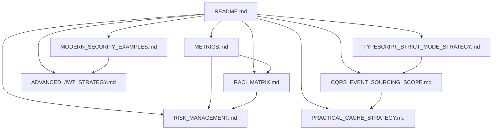
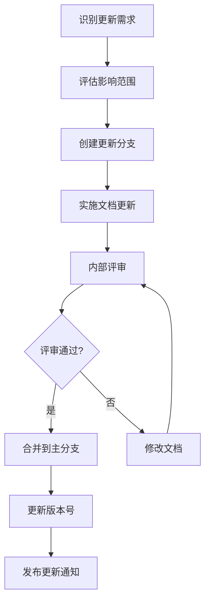

# 📚 后端系统改进文档索引

> **统一文档索引与权威来源管理** - 建立清晰的文档结构，避免内容分散与版本漂移  
> **更新时间**: 2025-10-02  
> **文档版本**: v1.0.0

---

## 🎯 文档体系概述

### 文档结构
```
backend/docs/improvement/
├── README.md                           # 文档索引 (本文件)
├── METRICS.md                          # 统一基线数据管理
├── RACI_MATRIX.md                      # 责任矩阵与优先级体系
├── RISK_MANAGEMENT.md                  # 风险管理与回滚策略
├── MODERN_SECURITY_EXAMPLES.md         # 现代化安全实现示例
├── ADVANCED_JWT_STRATEGY.md            # 高级JWT策略实现
├── TYPESCRIPT_STRICT_MODE_STRATEGY.md  # TypeScript严格模式渐进策略
├── CQRS_EVENT_SOURCING_SCOPE.md       # CQRS/Event Sourcing实施范围优化
└── PRACTICAL_CACHE_STRATEGY.md         # 现实可行的两级缓存策略
```

### 文档关系图


---

## 📋 文档详细说明

### 📊 METRICS.md - 统一基线数据管理
**描述**: 提供所有改进计划的权威基线数据源，包含当前状态和目标值

**主要内容**:
- 代码质量指标基线
- 测试覆盖率基线
- 性能指标基线
- 安全指标基线
- 运维指标基线

**使用场景**:
- 所有改进计划引用基线数据
- 跟踪改进进度
- 评估改进效果

**更新频率**: 每月评估更新

---

### 📋 RACI_MATRIX.md - 责任矩阵与优先级体系
**描述**: 整合主计划与执行清单的分工信息，明确责任分配和优先级

**主要内容**:
- 优先级体系定义 (P0-P3)
- RACI角色定义
- 统一责任矩阵
- 优先级动态调整机制
- 责任人绩效关联

**使用场景**:
- 任务分配和执行
- 优先级调整
- 团队协作管理

**更新频率**: 每周评估更新

---

### 🛡️ RISK_MANAGEMENT.md - 风险管理与回滚策略
**描述**: 全面的风险识别、评估、缓解和回滚机制，确保改进过程安全可控

**主要内容**:
- 变更冻结窗口
- 回滚策略 (数据库/应用/配置)
- 风险识别与评估
- 风险缓解路径
- 应急响应流程

**使用场景**:
- 改进过程风险管理
- 变更审批和执行
- 故障应急响应

**更新频率**: 每周评估更新

---

### 🔒 MODERN_SECURITY_EXAMPLES.md - 现代化安全实现示例
**描述**: 更新安全示例为现代化实现，替换不安全的加密API，采用最新安全实践

**主要内容**:
- AES-GCM现代化加密实现
- Argon2id密码哈希安全增强
- 输入验证和SQL注入防护
- API安全防护
- 密钥管理最佳实践

**使用场景**:
- 安全功能实现参考
- 安全代码审查
- 安全培训材料

**更新频率**: 每月评估更新

---

### 🔐 ADVANCED_JWT_STRATEGY.md - 高级JWT策略实现
**描述**: 改进JWT策略为RS256非对称加密，提升安全性，支持密钥轮换与跨服务认证

**主要内容**:
- RS256非对称加密实现
- 高级JWT服务实现
- JWT安全中间件
- 密钥轮换机制
- JWT监控与分析

**使用场景**:
- 认证授权系统实现
- 跨服务认证
- 安全令牌管理

**更新频率**: 每月评估更新

---

### 📝 TYPESCRIPT_STRICT_MODE_STRATEGY.md - TypeScript严格模式渐进策略
**描述**: 制定TypeScript严格模式渐进策略，避免全量严格模式引入大量重构

**主要内容**:
- 三阶段实施计划
- 严格模式工具链
- 严格模式实施监控
- 错误趋势分析
- 团队协作建议

**使用场景**:
- TypeScript代码质量提升
- 类型安全增强
- 代码重构规划

**更新频率**: 每周评估更新

---

### 🎯 CQRS_EVENT_SOURCING_SCOPE.md - CQRS/Event Sourcing实施范围优化
**描述**: 优化CQRS/Event Sourcing实施范围，先在订单领域试点，设退出标准与收益评估

**主要内容**:
- 订单领域试点实施
- 试点评估标准
- 扩展决策流程
- 技术指标评估
- 业务价值评估

**使用场景**:
- CQRS/Event Sourcing架构实施
- 架构决策支持
- 技术试点管理

**更新频率**: 每月评估更新

---

### ⚡ PRACTICAL_CACHE_STRATEGY.md - 现实可行的两级缓存策略
**描述**: 简化缓存策略为现实可行的两级缓存，明确失效/预热/一致性策略

**主要内容**:
- 两级缓存架构设计
- 缓存一致性策略
- 缓存预热策略
- 缓存监控与分析
- 缓存使用原则

**使用场景**:
- 缓存系统实现
- 性能优化
- 缓存策略制定

**更新频率**: 每月评估更新

---

## 🔄 文档维护流程

### 文档更新流程


### 版本管理策略
- **主版本**: 重大架构变更或文档结构重组
- **次版本**: 新增文档或重要内容更新
- **修订版本**: 内容修正或格式调整

### 文档审查机制
- **技术审查**: 由技术负责人或架构师审查技术内容
- **内容审查**: 由相关领域专家审查内容准确性
- **格式审查**: 由文档工程师审查格式和结构

---

## 📊 文档使用指南

### 如何引用文档
```markdown
<!-- 在其他文档中引用基线数据 -->
根据 [METRICS.md](./METRICS.md) 的基线数据：
- 当前测试覆盖率为 **21.39%**
- 目标提升到 **90%**

<!-- 引用责任矩阵 -->
根据 [RACI_MATRIX.md](./RACI_MATRIX.md) 的责任分配：
- 测试覆盖率提升由测试工程师负责
- 技术负责人负最终审批责任

<!-- 引用风险管理 -->
根据 [RISK_MANAGEMENT.md](./RISK_MANAGEMENT.md) 的变更冻结窗口：
- 每月28日-次月5日为变更冻结期
```

### 文档贡献指南
1. **识别需求**: 确定需要更新或新增的文档内容
2. **创建分支**: 从主分支创建功能分支
3. **实施更新**: 按照文档模板和格式要求实施更新
4. **提交审查**: 创建Pull Request并提交审查
5. **响应反馈**: 根据审查意见修改文档
6. **合并发布**: 审查通过后合并到主分支并发布

### 文档访问权限
- **读取权限**: 所有团队成员
- **编辑权限**: 文档维护团队和相关领域专家
- **发布权限**: 技术负责人和文档工程师

---

## 📞 联系信息

### 文档维护团队
- **文档负责人**: 文档体系整体规划和维护
- **技术文档工程师**: 技术文档编写和维护
- **内容审查员**: 文档内容准确性审查
- **格式审查员**: 文档格式和结构审查

### 文档支持
- **文档问题**: 联系文档负责人
- **内容问题**: 联系相关领域专家
- **格式问题**: 联系格式审查员
- **访问问题**: 联系文档工程师

### 反馈渠道
- **GitHub Issues**: 创建文档相关Issue
- **团队会议**: 在团队会议上讨论文档问题
- **邮件反馈**: 发送邮件到文档维护团队
- **即时通讯**: 通过团队即时通讯工具反馈

---

## 📈 文档质量指标

### 质量目标
- **完整性**: 覆盖所有改进计划的关键方面
- **准确性**: 内容准确反映技术实现和业务需求
- **一致性**: 文档间内容一致，无冲突
- **可用性**: 文档易于理解和使用
- **时效性**: 内容及时更新，反映最新状态

### 质量评估
- **月度评估**: 每月评估文档质量和使用情况
- **用户反馈**: 收集用户反馈并持续改进
- **质量指标**: 跟踪文档质量相关指标
- **改进计划**: 基于评估结果制定改进计划

---

**版本**: v1.0.0  
**创建时间**: 2025-10-02  
**下次评估**: 2025-11-02  
**维护周期**: 每月评估更新

---

## 📝 更新日志

| 版本 | 日期 | 更新内容 | 更新人 |
|------|------|----------|--------|
| v1.0.0 | 2025-10-02 | 创建文档索引和权威来源管理 | AI Assistant |
| | | | |
| | | | |