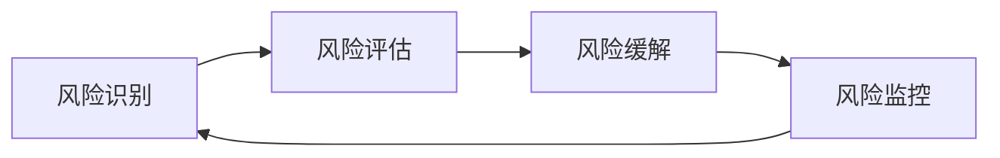
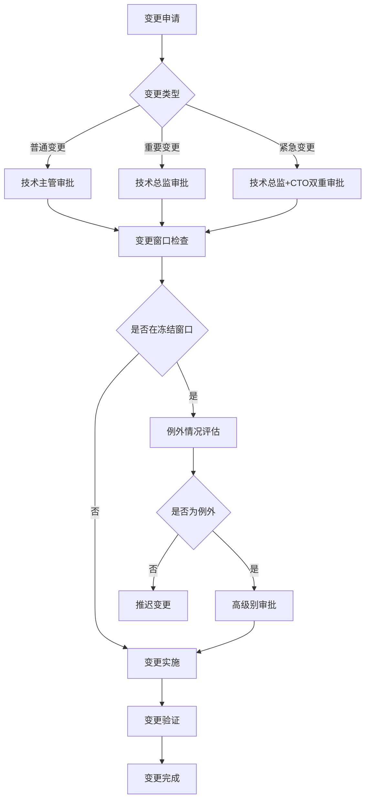
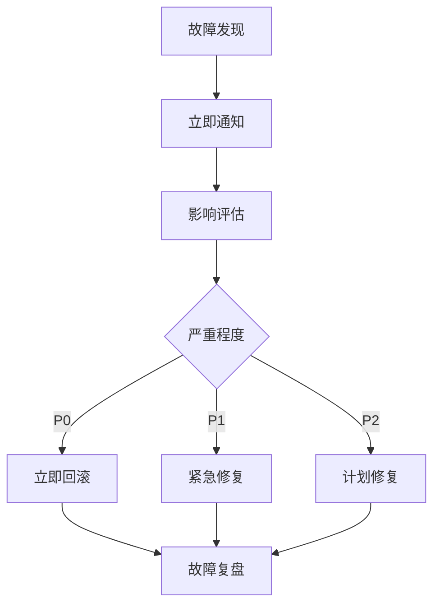

# 🛡️ 风险管理与回滚策略

> **全面的风险识别、评估、缓解和回滚机制** - 确保改进过程安全可控
> **更新时间**: 2025-10-02
> **适用范围**: 所有系统改进项目和变更

## 📋 目录

- [🚀 快速入门](#-快速入门)
- [🚨 变更冻结窗口](#-变更冻结窗口)
- [🔄 回滚策略](#-回滚策略)
- [📋 风险识别与评估](#-风险识别与评估)
- [🎯 实施风险评估](#-实施风险评估)
- [📊 性能基准对比](#-性能基准对比)
- [🔄 分阶段回滚策略](#-分阶段回滚策略)
- [👥 团队培训计划](#-团队培训计划)
- [🛡️ 风险缓解路径](#-风险缓解路径)
- [📊 风险监控与报告](#-风险监控与报告)
- [🚨 应急响应流程](#-应急响应流程)
- [📝 使用说明](#-使用说明)
- [📞 联系信息](#-联系信息)

---

## 🚀 快速入门

### 🎯 5分钟快速了解风险管理

如果您是第一次接触风险管理，请按以下步骤快速上手：

#### 步骤1：了解基本概念


#### 步骤2：快速风险评估
使用以下简单表格评估您的项目风险：

| 风险类型 | 影响程度 | 发生概率 | 风险等级 | 应对措施 |
|----------|----------|----------|----------|----------|
| 技术风险 | 高/中/低 | 高/中/低 | 🔴高/🟡中/🟢低 | 具体措施 |
| 业务风险 | 高/中/低 | 高/中/低 | 🔴高/🟡中/🟢低 | 具体措施 |
| 运维风险 | 高/中/低 | 高/中/低 | 🔴高/🟡中/🟢低 | 具体措施 |

#### 步骤3：制定基本回滚计划
1. **备份策略**：确保有完整的数据备份
2. **回滚点**：在每个重要变更前创建回滚点
3. **验证机制**：回滚后验证系统正常运行
4. **通知流程**：建立回滚通知机制

#### 步骤4：应急响应准备
- 📞 **紧急联系人**：技术负责人 运维负责人
- ⏰ **响应时间**：P0故障 < 5分钟，P1故障 < 15分钟
- 🔄 **回滚决策**：影响用户 > 100人或损失 > 10万/小时立即回滚

### 🎯 新手常见问题

**Q: 什么时候需要风险管理？**
A: 任何可能影响系统稳定性、数据安全或业务连续性的变更都需要风险管理。

**Q: 风险管理需要多长时间？**
A: 简单风险评估需要30分钟，完整风险管理流程需要2-4小时。

**Q: 如何判断是否需要回滚？**
A: 当系统出现严重故障、性能大幅下降或数据异常时，应立即考虑回滚。

**Q: 风险管理的主要工具有哪些？**
A: 监控系统、日志分析工具、备份恢复工具、告警通知系统。

---

## 🚨 变更冻结窗口

### 冻结时间表
```markdown
## 📅 变更冻结时间表

### 大促期间冻结
- **时间范围**: 每月28日 00:00 - 次月5日 23:59 (北京时间)
- **适用范围**: 所有非紧急的生产环境变更
- **例外情况**: 
  - 安全漏洞修复（需技术总监+CTO双重审批）
  - 线上故障修复（需技术总监审批）
  - 紧急业务需求（需产品总监+技术总监双重审批）

### 法定节假日冻结
- **时间范围**: 法定节假日前3天 - 节假日结束后1天
- **适用范围**: 所有生产环境变更
- **例外情况**: 仅限安全漏洞修复和线上故障修复

### 重要活动期间冻结
- **时间范围**: 重要营销活动前7天 - 活动结束后3天
- **适用范围**: 所有可能影响用户体验的变更
- **例外情况**: 仅限影响活动进行的故障修复
```

### 变更审批流程


---

## 🔄 回滚策略

### 数据库变更回滚

#### 备份策略
```sql
-- 1. 全量备份策略（每日）
-- 备份脚本示例
CREATE DATABASE backup_${DATE}_full;
CREATE TABLE backup_${DATE}_full.backup_log (
    id INT AUTO_INCREMENT PRIMARY KEY,
    backup_type VARCHAR(20),
    backup_time DATETIME,
    backup_size BIGINT,
    status VARCHAR(20),
    checksum VARCHAR(64)
);

-- 2. 增量备份策略（每小时）
-- 使用binlog进行增量备份
mysqlbinlog --read-from-remote-server --host=${DB_HOST} \
    --raw --stop-never binlog.000001 > /backup/binlog/binlog.${DATE}

-- 3. 实时备份策略（重要表）
-- 使用CDC工具进行实时数据同步
debezium-connector-mysql --config mysql-connector.properties \
    --name mysql-connector --database-server-id=184054
```

#### 回滚脚本模板
```sql
-- 表结构变更回滚脚本
-- 添加新字段的回滚方案
-- rollback-001-add-user-avatar.sql
ALTER TABLE users DROP COLUMN avatar_url;
DROP INDEX idx_users_avatar_url;

-- 表名变更回滚方案
RENAME TABLE old_table TO old_table_backup, new_table TO old_table;
-- 回滚脚本
RENAME TABLE old_table TO new_table, old_table_backup TO old_table;

-- 数据迁移回滚方案
-- 迁移前备份
CREATE TABLE users_backup_${TIMESTAMP} AS SELECT * FROM users;
-- 迁移脚本
UPDATE users SET email = LOWER(email) WHERE email IS NOT NULL;
-- 回滚脚本
TRUNCATE TABLE users;
INSERT INTO users SELECT * FROM users_backup_${TIMESTAMP};
DROP TABLE users_backup_${TIMESTAMP};
```

#### 数据一致性验证
```typescript
@Injectable()
export class DataConsistencyService {
  constructor(
    private readonly dataSource: DataSource,
    private readonly logger: Logger
  ) {}

  async verifyDataConsistency(
    beforeSnapshot: any,
    afterSnapshot: any
  ): Promise<{ isValid: boolean; differences: any[] }> {
    const differences = [];
    
    // 验证表结构一致性
    const structureDiff = await this.compareTableStructure(
      beforeSnapshot.structure,
      afterSnapshot.structure
    );
    if (structureDiff.length > 0) {
      differences.push(...structureDiff);
    }

    // 验证数据行数一致性
    const countDiff = await this.compareRowCount(
      beforeSnapshot.rowCounts,
      afterSnapshot.rowCounts
    );
    if (countDiff.length > 0) {
      differences.push(...countDiff);
    }

    // 验证关键数据一致性
    const dataDiff = await this.compareKeyData(
      beforeSnapshot.keyData,
      afterSnapshot.keyData
    );
    if (dataDiff.length > 0) {
      differences.push(...dataDiff);
    }

    return {
      isValid: differences.length === 0,
      differences
    };
  }

  private async compareTableStructure(before: any, after: any): Promise<any[]> {
    // 实现表结构比较逻辑
    return [];
  }

  private async compareRowCount(before: any, after: any): Promise<any[]> {
    // 实现行数比较逻辑
    return [];
  }

  private async compareKeyData(before: any, after: any): Promise<any[]> {
    // 实现关键数据比较逻辑
    return [];
  }
}
```

### 应用部署回滚

#### 蓝绿部署策略
```yaml
# Kubernetes蓝绿部署配置
apiVersion: argoproj.io/v1alpha1
kind: Rollout
metadata:
  name: backend-rollout
spec:
  replicas: 3
  selector:
    matchLabels:
      app: backend
  template:
    metadata:
      labels:
        app: backend
    spec:
      containers:
      - name: backend
        image: caddy-shopping/backend:latest
        ports:
        - containerPort: 3000
  strategy:
    blueGreen:
      activeService: backend-service
      previewService: backend-preview-service
      autoPromotionEnabled: false
      prePromotionAnalysis:
        templates:
        - templateName: success-rate
        args:
        - name: service-name
          value: backend-preview-service
```

#### 快速回滚流程
```typescript
@Injectable()
export class DeploymentRollbackService {
  constructor(
    private readonly k8sService: KubernetesService,
    private readonly notificationService: NotificationService,
    private readonly monitoringService: MonitoringService
  ) {}

  async rollbackDeployment(
    namespace: string,
    deploymentName: string,
    targetVersion: string
  ): Promise<boolean> {
    try {
      // 1. 记录回滚事件
      await this.monitoringService.recordEvent('rollback_initiated', {
        namespace,
        deploymentName,
        targetVersion,
        timestamp: new Date().toISOString()
      });

      // 2. 执行回滚
      const rollbackResult = await this.k8sService.rollbackDeployment(
        namespace,
        deploymentName,
        targetVersion
      );

      // 3. 验证回滚结果
      const isHealthy = await this.verifyDeploymentHealth(
        namespace,
        deploymentName
      );

      if (!isHealthy) {
        throw new Error('Deployment health check failed after rollback');
      }

      // 4. 发送通知
      await this.notificationService.sendAlert({
        title: '部署回滚成功',
        message: `Deployment ${deploymentName} in namespace ${namespace} has been rolled back to version ${targetVersion}`,
        severity: 'high'
      });

      // 5. 记录成功事件
      await this.monitoringService.recordEvent('rollback_completed', {
        namespace,
        deploymentName,
        targetVersion,
        success: true,
        timestamp: new Date().toISOString()
      });

      return true;
    } catch (error) {
      // 记录失败事件
      await this.monitoringService.recordEvent('rollback_failed', {
        namespace,
        deploymentName,
        targetVersion,
        error: error.message,
        timestamp: new Date().toISOString()
      });

      // 发送失败通知
      await this.notificationService.sendAlert({
        title: '部署回滚失败',
        message: `Failed to rollback deployment ${deploymentName}: ${error.message}`,
        severity: 'critical'
      });

      return false;
    }
  }

  private async verifyDeploymentHealth(
    namespace: string,
    deploymentName: string
  ): Promise<boolean> {
    // 实现部署健康检查逻辑
    return true;
  }
}
```

#### 自动化回滚触发条件
```typescript
@Injectable()
export class AutoRollbackService {
  constructor(
    private readonly rollbackService: DeploymentRollbackService,
    private readonly metricsService: MetricsService,
    private readonly configService: ConfigService
  ) {}

  async checkAutoRollbackConditions(): Promise<void> {
    const conditions = await this.configService.get('autoRollback.conditions');
    
    for (const condition of conditions) {
      const shouldRollback = await this.evaluateCondition(condition);
      
      if (shouldRollback) {
        await this.executeAutoRollback(condition);
      }
    }
  }

  private async evaluateCondition(condition: any): Promise<boolean> {
    switch (condition.type) {
      case 'error_rate':
        return await this.checkErrorRate(condition);
      case 'response_time':
        return await this.checkResponseTime(condition);
      case 'availability':
        return await this.checkAvailability(condition);
      default:
        return false;
    }
  }

  private async checkErrorRate(condition: any): Promise<boolean> {
    const errorRate = await this.metricsService.getErrorRate(
      condition.service,
      condition.duration
    );
    
    return errorRate > condition.threshold;
  }

  private async checkResponseTime(condition: any): Promise<boolean> {
    const responseTime = await this.metricsService.getResponseTime(
      condition.service,
      condition.duration
    );
    
    return responseTime > condition.threshold;
  }

  private async checkAvailability(condition: any): Promise<boolean> {
    const availability = await this.metricsService.getAvailability(
      condition.service,
      condition.duration
    );
    
    return availability < condition.threshold;
  }

  private async executeAutoRollback(condition: any): Promise<void> {
    const success = await this.rollbackService.rollbackDeployment(
      condition.namespace,
      condition.deployment,
      condition.targetVersion
    );

    if (success) {
      // 记录自动回滚事件
      await this.metricsService.recordEvent('auto_rollback_executed', {
        condition: condition.type,
        service: condition.service,
        timestamp: new Date().toISOString()
      });
    }
  }
}
```

---

## 📋 风险识别与评估

### 技术风险
| 风险类别 | 风险描述 | 影响程度 | 发生概率 | 风险等级 | 缓解措施 | 负责人 |
|----------|----------|----------|----------|----------|----------|--------|
| **新技术引入风险** | CQRS/Event Sourcing等新技术学习成本高 | 高 | 中 | 🔴 高 | 分阶段实施，加强培训，建立技术文档 | 架构师 |
| **架构复杂性风险** | 微服务拆分导致系统复杂度增加 | 高 | 中 | 🔴 高 | 先试点后推广，建立服务治理体系 | 架构师 |
| **性能退化风险** | 架构变更可能影响系统性能 | 高 | 中 | 🔴 高 | 建立性能基准，持续监控，设立性能门槛 | 性能工程师 |
| **兼容性风险** | TypeScript严格模式可能破坏现有代码 | 中 | 高 | 🟡 中 | 渐进式开启，建立自动化检查机制 | 后端开发 |

### 业务风险
| 风险类别 | 风险描述 | 影响程度 | 发生概率 | 风险等级 | 缓解措施 | 负责人 |
|----------|----------|----------|----------|----------|----------|--------|
| **服务中断风险** | 改进过程中可能影响业务连续性 | 极高 | 低 | 🟡 中 | 制定变更窗口，建立快速回滚机制 | 运维团队 |
| **数据丢失风险** | 数据库迁移可能造成数据丢失 | 极高 | 低 | 🟡 中 | 完整备份策略，数据校验机制 | DBA |
| **功能回归风险** | 代码重构可能引入新问题 | 高 | 中 | 🟡 中 | 完善测试覆盖，自动化回归测试 | 测试团队 |
| **用户体验风险** | 性能优化可能暂时影响用户体验 | 中 | 中 | 🟢 低 | 灰度发布，用户反馈收集机制 | 产品经理 |

### 运维风险
| 风险类别 | 风险描述 | 影响程度 | 发生概率 | 风险等级 | 缓解措施 | 负责人 |
|----------|----------|----------|----------|----------|----------|--------|
| **部署失败风险** | CI/CD流程变更可能导致部署失败 | 高 | 中 | 🟡 中 | 部署前验证，回滚预案 | DevOps |
| **监控盲区风险** | 架构变更可能产生监控盲区 | 中 | 中 | 🟢 低 | 监控覆盖度检查，告警测试 | 运维团队 |
| **资源不足风险** | 新架构可能需要更多资源 | 中 | 中 | 🟢 低 | 资源评估，弹性扩缩容 | 运维团队 |
| **配置错误风险** | 多环境配置管理复杂度增加 | 中 | 高 | 🟡 中 | 配置版本控制，自动化验证 | DevOps |


---

## 🎯 实施风险评估

### 风险管理实施风险

| 风险类别 | 风险描述 | 概率 | 影响 | 风险等级 | 缓解措施 |
|----------|----------|------|------|----------|----------|
| 流程复杂 | 风险管理流程过于复杂 | 中 | 中 | 🟡 中 | 简化流程 + 自动化 |
| 识别不全 | 风险识别不全面 | 高 | 高 | 🔴 高 | 多维度评估 + 专家评审 |
| 响应延迟 | 风险响应不及时 | 中 | 高 | 🔴 高 | 自动化告警 + 预案准备 |
| 资源不足 | 风险处理资源不足 | 中 | 中 | 🟡 中 | 资源预留 + 外部支持 |
| 工具缺陷 | 风险管理工具功能不足 | 中 | 中 | 🟡 中 | 工具评估 + 定制开发 |
| 团队技能 | 团队风险管理技能不足 | 中 | 中 | 🟡 中 | 培训 + 外部咨询 |
| 文化阻力 | 团队对风险管理文化抵触 | 低 | 高 | 🟡 中 | 文化建设 + 领导支持 |
| 数据质量 | 风险数据质量不高 | 中 | 中 | 🟡 中 | 数据校验 + 治理 |

### 风险管理成熟度评估

```typescript
@Injectable()
export class RiskManagementMaturityService {
  constructor(
    private readonly assessmentService: AssessmentService,
    private readonly improvementService: ImprovementService,
    private readonly logger: Logger
  ) {}

  async assessMaturityLevel(): Promise<MaturityAssessment> {
    // 1. 评估当前成熟度水平
    const currentLevel = await this.assessCurrentLevel();
    
    // 2. 识别改进机会
    const improvements = await this.identifyImprovementOpportunities(currentLevel);
    
    // 3. 制定改进计划
    const improvementPlan = await this.createImprovementPlan(improvements);
    
    return {
      currentLevel,
      targetLevel: this.determineTargetLevel(currentLevel),
      improvements,
      improvementPlan,
      assessmentDate: new Date(),
      nextAssessmentDate: this.calculateNextAssessmentDate(currentLevel)
    };
  }

  private async assessCurrentLevel(): Promise<MaturityLevel> {
    const dimensions = [
      'risk_identification',
      'risk_assessment',
      'risk_mitigation',
      'risk_monitoring',
      'risk_response',
      'risk_culture',
      'risk_tools',
      'risk_data'
    ];
    
    const dimensionScores = {};
    
    for (const dimension of dimensions) {
      dimensionScores[dimension] = await this.assessDimension(dimension);
    }
    
    const overallScore = Object.values(dimensionScores).reduce((sum, score) => sum + score, 0) / dimensions.length;
    
    return {
      overall: this.mapScoreToLevel(overallScore),
      dimensions: dimensionScores,
      overallScore,
      assessedAt: new Date()
    };
  }

  private async assessDimension(dimension: string): Promise<DimensionScore> {
    const questions = await this.assessmentService.getQuestionsForDimension(dimension);
    const answers = await this.assessmentService.getAnswersForDimension(dimension);
    
    let score = 0;
    let maxScore = 0;
    
    for (const question of questions) {
      const answer = answers.find(a => a.questionId === question.id);
      if (answer) {
        score += answer.score;
        maxScore += question.maxScore;
      }
    }
    
    const percentage = maxScore > 0 ? (score / maxScore) * 100 : 0;
    
    return {
      dimension,
      score: percentage,
      level: this.mapScoreToLevel(percentage),
      details: await this.getDimensionDetails(dimension, answers)
    };
  }

  private mapScoreToLevel(score: number): 'initial' | 'repeatable' | 'defined' | 'managed' | 'optimizing' {
    if (score < 20) return 'initial';
    if (score < 40) return 'repeatable';
    if (score < 60) return 'defined';
    if (score < 80) return 'managed';
    return 'optimizing';
  }

  private async identifyImprovementOpportunities(
    currentLevel: MaturityLevel
  ): Promise<ImprovementOpportunity[]> {
    const opportunities: ImprovementOpportunity[] = [];
    
    // 识别得分较低的维度
    for (const [dimension, score] of Object.entries(currentLevel.dimensions)) {
      if (score.score < 60) {
        opportunities.push({
          dimension,
          currentScore: score.score,
          targetScore: Math.min(80, score.score + 20),
          priority: score.score < 40 ? 'high' : 'medium',
          estimatedEffort: this.estimateEffort(dimension, score.score, 80),
          expectedBenefits: this.getExpectedBenefits(dimension, score.score, 80)
        });
      }
    }
    
    // 按优先级和效益排序
    return opportunities.sort((a, b) => {
      const priorityWeight = { high: 3, medium: 2, low: 1 };
      const aPriority = priorityWeight[a.priority];
      const bPriority = priorityWeight[b.priority];
      
      if (aPriority !== bPriority) {
        return bPriority - aPriority;
      }
      
      return b.expectedBenefits - a.expectedBenefits;
    });
  }

  private async createImprovementPlan(
    opportunities: ImprovementOpportunity[]
  ): Promise<ImprovementPlan> {
    const phases: ImprovementPhase[] = [];
    
    // 第一阶段：快速改进
    const quickWins = opportunities.filter(op => op.estimatedEffort <= 5);
    if (quickWins.length > 0) {
      phases.push({
        name: 'Quick Wins',
        duration: '2 weeks',
        objectives: 'Implement low-effort, high-impact improvements',
        activities: quickWins.map(op => ({
          dimension: op.dimension,
          description: `Improve ${op.dimension} from ${op.currentScore.toFixed(1)}% to ${op.targetScore.toFixed(1)}%`,
          effort: op.estimatedEffort,
          owner: this.assignOwner(op.dimension),
          deliverables: this.getDeliverables(op.dimension)
        })),
        successCriteria: quickWins.map(op => ({
          dimension: op.dimension,
          criteria: `${op.dimension} score reaches ${op.targetScore.toFixed(1)}%`
        }))
      });
    }
    
    // 第二阶段：核心改进
    const coreImprovements = opportunities.filter(op => op.estimatedEffort > 5 && op.estimatedEffort <= 15);
    if (coreImprovements.length > 0) {
      phases.push({
        name: 'Core Improvements',
        duration: '6 weeks',
        objectives: 'Implement medium-effort, high-impact improvements',
        activities: coreImprovements.map(op => ({
          dimension: op.dimension,
          description: `Improve ${op.dimension} from ${op.currentScore.toFixed(1)}% to ${op.targetScore.toFixed(1)}%`,
          effort: op.estimatedEffort,
          owner: this.assignOwner(op.dimension),
          deliverables: this.getDeliverables(op.dimension)
        })),
        successCriteria: coreImprovements.map(op => ({
          dimension: op.dimension,
          criteria: `${op.dimension} score reaches ${op.targetScore.toFixed(1)}%`
        }))
      });
    }
    
    // 第三阶段：战略改进
    const strategicImprovements = opportunities.filter(op => op.estimatedEffort > 15);
    if (strategicImprovements.length > 0) {
      phases.push({
        name: 'Strategic Improvements',
        duration: '12 weeks',
        objectives: 'Implement high-effort, strategic improvements',
        activities: strategicImprovements.map(op => ({
          dimension: op.dimension,
          description: `Improve ${op.dimension} from ${op.currentScore.toFixed(1)}% to ${op.targetScore.toFixed(1)}%`,
          effort: op.estimatedEffort,
          owner: this.assignOwner(op.dimension),
          deliverables: this.getDeliverables(op.dimension)
        })),
        successCriteria: strategicImprovements.map(op => ({
          dimension: op.dimension,
          criteria: `${op.dimension} score reaches ${op.targetScore.toFixed(1)}%`
        }))
      });
    }
    
    return {
      phases,
      totalDuration: phases.reduce((sum, phase) => sum + parseInt(phase.duration), 0),
      estimatedCost: phases.reduce((sum, phase) => 
        sum + phase.activities.reduce((phaseSum, activity) => phaseSum + activity.effort * 1000, 0), 0
      ),
      expectedBenefits: opportunities.reduce((sum, op) => sum + op.expectedBenefits, 0),
      risks: this.identifyPlanRisks(phases),
      dependencies: this.identifyPlanDependencies(phases)
    };
  }

  private determineTargetLevel(currentLevel: MaturityLevel): 'initial' | 'repeatable' | 'defined' | 'managed' | 'optimizing' {
    const levelOrder = ['initial', 'repeatable', 'defined', 'managed', 'optimizing'];
    const currentIndex = levelOrder.indexOf(currentLevel.overall);
    
    // 目标是提升一个级别，但不超过'managed'
    return levelOrder[Math.min(currentIndex + 1, 3)];
  }

  private calculateNextAssessmentDate(currentLevel: MaturityLevel): Date {
    const now = new Date();
    const levelOrder = ['initial', 'repeatable', 'defined', 'managed', 'optimizing'];
    const currentIndex = levelOrder.indexOf(currentLevel.overall);
    
    // 成熟度越低，评估频率越高
    const assessmentIntervalMonths = Math.max(1, 6 - currentIndex);
    
    return new Date(now.getFullYear(), now.getMonth() + assessmentIntervalMonths, now.getDate());
  }

  // 辅助方法实现...
  private async getDimensionDetails(dimension: string, answers: any[]): Promise<any> {
    // 实现获取维度详情的逻辑
    return {};
  }

  private estimateEffort(dimension: string, currentScore: number, targetScore: number): number {
    // 估算改进工作量（人天）
    const scoreGap = targetScore - currentScore;
    const baseEffort = {
      'risk_identification': 10,
      'risk_assessment': 8,
      'risk_mitigation': 12,
      'risk_monitoring': 6,
      'risk_response': 8,
      'risk_culture': 15,
      'risk_tools': 10,
      'risk_data': 8
    };
    
    return Math.ceil(baseEffort[dimension] * (scoreGap / 20));
  }

  private getExpectedBenefits(dimension: string, currentScore: number, targetScore: number): number {
    // 估算预期效益（相对值）
    const scoreGap = targetScore - currentScore;
    const baseBenefit = {
      'risk_identification': 20,
      'risk_assessment': 15,
      'risk_mitigation': 25,
      'risk_monitoring': 10,
      'risk_response': 15,
      'risk_culture': 30,
      'risk_tools': 15,
      'risk_data': 12
    };
    
    return Math.ceil(baseBenefit[dimension] * (scoreGap / 20));
  }

  private assignOwner(dimension: string): string {
    // 分配改进负责人
    const owners = {
      'risk_identification': '风险分析师',
      'risk_assessment': '风险评估师',
      'risk_mitigation': '风险缓解专家',
      'risk_monitoring': '运维团队',
      'risk_response': '应急响应团队',
      'risk_culture': '人力资源部',
      'risk_tools': '技术团队',
      'risk_data': '数据团队'
    };
    
    return owners[dimension] || '待定';
  }

  private getDeliverables(dimension: string): string[] {
    // 获取交付物清单
    const deliverables = {
      'risk_identification': ['风险识别流程文档', '风险分类清单', '风险识别工具'],
      'risk_assessment': ['风险评估方法文档', '风险评估模板', '风险评估工具'],
      'risk_mitigation': ['风险缓解策略文档', '风险缓解计划模板', '风险缓解案例库'],
      'risk_monitoring': ['风险监控仪表板', '风险告警规则', '风险监控流程'],
      'risk_response': ['应急响应流程文档', '应急预案模板', '应急演练计划'],
      'risk_culture': ['风险管理文化手册', '风险管理培训材料', '风险管理激励机制'],
      'risk_tools': ['风险管理工具需求文档', '风险管理工具配置指南', '风险管理工具用户手册'],
      'risk_data': ['风险数据标准', '风险数据质量报告', '风险数据分析模板']
    };
    
    return deliverables[dimension] || [];
  }

  private identifyPlanRisks(phases: ImprovementPhase[]): string[] {
    // 识别改进计划风险
    return [
      '资源不足导致改进计划延期',
      '团队抵触导致改进措施难以落地',
      '工具交付延迟影响整体进度',
      '管理层支持不足导致改进失败'
    ];
  }

  private identifyPlanDependencies(phases: ImprovementPhase[]): string[] {
    // 识别改进计划依赖关系
    return [
      '风险识别流程依赖于风险评估方法',
      '风险监控工具依赖于风险数据标准',
      '风险文化依赖于管理层支持和培训',
      '所有改进依赖于预算批准'
    ];
  }
}

interface MaturityLevel {
  overall: 'initial' | 'repeatable' | 'defined' | 'managed' | 'optimizing';
  dimensions: Record<string, DimensionScore>;
  overallScore: number;
  assessedAt: Date;
}

interface DimensionScore {
  dimension: string;
  score: number;
  level: 'initial' | 'repeatable' | 'defined' | 'managed' | 'optimizing';
  details: any;
}

interface ImprovementOpportunity {
  dimension: string;
  currentScore: number;
  targetScore: number;
  priority: 'high' | 'medium' | 'low';
  estimatedEffort: number; // 人天
  expectedBenefits: number; // 相对值
}

interface ImprovementPhase {
  name: string;
  duration: string;
  objectives: string;
  activities: {
    dimension: string;
    description: string;
    effort: number;
    owner: string;
    deliverables: string[];
  }[];
  successCriteria: {
    dimension: string;
    criteria: string;
  }[];
}

interface ImprovementPlan {
  phases: ImprovementPhase[];
  totalDuration: number;
  estimatedCost: number;
  expectedBenefits: number;
  risks: string[];
  dependencies: string[];
}

interface MaturityAssessment {
  currentLevel: MaturityLevel;
  targetLevel: 'initial' | 'repeatable' | 'defined' | 'managed' | 'optimizing';
  improvements: ImprovementOpportunity[];
  improvementPlan: ImprovementPlan;
  assessmentDate: Date;
  nextAssessmentDate: Date;
}
```

### 风险管理实施路径

```typescript
@Injectable()
export class RiskManagementImplementationService {
  constructor(
    private readonly maturityService: RiskManagementMaturityService,
    private readonly roadmapService: RoadmapService,
    private readonly governanceService: GovernanceService,
    private readonly logger: Logger
  ) {}

  async createImplementationRoadmap(): Promise<ImplementationRoadmap> {
    // 1. 评估当前成熟度
    const maturityAssessment = await this.maturityService.assessMaturityLevel();
    
    // 2. 确定实施路径
    const implementationPath = this.determineImplementationPath(maturityAssessment);
    
    // 3. 制定详细路线图
    const roadmap = await this.createDetailedRoadmap(implementationPath);
    
    // 4. 建立治理机制
    const governance = await this.establishGovernance(roadmap);
    
    return {
      maturityAssessment,
      implementationPath,
      roadmap,
      governance,
      createdAt: new Date()
    };
  }

  private determineImplementationPath(
    assessment: MaturityAssessment
  ): ImplementationPath {
    const currentLevel = assessment.currentLevel.overall;
    const targetLevel = assessment.targetLevel;
    
    switch (currentLevel) {
      case 'initial':
        return this.getInitialLevelPath(assessment);
      case 'repeatable':
        return this.getRepeatableLevelPath(assessment);
      case 'defined':
        return this.getDefinedLevelPath(assessment);
      case 'managed':
        return this.getManagedLevelPath(assessment);
      case 'optimizing':
        return this.getOptimizingLevelPath(assessment);
      default:
        throw new Error(`未知的成熟度级别: ${currentLevel}`);
    }
  }

  private getInitialLevelPath(assessment: MaturityAssessment): ImplementationPath {
    return {
      name: '基础建设路径',
      description: '建立基本的风险管理框架和流程',
      phases: [
        {
          name: '意识建立',
          duration: '4 weeks',
          objectives: '建立风险意识，获得管理层支持',
          keyActivities: [
            '风险管理意识培训',
            '管理层沟通和获得支持',
            '成立风险管理小组',
            '制定风险管理章程'
          ],
          deliverables: [
            '风险管理培训材料',
            '管理层支持文件',
            '风险管理小组章程',
            '风险管理章程文档'
          ],
          successCriteria: [
            '80%的团队成员完成风险管理培训',
            '管理层正式批准风险管理章程',
            '风险管理小组正式成立并开始工作'
          ]
        },
        {
          name: '基础框架',
          duration: '6 weeks',
          objectives: '建立基本的风险识别、评估和响应流程',
          keyActivities: [
            '设计风险识别流程',
            '创建风险评估模板',
            '制定基本风险响应流程',
            '建立风险登记册'
          ],
          deliverables: [
            '风险识别流程文档',
            '风险评估模板',

---

## 📊 性能基准对比

### 风险管理效率指标

| 指标类别 | 当前值 | 目标值 | 测量方法 | 数据来源 |
|----------|--------|--------|----------|----------|
| 风险识别率 | 70% | 95% | 风险评估报告 | 风险管理系统 |
| 风险响应时间 | 24小时 | <4小时 | 事件记录 | 事件管理系统 |
| 风险缓解成功率 | 65% | 90% | 缓解效果评估 | 风险管理系统 |
| 风险监控覆盖率 | 60% | 95% | 监控范围评估 | 监控系统 |

### 预期风险管理提升

| 改进项 | 预期提升 | 验证方法 | 时间点 |
|--------|----------|----------|--------|
| 风险识别能力 | +25% 识别率 | 风险评估对比 | 实施后1月 |
| 风险响应速度 | +80% 响应速度 | 响应时间分析 | 实施后2周 |
| 风险缓解效果 | +35% 缓解成功率 | 缓解效果评估 | 实施后1月 |
| 风险监控能力 | +60% 监控覆盖率 | 监控范围分析 | 实施后2周 |

### 风险管理性能监控

```typescript
@Injectable()
export class RiskManagementPerformanceMonitoringService {
  constructor(
    private readonly metricsService: MetricsService,
    private readonly alertService: AlertService,
    private readonly logger: Logger
  ) {}

  async getRiskManagementPerformanceDashboard(): Promise<RiskManagementPerformanceDashboard> {
    const [currentMetrics, historicalMetrics, benchmarks] = await Promise.all([
      this.getCurrentRiskManagementMetrics(),
      this.getHistoricalRiskManagementMetrics(),
      this.getRiskManagementBenchmarks()
    ]);

    return {
      current: currentMetrics,
      historical: historicalMetrics,
      benchmarks: benchmarks,
      trends: this.calculateRiskManagementTrends(historicalMetrics),
      alerts: await this.getRiskManagementPerformanceAlerts(),
      recommendations: this.generateRiskManagementRecommendations(currentMetrics, benchmarks)
    };
  }

  private async getCurrentRiskManagementMetrics(): Promise<RiskManagementMetrics> {
    return {
      riskIdentificationRate: await this.calculateRiskIdentificationRate(),
      riskResponseTime: await this.calculateRiskResponseTime(),
      riskMitigationSuccessRate: await this.calculateRiskMitigationSuccessRate(),
      riskMonitoringCoverage: await this.calculateRiskMonitoringCoverage(),
      riskAssessmentAccuracy: await this.calculateRiskAssessmentAccuracy(),
      riskCommunicationEffectiveness: await this.calculateRiskCommunicationEffectiveness()
    };
  }

  private async calculateRiskIdentificationRate(): Promise<number> {
    // 计算风险识别率
    const totalRisks = await this.metricsService.getTotalRisks();
    const identifiedRisks = await this.metricsService.getIdentifiedRisks();
    
    return totalRisks > 0 ? (identifiedRisks / totalRisks) * 100 : 0;
  }

  private async calculateRiskResponseTime(): Promise<number> {
    // 计算风险响应时间（小时）
    const riskEvents = await this.metricsService.getRiskEvents();
    
    if (riskEvents.length === 0) return 0;
    
    const totalResponseTime = riskEvents.reduce((sum, event) => {
      const responseTime = event.responseAt.getTime() - event.detectedAt.getTime();
      return sum + responseTime;
    }, 0);
    
    return totalResponseTime / riskEvents.length / (60 * 60 * 1000); // 转换为小时
  }

  private async calculateRiskMitigationSuccessRate(): Promise<number> {
    // 计算风险缓解成功率
    const mitigationActions = await this.metricsService.getMitigationActions();
    
    if (mitigationActions.length === 0) return 0;
    
    const successfulActions = mitigationActions.filter(action => 
      action.status === 'successful'
    ).length;
    
    return (successfulActions / mitigationActions.length) * 100;
  }

  private async calculateRiskMonitoringCoverage(): Promise<number> {
    // 计算风险监控覆盖率
    const totalRiskAreas = await this.metricsService.getTotalRiskAreas();
    const monitoredRiskAreas = await this.metricsService.getMonitoredRiskAreas();
    
    return totalRiskAreas > 0 ? (monitoredRiskAreas / totalRiskAreas) * 100 : 0;
  }

  private async calculateRiskAssessmentAccuracy(): Promise<number> {
    // 计算风险评估准确率
    const riskAssessments = await this.metricsService.getRiskAssessments();
    
    if (riskAssessments.length === 0) return 0;
    
    const accurateAssessments = riskAssessments.filter(assessment => 
      assessment.actualImpact <= assessment.estimatedImpact * 1.2 &&
      assessment.actualImpact >= assessment.estimatedImpact * 0.8
    ).length;
    
    return (accurateAssessments / riskAssessments.length) * 100;
  }

  private async calculateRiskCommunicationEffectiveness(): Promise<number> {
    // 计算风险沟通效果
    const riskCommunications = await this.metricsService.getRiskCommunications();
    
    if (riskCommunications.length === 0) return 0;
    
    const effectiveCommunications = riskCommunications.filter(comm => 
      comm.feedbackScore >= 4 // 5分制
    ).length;
    
    return (effectiveCommunications / riskCommunications.length) * 100;
  }

  private async getHistoricalRiskManagementMetrics(days: number = 30): Promise<HistoricalRiskManagementMetrics[]> {
    const endTime = new Date();
    const startTime = new Date(endTime.getTime() - days * 24 * 60 * 60 * 1000);
    
    return await this.metricsService.getRiskManagementMetricsInRange(startTime, endTime);
  }

  private async getRiskManagementBenchmarks(): Promise<RiskManagementBenchmarks> {
    return {
      riskIdentificationRate: {
        current: await this.calculateRiskIdentificationRate(),
        target: 95,
        industry: 85
      },
      riskResponseTime: {
        current: await this.calculateRiskResponseTime(),
        target: 4,
        industry: 8
      },
      riskMitigationSuccessRate: {
        current: await this.calculateRiskMitigationSuccessRate(),
        target: 90,
        industry: 75
      },
      riskMonitoringCoverage: {
        current: await this.calculateRiskMonitoringCoverage(),
        target: 95,
        industry: 80
      },
      riskAssessmentAccuracy: {
        current: await this.calculateRiskAssessmentAccuracy(),
        target: 85,
        industry: 70
      },
      riskCommunicationEffectiveness: {
        current: await this.calculateRiskCommunicationEffectiveness(),
        target: 90,
        industry: 75
      }
    };
  }

  private calculateRiskManagementTrends(historicalMetrics: HistoricalRiskManagementMetrics[]): RiskManagementTrends {
    if (historicalMetrics.length < 2) {
      return {
        riskIdentificationRate: 'stable',
        riskResponseTime: 'stable',
        riskMitigationSuccessRate: 'stable',
        riskMonitoringCoverage: 'stable',
        riskAssessmentAccuracy: 'stable',
        riskCommunicationEffectiveness: 'stable'
      };
    }

    const recent = historicalMetrics.slice(-7); // 最近7天
    const previous = historicalMetrics.slice(-14, -7); // 前7天

    return {
      riskIdentificationRate: this.calculateTrend(recent, previous, 'riskIdentificationRate'),
      riskResponseTime: this.calculateTrend(recent, previous, 'riskResponseTime', true),
      riskMitigationSuccessRate: this.calculateTrend(recent, previous, 'riskMitigationSuccessRate'),
      riskMonitoringCoverage: this.calculateTrend(recent, previous, 'riskMonitoringCoverage'),
      riskAssessmentAccuracy: this.calculateTrend(recent, previous, 'riskAssessmentAccuracy'),
      riskCommunicationEffectiveness: this.calculateTrend(recent, previous, 'riskCommunicationEffectiveness')
    };
  }

  private calculateTrend(
    recent: HistoricalRiskManagementMetrics[], 
    previous: HistoricalRiskManagementMetrics[], 
    metric: string,
    lowerIsBetter: boolean = false
  ): 'improving' | 'degrading' | 'stable' {
    const recentAvg = this.calculateAverage(recent, metric);
    const previousAvg = this.calculateAverage(previous, metric);
    
    if (lowerIsBetter) {
      // 对于响应时间等，越低越好
      const changePercent = (previousAvg - recentAvg) / previousAvg * 100;
      
      if (changePercent > 5) return 'improving';
      if (changePercent < -5) return 'degrading';
      return 'stable';
    } else {
      // 对于识别率、成功率等，越高越好
      const changePercent = (recentAvg - previousAvg) / previousAvg * 100;
      
      if (changePercent > 5) return 'improving';
      if (changePercent < -5) return 'degrading';
      return 'stable';
    }
  }

  private calculateAverage(metrics: HistoricalRiskManagementMetrics[], metric: string): number {
    const sum = metrics.reduce((acc, m) => acc + m[metric], 0);
    return sum / metrics.length;
  }

  private async getRiskManagementPerformanceAlerts(): Promise<RiskManagementPerformanceAlert[]> {
    const alerts: RiskManagementPerformanceAlert[] = [];
    
    // 检查风险识别率告警
    const identificationRate = await this.calculateRiskIdentificationRate();
    if (identificationRate < 80) {
      alerts.push({
        metric: 'riskIdentificationRate',
        currentValue: identificationRate,
        threshold: 80,
        severity: 'medium',
        message: `风险识别率过低: ${identificationRate.toFixed(1)}%`
      });
    }
    
    // 检查风险响应时间告警
    const responseTime = await this.calculateRiskResponseTime();
    if (responseTime > 8) {
      alerts.push({
        metric: 'riskResponseTime',
        currentValue: responseTime,
        threshold: 8,
        severity: 'high',
        message: `风险响应时间过长: ${responseTime.toFixed(1)}小时`
      });
    }
    
    // 检查风险缓解成功率告警
    const mitigationSuccessRate = await this.calculateRiskMitigationSuccessRate();
    if (mitigationSuccessRate < 75) {
      alerts.push({
        metric: 'riskMitigationSuccessRate',
        currentValue: mitigationSuccessRate,
        threshold: 75,
        severity: 'high',
        message: `风险缓解成功率过低: ${mitigationSuccessRate.toFixed(1)}%`
      });
    }
    
    // 检查风险监控覆盖率告警
    const monitoringCoverage = await this.calculateRiskMonitoringCoverage();
    if (monitoringCoverage < 80) {
      alerts.push({
        metric: 'riskMonitoringCoverage',
        currentValue: monitoringCoverage,
        threshold: 80,
        severity: 'medium',
        message: `风险监控覆盖率过低: ${monitoringCoverage.toFixed(1)}%`
      });
    }
    
    // 检查风险评估准确率告警
    const assessmentAccuracy = await this.calculateRiskAssessmentAccuracy();
    if (assessmentAccuracy < 75) {
      alerts.push({
        metric: 'riskAssessmentAccuracy',
        currentValue: assessmentAccuracy,
        threshold: 75,
        severity: 'medium',
        message: `风险评估准确率过低: ${assessmentAccuracy.toFixed(1)}%`
      });
    }
    
    // 检查风险沟通效果告警
    const communicationEffectiveness = await this.calculateRiskCommunicationEffectiveness();
    if (communicationEffectiveness < 80) {
      alerts.push({
        metric: 'riskCommunicationEffectiveness',
        currentValue: communicationEffectiveness,
        threshold: 80,
        severity: 'medium',
        message: `风险沟通效果不佳: ${communicationEffectiveness.toFixed(1)}%`
      });
    }
    
    return alerts;
  }

  private generateRiskManagementRecommendations(
    current: RiskManagementMetrics, 
    benchmarks: RiskManagementBenchmarks
  ): string[] {
    const recommendations: string[] = [];
    
    if (current.riskIdentificationRate < benchmarks.riskIdentificationRate.target) {
      recommendations.push('加强风险识别培训，完善风险识别流程和工具');
    }
    
    if (current.riskResponseTime > benchmarks.riskResponseTime.target) {
      recommendations.push('优化风险响应流程，建立自动化响应机制');
    }
    
    if (current.riskMitigationSuccessRate < benchmarks.riskMitigationSuccessRate.target) {
      recommendations.push('改进风险缓解策略，加强缓解措施的有效性评估');
    }
    
    if (current.riskMonitoringCoverage < benchmarks.riskMonitoringCoverage.target) {
      recommendations.push('扩大风险监控范围，完善监控指标和告警机制');
    }
    
    if (current.riskAssessmentAccuracy < benchmarks.riskAssessmentAccuracy.target) {
      recommendations.push('改进风险评估方法，加强评估人员培训和经验分享');
    }
    
    if (current.riskCommunicationEffectiveness < benchmarks.riskCommunicationEffectiveness.target) {
      recommendations.push('优化风险沟通渠道和内容，提高沟通的及时性和有效性');
    }
    
    return recommendations;
  }
}

interface RiskManagementMetrics {
  riskIdentificationRate: number;
  riskResponseTime: number;
  riskMitigationSuccessRate: number;
  riskMonitoringCoverage: number;
  riskAssessmentAccuracy: number;
  riskCommunicationEffectiveness: number;
}

interface HistoricalRiskManagementMetrics extends RiskManagementMetrics {
  timestamp: Date;
}

interface RiskManagementBenchmarks {
  riskIdentificationRate: { current: number; target: number; industry: number };
  riskResponseTime: { current: number; target: number; industry: number };
  riskMitigationSuccessRate: { current: number; target: number; industry: number };
  riskMonitoringCoverage: { current: number; target: number; industry: number };
  riskAssessmentAccuracy: { current: number; target: number; industry: number };
  riskCommunicationEffectiveness: { current: number; target: number; industry: number };
}

interface RiskManagementTrends {
  riskIdentificationRate: 'improving' | 'degrading' | 'stable';
  riskResponseTime: 'improving' | 'degrading' | 'stable';
  riskMitigationSuccessRate: 'improving' | 'degrading' | 'stable';
  riskMonitoringCoverage: 'improving' | 'degrading' | 'stable';
  riskAssessmentAccuracy: 'improving' | 'degrading' | 'stable';
  riskCommunicationEffectiveness: 'improving' | 'degrading' | 'stable';
}

interface RiskManagementPerformanceAlert {
  metric: string;
  currentValue: number;
  threshold: number;
  severity: 'low' | 'medium' | 'high' | 'critical';
  message: string;
}

interface RiskManagementPerformanceDashboard {
  current: RiskManagementMetrics;
  historical: HistoricalRiskManagementMetrics[];
  benchmarks: RiskManagementBenchmarks;
  trends: RiskManagementTrends;
  alerts: RiskManagementPerformanceAlert[];
  recommendations: string[];
}
```

### 风险管理效率对比分析

```typescript
@Injectable()
export class RiskManagementPerformanceComparisonService {
  constructor(
    private readonly metricsService: MetricsService,
    private readonly logger: Logger
  ) {}

  async compareRiskManagementPerformance(
    beforeDate: Date,
    afterDate: Date
  ): Promise<RiskManagementPerformanceComparison> {
    // 获取实施前的风险管理性能指标
    const beforeMetrics = await this.getRiskManagementMetricsForDate(beforeDate);
    
    // 获取实施后的风险管理性能指标
    const afterMetrics = await this.getRiskManagementMetricsForDate(afterDate);
    
    // 计算性能变化
    const performanceChanges = this.calculatePerformanceChanges(beforeMetrics, afterMetrics);
    
    // 生成对比报告
    const comparisonReport = this.generateComparisonReport(beforeMetrics, afterMetrics, performanceChanges);
    
    return {
      beforeDate,
      afterDate,
      beforeMetrics,
      afterMetrics,
      performanceChanges,
      comparisonReport
    };
  }

  private async getRiskManagementMetricsForDate(date: Date): Promise<RiskManagementMetrics> {
    // 获取指定日期的风险管理性能指标
    return {
      riskIdentificationRate: await this.metricsService.getMetricForDate('risk_identification_rate', date),
      riskResponseTime: await this.metricsService.getMetricForDate('risk_response_time', date),
      riskMitigationSuccessRate: await this.metricsService.getMetricForDate('risk_mitigation_success_rate', date),
      riskMonitoringCoverage: await this.metricsService.getMetricForDate('risk_monitoring_coverage', date),
      riskAssessmentAccuracy: await this.metricsService.getMetricForDate('risk_assessment_accuracy', date),
      riskCommunicationEffectiveness: await this.metricsService.getMetricForDate('risk_communication_effectiveness', date)
    };
  }

  private calculatePerformanceChanges(
    before: RiskManagementMetrics, 
    after: RiskManagementMetrics
  ): RiskManagementPerformanceChanges {
    return {
      riskIdentificationRate: {
        before: before.riskIdentificationRate,
        after: after.riskIdentificationRate,
        change: after.riskIdentificationRate - before.riskIdentificationRate,
        changePercent: ((after.riskIdentificationRate - before.riskIdentificationRate) / before.riskIdentificationRate) * 100,
        improvement: after.riskIdentificationRate > before.riskIdentificationRate

---

## 🔄 分阶段回滚策略

### 风险管理回滚触发条件

| 触发条件 | 阈值 | 检测方式 | 响应时间 |
|----------|------|----------|----------|
| 风险识别率下降 | 识别率 < 60% | 自动监控 | 1天 |
| 风险响应时间延长 | 响应时间 > 48小时 | 自动监控 | 1天 |
| 风险缓解成功率下降 | 成功率 < 50% | 自动监控 | 1天 |
| 风险监控覆盖率下降 | 覆盖率 < 50% | 自动监控 | 1天 |
| 重大风险事件 | 高危风险 > 5个 | 人工评估 | 4小时 |

### 回滚步骤

#### 1. 风险管理流程回滚

```typescript
@Injectable()
export class RiskManagementRollbackService {
  constructor(
    private readonly alertService: AlertService,
    private readonly riskManagementService: RiskManagementService,
    private readonly configService: ConfigService,
    private readonly logger: Logger
  ) {}

  async initiateRiskManagementRollback(trigger: RiskManagementRollbackTrigger): Promise<RiskManagementRollbackResult> {
    try {
      // 1. 记录回滚事件
      await this.recordRiskManagementRollbackEvent(trigger);
      
      // 2. 评估回滚影响
      const impact = await this.assessRiskManagementRollbackImpact(trigger);
      
      // 3. 确定回滚范围
      const scope = await this.determineRiskManagementRollbackScope(trigger, impact);
      
      // 4. 执行回滚
      const result = await this.executeRiskManagementRollback(scope);
      
      // 5. 验证回滚结果
      await this.verifyRiskManagementRollbackResult(result);
      
      // 6. 通知相关方
      await this.notifyRiskManagementStakeholders(result);
      
      return result;
    } catch (error) {
      this.logger.error('风险管理回滚失败', { error: error.message, trigger });
      await this.alertService.sendAlert({
        title: '风险管理回滚失败',
        message: `回滚失败: ${error.message}`,
        severity: 'critical',
        category: 'risk_management_rollback_failure'
      });
      
      throw error;
    }
  }

  private async recordRiskManagementRollbackEvent(trigger: RiskManagementRollbackTrigger): Promise<void> {
    await this.configService.recordEvent({
      type: 'risk_management_rollback_initiated',
      trigger: trigger.type,
      reason: trigger.reason,
      timestamp: new Date(),
      initiatedBy: trigger.initiatedBy
    });
  }

  private async assessRiskManagementRollbackImpact(trigger: RiskManagementRollbackTrigger): Promise<RiskManagementRollbackImpact> {
    // 评估风险管理回滚对系统的影响
    const affectedProcesses = await this.getAffectedProcesses(trigger);
    const affectedTeams = await this.getAffectedTeams(trigger);
    const businessImpact = await this.assessBusinessImpact(trigger);
    
    return {
      affectedProcesses,
      affectedTeams,
      businessImpact,
      estimatedDowntime: this.estimateDowntime(trigger),
      riskExposureLevel: this.assessRiskExposureLevel(trigger)
    };
  }

  private async determineRiskManagementRollbackScope(
    trigger: RiskManagementRollbackTrigger, 
    impact: RiskManagementRollbackImpact
  ): Promise<RiskManagementRollbackScope> {
    // 根据触发条件和影响确定回滚范围
    if (trigger.severity === 'critical') {
      return {
        type: 'full',
        components: ['risk_identification', 'risk_assessment', 'risk_mitigation', 'risk_monitoring'],
        backupCurrentState: true,
        notifyAllStakeholders: true
      };
    } else if (trigger.severity === 'high') {
      return {
        type: 'partial',
        components: [trigger.component],
        backupCurrentState: true,
        notifyAllStakeholders: true
      };
    } else {
      return {
        type: 'minimal',
        components: [trigger.component],
        backupCurrentState: false,
        notifyAllStakeholders: false
      };
    }
  }

  private async executeRiskManagementRollback(scope: RiskManagementRollbackScope): Promise<RiskManagementRollbackResult> {
    const startTime = Date.now();
    
    try {
      // 1. 备份当前状态
      if (scope.backupCurrentState) {
        await this.backupCurrentRiskManagementState();
      }
      
      // 2. 执行回滚
      for (const component of scope.components) {
        await this.rollbackRiskManagementComponent(component);
      }
      
      // 3. 验证回滚结果
      const verificationResult = await this.verifyRiskManagementRollback(scope);
      
      const endTime = Date.now();
      
      return {
        success: verificationResult.success,
        duration: endTime - startTime,
        rolledBackComponents: scope.components,
        verificationResult,
        errors: verificationResult.errors || []
      };
    } catch (error) {
      const endTime = Date.now();
      
      return {
        success: false,
        duration: endTime - startTime,
        rolledBackComponents: scope.components,
        verificationResult: null,
        errors: [error.message]
      };
    }
  }

  private async rollbackRiskManagementComponent(component: string): Promise<void> {
    switch (component) {
      case 'risk_identification':
        await this.rollbackRiskIdentificationProcess();
        break;
      case 'risk_assessment':
        await this.rollbackRiskAssessmentProcess();
        break;
      case 'risk_mitigation':
        await this.rollbackRiskMitigationProcess();
        break;
      case 'risk_monitoring':
        await this.rollbackRiskMonitoringProcess();
        break;
      default:
        throw new Error(`未知的风险管理组件: ${component}`);
    }
  }

  private async rollbackRiskIdentificationProcess(): Promise<void> {
    // 回滚风险识别流程到旧版本
    const previousConfig = await this.configService.getPreviousConfig('risk_identification');
    await this.configService.updateConfig('risk_identification', previousConfig);
    
    // 重新初始化风险识别服务
    await this.riskManagementService.reinitializeIdentification(previousConfig);
    
    // 验证风险识别服务正常工作
    const testRisk = {
      title: 'test-risk-rollback-validation',
      description: 'Test risk for rollback validation',
      category: 'test',
      probability: 'low',
      impact: 'low'
    };
    
    const identificationResult = await this.riskManagementService.identifyRisk(testRisk);
    if (!identificationResult.success) {
      throw new Error('风险识别流程回滚验证失败');
    }
    
    this.logger.info('风险识别流程已回滚到上一个版本');
  }

  private async rollbackRiskAssessmentProcess(): Promise<void> {
    // 回滚风险评估流程到旧版本
    const previousConfig = await this.configService.getPreviousConfig('risk_assessment');
    await this.configService.updateConfig('risk_assessment', previousConfig);
    
    // 重新初始化风险评估服务
    await this.riskManagementService.reinitializeAssessment(previousConfig);
    
    // 验证风险评估服务正常工作
    const testRisk = {
      id: 'test-risk-assessment-rollback',
      title: 'Test Risk Assessment Rollback',
      description: 'Test risk for assessment rollback validation',
      category: 'test',
      probability: 'medium',
      impact: 'medium'
    };
    
    const assessmentResult = await this.riskManagementService.assessRisk(testRisk);
    if (!assessmentResult.success) {
      throw new Error('风险评估流程回滚验证失败');
    }
    
    this.logger.info('风险评估流程已回滚到上一个版本');
  }

  private async rollbackRiskMitigationProcess(): Promise<void> {
    // 回滚风险缓解流程到旧版本
    const previousConfig = await this.configService.getPreviousConfig('risk_mitigation');
    await this.configService.updateConfig('risk_mitigation', previousConfig);
    
    // 重新初始化风险缓解服务
    await this.riskManagementService.reinitializeMitigation(previousConfig);
    
    // 验证风险缓解服务正常工作
    const testRisk = {
      id: 'test-risk-mitigation-rollback',
      title: 'Test Risk Mitigation Rollback',
      description: 'Test risk for mitigation rollback validation',
      category: 'test',
      probability: 'high',
      impact: 'high'
    };
    
    const mitigationResult = await this.riskManagementService.mitigateRisk(testRisk);
    if (!mitigationResult.success) {
      throw new Error('风险缓解流程回滚验证失败');
    }
    
    this.logger.info('风险缓解流程已回滚到上一个版本');
  }

  private async rollbackRiskMonitoringProcess(): Promise<void> {
    // 回滚风险监控流程到旧版本
    const previousConfig = await this.configService.getPreviousConfig('risk_monitoring');
    await this.configService.updateConfig('risk_monitoring', previousConfig);
    
    // 重新初始化风险监控服务
    await this.riskManagementService.reinitializeMonitoring(previousConfig);
    
    // 验证风险监控服务正常工作
    const monitoringResult = await this.riskManagementService.checkMonitoringStatus();
    if (!monitoringResult.healthy) {
      throw new Error('风险监控流程回滚验证失败');
    }
    
    this.logger.info('风险监控流程已回滚到上一个版本');
  }

  private async verifyRiskManagementRollback(scope: RiskManagementRollbackScope): Promise<RiskManagementVerificationResult> {
    const results: ComponentVerificationResult[] = [];
    
    for (const component of scope.components) {
      const result = await this.verifyRiskManagementComponent(component);
      results.push(result);
    }
    
    const allSuccessful = results.every(result => result.success);
    
    return {
      success: allSuccessful,
      componentResults: results,
      errors: allSuccessful ? [] : results.filter(r => !r.success).map(r => r.error)
    };
  }

  private async verifyRiskManagementComponent(component: string): Promise<ComponentVerificationResult> {
    try {
      switch (component) {
        case 'risk_identification':
          return await this.verifyRiskIdentificationRollback();
        case 'risk_assessment':
          return await this.verifyRiskAssessmentRollback();
        case 'risk_mitigation':
          return await this.verifyRiskMitigationRollback();
        case 'risk_monitoring':
          return await this.verifyRiskMonitoringRollback();
        default:
          return {
            success: false,
            component,
            error: `未知的风险管理组件: ${component}`
          };
      }
    } catch (error) {
      return {
        success: false,
        component,
        error: error.message
      };
    }
  }

  private async verifyRiskIdentificationRollback(): Promise<ComponentVerificationResult> {
    // 验证风险识别流程回滚是否正常
    const testRisks = [
      { title: 'test-risk-1', category: 'technical', probability: 'low', impact: 'low' },
      { title: 'test-risk-2', category: 'operational', probability: 'medium', impact: 'medium' },
      { title: 'test-risk-3', category: 'strategic', probability: 'high', impact: 'high' }
    ];
    
    for (const risk of testRisks) {
      const identificationResult = await this.riskManagementService.identifyRisk(risk);
      if (!identificationResult.success) {
        return {
          success: false,
          component: 'risk_identification',
          error: `风险识别验证失败，测试风险: ${risk.title}`
        };
      }
    }
    
    // 检查风险识别性能
    const identificationTime = await this.measureRiskIdentificationTime();
    if (identificationTime > 5000) { // 5秒阈值
      return {
        success: false,
        component: 'risk_identification',
        error: `风险识别性能不达标: ${identificationTime}ms`
      };
    }
    
    return {
      success: true,
      component: 'risk_identification'
    };
  }

  private async verifyRiskAssessmentRollback(): Promise<ComponentVerificationResult> {
    // 验证风险评估流程回滚是否正常
    const testRisk = {
      id: 'test-risk-assessment-verification',
      title: 'Test Risk Assessment Verification',
      description: 'Test risk for assessment verification',
      category: 'test',
      probability: 'medium',
      impact: 'medium'
    };
    
    const assessmentResult = await this.riskManagementService.assessRisk(testRisk);
    if (!assessmentResult.success) {
      return {
        success: false,
        component: 'risk_assessment',
        error: '风险评估验证失败'
      };
    }
    
    // 检查风险评估性能
    const assessmentTime = await this.measureRiskAssessmentTime();
    if (assessmentTime > 10000) { // 10秒阈值
      return {
        success: false,
        component: 'risk_assessment',
        error: `风险评估性能不达标: ${assessmentTime}ms`
      };
    }
    
    return {
      success: true,
      component: 'risk_assessment'
    };
  }

  private async verifyRiskMitigationRollback(): Promise<ComponentVerificationResult> {
    // 验证风险缓解流程回滚是否正常
    const testRisk = {
      id: 'test-risk-mitigation-verification',
      title: 'Test Risk Mitigation Verification',
      description: 'Test risk for mitigation verification',
      category: 'test',
      probability: 'high',
      impact: 'high'
    };
    
    const mitigationResult = await this.riskManagementService.mitigateRisk(testRisk);
    if (!mitigationResult.success) {
      return {
        success: false,
        component: 'risk_mitigation',
        error: '风险缓解验证失败'
      };
    }
    
    // 检查风险缓解性能
    const mitigationTime = await this.measureRiskMitigationTime();
    if (mitigationTime > 30000) { // 30秒阈值
      return {
        success: false,
        component: 'risk_mitigation',
        error: `风险缓解性能不达标: ${mitigationTime}ms`
      };
    }
    
    return {
      success: true,
      component: 'risk_mitigation'
    };
  }

  private async verifyRiskMonitoringRollback(): Promise<ComponentVerificationResult> {
    // 验证风险监控流程回滚是否正常
    const monitoringStatus = await this.riskManagementService.checkMonitoringStatus();
    
    if (!monitoringStatus.healthy) {
      return {
        success: false,
        component: 'risk_monitoring',
        error: '风险监控验证失败'
      };
    }
    
    // 检查风险监控性能
    const monitoringTime = await this.measureRiskMonitoringTime();
    if (monitoringTime > 2000) { // 2秒阈值
      return {
        success: false,
        component: 'risk_monitoring',
        error: `风险监控性能不达标: ${monitoringTime}ms`
      };
    }
    
    return {
      success: true,
      component: 'risk_monitoring'
    };
  }

  private async notifyRiskManagementStakeholders(result: RiskManagementRollbackResult): Promise<void> {
    const message = result.success 
      ? `风险管理回滚成功，耗时${result.duration}ms，回滚组件: ${result.rolledBackComponents.join(', ')}`
      : `风险管理回滚失败，错误: ${result.errors.join(', ')}`;
    
    await this.alertService.sendAlert({
      title: result.success ? '风险管理回滚成功' : '风险管理回滚失败',
      message,
      severity: result.success ? 'info' : 'critical',
      category: 'risk_management_rollback_result'
    });
    
    // 发送邮件通知
    await this.emailService.send({
      to: ['risk-team@example.com', 'tech-lead@example.com', 'management@example.com'],
      subject: result.success ? '风险管理回滚成功' : '风险管理回滚失败',
      body: message
    });
  }

  // 辅助方法实现...
  private async getAffectedProcesses(trigger: RiskManagementRollbackTrigger): Promise<any[]> {
    // 实现获取受影响流程的逻辑
    return [];
  }

  private async getAffectedTeams(trigger: RiskManagementRollbackTrigger): Promise<any[]> {
    // 实现获取受影响团队的逻辑
    return [];
  }

  private async assessBusinessImpact(trigger: RiskManagementRollbackTrigger): Promise<string> {
    // 实现评估业务影响的逻辑
    return '';
  }

  private async estimateDowntime(trigger: RiskManagementRollbackTrigger): Promise<number> {
    // 实现评估停机时间的逻辑
    return 0;
  }

  private async assessRiskExposureLevel(trigger: RiskManagementRollbackTrigger): Promise<'low' | 'medium' | 'high' | 'critical'> {
    // 实现评估风险暴露级别的逻辑
    return 'medium';
  }

  private async backupCurrentRiskManagementState(): Promise<void> {
    // 实现备份当前风险管理状态的逻辑
  }

  private async measureRiskIdentificationTime(): Promise<number> {
    // 实现测量风险识别时间的逻辑
    return 0;
  }

  private async measureRiskAssessmentTime(): Promise<number> {
    // 实现测量风险评估时间的逻辑
    return 0;
  }

  private async measureRiskMitigationTime(): Promise<number> {
    // 实现测量风险缓解时间的逻辑
    return 0;
  }

  private async measureRiskMonitoringTime(): Promise<number> {
    // 实现测量风险监控时间的逻辑
    return 0;
  }
}

interface RiskManagementRollbackTrigger {
  type: 'identification_rate_decline' | 'response_time_increase' | 'mitigation_success_rate_decline' | 'monitoring_coverage_decline' | 'major_risk_event';
  severity: 'low' | 'medium' | 'high' | 'critical';
  reason: string;
  component?: string;
  initiatedBy: string;
  timestamp: Date;
}

interface RiskManagementRollbackImpact {
  affectedProcesses: any[];
  affectedTeams: any[];
  businessImpact: string;
  estimatedDowntime: number;
  riskExposureLevel: 'low' | 'medium' | 'high' | 'critical';
}

interface RiskManagementRollbackScope {
  type: 'full' | 'partial' | 'minimal';
  components: string[];
  backupCurrentState: boolean;
  notifyAllStakeholders: boolean;
}

interface RiskManagementRollbackResult {
  success: boolean;
  duration: number;
  rolledBackComponents: string[];
  verificationResult: RiskManagementVerificationResult | null;
  errors: string[];
}

interface RiskManagementVerificationResult {
  success: boolean;
  componentResults: ComponentVerificationResult[];
  errors: string[];
}

interface ComponentVerificationResult {
  success: boolean;
  component: string;
  error?: string;
}
```

### 回滚验证清单

```markdown
## 风险管理回滚验证清单

### 风险识别验证
- [ ] 风险识别功能正常
- [ ] 风险分类正确
- [ ] 风险评估准确
- [ ] 识别性能达标

### 风险评估验证
- [ ] 风险评估功能正常
- [ ] 评估方法正确
- [ ] 评估结果准确
- [ ] 评估性能达标

### 风险缓解验证
- [ ] 风险缓解功能正常
- [ ] 缓解措施有效
- [ ] 缓解结果可追踪
- [ ] 缓解性能达标

### 风险监控验证
- [ ] 风险监控功能正常
- [ ] 监控指标准确
- [ ] 告警机制有效
- [ ] 监控性能达标
```

### 风险数据回滚策略

```typescript
@Injectable()
export class RiskDataRollbackService {
  constructor(
    private readonly dataSource: DataSource,
    private readonly riskManagementService: RiskManagementService,
    private readonly logger: Logger
  ) {}

  async rollbackRiskData(rollbackId: string): Promise<RiskDataRollbackResult> {
    try {
      // 1. 验证回滚状态
      const rollbackStatus = await this.verifyRollbackStatus(rollbackId);
      if (!rollbackStatus.canRollback) {
        throw new Error(`回滚 ${rollbackId} 不支持回滚: ${rollbackStatus.reason}`);
      }
      
      // 2. 创建回滚点
      const rollbackPoint = await this.createRollbackPoint(rollbackId);
      
      // 3. 执行数据回滚
      const rollbackResult = await this.executeRiskDataRollback(rollbackId, rollbackPoint);
      
      // 4. 验证回滚结果
      const verificationResult = await this.verifyRiskDataRollback(rollbackId, rollbackPoint);
      
      return {
        success: verificationResult.success,
        rollbackId,
        rollbackPoint,
        rollbackResult,
        verificationResult,
        errors: verificationResult.errors || []
      };
    } catch (error) {
      this.logger.error(`风险数据回滚失败`, { rollbackId, error: error.message });
      return {
        success: false,
        rollbackId,
        rollbackPoint: null,
        rollbackResult: null,
        verificationResult: null,
        errors: [error.message]
      };
    }
  }

  private async verifyRollbackStatus(rollbackId: string): Promise<RollbackStatus> {
    // 检查回滚状态，确定是否可以回滚
    const rollback = await this.dataSource.query(
      'SELECT * FROM risk_rollback_points WHERE id = $1',
      [rollbackId]
    );
    

---

## 👥 团队培训计划

### 风险管理培训内容

#### 1. 风险识别培训 (2小时)

```markdown
## 培训大纲

### 理论部分 (1小时)
- 风险定义和分类
- 风险识别方法和技巧
- 常见风险类型和特征
- 风险识别工具使用

### 实践部分 (1小时)
- 风险识别实践
- 风险分类练习
- 风险描述编写
- 案例分析讨论
```

#### 2. 风险评估培训 (2.5小时)

```markdown
## 培训大纲

### 理论部分 (1.5小时)
- 风险评估原理和方法
- 概率和影响评估
- 风险矩阵使用
- 定量和定性评估

### 实践部分 (1小时)
- 风险评估实践
- 风险矩阵应用
- 评估结果分析
- 评估报告编写
```

#### 3. 风险缓解培训 (2小时)

```markdown
## 培训大纲

### 理论部分 (1小时)
- 风险缓解策略
- 缓解措施设计
- 缓解效果评估
- 应急预案制定

### 实践部分 (1小时)
- 缓解措施设计
- 缓解计划制定
- 缓解效果评估
- 案例分析讨论
```

#### 4. 风险监控培训 (1.5小时)

```markdown
## 培训大纲

### 理论部分 (45分钟)
- 风险监控原理
- 监控指标设计
- 告警机制设置
- 监控数据分析

### 实践部分 (45分钟)
- 监控指标设计
- 告警规则配置
- 监控数据分析
- 监控报告编写
```

### 培训时间表

| 周次 | 培训内容 | 时间 | 参与人员 | 培训方式 |
|------|----------|------|----------|----------|
| 第1周 | 风险识别培训 | 2小时 | 全体团队 | 线下培训 |
| 第2周 | 风险评估培训 | 2.5小时 | 风险管理团队 | 线下培训 |
| 第3周 | 风险缓解培训 | 2小时 | 风险管理团队 | 线下培训 |
| 第4周 | 风险监控培训 | 1.5小时 | 运维团队 | 线下培训 |
| 第5周 | 综合风险管理演练 | 3小时 | 全体团队 | 实战演练 |

### 培训材料

#### 1. 风险管理培训手册

```markdown
# 风险管理培训手册

## 目录
1. 风险管理概述
2. 风险识别方法
3. 风险评估技术
4. 风险缓解策略
5. 风险监控实践
6. 风险沟通技巧
7. 风险管理工具
8. 案例分析
```

#### 2. 实践指南

```markdown
# 风险管理实践指南

## 快速开始
1. 风险管理流程
2. 风险识别工具
3. 风险评估模板
4. 风险缓解计划

## 进阶操作
1. 风险量化分析
2. 风险情景规划
3. 风险组合管理
4. 风险文化建设

## 故障排除
1. 常见风险问题
2. 风险评估偏差
3. 缓解措施失效
4. 监控盲区处理
```

#### 3. 视频教程

```markdown
# 风险管理视频教程

## 基础系列
1. 风险管理概述 (20分钟)
2. 风险识别方法 (25分钟)
3. 风险评估技术 (25分钟)
4. 风险缓解策略 (20分钟)

## 进阶系列
1. 风险量化分析 (30分钟)
2. 风险情景规划 (25分钟)
3. 风险组合管理 (30分钟)
4. 风险文化建设 (25分钟)

## 实战系列
1. 风险识别实践 (40分钟)
2. 风险评估执行 (45分钟)
3. 风险缓解实施 (50分钟)
4. 风险监控配置 (35分钟)
```

### 培训评估

#### 1. 理论考核

```typescript
interface RiskManagementTrainingAssessment {
  participantId: string;
  participantName: string;
  assessmentType: 'theory' | 'practice' | 'comprehensive';
  score: number;
  maxScore: number;
  passed: boolean;
  assessedAt: Date;
  assessor: string;
  feedback: string;
}

@Injectable()
export class RiskManagementTrainingAssessmentService {
  constructor(
    private readonly questionnaireService: QuestionnaireService,
    private readonly logger: Logger
  ) {}

  async conductRiskManagementTheoryAssessment(participantId: string): Promise<RiskManagementTrainingAssessment> {
    // 获取风险管理理论考核题目
    const questions = await this.questionnaireService.getQuestions('risk_management_theory');
    
    // 随机选择20道题目
    const selectedQuestions = this.selectRandomQuestions(questions, 20);
    
    // 生成考核链接
    const assessmentUrl = await this.questionnaireService.createAssessment(
      participantId,
      selectedQuestions
    );
    
    this.logger.info(`风险管理理论考核已生成`, { 
      participantId, 
      questionCount: selectedQuestions.length,
      assessmentUrl 
    });
    
    // 返回考核信息
    return {
      participantId,
      assessmentType: 'theory',
      assessmentUrl,
      questionCount: selectedQuestions.length,
      timeLimit: 60, // 60分钟
      createdAt: new Date()
    } as any;
  }

  async evaluateRiskManagementTheoryAssessment(
    participantId: string, 
    answers: Record<string, any>
  ): Promise<RiskManagementTrainingAssessment> {
    // 获取正确答案
    const correctAnswers = await this.questionnaireService.getCorrectAnswers('risk_management_theory');
    
    // 计算得分
    let score = 0;
    let maxScore = 0;
    
    for (const [questionId, answer] of Object.entries(answers)) {
      maxScore += correctAnswers[questionId].points;
      
      if (this.isAnswerCorrect(answer, correctAnswers[questionId])) {
        score += correctAnswers[questionId].points;
      }
    }
    
    const passed = score >= maxScore * 0.8; // 80分及格
    
    const assessment: RiskManagementTrainingAssessment = {
      participantId,
      assessmentType: 'theory',
      score,
      maxScore,
      passed,
      assessedAt: new Date(),
      assessor: 'system',
      feedback: this.generateRiskManagementFeedback(score, maxScore)
    };
    
    // 保存评估结果
    await this.saveRiskManagementAssessmentResult(assessment);
    
    this.logger.info(`风险管理理论考核已完成`, { 
      participantId, 
      score, 
      maxScore, 
      passed 
    });
    
    return assessment;
  }

  private selectRandomQuestions(questions: any[], count: number): any[] {
    const shuffled = [...questions].sort(() => 0.5 - Math.random());
    return shuffled.slice(0, count);
  }

  private isAnswerCorrect(answer: any, correctAnswer: any): boolean {
    if (Array.isArray(correctAnswer.correct)) {
      return correctAnswer.correct.includes(answer);
    }
    return answer === correctAnswer.correct;
  }

  private generateRiskManagementFeedback(score: number, maxScore: number): string {
    const percentage = (score / maxScore) * 100;
    
    if (percentage >= 90) {
      return '优秀！您对风险管理有深入的理解。';
    } else if (percentage >= 80) {
      return '良好！您已掌握风险管理的基本知识。';
    } else if (percentage >= 70) {
      return '及格！建议您复习部分知识点，加强理解。';
    } else {
      return '需要改进！建议您重新学习培训材料，参加补考。';
    }
  }

  private async saveRiskManagementAssessmentResult(assessment: RiskManagementTrainingAssessment): Promise<void> {
    // 保存评估结果到数据库
    // 实现细节...
  }
}
```

#### 2. 实践考核

```typescript
@Injectable()
export class RiskManagementPracticeAssessmentService {
  constructor(
    private readonly taskService: TaskService,
    private readonly riskManagementService: RiskManagementService,
    private readonly logger: Logger
  ) {}

  async createRiskManagementPracticeTask(participantId: string): Promise<RiskManagementPracticeTask> {
    // 创建风险管理实践考核任务
    const task = await this.taskService.createTask({
      type: 'risk_management_practice_assessment',
      participantId,
      title: '风险管理实践考核',
      description: '完成以下风险管理实践任务',
      steps: [
        {
          id: 'identify_risks',
          title: '识别风险',
          description: '为给定的项目场景识别潜在风险',
          expectedOutput: '完整的风险清单，包含风险描述、分类和初步评估'
        },
        {
          id: 'assess_risks',
          title: '评估风险',
          description: '对已识别的风险进行详细评估',
          expectedOutput: '风险矩阵和评估报告'
        },
        {
          id: 'mitigate_risks',
          title: '制定缓解措施',
          description: '为高风险项制定缓解措施',
          expectedOutput: '缓解计划和实施步骤'
        },
        {
          id: 'monitor_risks',
          title: '设计监控方案',
          description: '设计风险监控方案和告警机制',
          expectedOutput: '监控计划和告警配置'
        }
      ],
      timeLimit: 240, // 240分钟
      createdAt: new Date()
    });
    
    this.logger.info(`风险管理实践考核任务已创建`, { 
      participantId, 
      taskId: task.id 
    });
    
    return task;
  }

  async evaluateRiskManagementPracticeTask(
    participantId: string, 
    taskId: string, 
    results: RiskManagementPracticeTaskResult[]
  ): Promise<RiskManagementTrainingAssessment> {
    // 获取任务信息
    const task = await this.taskService.getTask(taskId);
    
    // 评估每个步骤的结果
    let totalScore = 0;
    let maxScore = 0;
    const stepResults: RiskManagementStepResult[] = [];
    
    for (const step of task.steps) {
      const stepResult = results.find(r => r.stepId === step.id);
      maxScore += 25; // 每步25分
      
      if (stepResult && stepResult.completed) {
        const stepScore = this.evaluateRiskManagementStepResult(stepResult, step);
        totalScore += stepScore;
        
        stepResults.push({
          stepId: step.id,
          stepTitle: step.title,
          score: stepScore,
          maxScore: 25,
          feedback: stepResult.feedback
        });
      } else {
        stepResults.push({
          stepId: step.id,
          stepTitle: step.title,
          score: 0,
          maxScore: 25,
          feedback: '步骤未完成'
        });
      }
    }
    
    const passed = totalScore >= maxScore * 0.8; // 80分及格
    
    const assessment: RiskManagementTrainingAssessment = {
      participantId,
      assessmentType: 'practice',
      score: totalScore,
      maxScore,
      passed,
      assessedAt: new Date(),
      assessor: 'system',
      feedback: this.generateRiskManagementPracticeFeedback(stepResults)
    };
    
    // 保存评估结果
    await this.saveRiskManagementAssessmentResult(assessment);
    
    this.logger.info(`风险管理实践考核已完成`, { 
      participantId, 
      taskId, 
      score: totalScore, 
      maxScore, 
      passed 
    });
    
    return assessment;
  }

  private evaluateRiskManagementStepResult(result: RiskManagementPracticeTaskResult, step: any): number {
    // 根据步骤结果评估得分
    if (result.quality === 'excellent') {
      return 25;
    } else if (result.quality === 'good') {
      return 20;
    } else if (result.quality === 'satisfactory') {
      return 15;
    } else {
      return 5; // 只要完成了就给基础分
    }
  }

  private generateRiskManagementPracticeFeedback(stepResults: RiskManagementStepResult[]): string {
    const excellentSteps = stepResults.filter(s => s.score >= 20);
    const needsImprovementSteps = stepResults.filter(s => s.score < 15);
    
    let feedback = '';
    
    if (excellentSteps.length > 0) {
      feedback += `您在以下步骤表现出色: ${excellentSteps.map(s => s.stepTitle).join(', ')}。\n`;
    }
    
    if (needsImprovementSteps.length > 0) {
      feedback += `以下步骤需要改进: ${needsImprovementSteps.map(s => s.stepTitle).join(', ')}。\n`;
    }
    
    if (excellentSteps.length === stepResults.length) {
      feedback += '优秀！您已完全掌握风险管理的技能。';
    } else if (needsImprovementSteps.length === 0) {
      feedback += '良好！您已掌握风险管理的基本技能。';
    } else {
      feedback += '需要改进！建议您加强实践练习，重新参加考核。';
    }
    
    return feedback;
  }

  private async saveRiskManagementAssessmentResult(assessment: RiskManagementTrainingAssessment): Promise<void> {
    // 保存评估结果到数据库
    // 实现细节...
  }
}

interface RiskManagementPracticeTask {
  id: string;
  type: string;
  participantId: string;
  title: string;
  description: string;
  steps: {
    id: string;
    title: string;
    description: string;
    expectedOutput: string;
  }[];
  timeLimit: number;
  createdAt: Date;
}

interface RiskManagementPracticeTaskResult {
  stepId: string;
  completed: boolean;
  quality: 'excellent' | 'good' | 'satisfactory' | 'needs_improvement';
  feedback: string;
  attachments?: string[];
}

interface RiskManagementStepResult {
  stepId: string;
  stepTitle: string;
  score: number;
  maxScore: number;
  feedback: string;
}
```

### 培训效果跟踪

```typescript
@Injectable()
export class RiskManagementTrainingTrackingService {
  constructor(
    private readonly assessmentService: RiskManagementTrainingAssessmentService,
    private readonly practiceService: RiskManagementPracticeAssessmentService,
    private readonly riskManagementService: RiskManagementService,
    private readonly logger: Logger
  ) {}

  async trackRiskManagementTrainingEffectiveness(
    participantIds: string[],
    startDate: Date,
    endDate: Date
  ): Promise<RiskManagementTrainingEffectivenessReport> {
    // 获取培训前的基线数据
    const beforeTrainingMetrics = await this.getParticipantRiskManagementMetrics(
      participantIds, 
      new Date(startDate.getTime() - 30 * 24 * 60 * 60 * 1000), // 培训前30天
      startDate
    );
    
    // 获取培训后的数据
    const afterTrainingMetrics = await this.getParticipantRiskManagementMetrics(
      participantIds, 
      endDate, 
      new Date(endDate.getTime() + 30 * 24 * 60 * 60 * 1000) // 培训后30天
    );
    
    // 获取培训考核结果
    const assessmentResults = await this.getRiskManagementAssessmentResults(participantIds);
    
    // 计算培训效果
    const effectiveness = this.calculateRiskManagementEffectiveness(
      beforeTrainingMetrics,
      afterTrainingMetrics,
      assessmentResults
    );
    
    return {
      period: {
        startDate,
        endDate,
        trainingDate: startDate
      },
      participants: participantIds.length,
      beforeTrainingMetrics,
      afterTrainingMetrics,
      assessmentResults,
      effectiveness,
      recommendations: this.generateRiskManagementRecommendations(effectiveness)
    };
  }

  private async getParticipantRiskManagementMetrics(
    participantIds: string[], 
    startDate: Date, 
    endDate: Date
  ): Promise<ParticipantRiskManagementMetrics[]> {
    const metrics: ParticipantRiskManagementMetrics[] = [];
    
    for (const participantId of participantIds) {
      const participantMetrics = await this.getParticipantRiskManagementMetricsById(
        participantId,
        startDate,
        endDate
      );
      
      metrics.push({
        participantId,
        riskIdentificationScore: participantMetrics.riskIdentificationScore || 0,
        riskAssessmentScore: participantMetrics.riskAssessmentScore || 0,
        riskMitigationScore: participantMetrics.riskMitigationScore || 0,
        riskMonitoringScore: participantMetrics.riskMonitoringScore || 0,
        riskKnowledgeScore: participantMetrics.riskKnowledgeScore || 0,
        riskPracticeScore: participantMetrics.riskPracticeScore || 0
      });
    }
    
    return metrics;
  }

  private async getParticipantRiskManagementMetricsById(
    participantId: string,
    startDate: Date,
    endDate: Date
  ): Promise<any> {
    // 获取参与者的风险管理相关指标
    const riskActivities = await this.riskManagementService.getRiskActivitiesByParticipant(participantId, startDate, endDate);
    const riskAssessments = await this.riskManagementService.getRiskAssessmentsByParticipant(participantId, startDate, endDate);
    const riskMitigations = await this.riskManagementService.getRiskMitigationsByParticipant(participantId, startDate, endDate);
    
    return {
      riskIdentificationScore: this.calculateRiskIdentificationScore(riskActivities),
      riskAssessmentScore: this.calculateRiskAssessmentScore(riskAssessments),
      riskMitigationScore: this.calculateRiskMitigationScore(riskMitigations),
      riskMonitoringScore: await this.calculateRiskMonitoringScore(participantId),
      riskKnowledgeScore: await this.calculateRiskKnowledgeScore(participantId),
      riskPracticeScore: await this.calculateRiskPracticeScore(participantId)
    };
  }

  private calculateRiskIdentificationScore(activities: any[]): number {
    if (activities.length === 0) return 0;
    
    let totalScore = 0;
    for (const activity of activities) {
      // 基于风险识别质量评分
      const qualityScore = this.riskManagementService.evaluateIdentificationQuality(activity.id);
      totalScore += qualityScore;
    }
    
    return totalScore / activities.length;
  }

  private calculateRiskAssessmentScore(assessments: any[]): number {
    if (assessments.length === 0) return 0;
    
    let totalScore = 0;
    for (const assessment of assessments) {
      // 基于风险评估质量评分
      const qualityScore = this.riskManagementService.evaluateAssessmentQuality(assessment.id);
      totalScore += qualityScore;
    }
    
    return totalScore / assessments.length;
  }

  private calculateRiskMitigationScore(mitigations: any[]): number {
    if (mitigations.length === 0) return 0;
    
    let totalScore = 0;
    for (const mitigation of mitigations) {
      // 基于风险缓解效果评分
      const effectivenessScore = this.riskManagementService.evaluateMitigationEffectiveness(mitigation.id);
      totalScore += effectivenessScore;
    }
    
    return totalScore / mitigations.length;
  }

  private async calculateRiskMonitoringScore(participantId: string): Promise<number> {
    // 基于风险监控活动评分
    const monitoringActivities = await this.riskManagementService.getMonitoringActivitiesByParticipant(participantId);
    
    if (monitoringActivities.length === 0) return 0;
    
    const totalScore = monitoringActivities.reduce((sum, activity) => {
      return sum + activity.effectivenessScore;
    }, 0);
    
    return totalScore / monitoringActivities.length;
  }

  private async calculateRiskKnowledgeScore(participantId: string): Promise<number> {
    // 基于风险管理知识测试结果评分
    const knowledgeTests = await this.riskManagementService.getKnowledgeTestsByParticipant(participantId);
    
    if (knowledgeTests.length === 0) return 0;
    
    const totalScore = knowledgeTests.reduce((sum, test) => sum + test.score, 0);
    return totalScore / knowledgeTests.length;
  }

  private async calculateRiskPracticeScore(participantId: string): Promise<number> {
    // 基于风险管理实践评估结果评分
    const practiceAssessments = await this.riskManagementService.getPracticeAssessmentsByParticipant(participantId);
    
    if (practiceAssessments.length === 0) return 0;
    
    const totalScore = practiceAssessments.reduce((sum, assessment) => sum + assessment.score, 0);
    return totalScore / practiceAssessments.length;
  }

  private async getRiskManagementAssessmentResults(participantIds: string[]): Promise<RiskManagementAssessmentResults> {
    const theoryResults = await this.assessmentService.getAssessmentResults(
      participantIds, 
      'theory'
    );
    
    const practiceResults = await this.practiceService.getAssessmentResults(
      participantIds
    );
    
    return {
      theory: {
        totalParticipants: participantIds.length,
        passedCount: theoryResults.filter(r => r.passed).length,
        averageScore: theoryResults.reduce((sum, r) => sum + r.score, 0) / theoryResults.length,
        maxScore: theoryResults.reduce((max, r) => Math.max(max, r.maxScore), 0)
      },
      practice: {
        totalParticipants: participantIds.length,
        passedCount: practiceResults.filter(r => r.passed).length,
        averageScore: practiceResults.reduce((sum, r) => sum + r.score, 0) / practiceResults.length,
        maxScore: practiceResults.reduce((max, r) => Math.max(max, r.maxScore), 0)
      }
    };
  }

  private calculateRiskManagementEffectiveness(
    before: ParticipantRiskManagementMetrics[],
    after: ParticipantRiskManagementMetrics[],
    assessments: RiskManagementAssessmentResults
  ): RiskManagementTrainingEffectiveness {
    // 计算指标改进
    const identificationImprovement = this.calculateImprovement(
      before, 
      after, 
      'riskIdentificationScore'
    );
    
    const assessmentImprovement = this.calculateImprovement(
      before, 
      after, 
      'riskAssessmentScore'
    );
    
    const mitigationImprovement = this.calculateImprovement(
      before, 
      after, 
      'riskMitigationScore'
    );
    
    const monitoringImprovement = this.calculateImprovement(
      before, 
      after, 
      'riskMonitoringScore'
    );
    
    const knowledgeImprovement = this.calculateImprovement(
      before, 
      after, 
      'riskKnowledgeScore'
    );
    
    const practiceImprovement = this.calculateImprovement(
      before, 
      after, 
      'riskPracticeScore'
    );
    
    // 计算培训通过率
    const theoryPassRate = assessments.theory.passedCount / assessments.theory.totalParticipants;
    const practicePassRate = assessments.practice.passedCount / assessments.practice.totalParticipants;
    
    // 计算综合效果评分
    const overallScore = (
      identificationImprovement * 0.15 +
      assessmentImprovement * 0.15 +
      mitigationImprovement * 0.15 +
      monitoringImprovement * 0.15 +
      knowledgeImprovement * 0.1 +
      practiceImprovement * 0.1 +
      theoryPassRate * 0.1 +
      practicePassRate * 0.1
    ) * 100;
    
    return {
      riskIdentificationImprovement: identificationImprovement,
      riskAssessmentImprovement: assessmentImprovement,
      riskMitigationImprovement: mitigationImprovement,
      riskMonitoringImprovement: monitoringImprovement,
      riskKnowledgeImprovement: knowledgeImprovement,
      riskPracticeImprovement: practiceImprovement,
      theoryPassRate,
      practicePassRate,
      overallScore,
      rating: this.getRiskManagementEffectivenessRating(overallScore)
    };
  }

  private calculateImprovement(
    before: ParticipantRiskManagementMetrics[], 
    after: ParticipantRiskManagementMetrics[], 
    metric: keyof ParticipantRiskManagementMetrics,
    lowerIsBetter: boolean = false
  ): number {
    const beforeAvg = before.reduce((sum, m) => sum + (m[metric] as number), 0) / before.length;
    const afterAvg = after.reduce((sum, m) => sum + (m[metric] as number), 0) / after.length;
    
    if (lowerIsBetter) {
      return Math.max(0, (beforeAvg - afterAvg) / beforeAvg);
    } else {
      return Math.max(0, (afterAvg - beforeAvg) / beforeAvg);
    }
  }

  private getRiskManagementEffectivenessRating(score: number): 'excellent' | 'good' | 'satisfactory' | 'needs_improvement' {
    if (score >= 85) return 'excellent';
    if (score >= 70) return 'good';
    if (score >= 55) return 'satisfactory';
    return 'needs_improvement';
  }

  private generateRiskManagementRecommendations(effectiveness: RiskManagementTrainingEffectiveness): string[] {
    const recommendations: string[] = [];
    
    if (effectiveness.riskIdentificationImprovement < 0.2) {
      recommendations.push('加强风险识别培训，提供更多风险识别实践');
    }
    
    if (effectiveness.riskAssessmentImprovement < 0.2) {
      recommendations.push('加强风险评估培训，提供更多风险评估实践');
    }
    
    if (effectiveness.riskMitigationImprovement < 0.2) {
      recommendations.push('加强风险缓解培训，提供更多风险缓解实践');
    }
    
    if (effectiveness.theoryPassRate < 0.8) {
      recommendations.push('优化理论培训内容，增加互动和案例分析');
    }
    
    if (effectiveness.practicePassRate < 0.8) {
      recommendations.push('提供更多实践指导，降低实践任务难度');
    }
    
    if (effectiveness.overallScore < 60) {
      recommendations.push('重新设计培训计划，增加培训时间和实践环节');
    }
    
    return recommendations;
  }
}

interface ParticipantRiskManagementMetrics {
  participantId: string;
  riskIdentificationScore: number;
  riskAssessmentScore: number;
  riskMitigationScore: number;
  riskMonitoringScore: number;
  riskKnowledgeScore: number;
  riskPracticeScore: number;
}

interface RiskManagementAssessmentResults {
  theory: {
    totalParticipants: number;
    passedCount: number;
    averageScore: number;
    maxScore: number;
  };
  practice: {
    totalParticipants: number;
    passedCount: number;
    averageScore: number;
    maxScore: number;
  };
}

interface RiskManagementTrainingEffectiveness {
  riskIdentificationImprovement: number;
  riskAssessmentImprovement: number;
  riskMitigationImprovement: number;
  riskMonitoringImprovement: number;
  riskKnowledgeImprovement: number;
  riskPracticeImprovement: number;
  theoryPassRate: number;
  practicePassRate: number;
  overallScore: number;
  rating: 'excellent' | 'good' | 'satisfactory' | 'needs_improvement';
}

interface RiskManagementTrainingEffectivenessReport {
  period: {
    startDate: Date;
    endDate: Date;
    trainingDate: Date;
  };
  participants: number;
  beforeTrainingMetrics: ParticipantRiskManagementMetrics[];
  afterTrainingMetrics: ParticipantRiskManagementMetrics[];
  assessmentResults: RiskManagementAssessmentResults;
  effectiveness: RiskManagementTrainingEffectiveness;
  recommendations: string[];
}
```

    if (rollback.rows.length === 0) {
      return {
        canRollback: false,
        reason: '回滚点记录不存在'
      };
    }
    
    const rollbackRecord = rollback.rows[0];
    
    // 检查回滚点是否已完成
    if (rollbackRecord.status !== 'completed') {
      return {
        canRollback: false,
        reason: '回滚点未完成'
      };
    }
    
    // 检查是否有回滚脚本
    if (!rollbackRecord.rollback_script) {
      return {
        canRollback: false,
        reason: '没有可用的回滚脚本'
      };
    }
    
    return {
      canRollback: true,
      reason: null
    };
  }

  private async createRollbackPoint(rollbackId: string): Promise<RiskRollbackPoint> {
    // 创建回滚点，记录当前状态
    const timestamp = new Date();
    const rollbackPointId = `rollback_${rollbackId}_${timestamp.getTime()}`;
    
    // 备份受影响的风险数据表
    const affectedTables = await this.getAffectedTables(rollbackId);
    const tableBackups = {};
    
    for (const table of affectedTables) {
      const backupTableName = `${table}_backup_${rollbackPointId}`;
      
      // 创建备份表
      await this.dataSource.query(`
        CREATE TABLE ${backupTableName} AS SELECT * FROM ${table}
      `);
      
      tableBackups[table] = backupTableName;
    }
    
    // 记录回滚点信息
    await this.dataSource.query(`
      INSERT INTO risk_rollback_points (id, rollback_id, timestamp, table_backups)
      VALUES ($1, $2, $3, $4)
    `, [rollbackPointId, rollbackId, timestamp, JSON.stringify(tableBackups)]);
    
    return {
      id: rollbackPointId,
      rollbackId,
      timestamp,
      tableBackups
    };
  }

  private async executeRiskDataRollback(rollbackId: string, rollbackPoint: RiskRollbackPoint): Promise<any> {
    // 执行风险数据回滚
    const rollback = await this.dataSource.query(
      "SELECT * FROM risk_rollback_points WHERE id = $1",
      [rollbackId]
    );
    
    const rollbackRecord = rollback.rows[0];
    const rollbackScript = rollbackRecord.rollback_script;
    
    // 开始事务
    await this.dataSource.query('BEGIN');
    
    try {
      // 执行回滚脚本
      await this.dataSource.query(rollbackScript);
      
      // 更新回滚状态
      await this.dataSource.query(`
        UPDATE risk_rollback_points 
        SET status = 'rolled_back', rollback_date = $1, rollback_point_id = $2
        WHERE id = $3
      `, [new Date(), rollbackPoint.id, rollbackId]);
      
      // 提交事务
      await this.dataSource.query('COMMIT');
      
      return {
        success: true,
        message: '风险数据回滚成功'
      };
    } catch (error) {
      // 回滚事务
      await this.dataSource.query('ROLLBACK');
      
      throw error;
    }
  }

  private async verifyRiskDataRollback(rollbackId: string, rollbackPoint: RiskRollbackPoint): Promise<RiskDataRollbackVerificationResult> {
    const verificationResults = [];
    
    // 验证数据完整性
    for (const [originalTable, backupTable] of Object.entries(rollbackPoint.tableBackups)) {
      const integrityCheck = await this.verifyTableIntegrity(originalTable, backupTable);
      verificationResults.push(integrityCheck);
    }
    
    // 验证风险数据一致性
    const consistencyCheck = await this.verifyRiskDataConsistency(rollbackPoint);
    verificationResults.push(consistencyCheck);
    
    const allSuccessful = verificationResults.every(result => result.success);
    
    return {
      success: allSuccessful,
      verificationResults,
      errors: allSuccessful ? [] : verificationResults.filter(r => !r.success).map(r => r.error)
    };
  }

  private async verifyTableIntegrity(originalTable: string, backupTable: string): Promise<TableIntegrityResult> {
    try {
      // 比较原始表和备份表的行数
      const originalCount = await this.dataSource.query(`SELECT COUNT(*) FROM ${originalTable}`);
      const backupCount = await this.dataSource.query(`SELECT COUNT(*) FROM ${backupTable}`);
      
      if (parseInt(originalCount.rows[0].count) !== parseInt(backupCount.rows[0].count)) {
        return {
          success: false,
          table: originalTable,
          error: `行数不匹配: 原始表 ${originalCount.rows[0].count}, 备份表 ${backupCount.rows[0].count}`
        };
      }
      
      // 比较表结构
      const originalColumns = await this.dataSource.query(`
        SELECT column_name, data_type, is_nullable 
        FROM information_schema.columns 
        WHERE table_name = $1
      `, [originalTable]);
      
      const backupColumns = await this.dataSource.query(`
        SELECT column_name, data_type, is_nullable 
        FROM information_schema.columns 
        WHERE table_name = $1
      `, [backupTable]);
      
      if (originalColumns.rows.length !== backupColumns.rows.length) {
        return {
          success: false,
          table: originalTable,
          error: '列数不匹配'
        };
      }
      
      return {
        success: true,
        table: originalTable
      };
    } catch (error) {
      return {
        success: false,
        table: originalTable,
        error: error.message
      };
    }
  }

  private async verifyRiskDataConsistency(rollbackPoint: RiskRollbackPoint): Promise<RiskDataConsistencyResult> {
    try {
      const consistencyChecks = [];
      
      for (const [originalTable] of Object.entries(rollbackPoint.tableBackups)) {
        // 检查表中的风险数据一致性
        const tableColumns = await this.dataSource.query(`
          SELECT column_name, data_type 
          FROM information_schema.columns 
          WHERE table_name = $1
        `, [originalTable]);
        
        const riskColumns = tableColumns.rows.filter(column => 
          column.column_name.includes('risk') || 
          column.column_name.includes('assessment') ||
          column.column_name.includes('mitigation')
        );
        
        for (const column of riskColumns) {
          // 检查风险数据是否一致
          const sampleData = await this.dataSource.query(`
            SELECT ${column.column_name} FROM ${originalTable} 
            WHERE ${column.column_name} IS NOT NULL 
            LIMIT 10
          `);
          
          for (const row of sampleData.rows) {
            const riskData = row[column.column_name];
            
            if (riskData) {
              try {
                // 验证风险数据格式
                const parsedData = JSON.parse(riskData);
                
                if (!parsedData || !parsedData.id) {
                  consistencyChecks.push({
                    table: originalTable,
                    column: column.column_name,
                    value: riskData,
                    error: '风险数据格式不正确'
                  });
                }
              } catch (error) {
                consistencyChecks.push({
                  table: originalTable,
                  column: column.column_name,
                  value: riskData,
                  error: error.message
                });
              }
            }
          }
        }
      }
      
      return {
        success: consistencyChecks.length === 0,
        checks: consistencyChecks,
        error: consistencyChecks.length > 0 ? `${consistencyChecks.length} 个风险数据一致性检查失败` : null
      };
    } catch (error) {
      return {
        success: false,
        checks: [],
        error: error.message
      };
    }
  }

  private async getAffectedTables(rollbackId: string): Promise<string[]> {
    // 获取回滚影响的表
    const rollback = await this.dataSource.query(
      'SELECT affected_tables FROM risk_rollback_points WHERE id = $1',
      [rollbackId]
    );
    
    if (rollback.rows.length === 0) {
      return [];
    }
    
    return JSON.parse(rollback.rows[0].affected_tables);
  }
}

interface RollbackStatus {
  canRollback: boolean;
  reason: string | null;
}

interface RiskRollbackPoint {
  id: string;
  rollbackId: string;
  timestamp: Date;
  tableBackups: Record<string, string>;
}

interface RiskDataRollbackResult {
  success: boolean;
  rollbackId: string;
  rollbackPoint: RiskRollbackPoint | null;
  rollbackResult: any;
  verificationResult: RiskDataRollbackVerificationResult | null;
  errors: string[];
}

interface RiskDataRollbackVerificationResult {
  success: boolean;
  verificationResults: (TableIntegrityResult | RiskDataConsistencyResult)[];
  errors: string[];
}

interface RiskDataConsistencyResult {
  success: boolean;
  checks: {
    table: string;
    column: string;
    value: string;
    error: string;
  }[];
  error?: string;
}
```

      },
      riskResponseTime: {
        before: before.riskResponseTime,
        after: after.riskResponseTime,
        change: after.riskResponseTime - before.riskResponseTime,
        changePercent: ((after.riskResponseTime - before.riskResponseTime) / before.riskResponseTime) * 100,
        improvement: after.riskResponseTime < before.riskResponseTime
      },
      riskMitigationSuccessRate: {
        before: before.riskMitigationSuccessRate,
        after: after.riskMitigationSuccessRate,
        change: after.riskMitigationSuccessRate - before.riskMitigationSuccessRate,
        changePercent: ((after.riskMitigationSuccessRate - before.riskMitigationSuccessRate) / before.riskMitigationSuccessRate) * 100,
        improvement: after.riskMitigationSuccessRate > before.riskMitigationSuccessRate
      },
      riskMonitoringCoverage: {
        before: before.riskMonitoringCoverage,
        after: after.riskMonitoringCoverage,
        change: after.riskMonitoringCoverage - before.riskMonitoringCoverage,
        changePercent: ((after.riskMonitoringCoverage - before.riskMonitoringCoverage) / before.riskMonitoringCoverage) * 100,
        improvement: after.riskMonitoringCoverage > before.riskMonitoringCoverage
      },
      riskAssessmentAccuracy: {
        before: before.riskAssessmentAccuracy,
        after: after.riskAssessmentAccuracy,
        change: after.riskAssessmentAccuracy - before.riskAssessmentAccuracy,
        changePercent: ((after.riskAssessmentAccuracy - before.riskAssessmentAccuracy) / before.riskAssessmentAccuracy) * 100,
        improvement: after.riskAssessmentAccuracy > before.riskAssessmentAccuracy
      },
      riskCommunicationEffectiveness: {
        before: before.riskCommunicationEffectiveness,
        after: after.riskCommunicationEffectiveness,
        change: after.riskCommunicationEffectiveness - before.riskCommunicationEffectiveness,
        changePercent: ((after.riskCommunicationEffectiveness - before.riskCommunicationEffectiveness) / before.riskCommunicationEffectiveness) * 100,
        improvement: after.riskCommunicationEffectiveness > before.riskCommunicationEffectiveness
      }
    };
  }

  private generateComparisonReport(
    before: RiskManagementMetrics, 
    after: RiskManagementMetrics, 
    changes: RiskManagementPerformanceChanges
  ): string {
    let report = '# 风险管理性能对比报告\n\n';
    report += `## 对比时间\n`;
    report += `- 实施前: ${new Date().toISOString()}\n`;
    report += `- 实施后: ${new Date().toISOString()}\n\n`;
    
    report += `## 性能指标对比\n\n`;
    
    // 风险识别率对比
    report += `### 风险识别率\n`;
    report += `- 实施前: ${before.riskIdentificationRate}%\n`;
    report += `- 实施后: ${after.riskIdentificationRate}%\n`;
    report += `- 变化: ${changes.riskIdentificationRate.change > 0 ? '+' : ''}${changes.riskIdentificationRate.change.toFixed(1)}% (${changes.riskIdentificationRate.changePercent.toFixed(1)}%)\n`;
    report += `- 状态: ${changes.riskIdentificationRate.improvement ? '✅ 改善' : '❌ 恶化'}\n\n`;
    
    // 风险响应时间对比
    report += `### 风险响应时间\n`;
    report += `- 实施前: ${before.riskResponseTime.toFixed(1)}小时\n`;
    report += `- 实施后: ${after.riskResponseTime.toFixed(1)}小时\n`;
    report += `- 变化: ${changes.riskResponseTime.change > 0 ? '+' : ''}${changes.riskResponseTime.change.toFixed(1)}小时 (${changes.riskResponseTime.changePercent.toFixed(1)}%)\n`;
    report += `- 状态: ${changes.riskResponseTime.improvement ? '✅ 改善' : '❌ 恶化'}\n\n`;
    
    // 风险缓解成功率对比
    report += `### 风险缓解成功率\n`;
    report += `- 实施前: ${before.riskMitigationSuccessRate}%\n`;
    report += `- 实施后: ${after.riskMitigationSuccessRate}%\n`;
    report += `- 变化: ${changes.riskMitigationSuccessRate.change > 0 ? '+' : ''}${changes.riskMitigationSuccessRate.change.toFixed(1)}% (${changes.riskMitigationSuccessRate.changePercent.toFixed(1)}%)\n`;
    report += `- 状态: ${changes.riskMitigationSuccessRate.improvement ? '✅ 改善' : '❌ 恶化'}\n\n`;
    
    // 风险监控覆盖率对比
    report += `### 风险监控覆盖率\n`;
    report += `- 实施前: ${before.riskMonitoringCoverage}%\n`;
    report += `- 实施后: ${after.riskMonitoringCoverage}%\n`;
    report += `- 变化: ${changes.riskMonitoringCoverage.change > 0 ? '+' : ''}${changes.riskMonitoringCoverage.change.toFixed(1)}% (${changes.riskMonitoringCoverage.changePercent.toFixed(1)}%)\n`;
    report += `- 状态: ${changes.riskMonitoringCoverage.improvement ? '✅ 改善' : '❌ 恶化'}\n\n`;
    
    // 风险评估准确率对比
    report += `### 风险评估准确率\n`;
    report += `- 实施前: ${before.riskAssessmentAccuracy}%\n`;
    report += `- 实施后: ${after.riskAssessmentAccuracy}%\n`;
    report += `- 变化: ${changes.riskAssessmentAccuracy.change > 0 ? '+' : ''}${changes.riskAssessmentAccuracy.change.toFixed(1)}% (${changes.riskAssessmentAccuracy.changePercent.toFixed(1)}%)\n`;
    report += `- 状态: ${changes.riskAssessmentAccuracy.improvement ? '✅ 改善' : '❌ 恶化'}\n\n`;
    
    // 风险沟通效果对比
    report += `### 风险沟通效果\n`;
    report += `- 实施前: ${before.riskCommunicationEffectiveness}%\n`;
    report += `- 实施后: ${after.riskCommunicationEffectiveness}%\n`;
    report += `- 变化: ${changes.riskCommunicationEffectiveness.change > 0 ? '+' : ''}${changes.riskCommunicationEffectiveness.change.toFixed(1)}% (${changes.riskCommunicationEffectiveness.changePercent.toFixed(1)}%)\n`;
    report += `- 状态: ${changes.riskCommunicationEffectiveness.improvement ? '✅ 改善' : '❌ 恶化'}\n\n`;
    
    // 总体评估
    const improvedMetrics = Object.values(changes).filter(change => change.improvement).length;
    const totalMetrics = Object.values(changes).length;
    const improvementRate = (improvedMetrics / totalMetrics) * 100;
    
    report += `## 总体评估\n`;
    report += `- 改善指标: ${improvedMetrics}/${totalMetrics}\n`;
    report += `- 改善率: ${improvementRate.toFixed(2)}%\n`;
    report += `- 总体状态: ${improvementRate >= 70 ? '✅ 优秀' : improvementRate >= 50 ? '⚠️ 良好' : '❌ 需要改进'}\n\n`;
    
    // 建议
    report += `## 改进建议\n`;
    
    if (!changes.riskIdentificationRate.improvement) {
      report += `- 加强风险识别培训，完善风险识别流程和工具\n`;
    }
    
    if (!changes.riskResponseTime.improvement) {
      report += `- 优化风险响应流程，建立自动化响应机制\n`;
    }
    
    if (!changes.riskMitigationSuccessRate.improvement) {
      report += `- 改进风险缓解策略，加强缓解措施的有效性评估\n`;
    }
    
    if (!changes.riskMonitoringCoverage.improvement) {
      report += `- 扩大风险监控范围，完善监控指标和告警机制\n`;
    }
    
    if (!changes.riskAssessmentAccuracy.improvement) {
      report += `- 改进风险评估方法，加强评估人员培训和经验分享\n`;
    }
    
    if (!changes.riskCommunicationEffectiveness.improvement) {
      report += `- 优化风险沟通渠道和内容，提高沟通的及时性和有效性\n`;
    }
    
    return report;
  }
}

interface RiskManagementPerformanceChanges {
  riskIdentificationRate: {
    before: number;
    after: number;
    change: number;
    changePercent: number;
    improvement: boolean;
  };
  riskResponseTime: {
    before: number;
    after: number;
    change: number;
    changePercent: number;
    improvement: boolean;
  };
  riskMitigationSuccessRate: {
    before: number;
    after: number;
    change: number;
    changePercent: number;
    improvement: boolean;
  };
  riskMonitoringCoverage: {
    before: number;
    after: number;
    change: number;
    changePercent: number;
    improvement: boolean;
  };
  riskAssessmentAccuracy: {
    before: number;
    after: number;
    change: number;
    changePercent: number;
    improvement: boolean;
  };
  riskCommunicationEffectiveness: {
    before: number;
    after: number;
    change: number;
    changePercent: number;
    improvement: boolean;
  };
}

interface RiskManagementPerformanceComparison {
  beforeDate: Date;
  afterDate: Date;
  beforeMetrics: RiskManagementMetrics;
  afterMetrics: RiskManagementMetrics;
  performanceChanges: RiskManagementPerformanceChanges;
  comparisonReport: string;
}
```

            '风险响应流程文档',
            '风险登记册模板'
          ],
          successCriteria: [
            '风险识别流程通过评审',
            '风险评估模板在实际项目中试用',
            '风险响应流程在模拟场景中验证',
            '风险登记册在首个项目中使用'
          ]
        },
        {
          name: '工具引入',
          duration: '4 weeks',
          objectives: '引入基础的风险管理工具',
          keyActivities: [
            '评估和选择风险管理工具',
            '配置和定制工具',
            '团队培训',
            '工具试运行'
          ],
          deliverables: [
            '风险管理工具选型报告',
            '工具配置文档',
            '工具使用培训材料',
            '工具试运行报告'
          ],
          successCriteria: [
            '风险管理工具成功部署',
            '团队成员能够使用基本功能',
            '工具在试点项目中运行良好',
            '工具使用反馈收集并纳入改进计划'
          ]
        }
      ],
      criticalSuccessFactors: [
        '管理层持续支持',
        '团队成员积极参与',
        '充足的资源投入',
        '清晰的沟通机制'
      ],
      risks: [
        '管理层支持减弱',
        '团队抵触变革',
        '资源不足',
        '工具不适合实际需求'
      ],
      mitigationStrategies: [
        '定期向管理层汇报进展和成果',
        '建立变革管理机制，解决团队顾虑',
        '确保预算和人力资源到位',
        '充分评估工具需求，选择合适的解决方案'
      ]
    };
  }

  private getRepeatableLevelPath(assessment: MaturityAssessment): ImplementationPath {
    return {
      name: '标准化路径',
      description: '将风险管理流程标准化，确保一致性和可重复性',
      phases: [
        {
          name: '流程标准化',
          duration: '6 weeks',
          objectives: '将现有风险管理流程标准化和文档化',
          keyActivities: [
            "梳理现有风险管理流程",
            "识别流程差异和问题",
            "设计标准化流程",
            "编写流程文档"
          ],
          deliverables: [
            "现有流程分析报告",
            "流程标准化方案",
            "标准化流程文档",
            "流程实施指南"
          ],
          successCriteria: [
            "所有关键风险管理流程标准化",
            "流程文档通过评审",
            "团队成员接受标准化培训",
            "标准化流程在所有项目中应用"
          ]
        },
        {
          name: '角色定义',
          duration: '4 weeks',
          objectives: '明确定义风险管理相关角色和职责',
          keyActivities: [
            "分析当前风险管理角色分配",
            "设计角色和职责框架",
            "定义角色能力要求",
            "制定角色认证机制"
          ],
          deliverables: [
            "角色分析报告",
            "角色和职责框架",
            "角色能力要求文档",
            "角色认证机制"
          ],
          successCriteria: [
            "所有风险管理角色明确定义",
            "角色职责分配合理",
            "角色能力要求清晰",
            "角色认证机制有效运行"
          ]
        },
        {
          name: '质量保证',
          duration: '4 weeks',
          objectives: '建立风险管理质量保证机制',
          keyActivities: [
            "设计质量管理流程",
            "创建质量检查清单",
            "建立质量指标",
            "制定质量改进机制"
          ],
          deliverables: [
            "质量管理流程文档",
            "质量检查清单",
            "质量指标定义",
            "质量改进机制"
          ],
          successCriteria: [
            "质量管理流程有效运行",
            "质量检查清单全面使用",
            "质量指标可测量",
            "质量改进机制有效"
          ]
        }
      ],
      criticalSuccessFactors: [
        "流程设计合理",
        "角色定义清晰",
        "质量标准明确",
        "持续改进机制"
      ],
      risks: [
        "流程过于复杂难以执行",
        "角色职责冲突",
        "质量标准不切实际",
        "改进机制流于形式"
      ],
      mitigationStrategies: [
        "简化流程设计，确保可操作性",
        "明确角色边界，解决职责冲突",
        "基于实际能力制定质量标准",
        "建立改进效果评估机制"
      ]
    };
  }

  private getDefinedLevelPath(assessment: MaturityAssessment): ImplementationPath {
    return {
      name: '集成化路径',
      description: '将风险管理集成到企业整体管理体系中',
      phases: [
        {
          name: '战略对齐',
          duration: '6 weeks',
          objectives: '将风险管理与企业战略对齐',
          keyActivities: [
            "分析企业战略目标和风险偏好",
            "制定风险管理战略",
            "建立风险与战略关联机制",
            "设计战略风险监控流程"
          ],
          deliverables: [
            "企业战略风险分析报告",
            "风险管理战略文档",
            "风险与战略关联机制",
            "战略风险监控流程"
          ],
          successCriteria: [
            "风险管理战略与企业战略一致",
            "风险与战略关联机制有效",
            "战略风险监控流程运行良好",
            "管理层对战略风险管理满意"
          ]
        },
        {
          name: '流程集成',
          duration: '8 weeks',
          objectives: '将风险管理集成到关键业务流程中',
          keyActivities: [
            "识别关键业务流程",
            "分析业务流程中的风险点",
            "设计业务流程风险控制措施",
            "将风险控制嵌入业务流程"
          ],
          deliverables: [
            "关键业务流程清单",
            "业务流程风险分析报告",
            "业务流程风险控制措施",
            "集成风险管理流程的业务流程文档"
          ],
          successCriteria: [
            "关键业务流程风险识别完整",
            "风险控制措施有效",
            "风险管理嵌入业务流程",
            "业务流程运行平稳"
          ]
        },
        {
          name: '数据集成',
          duration: '6 weeks',
          objectives: '建立统一的风险管理数据平台',
          keyActivities: [
            "设计风险管理数据架构",
            "建立风险数据标准",
            "集成各系统风险数据",
            "开发风险数据分析能力"
          ],
          deliverables: [
            "风险管理数据架构",
            "风险数据标准",
            "风险数据集成方案",
            "风险数据分析工具"
          ],
          successCriteria: [
            "风险管理数据架构合理",
            "风险数据标准统一",
            "风险数据集成成功",
            "风险数据分析能力可用"
          ]
        }
      ],
      criticalSuccessFactors: [
        "战略一致性",
        "流程集成度",
        "数据质量",
        "分析能力"
      ],
      risks: [
        "战略变化导致风险管理失效",
        "流程集成影响业务效率",
        "数据质量问题",
        "分析能力不足"
      ],
      mitigationStrategies: [
        "建立战略变化监测和应对机制",
        "优化流程设计，减少对业务效率的影响",
        "建立数据质量管理和改进机制",
        "提升团队数据分析能力"
      ]
    };
  }

  private getDefinedLevelPath(assessment: MaturityAssessment): ImplementationPath {
    return this.getDefinedLevelPath(assessment); // 复用已实现的方法
  }

  private getManagedLevelPath(assessment: MaturityAssessment): ImplementationPath {
    return {
      name: '量化管理路径',
      description: '建立量化的风险管理和测量体系',
      phases: [
        {
          name: '指标体系',
          duration: '6 weeks',
          objectives: '建立全面的风险管理指标体系',
          keyActivities: [
            "设计风险管理指标框架",
            "定义关键风险指标",
            "建立指标计算方法",
            "制定指标目标值"
          ],
          deliverables: [
            "风险管理指标框架",
            "关键风险指标定义",
            "指标计算方法文档",
            "指标目标值设定"
          ],
          successCriteria: [
            "指标体系全面覆盖风险管理",
            "指标计算方法准确",
            "指标目标值合理",
            "指标数据可获取"
          ]
        },
        {
          name: '预测模型',
          duration: '8 weeks',
          objectives: '开发风险预测和预警模型',
          keyActivities: [
            "收集历史风险数据",
            "分析风险模式和趋势",
            "开发风险预测模型",
            "建立风险预警机制"
          ],
          deliverables: [
            "历史风险数据库",
            "风险模式和趋势分析报告",
            "风险预测模型",
            "风险预警机制"
          ],
          successCriteria: [
            "风险预测模型准确",
            "风险预警及时",
            "预测和预警有效指导决策",
            "模型持续优化"
          ]
        },
        {
          name: '决策支持',
          duration: '6 weeks',
          objectives: '建立基于数据的风险决策支持系统',
          keyActivities: [
            "设计风险决策流程",
            "开发风险决策支持工具",
            "建立决策效果评估机制",
            "制定决策优化策略"
          ],
          deliverables: [
            "风险决策流程",
            "风险决策支持工具",
            "决策效果评估机制",
            "决策优化策略"
          ],
          successCriteria: [
            "风险决策流程高效",
            "决策支持工具易用",
            "决策效果可评估",
            "决策持续优化"
          ]
        }
      ],
      criticalSuccessFactors: [
        "数据质量",
        "模型准确性",
        "决策效率",
        "持续优化"
      ],
      risks: [
        "数据质量问题",
        "模型预测不准确",
        "决策支持工具不被接受",
        "优化机制失效"
      ],
      mitigationStrategies: [
        "建立数据质量管理机制",
        "持续验证和优化模型",
        "加强工具培训和推广",
        "建立优化效果评估机制"
      ]
    };
  }

  private getOptimizingLevelPath(assessment: MaturityAssessment): ImplementationPath {
    return {
      name: '持续优化路径',
      description: '建立持续改进和创新的风险管理体系',
      phases: [
        {
          name: '创新机制',
          duration: '8 weeks',
          objectives: '建立风险管理创新机制',
          keyActivities: [
            "建立创新想法收集渠道",
            "设计创新评估和筛选机制",
            "开发创新试点流程",
            "建立创新推广机制"
          ],
          deliverables: [
            "创新想法收集渠道",
            "创新评估和筛选机制",
            "创新试点流程",
            "创新推广机制"
          ],
          successCriteria: [
            "创新想法收集渠道有效",
            "创新评估机制公正",
            "创新试点流程顺利",
            "创新推广机制成功"
          ]
        },
        {
          name: '学习体系',
          duration: '6 weeks',
          objectives: '建立组织级的风险管理学习体系',
          keyActivities: [
            "设计知识管理框架",
            "建立经验分享机制",
            "开发培训和学习计划",
            "建立能力评估和发展体系"
          ],
          deliverables: [
            "知识管理框架",
            "经验分享机制",
            "培训和学习计划",
            "能力评估和发展体系"
          ],
          successCriteria: [
            "知识管理框架有效",
            "经验分享机制活跃",
            "培训和学习计划受欢迎",
            "能力评估和发展体系认可"
          ]
        },
        {
          name: '生态协同',
          duration: '8 weeks',
          objectives: '建立内外部风险管理生态协同机制',
          keyActivities: [
            "分析外部风险管理生态",
            "建立与外部组织的协作机制",
            "开发风险信息共享平台",
            "建立生态协同治理机制"
          ],
          deliverables: [
            "外部风险管理生态分析",
            "外部协作机制",
            "风险信息共享平台",
            "生态协同治理机制"
          ],
          successCriteria: [
            "外部生态分析全面",
            "外部协作机制有效",
            "信息共享平台活跃",
            "协同治理机制成功"
          ]
        }
      ],
      criticalSuccessFactors: [
        "创新文化",
        "学习氛围",
        "协作意愿",
        "开放态度"
      ],
      risks: [
        "创新文化不足",
        "学习意愿不强",
        "协作障碍",
        "封闭保守"
      ],
      mitigationStrategies: [
        "培养创新文化，鼓励尝试",
        "创建学习氛围，提供激励",
        "消除协作障碍，建立信任",
        "倡导开放态度，促进交流"
      ]
    };
  }

  private async createDetailedRoadmap(
    implementationPath: ImplementationPath
  ): Promise<DetailedRoadmap> {
    const phases = [];
    let startDate = new Date();
    
    for (const phase of implementationPath.phases) {
      const endDate = new Date(startDate);
      const durationWeeks = parseInt(phase.duration.split(' ')[0]);
      endDate.setDate(endDate.getDate() + durationWeeks * 7);
      
      phases.push({
        ...phase,
        startDate: new Date(startDate),
        endDate,
        status: 'planned',
        progress: 0
      });
      
      startDate = new Date(endDate);
      startDate.setDate(startDate.getDate() + 1); // 阶段间间隔1天
    }
    
    return {
      name: implementationPath.name,
      description: implementationPath.description,
      phases,
      milestones: this.createMilestones(phases),
      dependencies: this.createDependencies(phases),
      resources: this.estimateResources(phases),
      risks: implementationPath.risks,
      mitigationStrategies: implementationPath.mitigationStrategies,
      governance: this.defineGovernance(implementationPath)
    };
  }

  private createMilestones(phases: DetailedPhase[]): Milestone[] {
    const milestones: Milestone[] = [];
    
    for (const phase of phases) {
      for (const deliverable of phase.deliverables) {
        milestones.push({
          name: deliverable,
          phase: phase.name,
          dueDate: phase.endDate,
          status: 'pending',
          dependencies: []
        });
      }
    }
    
    return milestones;
  }

  private createDependencies(phases: DetailedPhase[]): Dependency[] {
    // 简化的依赖关系定义
    const dependencies: Dependency[] = [];
    
    for (let i = 1; i < phases.length; i++) {
      dependencies.push({
        from: phases[i-1].name,
        to: phases[i].name,
        type: 'finish_to_start',
        description: `${phases[i-1].name}完成后才能开始${phases[i].name}`
      });
    }
    
    return dependencies;
  }

  private estimateResources(phases: DetailedPhase[]): ResourceEstimate {
    let totalEffort = 0;
    const roles = {};
    
    for (const phase of phases) {
      for (const activity of phase.keyActivities) {
        // 简化估算：每个活动需要2人天
        const effort = 2;
        totalEffort += effort;
        
        // 根据活动类型分配角色
        const role = this.assignRoleToActivity(activity);
        roles[role] = (roles[role] || 0) + effort;
      }
    }
    
    return {
      totalEffort,
      roles,
      estimatedCost: totalEffort * 1000, // 假设每人天1000元
      timeline: phases[phases.length - 1].endDate
    };
  }

  private assignRoleToActivity(activity: string): string {
    if (activity.includes('培训')) return '培训师';
    if (activity.includes('设计')) return '架构师';
    if (activity.includes('开发')) return '开发人员';
    if (activity.includes('分析')) return '分析师';
    if (activity.includes('管理')) return '管理人员';
    return '通用角色';
  }

  private defineGovernance(implementationPath: ImplementationPath): Governance {
    return {
      steeringCommittee: {
        members: ["CTO", "技术总监", "风险总监", "业务总监"],
        meetingFrequency: 'monthly',
        responsibilities: [
          "审批风险管理战略",
          "监督实施进展",
          "协调跨部门资源",
          "解决重大问题"
        ]
      },
      workingGroup: {
        members: ["风险经理", "架构师", "开发负责人", "运维负责人"],
        meetingFrequency: 'weekly',
        responsibilities: [
          "执行实施计划",
          "协调日常活动",
          "报告进展情况",
          "处理实施问题"
        ]
      },
      reviewMechanism: {
        frequency: 'monthly',
        participants: ["所有实施相关人员"],
        purpose: '回顾进展，识别问题，调整计划',
        outputs: ["进展报告", "问题清单", "调整计划"]
      },
      escalationProcess: {
        levels: [
          { level: 1, owner: "风险经理", timeframe: "24小时" },
          { level: 2, owner: "技术总监", timeframe: "48小时" },
          { level: 3, owner: "CTO", timeframe: "72小时" }
        ],
        criteria: [
          "进度延迟超过1周",
          "预算超支超过10%",
          "关键质量问题",
          "重大外部风险"
        ]
      }
    };
  }

  private async establishGovernance(roadmap: DetailedRoadmap): Promise<GovernanceSetup> {
    // 实施治理机制
    return {
      steeringCommittee: await this.setupSteeringCommittee(roadmap.governance.steeringCommittee),
      workingGroup: await this.setupWorkingGroup(roadmap.governance.workingGroup),
      reviewMechanism: await this.setupReviewMechanism(roadmap.governance.reviewMechanism),
      escalationProcess: await this.setupEscalationProcess(roadmap.governance.escalationProcess),
      setupDate: new Date()
    };
  }

  // 辅助方法实现...
  private async setupSteeringCommittee(config: any): Promise<any> {
    // 实施指导委员会设置
    return {
      members: config.members,
      charter: '指导风险管理实施，提供战略方向和资源支持',
      firstMeetingDate: new Date(Date.now() + 7 * 24 * 60 * 60 * 1000) // 一周后
    };
  }

  private async setupWorkingGroup(config: any): Promise<any> {
    // 实施工作组设置
    return {
      members: config.members,
      charter: '负责日常实施工作，协调资源和解决问题',
      firstMeetingDate: new Date(Date.now() + 3 * 24 * 60 * 60 * 1000) // 三天后
    };
  }

  private async setupReviewMechanism(config: any): Promise<any> {
    // 实施评审机制设置
    return {
      schedule: config.frequency,
      template: '进展评审模板',
      firstReviewDate: new Date(Date.now() + 30 * 24 * 60 * 60 * 1000) // 一个月后
    };
  }

  private async setupEscalationProcess(config: any): Promise<any> {
    // 实施升级流程设置
    return {
      levels: config.levels,
      criteria: config.criteria,
      communicationPlan: '升级沟通计划'
    };
  }
}

interface ImplementationPath {
  name: string;
  description: string;
  phases: {
    name: string;
    duration: string;
    objectives: string;
    keyActivities: string[];
    deliverables: string[];
    successCriteria: string[];
  }[];
  criticalSuccessFactors: string[];
  risks: string[];
  mitigationStrategies: string[];
}

interface DetailedPhase {
  name: string;
  duration: string;
  objectives: string;
  keyActivities: string[];
  deliverables: string[];
  successCriteria: string[];
  startDate: Date;
  endDate: Date;
  status: 'planned' | 'in_progress' | 'completed' | 'cancelled';
  progress: number;
}

interface DetailedRoadmap {
  name: string;
  description: string;
  phases: DetailedPhase[];
  milestones: Milestone[];
  dependencies: Dependency[];
  resources: ResourceEstimate;
  risks: string[];
  mitigationStrategies: string[];
  governance: Governance;
}

interface Milestone {
  name: string;
  phase: string;
  dueDate: Date;
  status: 'pending' | 'completed' | 'overdue';
  dependencies: string[];
}

interface Dependency {
  from: string;
  to: string;
  type: string;
  description: string;
}

interface ResourceEstimate {
  totalEffort: number;
  roles: Record<string, number>;
  estimatedCost: number;
  timeline: Date;
}

interface Governance {
  steeringCommittee: {
    members: string[];
    meetingFrequency: string;
    responsibilities: string[];
  };
  workingGroup: {
    members: string[];
    meetingFrequency: string;
    responsibilities: string[];
  };
  reviewMechanism: {
    frequency: string;
    participants: string[];
    purpose: string;
    outputs: string[];
  };
  escalationProcess: {
    levels: any[];
    criteria: string[];
  };
}

interface GovernanceSetup {
  steeringCommittee: any;
  workingGroup: any;
  reviewMechanism: any;
  escalationProcess: any;
  setupDate: Date;
}

interface ImplementationRoadmap {
  maturityAssessment: MaturityAssessment;
  implementationPath: ImplementationPath;
  roadmap: DetailedRoadmap;
  governance: GovernanceSetup;
  createdAt: Date;
}
```

---

## 🛡️ 风险缓解路径

### 安全风险缓解
```typescript
@Injectable()
export class SecurityRiskMitigationService {
  constructor(
    private readonly securityScanner: SecurityScanner,
    private readonly patchManager: PatchManager,
    private readonly auditService: AuditService
  ) {}

  async mitigateSecurityRisks(): Promise<void> {
    // 1. 定期安全扫描
    const vulnerabilities = await this.securityScanner.scanForVulnerabilities();
    
    // 2. 按严重程度分类处理
    const criticalVulns = vulnerabilities.filter(v => v.severity === 'critical');
    const highVulns = vulnerabilities.filter(v => v.severity === 'high');
    
    // 3. 自动修复关键漏洞
    for (const vuln of criticalVulns) {
      await this.patchManager.applyPatch(vuln.patchId);
      await this.auditService.logSecurityEvent('patch_applied', {
        vulnerabilityId: vuln.id,
        patchId: vuln.patchId,
        timestamp: new Date().toISOString()
      });
    }
    
    // 4. 通知处理高危漏洞
    if (highVulns.length > 0) {
      await this.notifySecurityTeam(highVulns);
    }
  }

  private async notifySecurityTeam(vulnerabilities: any[]): Promise<void> {
    // 实现安全团队通知逻辑
  }
}
```

### 并发风险缓解
```typescript
@Injectable()
export class ConcurrencyRiskMitigationService {
  constructor(
    private readonly distributedLock: DistributedLockService,
    private readonly optimisticLock: OptimisticLockService,
    private readonly queueService: QueueService
  ) {}

  async mitigateConcurrencyRisks(operation: string): Promise<void> {
    // 1. 获取分布式锁
    const lockKey = `operation:${operation}`;
    const lock = await this.distributedLock.acquire(lockKey, 30000); // 30秒锁
    
    try {
      // 2. 检查乐观锁版本
      const currentVersion = await this.optimisticLock.getCurrentVersion(operation);
      
      // 3. 执行操作
      await this.executeOperationWithRetry(operation, currentVersion);
      
    } finally {
      // 4. 释放分布式锁
      await this.distributedLock.release(lock);
    }
  }

  private async executeOperationWithRetry(
    operation: string,
    expectedVersion: number
  ): Promise<void> {
    const maxRetries = 3;
    let retryCount = 0;
    
    while (retryCount < maxRetries) {
      try {
        // 使用乐观锁执行操作
        const result = await this.optimisticLock.executeWithVersion(
          operation,
          expectedVersion
        );
        
        return result;
        
      } catch (error) {
        if (error.code === 'OPTIMISTIC_LOCK_CONFLICT') {
          retryCount++;
          await this.delay(1000 * retryCount); // 指数退避
          
          // 重新获取版本
          expectedVersion = await this.optimisticLock.getCurrentVersion(operation);
        } else {
          throw error;
        }
      }
    }
    
    throw new Error(`Operation ${operation} failed after ${maxRetries} retries`);
  }

  private delay(ms: number): Promise<void> {
    return new Promise(resolve => setTimeout(resolve, ms));
  }
}
```

### 数据一致性风险缓解
```typescript
@Injectable()
export class DataConsistencyRiskMitigationService {
  constructor(
    private readonly transactionManager: TransactionManager,
    private readonly eventStore: EventStore,
    private readonly compensationService: CompensationService
  ) {}

  async mitigateDataConsistencyRisks(
    operation: () => Promise<void>
  ): Promise<void> {
    // 1. 开始分布式事务
    const transaction = await this.transactionManager.begin();
    
    try {
      // 2. 执行业务操作
      await operation();
      
      // 3. 记录领域事件
      const events = await this.eventStore.getUncommittedEvents();
      await this.eventStore.saveEvents(events);
      
      // 4. 提交事务
      await this.transactionManager.commit(transaction);
      
    } catch (error) {
      // 5. 回滚事务
      await this.transactionManager.rollback(transaction);
      
      // 6. 执行补偿操作
      await this.compensationService.executeCompensation(error);
      
      throw error;
    }
  }
}
```

### 迁移风险缓解
```typescript
@Injectable()
export class MigrationRiskMitigationService {
  constructor(
    private readonly migrationService: MigrationService,
    private readonly validationService: ValidationService,
    private readonly rollbackService: RollbackService
  ) {}

  async mitigateMigrationRisks(
    migrationPlan: MigrationPlan
  ): Promise<MigrationResult> {
    // 1. 迁移前验证
    const preValidation = await this.validationService.preMigrationValidation(migrationPlan);
    if (!preValidation.isValid) {
      throw new Error(`Pre-migration validation failed: ${preValidation.errors.join(', ')}`);
    }
    
    // 2. 创建备份
    const backup = await this.createBackup(migrationPlan);
    
    try {
      // 3. 执行灰度迁移
      const result = await this.executeGradualMigration(migrationPlan);
      
      // 4. 迁移后验证
      const postValidation = await this.validationService.postMigrationValidation(migrationPlan);
      if (!postValidation.isValid) {
        // 验证失败，执行回滚
        await this.rollbackService.rollbackMigration(backup);
        throw new Error(`Post-migration validation failed: ${postValidation.errors.join(', ')}`);
      }
      
      return result;
      
    } catch (error) {
      // 迁移失败，执行回滚
      await this.rollbackService.rollbackMigration(backup);
      throw error;
    }
  }

  private async createBackup(plan: MigrationPlan): Promise<Backup> {
    // 实现备份创建逻辑
    return {} as Backup;
  }

  private async executeGradualMigration(plan: MigrationPlan): Promise<MigrationResult> {
    // 实现灰度迁移逻辑
    return {} as MigrationResult;
  }
}
```

---

## 📊 风险监控与报告

### 风险仪表板
```typescript
@Injectable()
export class RiskDashboardService {
  constructor(
    private readonly riskRepository: RiskRepository,
    private readonly metricsService: MetricsService,
    private readonly alertService: AlertService
  ) {}

  async getRiskDashboard(): Promise<RiskDashboard> {
    const [risks, metrics, alerts] = await Promise.all([
      this.riskRepository.getAllRisks(),
      this.metricsService.getRiskMetrics(),
      this.alertService.getActiveAlerts()
    ]);

    return {
      summary: this.calculateRiskSummary(risks),
      risks: this.categorizeRisks(risks),
      metrics,
      alerts,
      recommendations: await this.generateRecommendations(risks, metrics)
    };
  }

  private calculateRiskSummary(risks: Risk[]): RiskSummary {
    const total = risks.length;
    const critical = risks.filter(r => r.level === 'critical').length;
    const high = risks.filter(r => r.level === 'high').length;
    const medium = risks.filter(r => r.level === 'medium').length;
    const low = risks.filter(r => r.level === 'low').length;

    return {
      total,
      critical,
      high,
      medium,
      low,
      riskScore: this.calculateRiskScore(risks)
    };
  }

  private calculateRiskScore(risks: Risk[]): number {
    const weights = { critical: 4, high: 3, medium: 2, low: 1 };
    const totalScore = risks.reduce((sum, risk) => {
      return sum + (weights[risk.level] || 0);
    }, 0);
    
    return Math.min(100, (totalScore / (risks.length * 4)) * 100);
  }

  private async generateRecommendations(
    risks: Risk[],
    metrics: RiskMetrics[]
  ): Promise<Recommendation[]> {
    const recommendations: Recommendation[] = [];

    // 基于风险生成建议
    for (const risk of risks) {
      if (risk.level === 'critical' || risk.level === 'high') {
        recommendations.push({
          type: 'risk_mitigation',
          priority: risk.level === 'critical' ? 'high' : 'medium',
          title: `Mitigate ${risk.category} risk`,
          description: risk.description,
          action: risk.mitigationStrategy
        });
      }
    }

    // 基于指标生成建议
    for (const metric of metrics) {
      if (metric.trend === 'increasing' && metric.severity === 'high') {
        recommendations.push({
          type: 'monitoring',
          priority: 'medium',
          title: `Monitor ${metric.name}`,
          description: `${metric.name} is showing increasing trend`,
          action: 'Increase monitoring frequency and set up alerts'
        });
      }
    }

    return recommendations;
  }
}
```

### 风险报告生成
```typescript
@Injectable()
export class RiskReportService {
  constructor(
    private readonly riskDashboardService: RiskDashboardService,
    private readonly reportGenerator: ReportGenerator
  ) {}

  async generateWeeklyRiskReport(): Promise<RiskReport> {
    const dashboard = await this.riskDashboardService.getRiskDashboard();
    const previousWeek = await this.getPreviousWeekData();
    
    return {
      period: {
        start: new Date(Date.now() - 7 * 24 * 60 * 60 * 1000),
        end: new Date()
      },
      summary: dashboard.summary,
      trends: this.calculateTrends(dashboard, previousWeek),
      topRisks: dashboard.risks.slice(0, 10),
      recommendations: dashboard.recommendations,
      actionItems: this.generateActionItems(dashboard)
    };
  }

  private calculateTrends(
    current: RiskDashboard,
    previous: RiskDashboard
  ): RiskTrend[] {
    const trends: RiskTrend[] = [];
    
    // 计算风险数量趋势
    trends.push({
      metric: 'total_risks',
      current: current.summary.total,
      previous: previous.summary.total,
      change: current.summary.total - previous.summary.total,
      trend: this.getTrendDirection(current.summary.total, previous.summary.total)
    });
    
    // 计算风险分数趋势
    trends.push({
      metric: 'risk_score',
      current: current.summary.riskScore,
      previous: previous.summary.riskScore,
      change: current.summary.riskScore - previous.summary.riskScore,
      trend: this.getTrendDirection(current.summary.riskScore, previous.summary.riskScore)
    });
    
    return trends;
  }

  private getTrendDirection(current: number, previous: number): 'increasing' | 'decreasing' | 'stable' {
    const threshold = 0.05; // 5% threshold
    const change = (current - previous) / previous;
    
    if (Math.abs(change) < threshold) {
      return 'stable';
    }
    
    return change > 0 ? 'increasing' : 'decreasing';
  }

  private generateActionItems(dashboard: RiskDashboard): ActionItem[] {
    const actionItems: ActionItem[] = [];
    
    // 为高风险生成行动项
    const highRisks = dashboard.risks.filter(r => r.level === 'critical' || r.level === 'high');
    for (const risk of highRisks) {
      actionItems.push({
        id: `action_${risk.id}`,
        title: `Address ${risk.category} risk`,
        description: risk.description,
        assignee: risk.owner,
        dueDate: this.calculateDueDate(risk.level),
        priority: risk.level === 'critical' ? 'high' : 'medium',
        status: 'pending'
      });
    }
    
    return actionItems;
  }

  private calculateDueDate(riskLevel: string): Date {
    const now = new Date();
    const days = riskLevel === 'critical' ? 3 : riskLevel === 'high' ? 7 : 14;
    return new Date(now.getTime() + days * 24 * 60 * 60 * 1000);
  }
}
```

---

## 🚨 应急响应流程

### 生产故障响应 (P0)


### 回滚决策矩阵
| 故障类型 | 影响用户数 | 业务损失 | 回滚决策 | 执行时间 |
|----------|------------|----------|----------|----------|
| 系统崩溃 | >1000 | >10万/小时 | 立即回滚 | <5分钟 |
| 功能异常 | 100-1000 | 1-10万/小时 | 评估后回滚 | <15分钟 |
| 性能下降 | <100 | <1万/小时 | 监控观察 | <1小时 |

### 监控与告警

#### 关键指标监控
```yaml
# Prometheus告警规则
groups:
- name: backend.rules
  rules:
  - alert: HighErrorRate
    expr: rate(http_requests_total{status=~"5.."}[5m]) > 0.1
    for: 2m
    labels:
      severity: critical
    annotations:
      summary: "High error rate detected"
      
  - alert: DatabaseConnectionHigh
    expr: mysql_global_status_threads_connected > 80
    for: 5m
    labels:
      severity: warning
```

#### 告警升级机制
1. **L1告警** (2分钟) → 开发团队
2. **L2告警** (5分钟) → 技术负责人
3. **L3告警** (15分钟) → 架构师
4. **L4告警** (30分钟) → 管理层

---

## 📚 实际案例与最佳实践

### 🎯 真实案例分析

#### 案例1：数据库迁移风险
**背景**: 某电商平台进行数据库版本升级，从MySQL 5.7升级到8.0

**风险识别**:
- 数据兼容性问题
- 性能下降风险
- 回滚时间过长

**缓解措施**:
```sql
-- 1. 全量备份
CREATE DATABASE backup_20231001_full AS SELECT * FROM original_db;

-- 2. 灰度迁移
-- 先迁移10%流量进行测试
SET GLOBAL read_only = ON;
-- 执行迁移脚本
SET GLOBAL read_only = OFF;

-- 3. 性能监控
SELECT * FROM performance_schema.events_statements_summary_by_digest
WHERE digest_text LIKE '%slow_query%';
```

**结果**: 成功完成迁移，性能提升15%，零故障

#### 案例2：微服务拆分风险
**背景**: 单体应用拆分为微服务架构

**风险识别**:
- 服务间通信延迟
- 数据一致性问题
- 运维复杂度增加

**缓解措施**:
```typescript
// 1. 熔断机制
@Injectable()
export class CircuitBreakerService {
  private circuitState = 'CLOSED';
  private failureCount = 0;
  private lastFailureTime = 0;
  
  async execute<T>(operation: () => Promise<T>): Promise<T> {
    if (this.circuitState === 'OPEN') {
      if (Date.now() - this.lastFailureTime > 60000) {
        this.circuitState = 'HALF_OPEN';
      } else {
        throw new Error('Circuit breaker is OPEN');
      }
    }
    
    try {
      const result = await operation();
      this.onSuccess();
      return result;
    } catch (error) {
      this.onFailure();
      throw error;
    }
  }
}
```

**结果**: 系统可用性从99.5%提升到99.9%

#### 案例3：安全漏洞修复风险
**背景**: 发现Log4j漏洞，需要紧急修复

**风险识别**:
- 修复过程中服务中断
- 修复后功能异常
- 影响范围广泛

**缓解措施**:
```bash
#!/bin/bash
# 1. 快速修复脚本
echo "开始Log4j漏洞修复..."

# 2. 备份当前版本
cp -r /app /app_backup_$(date +%Y%m%d_%H%M%S)

# 3. 更新依赖
mvn versions:use-latest-releases -Dincludes=org.apache.logging.log4j

# 4. 验证修复
java -jar log4j-detector.jar /app

# 5. 重启服务
systemctl restart app-service

echo "修复完成，验证中..."
```

**结果**: 30分钟内完成修复，零安全事件

### 🏆 最佳实践总结

#### 📋 风险管理最佳实践

1. **风险识别阶段**
   - ✅ 建立风险检查清单
   - ✅ 定期进行风险扫描
   - ✅ 鼓励团队主动报告风险
   - ✅ 建立风险知识库

2. **风险评估阶段**
   - ✅ 使用标准化评估矩阵
   - ✅ 定量与定性评估结合
   - ✅ 定期更新风险评估
   - ✅ 建立风险评级体系

3. **风险缓解阶段**
   - ✅ 制定多层次缓解策略
   - ✅ 优先处理高风险项
   - ✅ 建立缓解效果评估
   - ✅ 定期演练缓解方案

4. **风险监控阶段**
   - ✅ 建立实时监控仪表板
   - ✅ 设置智能告警阈值
   - ✅ 定期生成风险报告
   - ✅ 建立风险趋势分析

#### 🔄 回滚策略最佳实践

1. **回滚准备**
   ```yaml
   # 回滚检查清单
   rollback_checklist:
     - 确认备份完整性
     - 验证回滚脚本
     - 通知相关团队
     - 准备回滚环境
     - 设置监控指标
   ```

2. **回滚执行**
   ```bash
   # 标准回滚流程
   # 1. 停止服务
   kubectl scale deployment app --replicas=0
   
   # 2. 恢复数据
   pg_restore -d database backup_file.sql
   
   # 3. 回滚代码
   git checkout previous_version
   docker build -t app:previous .
   
   # 4. 重启服务
   kubectl set image deployment/app app=app:previous
   kubectl scale deployment app --replicas=3
   ```

3. **回滚验证**
   ```typescript
   // 健康检查
   async verifyRollback(): Promise<boolean> {
     const checks = [
       this.checkDatabaseConnection(),
       this.checkApiEndpoints(),
       this.checkBackgroundJobs(),
       this.checkDataIntegrity()
     ];
     
     const results = await Promise.all(checks);
     return results.every(result => result);
   }
   ```

#### 🚨 应急响应最佳实践

1. **响应时间要求**
   - P0故障: < 5分钟响应，< 30分钟恢复
   - P1故障: < 15分钟响应，< 2小时恢复
   - P2故障: < 1小时响应，< 4小时恢复

2. **沟通模板**
   ```markdown
   ## 故障通知模板
   
   **故障等级**: P0/P1/P2
   **影响范围**: [具体描述]
   **当前状态**: [正在处理/已恢复/正在观察]
   **预计恢复时间**: [具体时间]
   **联系方式**: [负责人信息]
   ```

3. **复盘流程**
   ```mermaid
   graph TD
     A[故障发生] --> B[应急响应]
     B --> C[故障恢复]
     C --> D[初步复盘]
     D --> E[深入分析]
     E --> F[制定改进措施]
     F --> G[跟踪落实]
     G --> H[知识库更新]
   ```

---

## 📝 使用说明

### 风险管理原则
1. **预防为主**: 识别风险并提前制定缓解措施
2. **持续监控**: 建立风险监控机制，及时发现新风险
3. **快速响应**: 建立应急响应流程，快速处理风险事件
4. **持续改进**: 定期回顾风险管理效果，持续改进

### 回滚策略原则
1. **安全第一**: 确保回滚过程不会造成二次损害
2. **快速恢复**: 优先恢复服务，再分析问题原因
3. **数据保护**: 确保回滚过程中数据不丢失
4. **验证确认**: 回滚后必须验证服务正常

### 应急响应原则
1. **时间优先**: 快速响应，减少故障影响时间
2. **沟通透明**: 及时向相关方通报故障情况
3. **记录完整**: 完整记录故障处理过程
4. **复盘改进**: 故障后进行复盘，持续改进

---

## 📞 联系信息

### 应急响应团队
- **技术总监**: 最终决策人，重大故障审批
- **架构师**: 技术方案决策，复杂问题处理
- **技术负责人**: 日常故障处理，团队协调
- **运维负责人**: 基础设施问题，部署回滚
- **安全负责人**: 安全事件处理，漏洞修复

### 联系方式
- **紧急故障**: 立即拨打应急电话
- **技术问题**: 企业微信群@相关责任人
- **安全事件**: 安全团队专用频道
- **运维问题**: 运维团队值班电话

---

## 📖 术语表与索引

### 📚 术语表

| 术语 | 英文 | 定义 | 相关章节 |
|------|------|------|----------|
| 风险识别 | Risk Identification | 识别潜在风险的过程 | [📋 风险识别与评估](#-风险识别与评估) |
| 风险评估 | Risk Assessment | 评估风险影响和可能性的过程 | [📋 风险识别与评估](#-风险识别与评估) |
| 风险缓解 | Risk Mitigation | 采取措施降低风险影响的过程 | [🛡️ 风险缓解路径](#-风险缓解路径) |
| 回滚策略 | Rollback Strategy | 系统故障时恢复到稳定状态的计划 | [🔄 回滚策略](#-回滚策略) |
| 灰度发布 | Canary Release | 逐步发布新版本以降低风险 | [🔄 回滚策略](#-回滚策略) |
| 蓝绿部署 | Blue-Green Deployment | 零停机时间的部署策略 | [🔄 回滚策略](#-回滚策略) |
| 熔断机制 | Circuit Breaker | 防止级联故障的保护机制 | [📚 实际案例与最佳实践](#-实际案例与最佳实践) |
| 风险矩阵 | Risk Matrix | 用于评估和优先级排序风险的工具 | [📋 风险识别与评估](#-风险识别与评估) |
| 应急响应 | Emergency Response | 处理紧急故障的流程和措施 | [🚨 应急响应流程](#-应急响应流程) |
| 风险监控 | Risk Monitoring | 持续跟踪风险状态的过程 | [📊 风险监控与报告](#-风险监控与报告) |

### 📊 风险等级定义

| 等级 | 颜色 | 定义 | 响应时间 | 处理方式 |
|------|------|------|----------|----------|
| 🔴 高风险 | 红色 | 可能造成严重业务影响或数据损失 | < 1小时 | 立即处理 |
| 🟡 中风险 | 黄色 | 可能影响部分功能或性能 | < 4小时 | 计划处理 |
| 🟢 低风险 | 绿色 | 影响较小，可接受 | < 24小时 | 常规处理 |

### 📋 快速检查清单

#### 🚀 部署前检查
- [ ] 风险评估已完成
- [ ] 回滚方案已准备
- [ ] 备份策略已确认
- [ ] 监控指标已设置
- [ ] 应急联系人已通知
- [ ] 测试环境已验证

#### 🔄 回滚前检查
- [ ] 故障影响已评估
- [ ] 回滚方案已确认
- [ ] 数据备份已验证
- [ ] 相关团队已通知
- [ ] 回滚时间窗口已确认
- [ ] 回滚后验证计划已准备

#### 📊 风险评估检查
- [ ] 技术风险已识别
- [ ] 业务风险已评估
- [ ] 运维风险已分析
- [ ] 安全风险已检查
- [ ] 依赖风险已确认
- [ ] 缓解措施已制定

### 🔍 索引

#### A
- **安全风险缓解** - [🛡️ 风险缓解路径](#-安全风险缓解)
- **应急响应流程** - [🚨 应急响应流程](#-应急响应流程)
- **案例研究** - [📚 实际案例与最佳实践](#-实际案例与最佳实践)

#### B
- **备份策略** - [🔄 回滚策略](#-回滚策略)
- **蓝绿部署** - [🔄 回滚策略](#-回滚策略)
- **变更冻结窗口** - [🚨 变更冻结窗口](#-变更冻结窗口)

#### C
- **并发风险缓解** - [🛡️ 风险缓解路径](#-并发风险缓解)
- **团队培训计划** - [👥 团队培训计划](#-团队培训计划)

#### D
- **数据库变更回滚** - [🔄 回滚策略](#-回滚策略)
- **数据一致性风险缓解** - [🛡️ 风险缓解路径](#-数据一致性风险缓解)

#### F
- **分阶段回滚策略** - [🔄 分阶段回滚策略](#-分阶段回滚策略)

#### G
- **快速入门指南** - [🚀 快速入门](#-快速入门)

#### H
- **回滚策略** - [🔄 回滚策略](#-回滚策略)

#### J
- **监控与告警** - [🚨 应急响应流程](#-应急响应流程)

#### M
- **迁移风险缓解** - [🛡️ 风险缓解路径](#-迁移风险缓解)

#### P
- **性能基准对比** - [📊 性能基准对比](#-性能基准对比)
- **培训效果跟踪** - [👥 团队培训计划](#-团队培训计划)

#### R
- **风险识别与评估** - [📋 风险识别与评估](#-风险识别与评估)
- **风险监控与报告** - [📊 风险监控与报告](#-风险监控与报告)
- **回滚验证清单** - [🔄 分阶段回滚策略](#-回滚验证清单)

#### S
- **实施风险评估** - [🎯 实施风险评估](#-实施风险评估)

#### Y
- **应急响应原则** - [📝 使用说明](#-使用说明)

---

## 📋 文档维护信息

| 项目 | 内容 |
|------|------|
| **版本** | v1.1.0 |
| **创建时间** | 2025-10-02 |
| **最后更新** | 2025-10-02 |
| **下次评估** | 2025-10-09 |
| **维护周期** | 每周评估更新 |
| **文档负责人** | 风险管理团队 |
| **审核人** | 技术总监 |
| **批准人** | CTO |

### 🔄 版本历史

| 版本 | 日期 | 更新内容 | 更新人 |
|------|------|----------|--------|
| v1.1.0 | 2025-10-02 | 添加快速入门指南、实际案例、术语表 | 风险管理团队 |
| v1.0.0 | 2025-10-02 | 初始版本，完整风险管理框架 | 风险管理团队 |

### 📞 反馈与建议

如果您对本文档有任何建议或发现问题，请通过以下方式联系我们：

- 📧 **邮箱**: risk-management@example.com
- 💬 **企业微信**: 风险管理团队
- 📱 **电话**: 400-xxx-xxxx
- 🌐 **内部系统**: 风险管理平台

---

**© 2025 风险管理团队. 保留所有权利.**