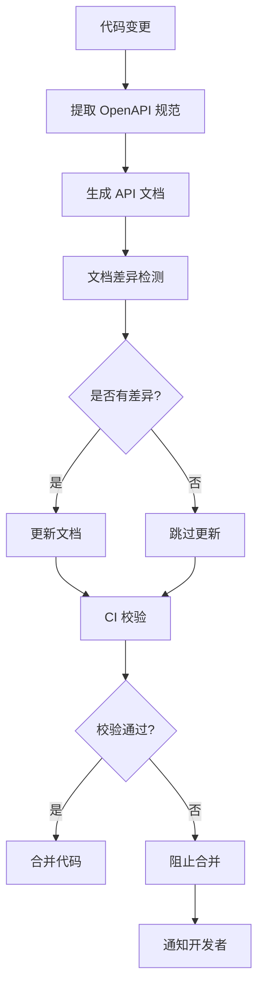

# OpenAPI 文档自动同步方案

## 🎯 方案概述

建立 OpenAPI 规范与 API 文档的双向同步机制，确保文档与代码的一致性，通过 CI/CD 流程自动化验证和更新。

## 🏗️ 架构设计

### 同步流程图


### 技术栈
- **OpenAPI 生成**: `@nestjs/swagger`
- **文档生成**: `swagger-ui-express`, `redoc-cli`
- **差异检测**: `openapi-diff`
- **CI/CD**: GitHub Actions
- **文档存储**: Git Repository

## 🔧 实施方案

### 1. OpenAPI 规范生成

#### Swagger 配置
```typescript
// src/main.ts
import { NestFactory } from '@nestjs/core';
import { SwaggerModule, DocumentBuilder } from '@nestjs/swagger';
import { AppModule } from './app.module';

async function bootstrap() {
  const app = await NestFactory.create(AppModule);

  // Swagger 配置
  const config = new DocumentBuilder()
    .setTitle('Caddy Style Shopping API')
    .setDescription('电商平台后端 API 文档')
    .setVersion('1.0.0')
    .addBearerAuth(
      {
        type: 'http',
        scheme: 'bearer',
        bearerFormat: 'JWT',
        name: 'JWT',
        description: 'Enter JWT token',
        in: 'header',
      },
      'JWT-auth',
    )
    .addTag('products', '商品管理')
    .addTag('orders', '订单管理')
    .addTag('users', '用户管理')
    .addTag('auth', '认证授权')
    .addServer('http://localhost:3000', '开发环境')
    .addServer('https://api.example.com', '生产环境')
    .build();

  const document = SwaggerModule.createDocument(app, config, {
    operationIdFactory: (controllerKey: string, methodKey: string) => methodKey,
    deepScanRoutes: true,
  });

  // 保存 OpenAPI 规范到文件
  const fs = require('fs');
  fs.writeFileSync('./docs/openapi.json', JSON.stringify(document, null, 2));
  fs.writeFileSync('./docs/openapi.yaml', require('js-yaml').dump(document));

  // 设置 Swagger UI
  SwaggerModule.setup('api/docs', app, document, {
    swaggerOptions: {
      persistAuthorization: true,
      displayRequestDuration: true,
    },
    customSiteTitle: 'Caddy Style Shopping API',
    customfavIcon: '/favicon.ico',
    customCss: '.swagger-ui .topbar { display: none }',
  });

  await app.listen(3000);
}
bootstrap();
```

#### API 装饰器标准化
```typescript
// src/products/products.controller.ts
import {
  Controller,
  Get,
  Post,
  Body,
  Param,
  Query,
  HttpStatus,
} from '@nestjs/common';
import {
  ApiTags,
  ApiOperation,
  ApiResponse,
  ApiParam,
  ApiQuery,
  ApiBearerAuth,
  ApiBody,
} from '@nestjs/swagger';
import { ProductsService } from './products.service';
import { CreateProductDto, ProductResponseDto, ProductListResponseDto } from './dto';

@ApiTags('products')
@Controller('api/v1/products')
@ApiBearerAuth('JWT-auth')
export class ProductsController {
  constructor(private readonly productsService: ProductsService) {}

  @Get()
  @ApiOperation({
    summary: '获取商品列表',
    description: '分页获取商品列表，支持分类筛选和关键词搜索',
  })
  @ApiQuery({ name: 'page', required: false, type: Number, description: '页码，默认1' })
  @ApiQuery({ name: 'limit', required: false, type: Number, description: '每页数量，默认20' })
  @ApiQuery({ name: 'category', required: false, type: String, description: '分类筛选' })
  @ApiQuery({ name: 'search', required: false, type: String, description: '关键词搜索' })
  @ApiResponse({
    status: HttpStatus.OK,
    description: '获取成功',
    type: ProductListResponseDto,
  })
  @ApiResponse({
    status: HttpStatus.BAD_REQUEST,
    description: '请求参数错误',
    schema: {
      example: {
        error: {
          code: 'VALIDATION_ERROR',
          message: 'Request validation failed',
          details: { validation: ['page must be a positive number'] }
        }
      }
    }
  })
  async getProducts(@Query() query: GetProductsQueryDto): Promise<ProductListResponseDto> {
    return this.productsService.getProducts(query);
  }

  @Post()
  @ApiOperation({
    summary: '创建商品',
    description: '创建新的商品信息',
  })
  @ApiBody({
    type: CreateProductDto,
    description: '商品创建数据',
    examples: {
      example1: {
        summary: '基础商品示例',
        value: {
          name: 'Gucci 经典T恤',
          price: 2999.00,
          category: 'clothing',
          description: '经典设计，舒适面料',
          stock: 50
        }
      }
    }
  })
  @ApiResponse({
    status: HttpStatus.CREATED,
    description: '创建成功',
    type: ProductResponseDto,
  })
  async createProduct(@Body() createProductDto: CreateProductDto): Promise<ProductResponseDto> {
    return this.productsService.createProduct(createProductDto);
  }
}
```

### 2. 自动化脚本

#### OpenAPI 规范提取脚本
```typescript
// scripts/extract-openapi.ts
import { NestFactory } from '@nestjs/core';
import { SwaggerModule, DocumentBuilder } from '@nestjs/swagger';
import { AppModule } from '../src/app.module';
import * as fs from 'fs';
import * as path from 'path';
import * as yaml from 'js-yaml';

async function extractOpenAPISpec() {
  console.log('🚀 开始提取 OpenAPI 规范...');
  
  const app = await NestFactory.create(AppModule, { logger: false });
  
  const config = new DocumentBuilder()
    .setTitle('Caddy Style Shopping API')
    .setDescription('电商平台后端 API 文档')
    .setVersion(process.env.API_VERSION || '1.0.0')
    .addBearerAuth()
    .build();

  const document = SwaggerModule.createDocument(app, config);
  
  // 确保目录存在
  const docsDir = path.join(process.cwd(), 'docs');
  if (!fs.existsSync(docsDir)) {
    fs.mkdirSync(docsDir, { recursive: true });
  }
  
  // 保存 JSON 格式
  const jsonPath = path.join(docsDir, 'openapi.json');
  fs.writeFileSync(jsonPath, JSON.stringify(document, null, 2));
  console.log(`✅ OpenAPI JSON 已保存到: ${jsonPath}`);
  
  // 保存 YAML 格式
  const yamlPath = path.join(docsDir, 'openapi.yaml');
  fs.writeFileSync(yamlPath, yaml.dump(document));
  console.log(`✅ OpenAPI YAML 已保存到: ${yamlPath}`);
  
  await app.close();
  console.log('🎉 OpenAPI 规范提取完成');
}

extractOpenAPISpec().catch(console.error);
```

#### 文档同步脚本
```typescript
// scripts/sync-docs.ts
import * as fs from 'fs';
import * as path from 'path';
import { execSync } from 'child_process';

interface SyncConfig {
  openApiPath: string;
  markdownPath: string;
  templatePath: string;
  outputPath: string;
}

class DocumentSyncer {
  private config: SyncConfig;

  constructor(config: SyncConfig) {
    this.config = config;
  }

  async syncDocuments(): Promise<void> {
    console.log('📚 开始同步 API 文档...');

    try {
      // 1. 检查 OpenAPI 规范是否存在
      if (!fs.existsSync(this.config.openApiPath)) {
        throw new Error(`OpenAPI 规范文件不存在: ${this.config.openApiPath}`);
      }

      // 2. 读取 OpenAPI 规范
      const openApiSpec = JSON.parse(fs.readFileSync(this.config.openApiPath, 'utf8'));
      
      // 3. 生成 Markdown 文档
      await this.generateMarkdownDocs(openApiSpec);
      
      // 4. 生成 HTML 文档
      await this.generateHtmlDocs();
      
      // 5. 更新版本信息
      await this.updateVersionInfo(openApiSpec);
      
      console.log('✅ API 文档同步完成');
    } catch (error) {
      console.error('❌ 文档同步失败:', error.message);
      process.exit(1);
    }
  }

  private async generateMarkdownDocs(openApiSpec: any): Promise<void> {
    console.log('📝 生成 Markdown 文档...');
    
    // 使用 widdershins 生成 Markdown
    const command = `npx widdershins ${this.config.openApiPath} -o ${this.config.outputPath}/api-reference.md --language_tabs 'javascript:JavaScript' 'typescript:TypeScript' 'curl:cURL'`;
    
    try {
      execSync(command, { stdio: 'inherit' });
      console.log('✅ Markdown 文档生成完成');
    } catch (error) {
      throw new Error(`Markdown 生成失败: ${error.message}`);
    }
  }

  private async generateHtmlDocs(): Promise<void> {
    console.log('🌐 生成 HTML 文档...');
    
    // 使用 redoc-cli 生成 HTML
    const command = `npx redoc-cli build ${this.config.openApiPath} --output ${this.config.outputPath}/api-docs.html --title "Caddy Style Shopping API"`;
    
    try {
      execSync(command, { stdio: 'inherit' });
      console.log('✅ HTML 文档生成完成');
    } catch (error) {
      throw new Error(`HTML 生成失败: ${error.message}`);
    }
  }

  private async updateVersionInfo(openApiSpec: any): Promise<void> {
    const versionInfo = {
      version: openApiSpec.info.version,
      lastUpdated: new Date().toISOString(),
      endpoints: Object.keys(openApiSpec.paths).length,
      schemas: Object.keys(openApiSpec.components?.schemas || {}).length,
    };

    const versionPath = path.join(this.config.outputPath, 'version.json');
    fs.writeFileSync(versionPath, JSON.stringify(versionInfo, null, 2));
    console.log('✅ 版本信息已更新');
  }
}

// 执行同步
const syncer = new DocumentSyncer({
  openApiPath: './docs/openapi.json',
  markdownPath: './docs/API_DOCUMENTATION.md',
  templatePath: './docs/templates',
  outputPath: './docs/generated',
});

syncer.syncDocuments();
```

### 3. CI/CD 集成

#### GitHub Actions 工作流
```yaml
# .github/workflows/api-docs-sync.yml
name: API 文档同步

on:
  push:
    branches: [main, develop]
    paths:
      - 'src/**/*.ts'
      - 'src/**/*.dto.ts'
      - 'src/**/*.controller.ts'
  pull_request:
    branches: [main]
    paths:
      - 'src/**/*.ts'

jobs:
  sync-api-docs:
    runs-on: ubuntu-latest
    
    steps:
    - name: 检出代码
      uses: actions/checkout@v4
      with:
        fetch-depth: 0

    - name: 设置 Node.js
      uses: actions/setup-node@v4
      with:
        node-version: '20'
        cache: 'npm'

    - name: 安装依赖
      run: |
        npm ci
        npm install -g widdershins redoc-cli

    - name: 构建应用
      run: npm run build

    - name: 提取 OpenAPI 规范
      run: npm run extract:openapi

    - name: 检测 API 变更
      id: api-diff
      run: |
        if [ -f "docs/openapi.json.backup" ]; then
          npx openapi-diff docs/openapi.json.backup docs/openapi.json > api-changes.txt
          if [ -s api-changes.txt ]; then
            echo "changes=true" >> $GITHUB_OUTPUT
            echo "API 检测到变更:"
            cat api-changes.txt
          else
            echo "changes=false" >> $GITHUB_OUTPUT
            echo "API 无变更"
          fi
        else
          echo "changes=true" >> $GITHUB_OUTPUT
          echo "首次生成 API 规范"
        fi

    - name: 同步文档
      if: steps.api-diff.outputs.changes == 'true'
      run: npm run sync:docs

    - name: 验证文档一致性
      run: npm run validate:docs

    - name: 提交文档变更
      if: steps.api-diff.outputs.changes == 'true' && github.event_name == 'push'
      run: |
        git config --local user.email "action@github.com"
        git config --local user.name "GitHub Action"
        git add docs/
        if git diff --staged --quiet; then
          echo "无文档变更需要提交"
        else
          git commit -m "docs: 自动同步 API 文档 [skip ci]"
          git push
        fi

    - name: 创建 PR 评论
      if: steps.api-diff.outputs.changes == 'true' && github.event_name == 'pull_request'
      uses: actions/github-script@v7
      with:
        script: |
          const fs = require('fs');
          let comment = '## 📋 API 变更检测\n\n';
          
          if (fs.existsSync('api-changes.txt')) {
            const changes = fs.readFileSync('api-changes.txt', 'utf8');
            comment += '### 🔄 检测到以下 API 变更:\n\n```diff\n' + changes + '\n```\n\n';
          }
          
          comment += '### 📚 文档已自动更新\n';
          comment += '- ✅ OpenAPI 规范已更新\n';
          comment += '- ✅ API 文档已重新生成\n';
          comment += '- ✅ 文档一致性验证通过\n\n';
          comment += '请检查生成的文档是否符合预期。';
          
          github.rest.issues.createComment({
            issue_number: context.issue.number,
            owner: context.repo.owner,
            repo: context.repo.repo,
            body: comment
          });

  validate-docs:
    runs-on: ubuntu-latest
    needs: sync-api-docs
    
    steps:
    - name: 检出代码
      uses: actions/checkout@v4

    - name: 设置 Node.js
      uses: actions/setup-node@v4
      with:
        node-version: '20'
        cache: 'npm'

    - name: 安装依赖
      run: npm ci

    - name: 验证 OpenAPI 规范
      run: |
        npx swagger-parser validate docs/openapi.json
        echo "✅ OpenAPI 规范验证通过"

    - name: 检查文档链接
      run: |
        npx markdown-link-check docs/**/*.md --config .github/markdown-link-check.json
        echo "✅ 文档链接检查通过"

    - name: 生成文档覆盖率报告
      run: npm run docs:coverage

    - name: 上传文档制品
      uses: actions/upload-artifact@v4
      with:
        name: api-documentation
        path: |
          docs/generated/
          docs/openapi.json
          docs/openapi.yaml
        retention-days: 30
```

### 4. 验证脚本

#### 文档一致性验证
```typescript
// scripts/validate-docs.ts
import * as fs from 'fs';
import * as path from 'path';

interface ValidationResult {
  isValid: boolean;
  errors: string[];
  warnings: string[];
}

class DocumentValidator {
  async validateDocumentation(): Promise<ValidationResult> {
    const result: ValidationResult = {
      isValid: true,
      errors: [],
      warnings: [],
    };

    console.log('🔍 开始验证文档一致性...');

    // 1. 验证 OpenAPI 规范存在
    await this.validateOpenAPIExists(result);
    
    // 2. 验证 API 文档存在
    await this.validateApiDocsExists(result);
    
    // 3. 验证端点覆盖率
    await this.validateEndpointCoverage(result);
    
    // 4. 验证示例数据
    await this.validateExamples(result);
    
    // 5. 验证文档元数据
    await this.validateMetadata(result);

    if (result.errors.length > 0) {
      result.isValid = false;
      console.error('❌ 文档验证失败:');
      result.errors.forEach(error => console.error(`  - ${error}`));
    }

    if (result.warnings.length > 0) {
      console.warn('⚠️  文档验证警告:');
      result.warnings.forEach(warning => console.warn(`  - ${warning}`));
    }

    if (result.isValid) {
      console.log('✅ 文档验证通过');
    }

    return result;
  }

  private async validateOpenAPIExists(result: ValidationResult): Promise<void> {
    const openApiPath = './docs/openapi.json';
    if (!fs.existsSync(openApiPath)) {
      result.errors.push('OpenAPI 规范文件不存在');
      return;
    }

    try {
      const spec = JSON.parse(fs.readFileSync(openApiPath, 'utf8'));
      if (!spec.info || !spec.paths) {
        result.errors.push('OpenAPI 规范格式无效');
      }
    } catch (error) {
      result.errors.push(`OpenAPI 规范解析失败: ${error.message}`);
    }
  }

  private async validateApiDocsExists(result: ValidationResult): Promise<void> {
    const apiDocsPath = './docs/API_DOCUMENTATION.md';
    if (!fs.existsSync(apiDocsPath)) {
      result.errors.push('API 文档文件不存在');
      return;
    }

    const content = fs.readFileSync(apiDocsPath, 'utf8');
    if (!content.includes('## 📦 商品管理API')) {
      result.warnings.push('API 文档可能缺少商品管理部分');
    }
  }

  private async validateEndpointCoverage(result: ValidationResult): Promise<void> {
    try {
      const openApiSpec = JSON.parse(fs.readFileSync('./docs/openapi.json', 'utf8'));
      const endpoints = Object.keys(openApiSpec.paths || {});
      
      if (endpoints.length === 0) {
        result.warnings.push('OpenAPI 规范中未发现任何端点');
        return;
      }

      // 检查关键端点是否存在
      const requiredEndpoints = [
        '/api/v1/products',
        '/api/v1/orders',
        '/api/v1/users',
        '/api/v1/auth/login',
      ];

      const missingEndpoints = requiredEndpoints.filter(
        endpoint => !endpoints.includes(endpoint)
      );

      if (missingEndpoints.length > 0) {
        result.warnings.push(
          `缺少关键端点: ${missingEndpoints.join(', ')}`
        );
      }

      console.log(`📊 发现 ${endpoints.length} 个 API 端点`);
    } catch (error) {
      result.errors.push(`端点覆盖率验证失败: ${error.message}`);
    }
  }

  private async validateExamples(result: ValidationResult): Promise<void> {
    try {
      const openApiSpec = JSON.parse(fs.readFileSync('./docs/openapi.json', 'utf8'));
      let exampleCount = 0;
      let missingExamples = 0;

      for (const [path, methods] of Object.entries(openApiSpec.paths || {})) {
        for (const [method, operation] of Object.entries(methods as any)) {
          if (operation.responses) {
            for (const [status, response] of Object.entries(operation.responses)) {
              if ((response as any).content) {
                const hasExample = Object.values((response as any).content).some(
                  (content: any) => content.example || content.examples
                );
                if (hasExample) {
                  exampleCount++;
                } else {
                  missingExamples++;
                }
              }
            }
          }
        }
      }

      if (missingExamples > exampleCount * 0.3) {
        result.warnings.push(
          `响应示例覆盖率较低: ${exampleCount}/${exampleCount + missingExamples}`
        );
      }

      console.log(`📝 发现 ${exampleCount} 个响应示例`);
    } catch (error) {
      result.errors.push(`示例验证失败: ${error.message}`);
    }
  }

  private async validateMetadata(result: ValidationResult): Promise<void> {
    const apiDocsPath = './docs/API_DOCUMENTATION.md';
    if (!fs.existsSync(apiDocsPath)) {
      return;
    }

    const content = fs.readFileSync(apiDocsPath, 'utf8');
    
    // 检查 frontmatter
    if (!content.startsWith('---')) {
      result.warnings.push('API 文档缺少 YAML frontmatter');
    }

    // 检查必要的元数据字段
    const requiredFields = ['title', 'lastUpdated', 'version'];
    const missingFields = requiredFields.filter(field => 
      !content.includes(`${field}:`)
    );

    if (missingFields.length > 0) {
      result.warnings.push(
        `API 文档缺少元数据字段: ${missingFields.join(', ')}`
      );
    }
  }
}

// 执行验证
const validator = new DocumentValidator();
validator.validateDocumentation().then(result => {
  process.exit(result.isValid ? 0 : 1);
});
```

### 5. Package.json 脚本配置

```json
{
  "scripts": {
    "extract:openapi": "ts-node scripts/extract-openapi.ts",
    "sync:docs": "ts-node scripts/sync-docs.ts",
    "validate:docs": "ts-node scripts/validate-docs.ts",
    "docs:coverage": "ts-node scripts/docs-coverage.ts",
    "docs:serve": "npx http-server docs/generated -p 8080",
    "docs:build": "npm run extract:openapi && npm run sync:docs",
    "docs:watch": "nodemon --watch src --ext ts --exec 'npm run docs:build'"
  },
  "devDependencies": {
    "widdershins": "^4.0.1",
    "redoc-cli": "^0.13.21",
    "openapi-diff": "^0.23.0",
    "swagger-parser": "^10.0.3",
    "markdown-link-check": "^3.11.2"
  }
}
```

## 🎯 使用指南

### 开发者工作流

1. **开发 API**: 添加适当的 Swagger 装饰器
2. **本地验证**: 运行 `npm run docs:build` 生成文档
3. **提交代码**: CI 自动检测变更并更新文档
4. **审查文档**: 检查生成的文档是否准确

### 文档维护

1. **定期检查**: 每周运行文档覆盖率检查
2. **版本管理**: 重大版本发布时手动更新版本号
3. **质量监控**: 监控文档一致性指标

这套自动化方案确保了 API 文档与代码的完全同步，大大减少了手动维护的工作量。