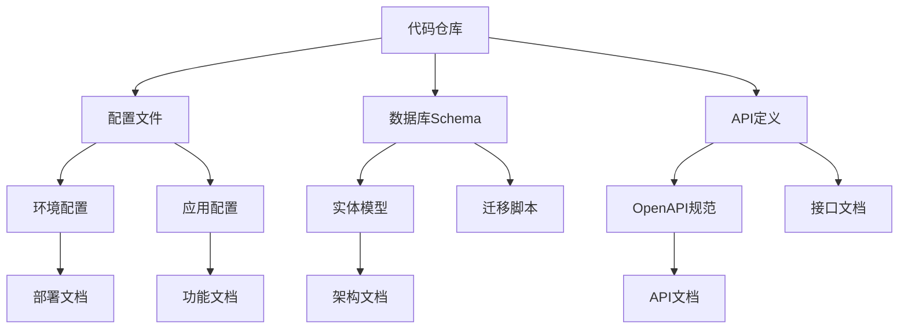
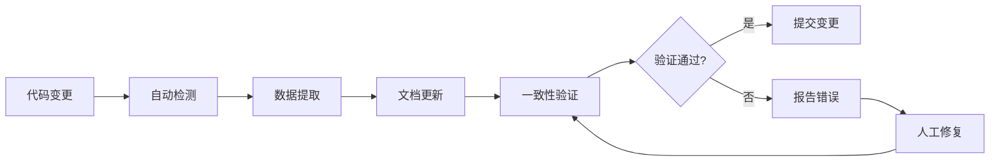

# 📊 单一数据源规范 (Single Source of Truth)

## 📋 概述

本文档定义了 Caddy Style Shopping Backend 项目的单一数据源规范，确保所有文档内容都能准确反映实际的系统状态，避免信息不一致和过时的问题。

---

## 🎯 核心原则

### 1. 单一数据源原则
- **唯一权威源**: 每个信息只有一个权威的数据源
- **自动同步**: 数据源变更时自动更新相关文档
- **实时验证**: 定期验证文档与实际系统的一致性
- **版本控制**: 所有数据源变更都有完整的版本历史

### 2. 数据源层次结构


---

## 📁 数据源映射表

### 1. 项目基础信息

| 信息类型 | 数据源 | 文档位置 | 同步方式 |
|----------|--------|----------|----------|
| **项目名称** | `backend/package.json` → `name` | `docs/index.md` | 自动同步 |
| **项目版本** | `backend/package.json` → `version` | `docs/index.md` | 自动同步 |
| **项目描述** | `backend/package.json` → `description` | `docs/index.md` | 自动同步 |
| **依赖版本** | `backend/package.json` → `dependencies` | `docs/DEPLOYMENT_GUIDE.md` | 自动同步 |
| **脚本命令** | `backend/package.json` → `scripts` | `docs/DEVELOPER_GUIDE.md` | 自动同步 |

### 2. 配置管理

| 配置类型 | 数据源 | 文档位置 | 同步方式 |
|----------|--------|----------|----------|
| **环境变量** | `backend/.env.example` | `docs/CONFIG_MANAGEMENT.md` | 自动同步 |
| **数据库配置** | `src/config/typeorm.config.ts` | `docs/database-setup-guide.md` | 自动同步 |
| **Redis配置** | `src/redis/redis.module.ts` | `docs/CACHE_SYSTEM.md` | 自动同步 |
| **JWT配置** | `src/config/configuration.ts` | `docs/JWT_SECURITY_CONFIG.md` | 自动同步 |
| **应用配置** | `src/config/configuration.ts` | `docs/CONFIG_MANAGEMENT.md` | 自动同步 |

### 3. API接口

| API信息 | 数据源 | 文档位置 | 同步方式 |
|---------|--------|----------|----------|
| **接口定义** | 控制器装饰器 `@Controller()` | `docs/API_DOCUMENTATION.md` | 自动生成 |
| **路由信息** | 方法装饰器 `@Get()`, `@Post()` 等 | `docs/API_DOCUMENTATION.md` | 自动生成 |
| **参数定义** | DTO类和验证装饰器 | `docs/API_DOCUMENTATION.md` | 自动生成 |
| **响应格式** | 响应DTO和Swagger装饰器 | `docs/API_DOCUMENTATION.md` | 自动生成 |
| **OpenAPI规范** | Swagger自动生成 | `docs/openapi.json` | 自动生成 |

### 4. 数据库结构

| 数据库信息 | 数据源 | 文档位置 | 同步方式 |
|------------|--------|----------|----------|
| **实体定义** | `@Entity()` 装饰器类 | `docs/ARCHITECTURE_DOCUMENTATION.md` | 自动生成 |
| **字段定义** | `@Column()` 装饰器 | `docs/ARCHITECTURE_DOCUMENTATION.md` | 自动生成 |
| **关系定义** | `@OneToMany()`, `@ManyToOne()` 等 | `docs/ARCHITECTURE_DOCUMENTATION.md` | 自动生成 |
| **迁移脚本** | `migrations/` 目录 | `docs/database-setup-guide.md` | 自动同步 |
| **索引定义** | `@Index()` 装饰器 | `docs/database-setup-guide.md` | 自动生成 |

### 5. 安全配置

| 安全信息 | 数据源 | 文档位置 | 同步方式 |
|----------|--------|----------|----------|
| **认证策略** | `src/auth/` 模块代码 | `docs/JWT_SECURITY_CONFIG.md` | 自动同步 |
| **权限定义** | 守卫和装饰器 | `docs/SECURITY_MONITORING_GUIDE.md` | 自动同步 |
| **安全中间件** | 中间件配置 | `docs/SECURITY_MONITORING_GUIDE.md` | 自动同步 |
| **CORS配置** | `main.ts` 中的配置 | `docs/SECURITY_MONITORING_GUIDE.md` | 自动同步 |
| **限流配置** | `@Throttle()` 装饰器 | `docs/RATE_LIMITER_SYSTEM.md` | 自动同步 |

---

## 🔄 自动同步机制

### 1. 代码变更触发同步

#### Git Hooks 配置
```bash
#!/bin/sh
# .git/hooks/pre-commit
# 提交前检查文档一致性

echo "🔍 检查文档一致性..."

# 检查 package.json 变更
if git diff --cached --name-only | grep -q "package.json"; then
    echo "📦 检测到 package.json 变更，更新相关文档..."
    npm run docs:sync:package
fi

# 检查配置文件变更
if git diff --cached --name-only | grep -q "src/config/"; then
    echo "⚙️ 检测到配置文件变更，更新配置文档..."
    npm run docs:sync:config
fi

# 检查实体文件变更
if git diff --cached --name-only | grep -q "\.entity\.ts$"; then
    echo "🗄️ 检测到实体变更，更新数据库文档..."
    npm run docs:sync:database
fi

# 检查控制器变更
if git diff --cached --name-only | grep -q "\.controller\.ts$"; then
    echo "🔌 检测到控制器变更，更新API文档..."
    npm run docs:sync:api
fi

echo "✅ 文档同步检查完成"
```

#### GitHub Actions 工作流
```yaml
# .github/workflows/docs-sync.yml
name: 📚 文档自动同步

on:
  push:
    branches: [main, develop]
    paths:
      - 'backend/package.json'
      - 'backend/src/**/*.ts'
      - 'backend/src/**/*.entity.ts'
      - 'backend/src/**/*.controller.ts'
      - 'backend/src/config/**'

jobs:
  sync-docs:
    runs-on: ubuntu-latest
    steps:
      - uses: actions/checkout@v4
        with:
          token: ${{ secrets.GITHUB_TOKEN }}
          
      - name: Setup Node.js
        uses: actions/setup-node@v4
        with:
          node-version: '18'
          cache: 'npm'
          cache-dependency-path: backend/package-lock.json
          
      - name: Install dependencies
        run: |
          cd backend
          npm ci
          
      - name: 同步项目信息
        run: |
          cd backend
          npm run docs:sync:package
          
      - name: 同步配置信息
        run: |
          cd backend
          npm run docs:sync:config
          
      - name: 同步API文档
        run: |
          cd backend
          npm run docs:sync:api
          
      - name: 同步数据库文档
        run: |
          cd backend
          npm run docs:sync:database
          
      - name: 验证文档一致性
        run: |
          cd backend
          npm run docs:validate:consistency
          
      - name: 提交文档更新
        run: |
          git config --local user.email "action@github.com"
          git config --local user.name "GitHub Action"
          git add backend/docs/
          git diff --staged --quiet || git commit -m "📚 自动同步文档 [skip ci]"
          git push
```

### 2. 实时监控脚本

#### 文档一致性监控
```typescript
// scripts/docs-consistency-monitor.ts
import { Injectable, Logger } from '@nestjs/common';
import { Cron, CronExpression } from '@nestjs/schedule';
import * as fs from 'fs';
import * as path from 'path';

@Injectable()
export class DocsConsistencyMonitor {
  private readonly logger = new Logger(DocsConsistencyMonitor.name);

  @Cron(CronExpression.EVERY_HOUR)
  async checkConsistency() {
    this.logger.log('🔍 开始检查文档一致性...');

    const checks = [
      this.checkPackageJsonSync(),
      this.checkConfigSync(),
      this.checkApiSync(),
      this.checkDatabaseSync(),
    ];

    const results = await Promise.all(checks);
    const inconsistencies = results.filter(result => !result.isConsistent);

    if (inconsistencies.length > 0) {
      this.logger.error(`❌ 发现 ${inconsistencies.length} 个文档不一致问题`);
      await this.reportInconsistencies(inconsistencies);
    } else {
      this.logger.log('✅ 所有文档都与数据源保持一致');
    }
  }

  private async checkPackageJsonSync(): Promise<ConsistencyResult> {
    const packageJson = JSON.parse(
      fs.readFileSync('backend/package.json', 'utf8')
    );
    const indexMd = fs.readFileSync('backend/docs/index.md', 'utf8');

    const checks = [
      {
        name: '项目名称',
        source: packageJson.name,
        doc: this.extractFromMarkdown(indexMd, 'name'),
      },
      {
        name: '项目版本',
        source: packageJson.version,
        doc: this.extractFromMarkdown(indexMd, 'version'),
      },
    ];

    const inconsistent = checks.filter(check => check.source !== check.doc);

    return {
      category: 'package.json',
      isConsistent: inconsistent.length === 0,
      inconsistencies: inconsistent,
    };
  }

  private async checkConfigSync(): Promise<ConsistencyResult> {
    // 检查配置文件与文档的一致性
    const configFile = await import('../src/config/configuration');
    const configDoc = fs.readFileSync('backend/docs/CONFIG_MANAGEMENT.md', 'utf8');

    // 实现配置检查逻辑
    return {
      category: 'configuration',
      isConsistent: true,
      inconsistencies: [],
    };
  }

  private async checkApiSync(): Promise<ConsistencyResult> {
    // 检查API定义与文档的一致性
    // 通过反射获取控制器信息
    // 与API文档进行对比
    return {
      category: 'api',
      isConsistent: true,
      inconsistencies: [],
    };
  }

  private async checkDatabaseSync(): Promise<ConsistencyResult> {
    // 检查数据库实体与文档的一致性
    return {
      category: 'database',
      isConsistent: true,
      inconsistencies: [],
    };
  }

  private extractFromMarkdown(content: string, field: string): string {
    // 从Markdown中提取特定字段的值
    const regex = new RegExp(`${field}[:\\s]*([^\\n]+)`, 'i');
    const match = content.match(regex);
    return match ? match[1].trim() : '';
  }

  private async reportInconsistencies(inconsistencies: ConsistencyResult[]) {
    // 生成不一致报告
    const report = {
      timestamp: new Date().toISOString(),
      inconsistencies,
      totalCount: inconsistencies.length,
    };

    // 保存报告
    fs.writeFileSync(
      'backend/docs/quality/consistency-report.json',
      JSON.stringify(report, null, 2)
    );

    // 发送通知（如果配置了）
    await this.sendNotification(report);
  }

  private async sendNotification(report: any) {
    // 发送Slack/Teams通知
    // 或者创建GitHub Issue
  }
}

interface ConsistencyResult {
  category: string;
  isConsistent: boolean;
  inconsistencies: Array<{
    name: string;
    source: any;
    doc: any;
  }>;
}
```

---

## 📋 同步脚本集合

### 1. Package.json 同步脚本

```typescript
// scripts/sync-package-info.ts
import * as fs from 'fs';
import * as path from 'path';

interface PackageInfo {
  name: string;
  version: string;
  description: string;
  scripts: Record<string, string>;
  dependencies: Record<string, string>;
  devDependencies: Record<string, string>;
}

class PackageInfoSyncer {
  private packageJson: PackageInfo;
  
  constructor() {
    this.packageJson = JSON.parse(
      fs.readFileSync('backend/package.json', 'utf8')
    );
  }

  async syncToIndexMd() {
    const indexPath = 'backend/docs/index.md';
    let content = fs.readFileSync(indexPath, 'utf8');

    // 更新项目名称
    content = this.updateMarkdownField(
      content,
      'project-name',
      this.packageJson.name
    );

    // 更新版本号
    content = this.updateMarkdownField(
      content,
      'version',
      this.packageJson.version
    );

    // 更新描述
    content = this.updateMarkdownField(
      content,
      'description',
      this.packageJson.description
    );

    fs.writeFileSync(indexPath, content);
    console.log('✅ 已同步 package.json 信息到 index.md');
  }

  async syncToDeploymentGuide() {
    const deployPath = 'backend/docs/DEPLOYMENT_GUIDE.md';
    let content = fs.readFileSync(deployPath, 'utf8');

    // 更新依赖版本表格
    const dependencyTable = this.generateDependencyTable();
    content = this.updateMarkdownSection(
      content,
      '## 依赖版本',
      dependencyTable
    );

    fs.writeFileSync(deployPath, content);
    console.log('✅ 已同步依赖信息到部署指南');
  }

  async syncToDeveloperGuide() {
    const devPath = 'backend/docs/DEVELOPER_GUIDE.md';
    let content = fs.readFileSync(devPath, 'utf8');

    // 更新脚本命令
    const scriptsSection = this.generateScriptsSection();
    content = this.updateMarkdownSection(
      content,
      '## 可用脚本',
      scriptsSection
    );

    fs.writeFileSync(devPath, content);
    console.log('✅ 已同步脚本命令到开发指南');
  }

  private updateMarkdownField(content: string, field: string, value: string): string {
    const regex = new RegExp(`(${field}[:\\s]*)[^\\n]+`, 'i');
    return content.replace(regex, `$1${value}`);
  }

  private updateMarkdownSection(content: string, sectionTitle: string, newContent: string): string {
    const regex = new RegExp(`(${sectionTitle}[\\s\\S]*?)(?=\\n## |$)`, 'i');
    return content.replace(regex, `${sectionTitle}\n\n${newContent}\n`);
  }

  private generateDependencyTable(): string {
    const deps = this.packageJson.dependencies;
    let table = '| 依赖包 | 版本 | 说明 |\n|--------|------|------|\n';
    
    Object.entries(deps).forEach(([name, version]) => {
      table += `| ${name} | ${version} | ${this.getDependencyDescription(name)} |\n`;
    });

    return table;
  }

  private generateScriptsSection(): string {
    const scripts = this.packageJson.scripts;
    let section = '### 开发脚本\n\n```bash\n';
    
    Object.entries(scripts).forEach(([name, command]) => {
      section += `# ${this.getScriptDescription(name)}\nnpm run ${name}\n\n`;
    });

    section += '```';
    return section;
  }

  private getDependencyDescription(name: string): string {
    const descriptions: Record<string, string> = {
      '@nestjs/common': 'NestJS 核心框架',
      '@nestjs/typeorm': 'TypeORM 集成',
      'typeorm': 'ORM 框架',
      'redis': 'Redis 客户端',
      // 添加更多依赖描述
    };
    return descriptions[name] || '项目依赖';
  }

  private getScriptDescription(name: string): string {
    const descriptions: Record<string, string> = {
      'start': '启动应用',
      'start:dev': '开发模式启动',
      'build': '构建项目',
      'test': '运行测试',
      // 添加更多脚本描述
    };
    return descriptions[name] || '执行脚本';
  }
}

// 执行同步
const syncer = new PackageInfoSyncer();
syncer.syncToIndexMd();
syncer.syncToDeploymentGuide();
syncer.syncToDeveloperGuide();
```

### 2. API文档同步脚本

```typescript
// scripts/sync-api-docs.ts
import { NestFactory } from '@nestjs/core';
import { SwaggerModule, DocumentBuilder } from '@nestjs/swagger';
import { AppModule } from '../src/app.module';
import * as fs from 'fs';

class ApiDocsSyncer {
  async generateApiDocs() {
    const app = await NestFactory.create(AppModule);
    
    const config = new DocumentBuilder()
      .setTitle('Caddy Style Shopping API')
      .setDescription('购物网站后端API文档')
      .setVersion('1.0')
      .addBearerAuth()
      .build();

    const document = SwaggerModule.createDocument(app, config);
    
    // 保存 OpenAPI JSON
    fs.writeFileSync(
      'backend/docs/openapi.json',
      JSON.stringify(document, null, 2)
    );

    // 生成 Markdown 格式的API文档
    const markdownDoc = this.convertToMarkdown(document);
    fs.writeFileSync(
      'backend/docs/API_DOCUMENTATION.md',
      markdownDoc
    );

    await app.close();
    console.log('✅ 已生成最新的API文档');
  }

  private convertToMarkdown(openApiDoc: any): string {
    let markdown = `# 🔌 API 接口文档\n\n`;
    markdown += `> 自动生成时间: ${new Date().toISOString()}\n\n`;
    
    // 遍历所有路径
    Object.entries(openApiDoc.paths).forEach(([path, methods]: [string, any]) => {
      Object.entries(methods).forEach(([method, details]: [string, any]) => {
        markdown += this.generateEndpointMarkdown(path, method, details);
      });
    });

    return markdown;
  }

  private generateEndpointMarkdown(path: string, method: string, details: any): string {
    let md = `## ${method.toUpperCase()} ${path}\n\n`;
    md += `**描述**: ${details.summary || details.description || '无描述'}\n\n`;
    
    if (details.parameters) {
      md += `### 请求参数\n\n`;
      md += `| 参数名 | 类型 | 位置 | 必填 | 描述 |\n`;
      md += `|--------|------|------|------|------|\n`;
      
      details.parameters.forEach((param: any) => {
        md += `| ${param.name} | ${param.schema?.type || 'string'} | ${param.in} | ${param.required ? '是' : '否'} | ${param.description || ''} |\n`;
      });
      md += '\n';
    }

    if (details.responses) {
      md += `### 响应格式\n\n`;
      Object.entries(details.responses).forEach(([code, response]: [string, any]) => {
        md += `**${code}**: ${response.description}\n\n`;
        if (response.content) {
          md += '```json\n';
          md += JSON.stringify(response.content, null, 2);
          md += '\n```\n\n';
        }
      });
    }

    md += '---\n\n';
    return md;
  }
}

// 执行同步
const syncer = new ApiDocsSyncer();
syncer.generateApiDocs();
```

---

## 🔍 验证机制

### 1. 文档一致性验证

```bash
# package.json 中添加验证脚本
{
  "scripts": {
    "docs:validate": "node scripts/validate-docs-consistency.js",
    "docs:validate:package": "node scripts/validate-package-sync.js",
    "docs:validate:config": "node scripts/validate-config-sync.js",
    "docs:validate:api": "node scripts/validate-api-sync.js",
    "docs:validate:database": "node scripts/validate-database-sync.js",
    "docs:sync:all": "npm run docs:sync:package && npm run docs:sync:config && npm run docs:sync:api && npm run docs:sync:database",
    "docs:sync:package": "node scripts/sync-package-info.js",
    "docs:sync:config": "node scripts/sync-config-info.js",
    "docs:sync:api": "node scripts/sync-api-docs.js",
    "docs:sync:database": "node scripts/sync-database-docs.js"
  }
}
```

### 2. CI/CD 集成验证

```yaml
# .github/workflows/docs-validation.yml
name: 📋 文档验证

on:
  pull_request:
    paths:
      - 'backend/docs/**'
      - 'backend/src/**'
      - 'backend/package.json'

jobs:
  validate-docs:
    runs-on: ubuntu-latest
    steps:
      - uses: actions/checkout@v4
      
      - name: Setup Node.js
        uses: actions/setup-node@v4
        with:
          node-version: '18'
          
      - name: Install dependencies
        run: |
          cd backend
          npm ci
          
      - name: 验证文档一致性
        run: |
          cd backend
          npm run docs:validate
          
      - name: 检查文档覆盖率
        run: |
          cd backend
          npm run docs:coverage
          
      - name: 生成验证报告
        run: |
          cd backend
          npm run docs:report
          
      - name: 上传验证报告
        uses: actions/upload-artifact@v3
        with:
          name: docs-validation-report
          path: backend/docs/quality/validation-report.html
```

---

## 📊 监控仪表板

### 1. 文档健康度仪表板

```typescript
// scripts/generate-docs-dashboard.ts
import * as fs from 'fs';

class DocsHealthDashboard {
  async generateDashboard() {
    const metrics = await this.collectMetrics();
    const html = this.generateHTML(metrics);
    
    fs.writeFileSync('backend/docs/quality/docs-health-dashboard.html', html);
    console.log('✅ 已生成文档健康度仪表板');
  }

  private async collectMetrics() {
    return {
      consistency: await this.checkConsistency(),
      coverage: await this.checkCoverage(),
      freshness: await this.checkFreshness(),
      quality: await this.checkQuality(),
    };
  }

  private async checkConsistency(): Promise<number> {
    // 检查文档一致性，返回百分比
    return 95;
  }

  private async checkCoverage(): Promise<number> {
    // 检查文档覆盖率，返回百分比
    return 88;
  }

  private async checkFreshness(): Promise<number> {
    // 检查文档新鲜度，返回百分比
    return 92;
  }

  private async checkQuality(): Promise<number> {
    // 检查文档质量，返回百分比
    return 90;
  }

  private generateHTML(metrics: any): string {
    return `
<!DOCTYPE html>
<html>
<head>
    <title>📊 文档健康度仪表板</title>
    <meta charset="utf-8">
    <style>
        body { font-family: Arial, sans-serif; margin: 20px; }
        .metric { display: inline-block; margin: 20px; padding: 20px; border-radius: 8px; }
        .metric h3 { margin: 0 0 10px 0; }
        .metric .value { font-size: 2em; font-weight: bold; }
        .excellent { background-color: #d4edda; color: #155724; }
        .good { background-color: #fff3cd; color: #856404; }
        .warning { background-color: #f8d7da; color: #721c24; }
    </style>
</head>
<body>
    <h1>📊 文档健康度仪表板</h1>
    <p>更新时间: ${new Date().toLocaleString()}</p>
    
    <div class="metric ${this.getStatusClass(metrics.consistency)}">
        <h3>📋 一致性</h3>
        <div class="value">${metrics.consistency}%</div>
    </div>
    
    <div class="metric ${this.getStatusClass(metrics.coverage)}">
        <h3>📚 覆盖率</h3>
        <div class="value">${metrics.coverage}%</div>
    </div>
    
    <div class="metric ${this.getStatusClass(metrics.freshness)}">
        <h3>🕒 新鲜度</h3>
        <div class="value">${metrics.freshness}%</div>
    </div>
    
    <div class="metric ${this.getStatusClass(metrics.quality)}">
        <h3>⭐ 质量</h3>
        <div class="value">${metrics.quality}%</div>
    </div>
</body>
</html>
    `;
  }

  private getStatusClass(value: number): string {
    if (value >= 90) return 'excellent';
    if (value >= 80) return 'good';
    return 'warning';
  }
}

// 执行生成
const dashboard = new DocsHealthDashboard();
dashboard.generateDashboard();
```

---

## 🎯 最佳实践

### 1. 数据源管理原则
- **最小化数据源**: 避免重复的数据源
- **明确责任**: 每个数据源都有明确的维护责任人
- **版本控制**: 所有数据源变更都要有版本记录
- **自动化优先**: 优先使用自动化同步而非手动更新

### 2. 文档更新流程


### 3. 质量保证措施
- **定期审查**: 每周进行文档一致性审查
- **自动化测试**: CI/CD 中包含文档验证步骤
- **监控告警**: 设置文档不一致的告警机制
- **培训教育**: 定期培训团队成员文档规范

---

**最后更新**: 2025年10月5日  
**文档版本**: v1.0.0  
**维护团队**: 文档团队 + 开发团队