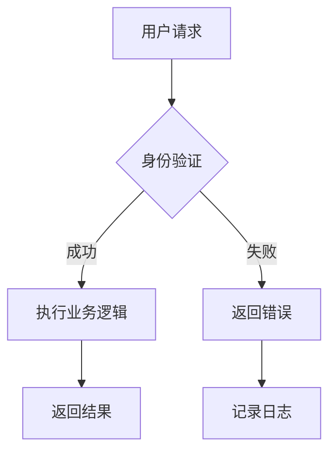
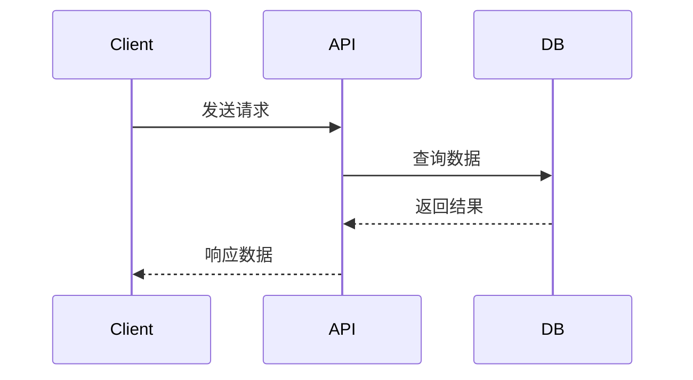
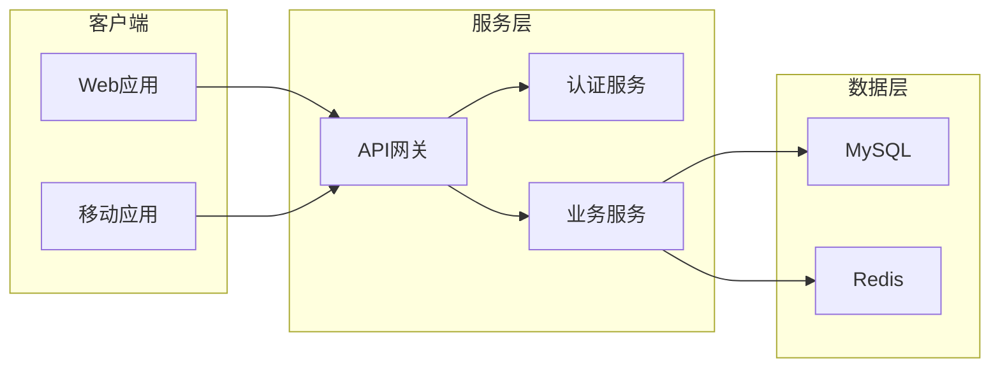

# 📋 文档编写标准和规范

## 📖 概述

本文档定义了 Caddy Style Shopping Backend 项目的文档编写标准、格式规范和质量要求，确保文档的一致性、可读性和维护性。

---

## 📄 YAML Frontmatter 规范

### 必需字段
每个文档都必须包含以下 YAML frontmatter：

```yaml
---
title: "文档标题"
description: "文档简要描述"
owner: "负责人/团队"
lastUpdated: "2025-01-26"
version: "1.0.0"
status: "active"  # active, draft, deprecated, archived
category: "文档分类"  # api, architecture, deployment, security, monitoring, etc.
tags: ["标签1", "标签2", "标签3"]
audience: ["developer", "ops", "security"]  # 目标读者
priority: "high"  # high, medium, low
reviewCycle: "monthly"  # weekly, monthly, quarterly, yearly
---
```

### 字段说明
- **title**: 文档标题，与 H1 标题保持一致
- **description**: 简要描述文档内容和用途（1-2句话）
- **owner**: 文档负责人或团队，格式：`姓名 <email>` 或 `团队名`
- **lastUpdated**: 最后更新日期，格式：`YYYY-MM-DD`
- **version**: 文档版本号，遵循语义化版本规范
- **status**: 文档状态
  - `active`: 活跃维护中
  - `draft`: 草稿状态
  - `deprecated`: 已废弃但仍可参考
  - `archived`: 已归档
- **category**: 文档分类，便于组织和检索
- **tags**: 标签数组，用于搜索和分类
- **audience**: 目标读者群体
- **priority**: 文档重要性级别
- **reviewCycle**: 文档审查周期

### 示例 Frontmatter
```yaml
---
title: "健康检查系统文档"
description: "提供全面的应用程序和依赖服务健康监控功能的系统文档"
owner: "Backend Team <backend@company.com>"
lastUpdated: "2025-01-26"
version: "2.1.0"
status: "active"
category: "monitoring"
tags: ["health-check", "monitoring", "kubernetes", "prometheus"]
audience: ["developer", "ops"]
priority: "high"
reviewCycle: "monthly"
---
```

---

## 🎯 文档编写原则

### 核心原则
1. **用户导向** - 以读者需求为中心，提供有价值的信息
2. **简洁明了** - 语言简练，逻辑清晰，避免冗余
3. **准确性** - 信息准确，示例可用，及时更新
4. **一致性** - 格式统一，风格一致，标准化程度高
5. **可维护** - 结构清晰，易于更新，支持自动化

### 质量标准
- **完整性**: 覆盖所有必要信息，无遗漏
- **准确性**: 技术信息正确，示例可执行
- **时效性**: 内容与代码同步，及时更新
- **易用性**: 结构清晰，导航便捷，搜索友好
- **专业性**: 术语准确，表述规范，符合行业标准

---

## 📝 文档结构规范

### 文档模板结构
```markdown
# 📋 文档标题（使用 Emoji + 简洁标题）

## 📖 概述
- 简要描述文档内容和用途
- 目标读者和使用场景
- 预期收益和价值

## 🎯 核心内容
- 主要功能和特性
- 技术实现细节
- 配置和使用方法

## 📊 示例和演示
- 代码示例
- 配置示例
- 操作步骤

## 🔧 故障排查
- 常见问题
- 解决方案
- 调试技巧

## 📚 相关资源
- 相关文档链接
- 外部参考资料
- 工具和资源

---
*最后更新: YYYY-MM-DD*
*文档版本: vX.Y.Z*
```

### 标题层级规范
```markdown
# H1 - 文档主标题（每个文档只有一个）
## H2 - 主要章节标题
### H3 - 子章节标题
#### H4 - 细分内容标题
##### H5 - 详细说明（谨慎使用）
```

### Emoji 使用规范
| 类型 | Emoji | 用途 | 示例 |
|------|-------|------|------|
| **概述** | 📋 📖 | 文档概述、说明 | `📋 概述` |
| **目标** | 🎯 🚀 | 目标、启动 | `🎯 目标` |
| **配置** | ⚙️ 🔧 | 配置、工具 | `⚙️ 配置` |
| **安全** | 🔒 🛡️ | 安全、防护 | `🔒 安全` |
| **性能** | ⚡ 🚀 | 性能、优化 | `⚡ 性能` |
| **监控** | 📊 📈 | 数据、监控 | `📊 监控` |
| **问题** | ⚠️ 🚨 | 警告、问题 | `⚠️ 注意` |
| **成功** | ✅ 🎉 | 成功、完成 | `✅ 完成` |
| **资源** | 📚 🔗 | 资源、链接 | `📚 资源` |

---

## 💻 代码示例规范

### 代码块格式
````markdown
```typescript
// 添加注释说明代码用途
@Injectable()
export class UserService {
  constructor(
    @InjectRepository(User)
    private readonly userRepository: Repository<User>,
  ) {}

  async findById(id: number): Promise<User> {
    return this.userRepository.findOne({ where: { id } });
  }
}
```
````

### 配置文件示例
````markdown
```yaml
# docker-compose.yml
version: '3.8'
services:
  backend:
    build: .
    ports:
      - "3000:3000"
    environment:
      - NODE_ENV=production
      - DB_HOST=database
```
````

### 命令行示例
````markdown
```bash
# 安装依赖
npm install

# 启动开发服务器
npm run start:dev

# 运行测试
npm test
```
````

### Shell 脚本示例
````markdown
```bash
#!/bin/bash
# 部署脚本示例

echo "🚀 开始部署..."

# 构建应用
npm run build

# 启动服务
pm2 start dist/main.js --name "backend"

echo "✅ 部署完成"
```
````

---

## 📊 表格使用规范

### 标准表格格式
```markdown
| 字段 | 类型 | 必填 | 描述 | 示例 |
|------|------|------|------|------|
| id | number | ✅ | 用户唯一标识 | 1001 |
| username | string | ✅ | 用户名 | john_doe |
| email | string | ✅ | 邮箱地址 | john@example.com |
| createdAt | Date | ❌ | 创建时间 | 2025-10-05T10:00:00Z |
```

### API 接口表格
```markdown
| 接口 | 方法 | 路径 | 描述 | 状态 |
|------|------|------|------|------|
| 用户登录 | POST | `/auth/login` | 用户身份验证 | ✅ 稳定 |
| 获取用户信息 | GET | `/users/profile` | 获取当前用户信息 | ✅ 稳定 |
| 更新用户信息 | PUT | `/users/profile` | 更新用户资料 | ✅ 稳定 |
```

### 配置参数表格
```markdown
| 参数名 | 默认值 | 类型 | 描述 | 环境变量 |
|--------|--------|------|------|----------|
| PORT | 3000 | number | 服务端口 | PORT |
| DB_HOST | localhost | string | 数据库主机 | DB_HOST |
| JWT_SECRET | - | string | JWT密钥 | JWT_SECRET |
```

---

## 🔗 链接和引用规范

### 内部链接格式
```markdown
- [相对路径链接](./relative-path.md)
- [绝对路径链接](/backend/docs/absolute-path.md)
- [章节锚点链接](#章节标题)
- [外部文件链接](../src/main.ts)
```

### 外部链接格式
```markdown
- [NestJS 官方文档](https://docs.nestjs.com)
- [TypeScript 手册](https://www.typescriptlang.org/docs/)
- [Docker 官方指南](https://docs.docker.com)
```

### 图片和资源
```markdown


[📁 下载配置模板](./templates/config-template.yml)
```

---

## 📐 图表和流程图规范

### Mermaid 流程图
````markdown

````

### 时序图
````markdown

````

### 架构图
````markdown

````

---

## ⚠️ 注意事项和警告

### 警告框格式
```markdown
> ⚠️ **重要提示**
> 
> 在生产环境中，请确保正确配置 JWT 密钥，避免使用默认值。

> 🚨 **安全警告**
> 
> 不要在代码中硬编码敏感信息，使用环境变量或密钥管理服务。

> 💡 **最佳实践**
> 
> 建议使用 TypeScript 的严格模式，提高代码质量和类型安全。

> 📝 **注意**
> 
> 该功能在 v1.2.0 版本中引入，确保使用兼容版本。
```

### 状态标识
```markdown
- ✅ **稳定** - 功能完整，生产可用
- 🚧 **开发中** - 功能开发中，可能变更
- ⚠️ **实验性** - 实验功能，谨慎使用
- 🔄 **维护模式** - 仅修复bug，不新增功能
- ❌ **已废弃** - 不再支持，计划移除
```

---

## 📋 文档元信息规范

### 文档头部信息
```markdown
---
title: "文档标题"
description: "文档简要描述"
author: "作者姓名"
version: "1.0.0"
created: "2025-10-05"
updated: "2025-10-05"
tags: ["标签1", "标签2", "标签3"]
category: "分类名称"
---
```

### 页脚信息
```markdown
---

**最后更新**: 2025年10月5日  
**文档版本**: v1.0.0  
**维护团队**: 开发团队  
**联系方式**: [docs@caddy-shopping.com](mailto:docs@caddy-shopping.com)

*本文档遵循 [CC BY-SA 4.0](https://creativecommons.org/licenses/by-sa/4.0/) 协议*
```

---

## 🔍 SEO 和可访问性

### SEO 优化
```markdown
# 使用描述性标题
## 如何配置 JWT 认证 - 完整指南

# 添加关键词
本文档介绍如何在 NestJS 应用中配置 JWT 认证，包括安装依赖、配置策略、实现守卫等步骤。

# 使用结构化数据
- **适用版本**: NestJS 9.0+
- **难度等级**: 中级
- **预计时间**: 30分钟
```

### 可访问性
```markdown
# 为图片添加 alt 属性


# 使用语义化标记
**重要**: 请确保在生产环境中使用强密钥

# 提供多种格式
- [📖 在线阅读](./database-setup-guide.md)
- [📄 PDF 下载](./guide.pdf)
- [🎥 视频教程](https://example.com/video)
```

---

## 🧪 文档测试和验证

### 自动化检查
```json
{
  "markdownlint": {
    "MD013": { "line_length": 120 },
    "MD033": false,
    "MD041": false
  },
  "link-check": {
    "timeout": "10s",
    "retryCount": 3,
    "ignorePatterns": ["localhost", "127.0.0.1"]
  },
  "spell-check": {
    "language": "zh-CN,en-US",
    "dictionaries": ["technical-terms.txt"]
  }
}
```

### 质量检查清单
- [ ] 标题结构合理，层级正确
- [ ] 代码示例可执行，格式正确
- [ ] 链接有效，无死链
- [ ] 图片清晰，alt 属性完整
- [ ] 表格格式规范，信息完整
- [ ] 拼写检查通过
- [ ] 语法检查通过
- [ ] 移动端适配良好

---

## 📚 模板库

### 文档模板
- [📄 API 文档模板](./templates/api-doc-template.md)
- [📄 功能说明模板](./templates/feature-doc-template.md)
- [📄 部署指南模板](./templates/deployment-guide-template.md)
- [📄 故障排查模板](./templates/troubleshooting-template.md)
- [📄 配置说明模板](./templates/config-doc-template.md)

### 代码模板
```typescript
/**
 * 服务类模板
 * 
 * @description 提供 [功能描述] 相关的业务逻辑处理
 * @author 开发者姓名
 * @version 1.0.0
 * @created 2025-10-05
 */
@Injectable()
export class TemplateService {
  /**
   * 构造函数
   * 
   * @param repository 数据仓库
   */
  constructor(
    @InjectRepository(Entity)
    private readonly repository: Repository<Entity>,
  ) {}

  /**
   * 方法描述
   * 
   * @param param 参数描述
   * @returns 返回值描述
   * @throws 异常描述
   */
  async methodName(param: Type): Promise<ReturnType> {
    // 实现逻辑
  }
}
```

---

## 🔧 工具和插件

### VS Code 插件推荐
```json
{
  "recommendations": [
    "yzhang.markdown-all-in-one",
    "DavidAnson.vscode-markdownlint",
    "shd101wyy.markdown-preview-enhanced",
    "bierner.markdown-mermaid",
    "streetsidesoftware.code-spell-checker"
  ]
}
```

### 自动化工具配置
```yaml
# .markdownlint.yaml
extends: markdownlint/style/prettier
rules:
  MD013:
    line_length: 120
    tables: false
  MD033: false
  MD041: false
```

---

## 📈 持续改进

### 反馈收集
```markdown
## 📝 文档反馈

如果您在使用过程中发现问题或有改进建议，请通过以下方式反馈：

1. **GitHub Issues**: [提交问题](https://github.com/org/repo/issues)
2. **邮件反馈**: [docs@caddy-shopping.com](mailto:docs@caddy-shopping.com)
3. **在线表单**: [反馈表单](https://forms.caddy-shopping.com/docs-feedback)

### 评分系统
请为本文档评分：⭐⭐⭐⭐⭐ (1-5星)
```

### 版本控制
```markdown
## 📋 变更日志

### v2.0.0 (2025-10-05)
- ✨ 新增 AI 辅助文档生成功能
- 🔄 重构文档结构，提升导航体验
- 📊 增加实时质量监控面板

### v1.2.0 (2025-09-30)
- 🔧 优化自动化流程
- 📝 完善API文档示例
- 🛡️ 增强安全相关文档

### v1.1.0 (2025-09-15)
- 📚 增加学习资源中心
- 🎯 改进新手指南
- 📊 添加性能监控文档
```

---

## 🎯 最佳实践总结

### 编写技巧
1. **开门见山** - 直接说明文档目的和价值
2. **结构清晰** - 使用标题、列表、表格等组织内容
3. **示例丰富** - 提供可执行的代码示例
4. **及时更新** - 保持文档与代码同步
5. **用户视角** - 从读者角度思考内容组织

### 维护策略
1. **自动化优先** - 尽可能使用自动化生成和更新
2. **定期审查** - 建立文档审查机制
3. **版本控制** - 文档版本与代码版本对应
4. **质量监控** - 持续监控文档质量指标
5. **社区参与** - 鼓励团队成员参与文档建设

---

**最后更新**: 2025年10月5日  
**标准版本**: v2.0.0  
**制定团队**: 技术写作团队 + 开发团队  
**联系方式**: [docs-standards@caddy-shopping.com](mailto:docs-standards@caddy-shopping.com)