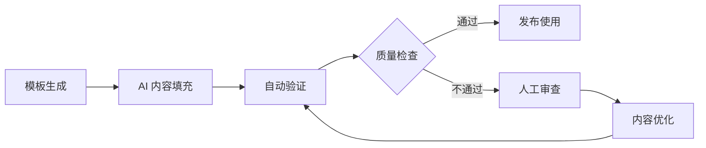

# 🎨 智能文档模板库

## 📋 概述

提供标准化的文档模板，支持 AI 辅助生成和自动填充，确保文档质量和一致性。

---

## 📄 模板分类

### 1. API 文档模板

#### 标准 API 文档
```markdown
# 🔌 {MODULE_NAME} API 文档

## 📋 概述
{AI_GENERATED_OVERVIEW}

## 🎯 接口列表

### {ENDPOINT_NAME}
**请求方式**: `{HTTP_METHOD}`  
**请求路径**: `{API_PATH}`  
**权限要求**: {REQUIRED_PERMISSIONS}

#### 请求参数
| 参数名 | 类型 | 必填 | 描述 | 示例 |
|--------|------|------|------|------|
{AI_GENERATED_PARAMS_TABLE}

#### 响应格式
```json
{AI_GENERATED_RESPONSE_EXAMPLE}
```

#### 错误码
| 状态码 | 错误码 | 描述 | 解决方案 |
|--------|--------|------|----------|
{AI_GENERATED_ERROR_TABLE}

#### 使用示例
```bash
# cURL 示例
{AI_GENERATED_CURL_EXAMPLE}
```

```javascript
// JavaScript 示例
{AI_GENERATED_JS_EXAMPLE}
```

---
*自动生成时间: {GENERATION_TIME}*
```

### 2. 功能模块文档模板

#### 模块说明文档
```markdown
# 📦 {MODULE_NAME} 模块文档

## 📖 模块概述
{AI_GENERATED_MODULE_OVERVIEW}

## 🏗️ 架构设计
```mermaid
{AI_GENERATED_ARCHITECTURE_DIAGRAM}
```

## 🎯 核心功能

### {FEATURE_NAME}
**功能描述**: {AI_GENERATED_FEATURE_DESC}  
**实现方式**: {AI_GENERATED_IMPLEMENTATION}  
**使用场景**: {AI_GENERATED_USE_CASES}

#### 代码示例
```typescript
{AI_GENERATED_CODE_EXAMPLE}
```

## ⚙️ 配置说明

### 环境变量
| 变量名 | 默认值 | 描述 | 示例 |
|--------|--------|------|------|
{AI_GENERATED_CONFIG_TABLE}

### 配置文件
```yaml
{AI_GENERATED_CONFIG_EXAMPLE}
```

## 🔧 故障排查

### 常见问题
{AI_GENERATED_FAQ_SECTION}

### 调试技巧
{AI_GENERATED_DEBUG_TIPS}

## 📚 相关资源
{AI_GENERATED_RELATED_LINKS}

---
*模块版本: {MODULE_VERSION}*  
*文档更新: {UPDATE_TIME}*
```

### 3. 部署指南模板

#### 部署文档模板
```markdown
# 🚀 {SERVICE_NAME} 部署指南

## 📋 部署概述
{AI_GENERATED_DEPLOYMENT_OVERVIEW}

## 🛠️ 环境要求

### 系统要求
{AI_GENERATED_SYSTEM_REQUIREMENTS}

### 软件依赖
{AI_GENERATED_SOFTWARE_DEPENDENCIES}

## 📦 部署步骤

### 1. 环境准备
```bash
{AI_GENERATED_SETUP_COMMANDS}
```

### 2. 应用部署
```bash
{AI_GENERATED_DEPLOYMENT_COMMANDS}
```

### 3. 服务启动
```bash
{AI_GENERATED_START_COMMANDS}
```

## 🔍 验证部署

### 健康检查
```bash
{AI_GENERATED_HEALTH_CHECK_COMMANDS}
```

### 功能测试
{AI_GENERATED_FUNCTIONALITY_TESTS}

## 🚨 故障恢复

### 回滚步骤
```bash
{AI_GENERATED_ROLLBACK_COMMANDS}
```

### 紧急处理
{AI_GENERATED_EMERGENCY_PROCEDURES}

---
*部署环境: {DEPLOYMENT_ENV}*  
*部署版本: {DEPLOYMENT_VERSION}*
```

---

## 🤖 AI 模板生成器

### 使用方法
```bash
# 生成 API 文档
npm run docs:template:api -- --module=users --controller=UsersController

# 生成模块文档
npm run docs:template:module -- --name=authentication --path=src/auth

# 生成部署指南
npm run docs:template:deploy -- --service=backend --env=production
```

### 模板配置
```yaml
# templates/config.yml
ai_templates:
  api_doc:
    model: "gpt-4-turbo-preview"
    temperature: 0.2
    max_tokens: 3000
    prompt_template: "api_documentation"
  
  module_doc:
    model: "claude-3-sonnet"
    temperature: 0.3
    max_tokens: 4000
    prompt_template: "module_documentation"
  
  deployment_guide:
    model: "gpt-4"
    temperature: 0.1
    max_tokens: 2500
    prompt_template: "deployment_guide"
```

---

## 📊 模板质量控制

### 自动验证规则
```typescript
interface TemplateValidation {
  structure: {
    hasTitle: boolean;
    hasOverview: boolean;
    hasExamples: boolean;
    hasTroubleshooting: boolean;
  };
  content: {
    minWordCount: number;
    codeExampleCount: number;
    linkValidation: boolean;
  };
  ai_quality: {
    relevanceScore: number;
    completenessScore: number;
    clarityScore: number;
  };
}
```

### 质量评分标准
- **优秀 (90-100分)**: 内容完整、示例丰富、结构清晰
- **良好 (80-89分)**: 基本完整、示例适当、结构合理
- **及格 (70-79分)**: 内容基本、示例较少、结构简单
- **需改进 (<70分)**: 内容不足、缺少示例、结构混乱

---

## 🎯 最佳实践

### 1. 模板设计原则
- **标准化**: 统一的格式和结构
- **可扩展**: 支持自定义字段和内容
- **智能化**: AI 辅助生成和优化
- **可维护**: 易于更新和修改

### 2. 内容生成策略
- **上下文感知**: 基于代码上下文生成相关内容
- **示例丰富**: 提供多种使用场景的示例
- **准确性优先**: 确保生成内容的技术准确性
- **用户友好**: 面向不同技术水平的用户

### 3. 质量保证流程


---

**最后更新**: 2025年10月5日  
**模板版本**: v2.0.0  
**维护团队**: AI 团队 + 文档团队