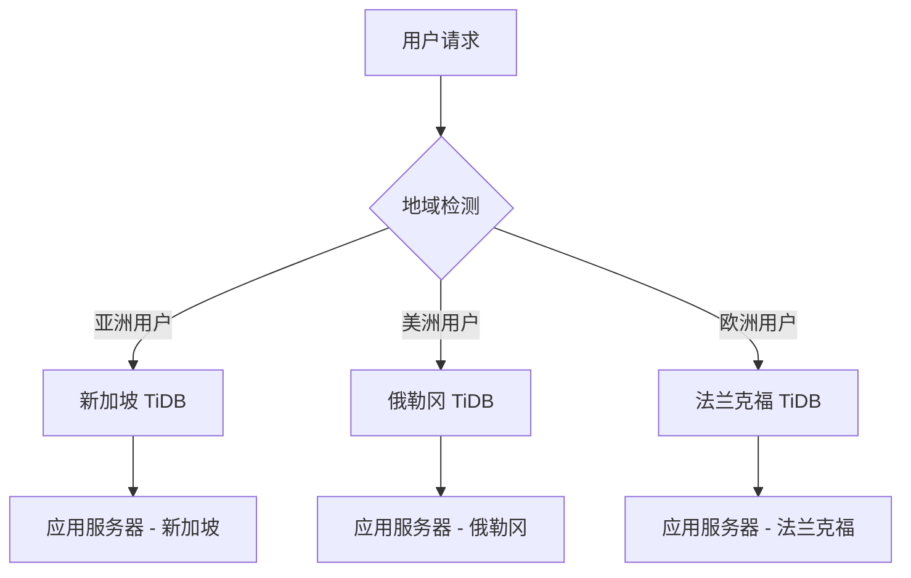

# TiDB Cloud 设置指南（面向国际买家）

## 为什么选择 TiDB Cloud？

对于面向国际买家的电商网站，TiDB Cloud 是理想选择：

✅ **全球分布式**：支持多地域部署，降低国际用户访问延迟  
✅ **MySQL 兼容**：无需修改现有代码，完全兼容 MySQL 协议  
✅ **弹性扩展**：根据业务增长自动扩容，支持高并发  
✅ **HTAP 架构**：同时支持事务处理和实时分析  
✅ **无运维负担**：托管服务，专注业务开发  

## 快速开始

### 1. 注册 TiDB Cloud 账户

访问 [TiDB Cloud](https://tidbcloud.com) 并注册账户：

1. 选择 **Developer Tier**（免费试用）或 **Dedicated Tier**（生产环境）
2. 选择地域：
   - **亚太地区**：`ap-southeast-1` (新加坡) - 适合亚洲用户
   - **美国**：`us-west-2` (俄勒冈) - 适合美洲用户  
   - **欧洲**：`eu-central-1` (法兰克福) - 适合欧洲用户

### 2. 创建集群

1. 在控制台点击 **Create Cluster**
2. 配置集群：
   ```
   Cluster Name: caddy-shopping-international
   Cloud Provider: AWS
   Region: ap-southeast-1 (或根据主要用户群体选择)
   Cluster Type: Developer Tier (免费) 或 Dedicated Tier
   ```

3. 等待集群创建完成（通常 5-15 分钟）

### 3. 获取连接信息

集群创建完成后，在 **Connect** 页面获取：

```bash
# 连接信息示例
Host: gateway01.ap-southeast-1.prod.aws.tidbcloud.com
Port: 4000
Username: your_username
Password: your_password
Database: test (默认数据库)
```

### 4. 配置环境变量

复制 `.env.tidb` 为 `.env`，并更新连接信息：

```bash
cp .env.tidb .env
```

编辑 `.env` 文件：

```env
# TiDB Cloud 连接配置
DATABASE_TYPE=mysql
DATABASE_HOST=gateway01.ap-southeast-1.prod.aws.tidbcloud.com
DATABASE_PORT=4000
DATABASE_USERNAME=your_actual_username
DATABASE_PASSWORD=your_actual_password
DATABASE_NAME=caddy_shopping
DATABASE_SSL=true

# 国际化配置
DEFAULT_TIMEZONE=UTC
SUPPORTED_LOCALES=en,zh,ja,ko,es,fr,de
DEFAULT_LOCALE=en
```

### 5. 创建数据库

连接到 TiDB 并创建应用数据库：

```sql
-- 使用 MySQL 客户端或 TiDB Cloud 控制台
CREATE DATABASE caddy_shopping CHARACTER SET utf8mb4 COLLATE utf8mb4_unicode_ci;
```

### 6. 运行迁移

```bash
cd backend
npm run migration:run
```

### 7. 启动应用

```bash
npm run start:dev
```

## 生产环境优化

### 1. 连接池配置

```env
# 针对国际网络优化
DATABASE_CONNECTION_LIMIT=50
DATABASE_ACQUIRE_TIMEOUT=60000
DATABASE_TIMEOUT=30000
DATABASE_IDLE_TIMEOUT=300000
```

### 2. 地域部署策略



### 3. 性能监控

在 TiDB Cloud 控制台监控：

- **QPS**：每秒查询数
- **延迟**：P99 响应时间
- **连接数**：活跃连接监控
- **存储**：数据增长趋势

### 4. 备份策略

```bash
# 自动备份（TiDB Cloud 默认启用）
- 每日自动备份
- 保留 7 天
- 跨地域备份（可选）

# 手动备份
mysqldump -h gateway01.ap-southeast-1.prod.aws.tidbcloud.com \
  -P 4000 -u username -p \
  --single-transaction \
  caddy_shopping > backup_$(date +%Y%m%d).sql
```

## 成本优化

### Developer Tier（免费）
- **存储**：500 MB
- **计算**：1 vCPU
- **适用**：开发测试、小型应用

### Dedicated Tier（按需付费）
- **存储**：按 GB 计费
- **计算**：按 vCPU 小时计费
- **网络**：跨地域流量费用
- **适用**：生产环境

### 成本控制建议

1. **合理选择实例规格**：根据实际负载选择
2. **启用自动暂停**：开发环境可配置自动暂停
3. **监控资源使用**：定期检查存储和计算使用情况
4. **优化查询**：减少不必要的数据传输

## 故障排除

### 连接问题

```bash
# 测试连接
mysql -h gateway01.ap-southeast-1.prod.aws.tidbcloud.com \
  -P 4000 -u username -p \
  -e "SELECT VERSION();"
```

### 常见错误

1. **SSL 连接错误**
   ```env
   DATABASE_SSL=true
   ```

2. **超时错误**
   ```env
   DATABASE_TIMEOUT=30000
   DATABASE_ACQUIRE_TIMEOUT=60000
   ```

3. **字符集问题**
   ```sql
   ALTER DATABASE caddy_shopping CHARACTER SET utf8mb4 COLLATE utf8mb4_unicode_ci;
   ```

## 迁移检查清单

- [ ] TiDB Cloud 集群已创建
- [ ] 连接信息已配置到 `.env`
- [ ] 数据库 `caddy_shopping` 已创建
- [ ] 迁移脚本执行成功
- [ ] 应用启动无错误
- [ ] Swagger 文档可访问：http://localhost:3000/api/docs
- [ ] 新增接口测试通过：
  - [ ] 收货地址 CRUD
  - [ ] 行政区划查询
  - [ ] 验证码发送

## 下一步

1. **配置 Redis**：使用 TiDB Cloud 的 Redis 服务或其他云 Redis
2. **设置监控**：集成 Grafana + Prometheus
3. **配置 CDN**：加速静态资源访问
4. **部署多地域**：根据用户分布部署应用服务器

---

🎉 **恭喜！** 你的国际电商后端已配置 TiDB Cloud，具备全球分布式数据库能力！