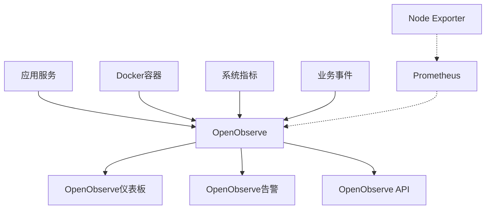

# OpenObserve使用指南和最佳实践

## 1. 概述

本文档提供了OpenObserve监控系统的完整使用指南，包括基本操作、高级功能和最佳实践。OpenObserve是一个现代化的可观测性平台，统一了日志、指标和追踪数据的收集、存储和分析。

### 1.1 系统架构



### 1.2 核心功能

- **统一数据收集**: 支持日志、指标、追踪数据
- **高性能存储**: 列式存储，压缩比高
- **实时查询**: SQL查询接口，响应速度快
- **内置可视化**: 替代Grafana的仪表板功能
- **自动告警**: 内置告警引擎和通知系统

## 2. 快速开始

### 2.1 访问OpenObserve

1. 打开浏览器访问: http://localhost:5080
2. 使用管理员账户登录:
   - 邮箱: admin@example.com
   - 密码: ComplexPass#123

### 2.2 基本界面导航

- **仪表板**: 数据可视化和监控面板
- **日志**: 日志数据查询和分析
- **指标**: 指标数据查询和图表
- **追踪**: 分布式追踪数据查看
- **告警**: 告警规则配置和管理
- **设置**: 系统配置和组织管理

## 3. 数据流管理

### 3.1 预配置数据流

系统已预配置以下数据流：

| 数据流名称 | 类型 | 保留期 | 用途 |
|-----------|------|--------|------|
| application-logs | 日志 | 30天 | 应用程序日志 |
| system-metrics | 指标 | 90天 | 系统性能指标 |
| request-traces | 追踪 | 7天 | 请求追踪数据 |
| business-events | 日志 | 365天 | 业务事件日志 |
| error-logs | 日志 | 90天 | 错误日志专用 |

### 3.2 创建自定义数据流

1. 导航到 **设置** > **数据流**
2. 点击 **新建数据流**
3. 配置数据流参数：
   ```yaml
   name: "custom-logs"
   type: "logs"
   retention: "60d"
   max_file_size: "256MB"
   compression: "gzip"
   index_enabled: true
   ```
4. 点击 **保存** 创建数据流

### 3.3 数据流最佳实践

- **合理设置保留期**: 根据数据重要性和存储成本设置保留期
- **启用压缩**: 使用gzip压缩减少存储空间
- **索引优化**: 为频繁查询的字段启用索引
- **文件大小控制**: 设置合适的文件大小以平衡查询性能和存储效率

## 4. 日志查询和分析

### 4.1 基本日志查询

1. 导航到 **日志** 页面
2. 选择数据流（如：application-logs）
3. 使用SQL语法进行查询：

```sql
-- 查询最近的错误日志
SELECT * FROM application-logs 
WHERE level = 'ERROR' 
AND timestamp >= now() - INTERVAL '1 hour' 
ORDER BY timestamp DESC 
LIMIT 100

-- 查询特定服务的日志
SELECT * FROM application-logs 
WHERE service = 'user-service' 
AND timestamp >= now() - INTERVAL '24 hours'

-- 统计错误日志数量
SELECT level, COUNT(*) as count 
FROM application-logs 
WHERE timestamp >= now() - INTERVAL '1 day' 
GROUP BY level
```

### 4.2 高级日志分析

#### 4.2.1 时间序列分析

```sql
-- 按小时统计错误数量
SELECT 
    time_bucket('1 hour', timestamp) as hour,
    COUNT(*) as error_count
FROM application-logs 
WHERE level = 'ERROR' 
AND timestamp >= now() - INTERVAL '24 hours'
GROUP BY hour 
ORDER BY hour DESC
```

#### 4.2.2 模式匹配

```sql
-- 使用正则表达式匹配特定模式
SELECT * FROM application-logs 
WHERE message ~ 'HTTP.*5\d{2}' 
AND timestamp >= now() - INTERVAL '1 hour'

-- 查找包含特定关键词的日志
SELECT * FROM application-logs 
WHERE match(message, 'database connection failed')
```

#### 4.2.3 聚合分析

```sql
-- 按服务和日志级别统计
SELECT 
    service,
    level,
    COUNT(*) as count,
    AVG(duration) as avg_duration
FROM application-logs 
WHERE timestamp >= now() - INTERVAL '1 day'
GROUP BY service, level
ORDER BY count DESC
```

### 4.3 性能优化建议

- **使用时间范围限制**: 始终在查询中包含时间范围
- **选择性字段查询**: 避免使用 `SELECT *`，只查询需要的字段
- **索引利用**: 在WHERE子句中使用索引字段
- **查询结果限制**: 使用LIMIT限制查询结果数量

## 5. 指标监控

### 5.1 系统指标查询

1. 导航到 **指标** 页面
2. 选择system-metrics数据流
3. 使用SQL查询指标数据：

```sql
-- CPU使用率趋势
SELECT 
    timestamp,
    value as cpu_usage
FROM system-metrics 
WHERE metric_name = 'cpu_usage_percent' 
AND timestamp >= now() - INTERVAL '1 hour'
ORDER BY timestamp DESC

-- 内存使用情况
SELECT 
    timestamp,
    value as memory_usage
FROM system-metrics 
WHERE metric_name = 'memory_usage_percent' 
AND timestamp >= now() - INTERVAL '1 hour'
ORDER BY timestamp DESC

-- 磁盘使用率
SELECT 
    timestamp,
    value as disk_usage
FROM system-metrics 
WHERE metric_name = 'disk_usage_percent' 
AND timestamp >= now() - INTERVAL '24 hours'
ORDER BY timestamp DESC
```

### 5.2 应用指标监控

```sql
-- 请求响应时间趋势
SELECT 
    time_bucket('5 minutes', timestamp) as time_window,
    AVG(CAST(value AS DOUBLE)) as avg_response_time,
    MAX(CAST(value AS DOUBLE)) as max_response_time,
    MIN(CAST(value AS DOUBLE)) as min_response_time
FROM system-metrics 
WHERE metric_name = 'http_request_duration_ms' 
AND timestamp >= now() - INTERVAL '1 hour'
GROUP BY time_window
ORDER BY time_window DESC

-- 请求量统计
SELECT 
    time_bucket('5 minutes', timestamp) as time_window,
    COUNT(*) as request_count
FROM system-metrics 
WHERE metric_name = 'http_requests_total' 
AND timestamp >= now() - INTERVAL '1 hour'
GROUP BY time_window
ORDER BY time_window DESC
```

### 5.3 自定义指标

#### 5.3.1 业务指标定义

```sql
-- 用户活跃度指标
SELECT 
    time_bucket('1 hour', timestamp) as hour,
    COUNT(DISTINCT user_id) as active_users
FROM business-events 
WHERE event_type = 'user_activity' 
AND timestamp >= now() - INTERVAL '24 hours'
GROUP BY hour
ORDER BY hour DESC

-- 订单统计指标
SELECT 
    time_bucket('1 hour', timestamp) as hour,
    COUNT(*) as order_count,
    SUM(CAST(amount AS DOUBLE)) as total_amount
FROM business-events 
WHERE event_type = 'order_created' 
AND timestamp >= now() - INTERVAL '24 hours'
GROUP BY hour
ORDER BY hour DESC
```

## 6. 仪表板创建和管理

### 6.1 创建仪表板

1. 导航到 **仪表板** 页面
2. 点击 **新建仪表板**
3. 配置仪表板基本信息：
   - 名称: 系统概览
   - 描述: 系统整体运行状态监控
   - 刷新间隔: 30秒

### 6.2 添加面板

#### 6.2.1 CPU使用率面板

```sql
-- 查询语句
SELECT 
    timestamp,
    value as cpu_usage
FROM system-metrics 
WHERE metric_name = 'cpu_usage_percent' 
AND timestamp >= now() - INTERVAL '1 hour'
ORDER BY timestamp DESC
```

配置选项：
- 图表类型: 线图
- Y轴标签: CPU使用率(%)
- 单位: 百分比
- 阈值: 80%

#### 6.2.2 内存使用率面板

```sql
-- 查询语句
SELECT 
    timestamp,
    value as memory_usage
FROM system-metrics 
WHERE metric_name = 'memory_usage_percent' 
AND timestamp >= now() - INTERVAL '1 hour'
ORDER BY timestamp DESC
```

配置选项：
- 图表类型: 线图
- Y轴标签: 内存使用率(%)
- 单位: 百分比
- 阈值: 85%

#### 6.2.3 错误日志统计面板

```sql
-- 查询语句
SELECT 
    time_bucket('5 minutes', timestamp) as time_window,
    COUNT(*) as error_count
FROM application-logs 
WHERE level = 'ERROR' 
AND timestamp >= now() - INTERVAL '1 hour'
GROUP BY time_window
ORDER BY time_window DESC
```

配置选项：
- 图表类型: 柱状图
- Y轴标签: 错误数量
- 单位: 计数

### 6.3 仪表板最佳实践

- **合理布局**: 按照重要性和关联性排列面板
- **统一时间范围**: 确保相关面板使用相同的时间范围
- **适当的刷新间隔**: 根据数据更新频率设置刷新间隔
- **清晰的标签**: 使用描述性的标题和轴标签
- **颜色编码**: 使用一致的颜色方案表示不同状态

## 7. 告警配置

### 7.1 告警规则创建

1. 导航到 **告警** 页面
2. 点击 **新建告警规则**
3. 配置告警规则：

#### 7.1.1 高错误率告警

```yaml
name: "HighErrorRate"
description: "错误率超过5%"
condition: |
  SELECT count(*) as error_count 
  FROM application-logs 
  WHERE level='ERROR' 
  AND timestamp >= now() - INTERVAL '5 minutes' 
  GROUP BY time_bucket('1 minute', timestamp) 
  HAVING error_count > 100
severity: "critical"
for: "5m"
labels:
  team: "backend"
  service: "application"
annotations:
  summary: "应用错误率过高"
  description: "过去5分钟内错误次数超过100次"
```

#### 7.1.2 高内存使用率告警

```yaml
name: "HighMemoryUsage"
description: "内存使用率超过85%"
condition: |
  SELECT value 
  FROM system-metrics 
  WHERE metric_name='memory_usage_percent' 
  AND timestamp >= now() - INTERVAL '5 minutes' 
  ORDER BY timestamp DESC 
  LIMIT 1 
  HAVING value > 85
severity: "warning"
for: "5m"
labels:
  team: "ops"
annotations:
  summary: "系统内存使用率过高"
  description: "当前内存使用率超过85%"
```

### 7.2 通知配置

#### 7.2.1 邮件通知

```yaml
name: "email"
type: "email"
enabled: true
config:
  smtp_host: "smtp.example.com"
  smtp_port: 587
  smtp_username: "alerts@example.com"
  smtp_password: "password"
  from: "alerts@example.com"
  to: ["admin@example.com", "ops@example.com"]
```

#### 7.2.2 Webhook通知

```yaml
name: "webhook"
type: "webhook"
enabled: true
config:
  url: "https://hooks.slack.com/services/YOUR/SLACK/WEBHOOK"
  method: "POST"
  headers:
    Content-Type: "application/json"
  template: |
    {
      "text": "告警: {{ .alert.name }}",
      "attachments": [
        {
          "color": "{{ if eq .alert.severity \"critical\" }}danger{{ else }}warning{{ end }}",
          "fields": [
            {
              "title": "描述",
              "value": "{{ .alert.description }}",
              "short": false
            },
            {
              "title": "严重程度",
              "value": "{{ .alert.severity }}",
              "short": true
            },
            {
              "title": "时间",
              "value": "{{ .alert.timestamp }}",
              "short": true
            }
          ]
        }
      ]
    }
```

### 7.3 告警最佳实践

- **合理的阈值**: 设置基于历史数据的合理阈值
- **避免告警风暴**: 使用告警抑制和分组规则
- **清晰的描述**: 提供详细的告警描述和处理建议
- **分级处理**: 根据严重程度设置不同的通知策略
- **定期审查**: 定期检查和更新告警规则

## 8. 性能优化

### 8.1 查询性能优化

#### 8.1.1 索引策略

```sql
-- 创建时间索引
CREATE INDEX idx_application_logs_timestamp ON application-logs(timestamp);

-- 创建日志级别索引
CREATE INDEX idx_application_logs_level ON application-logs(level);

-- 创建服务名索引
CREATE INDEX idx_application_logs_service ON application-logs(service);
```

#### 8.1.2 查询优化技巧

```sql
-- 优化前：全表扫描
SELECT * FROM application-logs WHERE message LIKE '%error%';

-- 优化后：使用全文索引
SELECT * FROM application-logs WHERE match(message, 'error');

-- 优化前：无时间限制
SELECT * FROM application-logs WHERE level = 'ERROR';

-- 优化后：添加时间限制
SELECT * FROM application-logs 
WHERE level = 'ERROR' 
AND timestamp >= now() - INTERVAL '1 hour';
```

### 8.2 存储优化

#### 8.2.1 数据压缩

- 启用gzip压缩减少存储空间
- 设置合适的文件大小（256MB-512MB）
- 定期清理过期数据

#### 8.2.2 数据保留策略

```yaml
# 不同类型数据的保留策略
retention_policies:
  application_logs: "30d"
  system_metrics: "90d"
  request_traces: "7d"
  business_events: "365d"
  error_logs: "90d"
```

### 8.3 系统资源优化

#### 8.3.1 内存配置

```yaml
# OpenObserve内存优化配置
memory:
  cache_enabled: true
  max_size: "2GB"
  cache_latest_files: true
  wal_memory_mode: true
  wal_memory_max_size: "1GB"
```

#### 8.3.2 CPU配置

```yaml
# CPU资源限制
cpu_limit: "2.0"
cpu_reservation: "1.0"
```

## 9. 故障排除

### 9.1 常见问题

#### 9.1.1 查询超时

**问题**: 查询执行时间过长导致超时

**解决方案**:
```sql
-- 优化查询，添加时间限制
SELECT * FROM application-logs 
WHERE timestamp >= now() - INTERVAL '1 hour' 
LIMIT 1000;

-- 增加查询超时时间
SET query_timeout = '5m';
```

#### 9.1.2 数据写入失败

**问题**: 数据无法写入OpenObserve

**解决方案**:
1. 检查数据流是否存在
2. 验证数据格式是否正确
3. 检查磁盘空间是否充足
4. 查看OpenObserve日志

#### 9.1.3 告警不触发

**问题**: 告警规则配置正确但不触发

**解决方案**:
1. 检查告警条件是否匹配数据
2. 验证时间范围设置
3. 检查告警评估间隔
4. 查看告警日志

### 9.2 日志分析

#### 9.2.1 OpenObserve日志位置

- 容器内: `/data/logs/openobserve.log`
- 主机映射: `./logs/openobserve/`

#### 9.2.2 常用日志查询

```sql
-- 查询OpenObserve错误日志
SELECT * FROM openobserve_logs 
WHERE level = 'ERROR' 
AND timestamp >= now() - INTERVAL '1 hour';

-- 查询慢查询日志
SELECT * FROM openobserve_logs 
WHERE message LIKE '%slow query%' 
AND timestamp >= now() - INTERVAL '24 hours';
```

## 10. 安全最佳实践

### 10.1 访问控制

#### 10.1.1 用户管理

1. 创建不同角色的用户账户
2. 为每个用户分配最小必要权限
3. 定期审查用户权限
4. 禁用不再使用的账户

#### 10.1.2 API密钥管理

```yaml
# API密钥配置
api_keys:
  - name: "application-logs"
    permissions: ["read", "write"]
    streams: ["application-logs"]
    expiration: "30d"
  - name: "metrics-read"
    permissions: ["read"]
    streams: ["system-metrics"]
    expiration: "90d"
```

### 10.2 数据安全

#### 10.2.1 数据加密

- 启用传输加密（HTTPS/TLS）
- 配置静态数据加密
- 定期更新SSL证书

#### 10.2.2 网络安全

```yaml
# 网络安全配置
network:
  allowed_origins: 
    - "https://yourdomain.com"
    - "https://monitoring.yourdomain.com"
  rate_limit:
    enabled: true
    requests_per_minute: 1000
```

## 11. 监控和维护

### 11.1 系统监控

#### 11.1.1 关键指标

- CPU使用率 < 80%
- 内存使用率 < 85%
- 磁盘使用率 < 90%
- 查询响应时间 < 2秒
- 数据写入延迟 < 1秒

#### 11.1.2 监控仪表板

创建专门的OpenObserve系统监控仪表板，监控：
- OpenObserve服务状态
- 数据写入速率
- 查询性能
- 存储使用情况
- 错误率

### 11.2 定期维护

#### 11.2.1 每日维护任务

- 检查系统健康状态
- 查看错误日志
- 验证告警规则
- 监控资源使用情况

#### 11.2.2 每周维护任务

- 清理过期数据
- 优化查询性能
- 更新仪表板
- 审查用户权限

#### 11.2.3 每月维护任务

- 系统性能评估
- 容量规划
- 安全审计
- 备份验证

## 12. 总结

OpenObserve作为一个统一的可观测性平台，提供了强大的日志、指标和追踪数据处理能力。通过遵循本指南的最佳实践，您可以：

1. **高效管理数据**: 合理配置数据流和保留策略
2. **优化查询性能**: 使用索引和查询优化技巧
3. **构建有效监控**: 创建有意义的仪表板和告警规则
4. **确保系统稳定**: 实施适当的监控和维护策略
5. **保障数据安全**: 遵循安全最佳实践

定期审查和优化您的OpenObserve配置，确保它能够满足不断变化的业务需求。