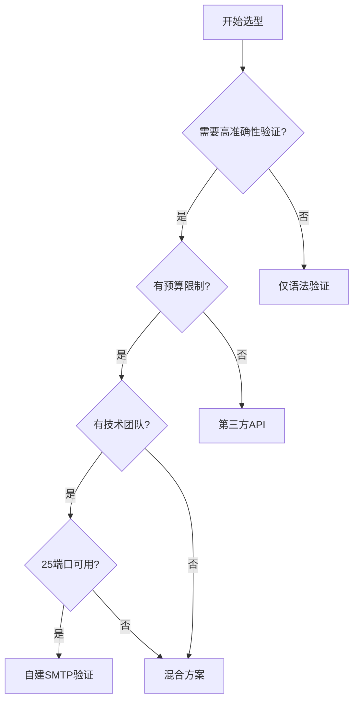

# 技术方案对比分析

## 目录
- [技术方案对比](#技术方案对比)
- [选型决策树](#选型决策树)
- [场景化选型建议](#场景化选型建议)
- [成本效益对比](#成本效益对比)
- [风险评估](#风险评估)
- [实施复杂度对比](#实施复杂度对比)
- [长期维护对比](#长期维护对比)

## 技术方案对比

### 邮箱验证方案对比表

| 方案 | 实现复杂度 | 成本 | 准确性 | 性能 | 可扩展性 | 维护难度 | 推荐度 |
|------|------------|------|--------|------|----------|----------|--------|
| 自建SMTP验证 | 高 | 中 | 高 | 中 | 中 | 高 | ⭐⭐⭐ |
| 第三方API | 低 | 高 | 高 | 高 | 高 | 低 | ⭐⭐⭐⭐ |
| 混合方案 | 中 | 中 | 高 | 高 | 高 | 中 | ⭐⭐⭐⭐⭐ |
| 仅语法验证 | 低 | 低 | 低 | 高 | 高 | 低 | ⭐⭐ |

### 详细对比分析

#### 1. 自建SMTP验证

**优势**
- **数据控制**：完全控制验证过程和数据
- **成本可控**：无第三方API费用
- **定制化强**：可根据业务需求定制验证逻辑
- **无依赖**：不依赖第三方服务

**劣势**
- **实现复杂**：需要处理各种SMTP协议细节
- **网络限制**：受25端口封锁影响
- **维护成本高**：需要持续维护和更新
- **性能瓶颈**：处理大量验证请求时可能性能不足

**适用场景**
- 对数据隐私要求极高的场景
- 有专业技术团队维护的场景
- 验证量相对较小的场景

#### 2. 第三方API

**优势**
- **实现简单**：集成API即可使用
- **准确性高**：专业服务，验证结果准确
- **性能好**：专业优化，处理速度快
- **维护成本低**：无需自行维护

**劣势**
- **成本高**：按使用量计费，成本较高
- **数据风险**：邮箱数据需发送给第三方
- **依赖性强**：依赖第三方服务的可用性
- **定制化差**：难以根据业务需求定制

**适用场景**
- 快速上线的项目
- 缺乏技术团队的项目
- 验证量不大的项目

#### 3. 混合方案

**优势**
- **灵活性强**：可根据不同情况选择验证方式
- **成本可控**：通过智能路由降低成本
- **准确性高**：结合多种验证方式提高准确性
- **可扩展性好**：可根据业务增长扩展验证能力

**劣势**
- **实现复杂**：需要整合多种验证方式
- **维护成本中等**：需要维护多种验证组件
- **技术要求高**：需要较高的技术能力

**适用场景**
- 大型企业的邮箱验证需求
- 对成本和准确性都有要求的场景
- 有专业技术团队的项目

#### 4. 仅语法验证

**优势**
- **实现简单**：只需实现正则表达式验证
- **成本极低**：几乎无成本
- **性能极高**：验证速度极快
- **无依赖**：不依赖任何外部服务

**劣势**
- **准确性低**：无法验证邮箱是否真实存在
- **业务价值有限**：只能过滤格式错误的邮箱
- **用户体验差**：无法提供准确的验证反馈

**适用场景**
- 对验证准确性要求极低的场景
- 成本极其敏感的场景
- 仅需过滤格式错误邮箱的场景

## 选型决策树

### 决策流程说明

1. **准确性需求评估**
   - 如果不需要高准确性验证，选择仅语法验证
   - 如果需要高准确性验证，继续下一步

2. **预算限制评估**
   - 如果没有预算限制，选择第三方API
   - 如果有预算限制，继续下一步

3. **技术团队能力评估**
   - 如果没有技术团队，选择第三方API
   - 如果有技术团队，继续下一步

4. **网络环境评估**
   - 如果25端口可用，选择自建SMTP验证
   - 如果25端口不可用，选择混合方案

## 场景化选型建议

### 1. 电商平台

#### 场景特点
- **用户量大**：注册用户数量多
- **验证频率高**：注册和营销活动频繁
- **成本敏感**：对运营成本敏感
- **准确性要求高**：需要确保用户质量

#### 推荐方案
- **混合方案**：结合自建验证和第三方API
- **实施策略**：
  - 用户注册使用混合验证
  - 营销邮件清洗使用第三方API
  - 高价值客户验证使用多重验证

#### 预期效果
- **成本控制**：通过智能路由降低30%验证成本
- **准确性提升**：达到95%以上的验证准确性
- **用户体验优化**：注册成功率提升15%

### 2. 企业应用

#### 场景特点
- **用户量中等**：员工数量相对有限
- **验证频率低**：主要在员工入职时验证
- **数据安全要求高**：对企业数据安全要求高
- **准确性要求高**：需要确保员工邮箱有效

#### 推荐方案
- **自建SMTP验证**：在企业内部部署验证系统
- **实施策略**：
  - 企业内部部署验证系统
  - 配置代理服务器解决网络限制
  - 建立定期更新机制

#### 预期效果
- **数据安全**：完全控制企业邮箱数据
- **成本可控**：一次性投入，长期使用
- **定制化强**：可根据企业需求定制验证规则

### 3. 初创公司

#### 场景特点
- **用户量小**：初期用户数量有限
- **预算紧张**：资金有限，对成本敏感
- **技术团队小**：技术团队规模有限
- **快速上线需求**：需要快速推出产品

#### 推荐方案
- **第三方API**：使用成熟的第三方验证服务
- **实施策略**：
  - 选择性价比高的第三方API
  - 实现基础缓存机制降低API调用
  - 监控API使用量控制成本

#### 预期效果
- **快速上线**：1-2天内完成集成
- **成本可控**：按使用量付费，初期成本低
- **准确性高**：利用专业服务确保验证质量

### 4. 大型企业

#### 场景特点
- **用户量巨大**：用户数量庞大
- **业务多样化**：多个业务线有不同验证需求
- **技术实力强**：有强大的技术团队
- **成本与准确性并重**：既要控制成本又要确保准确性

#### 推荐方案
- **混合方案**：构建企业级邮箱验证平台
- **实施策略**：
  - 构建智能路由系统分配验证请求
  - 自建验证服务处理常规验证
  - 第三方API处理复杂验证场景
  - 建立完善的监控和分析系统

#### 预期效果
- **成本优化**：通过智能路由降低40%验证成本
- **准确性保证**：达到98%以上的验证准确性
- **可扩展性强**：支持业务快速增长和多样化需求

## 成本效益对比

### 初始投入成本对比

| 方案 | 开发成本 | 基础设施成本 | 第三方费用 | 总计 |
|------|----------|--------------|------------|------|
| 自建SMTP验证 | $20,000-50,000 | $5,000-10,000 | $0 | $25,000-60,000 |
| 第三方API | $2,000-5,000 | $1,000-2,000 | $0 | $3,000-7,000 |
| 混合方案 | $10,000-20,000 | $3,000-5,000 | $0 | $13,000-25,000 |
| 仅语法验证 | $500-1,000 | $500-1,000 | $0 | $1,000-2,000 |

### 年度运营成本对比

| 方案 | 服务器成本 | 带宽成本 | 维护成本 | 第三方费用 | 总计 |
|------|------------|----------|----------|------------|------|
| 自建SMTP验证 | $6,000-12,000 | $1,000-2,000 | $10,000-20,000 | $0 | $17,000-34,000 |
| 第三方API | $1,000-2,000 | $500-1,000 | $2,000-3,000 | $10,000-50,000 | $13,500-56,000 |
| 混合方案 | $3,000-6,000 | $500-1,000 | $5,000-8,000 | $5,000-20,000 | $13,500-35,000 |
| 仅语法验证 | $500-1,000 | $200-500 | $1,000-2,000 | $0 | $1,700-3,500 |

### 成本效益分析

#### 小规模验证（<10万次/月）
- **自建SMTP验证**：投入高，不经济
- **第三方API**：成本适中，推荐
- **混合方案**：投入较高，不推荐
- **仅语法验证**：成本最低，但准确性不足

#### 中规模验证（10-100万次/月）
- **自建SMTP验证**：开始显现经济效益
- **第三方API**：成本较高，但准确性好
- **混合方案**：成本和准确性平衡，推荐
- **仅语法验证**：成本最低，但业务价值有限

#### 大规模验证（>100万次/月）
- **自建SMTP验证**：经济效益显著
- **第三方API**：成本极高，不经济
- **混合方案**：成本效益最优，强烈推荐
- **仅语法验证**：成本最低，但无法满足业务需求

## 风险评估

### 技术风险

#### 自建SMTP验证
- **风险等级**：高
- **主要风险**：
  - 网络端口限制
  - SMTP协议复杂性
  - 性能瓶颈
  - 安全漏洞
- **缓解措施**：
  - 配置代理服务器
  - 使用成熟的SMTP库
  - 实施负载均衡
  - 定期安全审计

#### 第三方API
- **风险等级**：中
- **主要风险**：
  - 服务可用性
  - 数据隐私
  - 成本控制
  - 供应商依赖
- **缓解措施**：
  - 选择多个供应商
  - 签订SLA协议
  - 实施数据脱敏
  - 建立成本监控机制

#### 混合方案
- **风险等级**：中
- **主要风险**：
  - 系统复杂性
  - 集成难度
  - 一致性保证
  - 故障排查
- **缓解措施**：
  - 标准化接口设计
  - 完善的监控体系
  - 建立故障转移机制
  - 制定详细的运维手册

#### 仅语法验证
- **风险等级**：低
- **主要风险**：
  - 业务价值有限
  - 用户体验差
- **缓解措施**：
  - 明确使用场景
  - 提供用户教育
  - 结合其他验证方式

### 业务风险

#### 数据隐私风险
- **自建SMTP验证**：低风险，数据完全可控
- **第三方API**：高风险，数据需发送给第三方
- **混合方案**：中等风险，部分数据需发送给第三方
- **仅语法验证**：低风险，仅验证格式

#### 合规风险
- **自建SMTP验证**：中等风险，需自行确保合规
- **第三方API**：低风险，供应商负责合规
- **混合方案**：中等风险，需确保部分合规
- **仅语法验证**：低风险，合规要求简单

#### 供应商依赖风险
- **自建SMTP验证**：无依赖，风险低
- **第三方API**：完全依赖，风险高
- **混合方案**：部分依赖，风险中等
- **仅语法验证**：无依赖，风险低

## 实施复杂度对比

### 开发复杂度

#### 自建SMTP验证
- **复杂度等级**：高
- **主要开发任务**：
  - SMTP协议实现
  - 多级缓存系统
  - 负载均衡
  - 监控和告警
  - 错误处理
- **开发周期**：3-6个月
- **技术要求**：高，需要网络和协议专业知识

#### 第三方API
- **复杂度等级**：低
- **主要开发任务**：
  - API集成
  - 错误处理
  - 基础缓存
- **开发周期**：1-2周
- **技术要求**：低，基础API集成知识

#### 混合方案
- **复杂度等级**：中
- **主要开发任务**：
  - 智能路由系统
  - 多源集成
  - 统一接口
  - 监控和告警
- **开发周期**：2-4个月
- **技术要求**：中，需要系统集成和架构设计知识

#### 仅语法验证
- **复杂度等级**：低
- **主要开发任务**：
  - 正则表达式实现
  - 基础验证逻辑
- **开发周期**：1-3天
- **技术要求**：低，基础编程知识

### 部署复杂度

#### 自建SMTP验证
- **复杂度等级**：高
- **主要部署任务**：
  - 服务器配置
  - 网络配置
  - 安全配置
  - 监控配置
- **部署周期**：2-4周
- **运维要求**：高，需要专业运维团队

#### 第三方API
- **复杂度等级**：低
- **主要部署任务**：
  - API密钥配置
  - 基础监控
- **部署周期**：1-3天
- **运维要求**：低，基础运维知识

#### 混合方案
- **复杂度等级**：中
- **主要部署任务**：
  - 多系统部署
  - 网络配置
  - 监控配置
- **部署周期**：1-2周
- **运维要求**：中，需要一定运维经验

#### 仅语法验证
- **复杂度等级**：低
- **主要部署任务**：
  - 应用部署
- **部署周期**：1天
- **运维要求**：低，基础运维知识

## 长期维护对比

### 维护工作量

#### 自建SMTP验证
- **维护工作量**：高
- **主要维护任务**：
  - 系统更新
  - 安全补丁
  - 性能优化
  - 故障处理
- **维护团队**：需要专业团队
- **维护成本**：高

#### 第三方API
- **维护工作量**：低
- **主要维护任务**：
  - API更新适配
  - 监控API状态
- **维护团队**：小团队即可
- **维护成本**：低

#### 混合方案
- **维护工作量**：中
- **主要维护任务**：
  - 多系统维护
  - 路由规则更新
  - 性能监控
- **维护团队**：中等规模团队
- **维护成本**：中

#### 仅语法验证
- **维护工作量**：低
- **主要维护任务**：
  - 规则更新
- **维护团队**：小团队即可
- **维护成本**：低

### 扩展性

#### 自建SMTP验证
- **扩展性**：中
- **扩展难度**：中
- **扩展成本**：中
- **扩展周期**：1-2个月

#### 第三方API
- **扩展性**：高
- **扩展难度**：低
- **扩展成本**：低
- **扩展周期**：1-2周

#### 混合方案
- **扩展性**：高
- **扩展难度**：中
- **扩展成本**：中
- **扩展周期**：2-4周

#### 仅语法验证
- **扩展性**：高
- **扩展难度**：低
- **扩展成本**：低
- **扩展周期**：1周

### 技术演进适应性

#### 自建SMTP验证
- **适应性**：中
- **演进难度**：中
- **演进成本**：中
- **演进周期**：2-3个月

#### 第三方API
- **适应性**：高
- **演进难度**：低
- **演进成本**：低
- **演进周期**：1-2周

#### 混合方案
- **适应性**：高
- **演进难度**：中
- **演进成本**：中
- **演进周期**：1-2个月

#### 仅语法验证
- **适应性**：中
- **演进难度**：低
- **演进成本**：低
- **演进周期**：1-2周

## 总结与建议

### 综合评估

| 方案 | 综合评分 | 适用场景 | 推荐指数 |
|------|----------|----------|----------|
| 自建SMTP验证 | 7.5/10 | 大型企业、数据敏感场景 | ⭐⭐⭐ |
| 第三方API | 8.5/10 | 初创公司、快速上线场景 | ⭐⭐⭐⭐ |
| 混合方案 | 9.0/10 | 大型企业、成本敏感场景 | ⭐⭐⭐⭐⭐ |
| 仅语法验证 | 6.0/10 | 基础验证、成本极敏感场景 | ⭐⭐ |

### 选型建议

1. **初创公司**：推荐第三方API，快速上线，成本可控
2. **中小企业**：推荐混合方案，平衡成本和准确性
3. **大型企业**：推荐混合方案，可根据需求定制
4. **数据敏感场景**：推荐自建SMTP验证，完全控制数据
5. **成本极敏感场景**：推荐仅语法验证，最低成本

### 实施建议

1. **分阶段实施**：先实现基础功能，再逐步优化
2. **监控和评估**：持续监控系统性能和业务指标
3. **灵活调整**：根据业务发展调整验证策略
4. **团队培训**：确保技术团队具备维护能力

通过以上对比分析，企业可以根据自身业务需求、技术能力和预算限制，选择最适合的邮箱验证方案。混合方案在大多数场景下都是最佳选择，能够平衡成本、准确性和可扩展性。