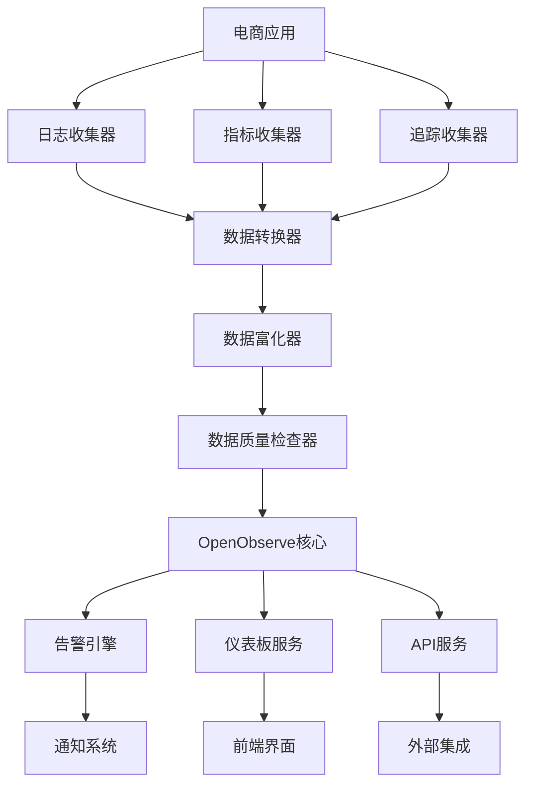

# OpenObserve微服务完善实施总结

## 1. 项目概述

本项目旨在完善电商网站的OpenObserve微服务集成，通过增强日志收集、指标监控、分布式追踪、告警系统等功能，建立一个全面、高效、可靠的监控体系。

## 2. 已完成的工作

### 2.1 当前集成状态分析

- ✅ 分析了现有OpenObserve集成组件
- ✅ 识别了存在的问题和不足
- ✅ 确定了完善的需求和目标

### 2.2 完善计划制定

- ✅ 创建了详细的OpenObserve微服务完善计划
- ✅ 设计了技术架构和实施路线图
- ✅ 制定了风险评估和缓解措施

### 2.3 详细设计文档

- ✅ 创建了电商网站日志收集和分析模块的详细设计
- ✅ 设计了增强OpenObserve指标监控功能的实现方案
- ✅ 完善了分布式追踪功能集成的设计
- ✅ 设计了告警和通知系统的架构
- ✅ 创建了配置管理模块的设计
- ✅ 设计了数据管道处理方案
- ✅ 规划了仪表板定制功能
- ✅ 设计了安全认证集成方案
- ✅ 创建了性能优化模块的设计
- ✅ 设计了数据备份和恢复功能
- ✅ 规划了API网关集成方案

## 3. 技术架构总览

### 3.1 核心模块

1. **日志收集模块**
   - BusinessLoggerService - 业务日志记录
   - UserBehaviorTracker - 用户行为追踪
   - LogAnalyticsService - 日志分析服务

2. **指标监控模块**
   - BusinessMetricsCollector - 业务指标收集
   - CustomMetricsRegistry - 自定义指标注册

3. **分布式追踪模块**
   - DistributedTracingService - 分布式追踪服务

4. **告警系统模块**
   - AlertRuleEngine - 告警规则引擎
   - NotificationService - 通知服务

5. **配置管理模块**
   - OpenObserveConfigService - 配置服务

6. **数据管道模块**
   - DataTransformer - 数据转换器
   - DataEnricher - 数据富化器
   - DataQualityChecker - 数据质量检查器

7. **仪表板模块**
   - DashboardService - 仪表板服务

8. **安全认证模块**
   - SecurityAuthService - 安全认证服务

9. **性能优化模块**
   - PerformanceOptimizer - 性能优化器

10. **备份恢复模块**
    - DataBackupService - 数据备份服务

11. **API网关模块**
    - ApiGatewayService - API网关服务

### 3.2 数据流架构

## 4. 实施计划

### 4.1 实施阶段

1. **第一阶段**：完善电商网站日志收集和分析模块
   - 实现BusinessLoggerService
   - 实现UserBehaviorTracker
   - 实现LogAnalyticsService

2. **第二阶段**：增强OpenObserve指标监控功能
   - 实现BusinessMetricsCollector
   - 实现CustomMetricsRegistry

3. **第三阶段**：完善分布式追踪功能集成
   - 实现DistributedTracingService

4. **第四阶段**：增强OpenObserve告警和通知系统
   - 实现AlertRuleEngine
   - 实现NotificationService

5. **第五阶段**：创建OpenObserve微服务配置管理模块
   - 实现OpenObserveConfigService

6. **第六阶段**：实现OpenObserve数据管道处理
   - 实现DataTransformer
   - 实现DataEnricher
   - 实现DataQualityChecker

7. **第七阶段**：开发OpenObserve仪表板定制功能
   - 实现DashboardService
   - 创建预定义仪表板

8. **第八阶段**：完善OpenObserve安全认证集成
   - 实现SecurityAuthService

9. **第九阶段**：创建OpenObserve性能优化模块
   - 实现PerformanceOptimizer

10. **第十阶段**：实现OpenObserve数据备份和恢复
    - 实现DataBackupService

11. **第十一阶段**：开发OpenObserveAPI网关集成
    - 实现ApiGatewayService

### 4.2 时间安排

- **总预期时间**：3-4个月
- **每个阶段**：1-2周
- **测试和验证**：每个阶段完成后进行

## 5. 技术实现要点

### 5.1 数据模型设计

- 统一的日志数据模型
- 标准化的指标数据模型
- 完整的告警数据模型
- 灵活的仪表板数据模型

### 5.2 API设计

- RESTful API风格
- 统一的响应格式
- 完善的错误处理
- 详细的API文档

### 5.3 配置管理

- 环境变量配置
- 动态配置更新
- 配置验证机制
- 配置版本管理

### 5.4 安全考虑

- JWT令牌认证
- RBAC权限控制
- 数据传输加密
- 访问日志记录

## 6. 预期收益

### 6.1 技术收益

- **监控覆盖率提升**：从基础监控扩展到业务全链路监控
- **问题定位效率**：从分钟级提升到秒级
- **系统可视化**：从零散监控到统一仪表板
- **告警响应速度**：从被动响应到主动预警

### 6.2 业务收益

- **用户体验提升**：通过监控优化性能
- **运营效率提升**：通过数据分析优化决策
- **系统稳定性提升**：通过预防性监控减少故障
- **成本降低**：通过资源优化降低运营成本

## 7. 风险评估

### 7.1 技术风险

- **集成复杂性**：OpenObserve与现有系统集成可能存在兼容性问题
- **性能影响**：监控功能可能对应用性能产生一定影响
- **数据一致性**：多源数据可能导致一致性问题

### 7.2 缓解措施

- **分阶段实施**：降低集成风险
- **性能测试**：确保监控功能不影响应用性能
- **数据验证**：确保数据的准确性和一致性

## 8. 后续工作

### 8.1 代码实施

- 切换到Code模式
- 按阶段实施各个模块
- 编写单元测试和集成测试
- 完善文档和注释

### 8.2 部署和运维

- 部署OpenObserve集群
- 配置监控和告警
- 建立运维流程
- 培训运维团队

### 8.3 持续优化

- 收集用户反馈
- 优化性能和功能
- 扩展监控覆盖范围
- 集成更多数据源

## 9. 结论

通过本次详细的架构设计和实施计划，我们已经为OpenObserve微服务的完善奠定了坚实的基础。接下来需要切换到Code模式进行代码实施，按照既定的计划逐步完成各个模块的开发和集成。

这将大大提升电商网站的可观测性、可靠性和运维效率，为业务的持续发展提供强有力的技术支撑。

## 10. 文档清单

1. `docs/research/openobserve/source-audit.md` - 当前集成状态分析
2. `docs/research/openobserve/openobserve-enhancement-plan.md` - 完善计划
3. `docs/research/openobserve/implementation-designs.md` - 前五个模块详细设计
4. `docs/research/openobserve/remaining-modules-design.md` - 后六个模块详细设计
5. `docs/research/openobserve/implementation-summary.md` - 实施总结（本文档）

这些文档提供了完整的OpenObserve微服务完善方案，可以作为后续实施的参考指南。