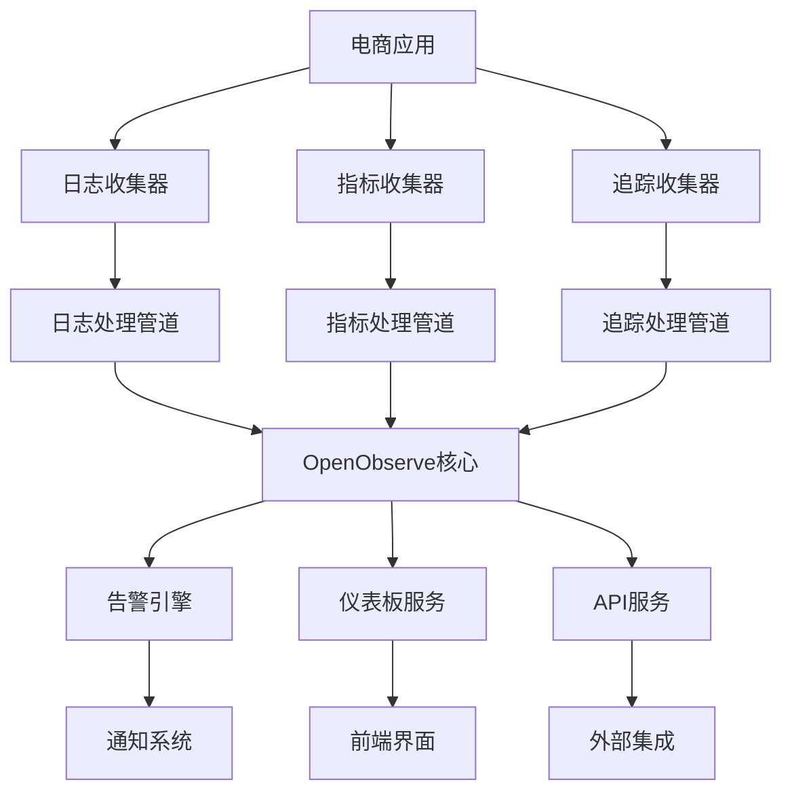

# OpenObserve微服务完善计划

## 1. 当前集成状态分析

### 1.1 现有集成组件

基于代码分析，当前项目已具备以下OpenObserve集成组件：

1. **日志传输模块** (`backend/src/logging/openobserve-transport.js`)
   - 基于Winston的OpenObserve传输层
   - 支持批量发送和定时刷新
   - 基础错误处理机制

2. **分布式追踪配置** (`backend/src/tracing/opentelemetry-config.js`)
   - OpenTelemetry SDK配置
   - 支持多种采样策略
   - 自定义span和业务事件记录

3. **监控服务** (`backend/src/monitoring/`)
   - 基础指标收集
   - 系统健康检查
   - 性能报告生成

4. **配置管理** (`backend/src/config/unified-master.config.ts`)
   - OpenObserve URL配置
   - 基础监控配置选项

### 1.2 存在的不足

1. **日志收集不完整**
   - 缺少业务日志结构化
   - 没有用户行为追踪
   - 缺少日志聚合和分析功能

2. **指标监控有限**
   - 缺少业务指标定义
   - 没有自定义指标支持
   - 缺少指标聚合和趋势分析

3. **告警系统缺失**
   - 没有告警规则定义
   - 缺少通知机制
   - 没有告警升级策略

4. **数据管道不完善**
   - 缺少数据转换和富化
   - 没有数据质量检查
   - 缺少数据备份和恢复

## 2. 完善目标

### 2.1 短期目标（1-2周）
- 完善电商业务日志收集
- 增强指标监控功能
- 实现基础告警系统

### 2.2 中期目标（3-4周）
- 完善分布式追踪
- 实现数据管道处理
- 开发仪表板定制功能

### 2.3 长期目标（1-2个月）
- 完善安全认证集成
- 实现性能优化
- 开发API网关集成

## 3. 技术架构设计

### 3.1 整体架构



### 3.2 核心模块设计

#### 3.2.1 日志收集模块
- **结构化日志处理器**
- **业务事件记录器**
- **用户行为追踪器**
- **日志聚合器**

#### 3.2.2 指标监控模块
- **业务指标收集器**
- **自定义指标注册器**
- **指标聚合器**
- **趋势分析器**

#### 3.2.3 告警系统模块
- **告警规则引擎**
- **通知管理器**
- **告警升级器**
- **告警抑制器**

#### 3.2.4 数据管道模块
- **数据转换器**
- **数据富化器**
- **质量检查器**
- **备份恢复器**

## 4. 实施计划

### 4.1 第一阶段：日志收集完善

#### 4.1.1 电商业务日志结构化
创建标准化的业务日志格式，包括：
- 用户操作日志
- 订单处理日志
- 支付交易日志
- 库存管理日志

#### 4.1.2 用户行为追踪
实现用户行为追踪功能：
- 页面访问记录
- 商品浏览记录
- 搜索行为记录
- 购物车操作记录

#### 4.1.3 日志聚合分析
开发日志聚合和分析功能：
- 实时日志流处理
- 日志模式识别
- 异常日志检测
- 日志统计分析

### 4.2 第二阶段：指标监控增强

#### 4.2.1 业务指标定义
定义关键业务指标：
- 用户活跃度指标
- 转化率指标
- 订单处理效率指标
- 系统性能指标

#### 4.2.2 自定义指标支持
实现自定义指标注册和收集：
- 指标注册API
- 指标收集器
- 指标存储优化
- 指标查询接口

#### 4.2.3 指标聚合和趋势分析
开发指标聚合和趋势分析功能：
- 时间窗口聚合
- 多维度分析
- 趋势预测
- 异常检测

### 4.3 第三阶段：告警系统实现

#### 4.3.1 告警规则引擎
实现灵活的告警规则引擎：
- 规则定义语言
- 规则解析器
- 规则执行器
- 规则优化器

#### 4.3.2 通知管理器
开发多渠道通知系统：
- 邮件通知
- 短信通知
- Webhook通知
- 即时消息通知

#### 4.3.3 告警升级和抑制
实现智能告警管理：
- 告警升级策略
- 告警抑制规则
- 告警分组
- 告警静默

## 5. 技术实现细节

### 5.1 数据模型设计

#### 5.1.1 日志数据模型
```typescript
interface LogEntry {
  timestamp: string;
  level: 'DEBUG' | 'INFO' | 'WARN' | 'ERROR';
  service: string;
  message: string;
  traceId?: string;
  spanId?: string;
  userId?: string;
  sessionId?: string;
  requestId?: string;
  tags?: Record<string, any>;
  metadata?: Record<string, any>;
}
```

#### 5.1.2 指标数据模型
```typescript
interface MetricEntry {
  timestamp: string;
  name: string;
  value: number;
  type: 'counter' | 'gauge' | 'histogram' | 'summary';
  labels?: Record<string, string>;
  unit?: string;
  description?: string;
}
```

#### 5.1.3 告警数据模型
```typescript
interface AlertRule {
  id: string;
  name: string;
  description: string;
  condition: string;
  severity: 'low' | 'medium' | 'high' | 'critical';
  enabled: boolean;
  notifications: NotificationConfig[];
  suppressions?: SuppressionRule[];
  escalation?: EscalationRule[];
}
```

### 5.2 API设计

#### 5.2.1 日志API
- `POST /api/logs` - 发送日志
- `GET /api/logs/search` - 搜索日志
- `GET /api/logs/stats` - 获取日志统计

#### 5.2.2 指标API
- `POST /api/metrics` - 发送指标
- `GET /api/metrics/query` - 查询指标
- `GET /api/metrics/series` - 获取指标序列

#### 5.2.3 告警API
- `POST /api/alerts/rules` - 创建告警规则
- `PUT /api/alerts/rules/:id` - 更新告警规则
- `GET /api/alerts` - 获取告警列表
- `POST /api/alerts/:id/ack` - 确认告警

### 5.3 配置管理

#### 5.3.1 OpenObserve配置
```yaml
openobserve:
  url: "http://localhost:5080"
  organization: "caddy-shopping"
  auth:
    type: "bearer"
    token: "${OPENOBSERVE_TOKEN}"
  
  streams:
    application_logs: "application-logs"
    business_events: "business-events"
    user_behavior: "user-behavior"
    metrics: "metrics"
    traces: "traces"
  
  retention:
    logs: "30d"
    metrics: "90d"
    traces: "7d"
    business_events: "365d"
  
  performance:
    batch_size: 100
    flush_interval: 5000
    max_retries: 3
    timeout: 30000
```

## 6. 部署和运维

### 6.1 部署架构

#### 6.1.1 开发环境
- 单实例OpenObserve
- 本地数据存储
- 基础监控配置

#### 6.1.2 生产环境
- 高可用OpenObserve集群
- 分布式存储
- 完整监控和告警

### 6.2 监控指标

#### 6.2.1 系统指标
- CPU使用率
- 内存使用率
- 磁盘使用率
- 网络流量

#### 6.2.2 应用指标
- 请求响应时间
- 错误率
- 吞吐量
- 并发连接数

#### 6.2.3 业务指标
- 用户活跃度
- 订单转化率
- 支付成功率
- 库存周转率

### 6.3 备份策略

#### 6.3.1 数据备份
- 每日自动备份
- 增量备份策略
- 异地备份存储
- 备份验证机制

#### 6.3.2 配置备份
- 配置版本管理
- 配置变更追踪
- 配置回滚机制
- 配置同步策略

## 7. 安全考虑

### 7.1 数据安全
- 传输加密
- 存储加密
- 访问控制
- 数据脱敏

### 7.2 认证授权
- JWT令牌认证
- RBAC权限控制
- API访问限制
- 审计日志

### 7.3 网络安全
- 防火墙配置
- DDoS防护
- 入侵检测
- 安全扫描

## 8. 性能优化

### 8.1 查询优化
- 索引策略
- 查询缓存
- 分页优化
- 并行查询

### 8.2 存储优化
- 数据压缩
- 分区策略
- 冷热数据分离
- 存储层级

### 8.3 网络优化
- 连接池
- 批量处理
- 压缩传输
- CDN加速

## 9. 测试策略

### 9.1 单元测试
- 模块功能测试
- 边界条件测试
- 异常处理测试
- 性能基准测试

### 9.2 集成测试
- API接口测试
- 数据流测试
- 端到端测试
- 兼容性测试

### 9.3 性能测试
- 负载测试
- 压力测试
- 稳定性测试
- 容量测试

## 10. 风险评估

### 10.1 技术风险
- 数据丢失风险
- 性能瓶颈风险
- 兼容性风险
- 安全漏洞风险

### 10.2 运维风险
- 配置错误风险
- 部署失败风险
- 监控盲区风险
- 响应延迟风险

### 10.3 缓解措施
- 多重备份策略
- 灰度发布机制
- 全面监控覆盖
- 快速响应流程

## 11. 成功指标

### 11.1 技术指标
- 系统可用性 ≥ 99.9%
- 查询响应时间 P95 < 2s
- 错误率 < 0.1%
- 数据完整性 100%

### 11.2 业务指标
- 故障恢复时间 < 5分钟
- 运维效率提升 > 50%
- 成本降低 > 30%
- 用户满意度 > 90%

## 12. 后续规划

### 12.1 短期优化（1-3个月）
- 查询性能优化
- 监控覆盖扩展
- 自动化运维
- 数据治理

### 12.2 中期发展（3-6个月）
- 智能分析
- 预测性告警
- 自愈能力
- 生态集成

### 12.3 长期演进（6-12个月）
- AI能力集成
- 微服务架构适配
- 多租户支持
- 边缘计算支持

通过本完善计划的实施，我们将建立一个功能完整、性能优异、安全可靠的OpenObserve监控体系，为电商业务的持续发展提供强有力的技术支撑。