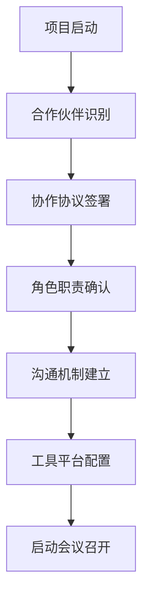
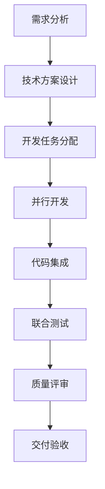
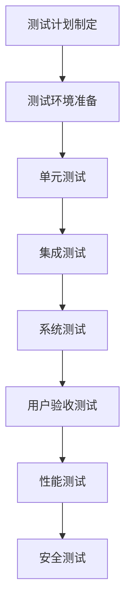

# Caddy Style Shopping Site - 合作伙伴文档

## 📋 文档概览

### 基本信息
- **文档名称**: 合作伙伴协作指南
- **版本**: 1.0.0
- **创建日期**: 2025-01-15
- **维护团队**: 项目管理办公室
- **适用范围**: 所有项目合作伙伴

### 文档目的
本文档旨在为Caddy Style Shopping Site项目的所有合作伙伴提供清晰的协作指南，确保项目团队、外部供应商、技术合作伙伴能够高效协作，共同推进项目成功交付。

## 🤝 合作伙伴生态

### 核心合作伙伴类型

#### 1. 技术合作伙伴
**职责范围**: 技术架构设计、代码开发、技术咨询

**合作模式**:
- 技术架构联合设计
- 代码协同开发
- 技术难题联合攻关
- 最佳实践分享

**关键合作伙伴**:
- 前端技术团队
- 后端开发团队
- DevOps工程团队
- 安全技术专家

#### 2. 产品合作伙伴
**职责范围**: 产品需求分析、用户体验设计、产品策略制定

**合作模式**:
- 需求联合分析
- 用户体验共同设计
- 产品路线图协同规划
- 市场反馈共享

**关键合作伙伴**:
- 产品经理团队
- UX/UI设计团队
- 用户研究团队
- 市场分析团队

#### 3. 质量保证合作伙伴
**职责范围**: 测试策略制定、质量标准建立、测试执行

**合作模式**:
- 测试策略联合制定
- 自动化测试协同建设
- 质量标准共同维护
- 缺陷管理协作

**关键合作伙伴**:
- QA测试团队
- 自动化测试专家
- 性能测试团队
- 安全测试专家

#### 4. 运维合作伙伴
**职责范围**: 基础设施管理、部署策略、监控运维

**合作模式**:
- 基础设施联合规划
- 部署流程协同优化
- 监控体系共建
- 故障响应协作

**关键合作伙伴**:
- 云服务提供商
- CDN服务商
- 监控服务提供商
- 安全服务商

## 📊 协作框架

### 协作原则

#### 1. 透明协作
- **信息共享**: 及时分享项目进展、技术决策、风险问题
- **决策透明**: 重要决策过程公开，邀请相关合作伙伴参与
- **文档开放**: 技术文档、设计文档对合作伙伴开放
- **沟通直接**: 建立直接沟通渠道，减少信息传递层级

#### 2. 责任明确
- **角色定义**: 明确各合作伙伴的职责边界和交付物
- **质量标准**: 统一质量标准和验收标准
- **时间节点**: 明确关键里程碑和交付时间点
- **风险共担**: 建立风险共担和问题协同解决机制

#### 3. 持续改进
- **定期回顾**: 定期举行协作回顾会议
- **流程优化**: 持续优化协作流程和工具
- **经验分享**: 建立最佳实践分享机制
- **能力提升**: 共同提升团队协作能力

### 协作流程

#### 项目启动阶段


**关键活动**:
1. **合作伙伴评估**: 评估潜在合作伙伴的技术能力、协作经验
2. **协作协议制定**: 明确合作范围、责任分工、质量标准
3. **沟通渠道建立**: 设置项目沟通群组、定期会议机制
4. **工具权限配置**: 为合作伙伴配置必要的开发工具和平台权限

#### 开发协作阶段


**协作要点**:
- **需求对齐**: 确保所有合作伙伴对需求理解一致
- **接口约定**: 明确模块间接口规范和数据格式
- **代码规范**: 统一代码风格和开发规范
- **集成策略**: 制定代码集成和冲突解决策略

#### 测试协作阶段


**质量保证**:
- **测试覆盖率**: 确保代码测试覆盖率达到70%以上
- **自动化测试**: 建立自动化测试流水线
- **缺陷管理**: 建立统一的缺陷跟踪和修复流程
- **性能基准**: 确保性能指标满足预定目标

## 🛠️ 协作工具与平台

### 开发协作工具

#### 代码管理
- **Git仓库**: GitHub/GitLab企业版
- **分支策略**: GitFlow工作流
- **代码审查**: Pull Request + Code Review
- **权限管理**: 基于角色的访问控制

#### 项目管理
- **任务管理**: Jira/Azure DevOps
- **进度跟踪**: 甘特图 + 燃尽图
- **里程碑管理**: 关键节点跟踪
- **风险管理**: 风险登记册维护

#### 沟通协作
- **即时通讯**: Slack/Microsoft Teams
- **视频会议**: Zoom/腾讯会议
- **文档协作**: Confluence/Notion
- **知识分享**: 内部Wiki + 技术博客

#### 质量保证
- **代码质量**: SonarQube + ESLint
- **自动化测试**: Jest + Cypress
- **性能监控**: Lighthouse + WebPageTest
- **安全扫描**: OWASP ZAP + Snyk

### 环境管理

#### 开发环境
- **本地开发**: Docker + Docker Compose
- **代码同步**: Git hooks + 自动同步
- **依赖管理**: npm + package-lock.json
- **环境一致性**: 开发环境标准化

#### 测试环境
- **集成测试环境**: 模拟生产环境配置
- **性能测试环境**: 独立的性能测试集群
- **安全测试环境**: 隔离的安全测试沙箱
- **用户验收环境**: 面向业务用户的测试环境

#### 生产环境
- **部署策略**: 蓝绿部署 + 金丝雀发布
- **监控告警**: 全链路监控 + 智能告警
- **备份恢复**: 自动备份 + 快速恢复
- **安全防护**: WAF + DDoS防护

## 📋 协作规范

### 沟通规范

#### 会议管理
- **日常站会**: 每日15分钟同步进展和问题
- **周度回顾**: 每周总结进展和调整计划
- **月度评审**: 每月评估协作效果和改进点
- **里程碑会议**: 关键节点的正式评审会议

#### 文档规范
- **技术文档**: 使用Markdown格式，版本化管理
- **设计文档**: 包含架构图、流程图、接口定义
- **会议纪要**: 记录决策、行动项、责任人
- **变更记录**: 跟踪所有重要变更和影响分析

#### 问题升级
```
级别1: 团队内部解决 (24小时内)
级别2: 跨团队协调解决 (48小时内)
级别3: 管理层介入解决 (72小时内)
级别4: 高级管理层决策 (1周内)
```

### 质量规范

#### 代码质量标准
- **代码规范**: 遵循ESLint配置的代码风格
- **注释要求**: 关键函数和复杂逻辑必须有注释
- **测试覆盖**: 新增代码测试覆盖率≥80%
- **性能要求**: 不得引入明显的性能回归

#### 交付质量标准
- **功能完整性**: 100%实现需求规格说明
- **缺陷密度**: 每千行代码缺陷数≤2个
- **性能指标**: 满足预定的性能基准
- **安全要求**: 通过安全扫描和渗透测试

### 安全规范

#### 数据安全
- **敏感数据**: 严禁在代码中硬编码敏感信息
- **数据传输**: 使用HTTPS加密传输
- **数据存储**: 敏感数据加密存储
- **访问控制**: 实施最小权限原则

#### 代码安全
- **依赖管理**: 定期更新依赖包，修复安全漏洞
- **代码审查**: 所有代码变更必须经过安全审查
- **静态扫描**: 集成静态代码安全扫描工具
- **动态测试**: 定期进行安全渗透测试

## 📈 绩效评估

### 协作效果评估指标

#### 效率指标
- **交付及时率**: 按时交付任务的比例
- **缺陷修复时间**: 从发现到修复的平均时间
- **沟通响应时间**: 消息回复的平均时间
- **决策效率**: 从问题提出到决策的时间

#### 质量指标
- **代码质量评分**: SonarQube质量门禁评分
- **测试通过率**: 自动化测试的通过率
- **用户满意度**: 内部用户对协作的满意度评分
- **缺陷逃逸率**: 生产环境发现缺陷的比例

#### 协作指标
- **知识分享频次**: 技术分享和最佳实践分享次数
- **跨团队协作次数**: 跨团队协作项目的数量
- **冲突解决效率**: 协作冲突的解决时间
- **团队融合度**: 团队协作融合程度评估

### 持续改进机制

#### 定期回顾
- **周度回顾**: 识别协作中的问题和改进点
- **月度总结**: 分析协作效果和趋势
- **季度评估**: 全面评估协作伙伴关系
- **年度规划**: 制定下一年度的协作策略

#### 改进措施
- **流程优化**: 基于反馈优化协作流程
- **工具升级**: 引入更高效的协作工具
- **培训提升**: 组织协作技能培训
- **激励机制**: 建立协作绩效激励机制

## 🎯 成功案例

### 技术协作成功案例

#### 案例1: 性能优化协作
**背景**: 网站加载速度需要优化
**合作伙伴**: 前端团队 + 后端团队 + CDN服务商
**协作过程**:
1. 联合性能分析，识别瓶颈点
2. 制定优化方案，分工实施
3. 协同测试验证，持续调优
**成果**: 页面加载速度提升60%，用户体验显著改善

#### 案例2: 安全加固协作
**背景**: 系统安全性需要全面提升
**合作伙伴**: 开发团队 + 安全专家 + 运维团队
**协作过程**:
1. 安全风险评估，制定加固计划
2. 代码安全审查，修复安全漏洞
3. 部署安全防护，建立监控体系
**成果**: 安全评级从B级提升到A级，零安全事故

### 协作最佳实践

#### 实践1: 敏捷协作模式
- **每日站会**: 15分钟高效同步
- **迭代规划**: 2周迭代周期
- **持续集成**: 自动化构建和测试
- **快速反馈**: 及时响应和调整

#### 实践2: 知识共享机制
- **技术分享会**: 每周技术主题分享
- **代码审查**: 知识传递和质量保证
- **文档协作**: 共同维护技术文档
- **经验总结**: 项目结束后的经验萃取

## 📞 联系方式

### 项目管理办公室
- **项目经理**: [姓名] - [邮箱] - [电话]
- **技术负责人**: [姓名] - [邮箱] - [电话]
- **质量负责人**: [姓名] - [邮箱] - [电话]

### 紧急联系
- **7x24小时热线**: [电话号码]
- **紧急邮箱**: [emergency@project.com]
- **值班群组**: [即时通讯群组]

### 协作平台
- **项目门户**: [项目网站URL]
- **代码仓库**: [Git仓库URL]
- **文档中心**: [文档平台URL]
- **监控面板**: [监控系统URL]

---

## 📝 附录

### 附录A: 协作协议模板
[协作协议的标准模板]

### 附录B: 质量检查清单
[质量验收的详细检查项]

### 附录C: 应急响应流程
[紧急情况的响应和处理流程]

### 附录D: 工具使用指南
[各种协作工具的使用说明]

---

**文档版本**: 1.0.0  
**最后更新**: 2025-01-15  
**下次评审**: 2025-04-15  
**维护者**: 项目管理办公室  
**批准人**: [项目总监姓名]