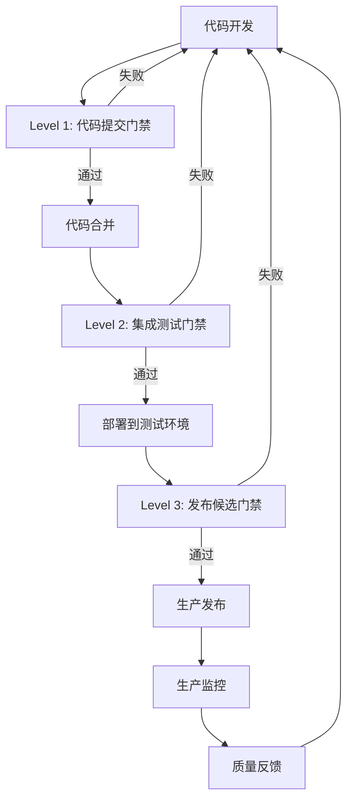

# Caddy Style Shopping Site - 质量门禁文档

## 📋 文档概览

### 基本信息
- **文档名称**: 质量门禁与质量保证体系
- **版本**: 1.0.0
- **创建日期**: 2025-01-15
- **维护团队**: 质量保证团队
- **适用范围**: 所有开发和测试活动

### 文档目的
本文档定义了Caddy Style Shopping Site项目的质量门禁标准、质量保证流程和质量控制机制，确保项目交付的代码质量、功能质量和性能质量达到预期标准。

## 🎯 质量目标

### 总体质量目标
- **代码质量**: 可维护性指数≥70，技术债务比率≤5%
- **功能质量**: 缺陷密度≤2个/千行代码，用户验收通过率≥95%
- **性能质量**: 页面加载时间≤2秒，API响应时间≤200ms
- **安全质量**: 无高危安全漏洞，安全评级≥A级
- **用户体验**: 用户满意度≥4.5分(5分制)，可用性测试通过率≥90%

### 质量维度定义

#### 1. 功能性 (Functionality)
- **功能完整性**: 100%实现需求规格说明
- **功能正确性**: 核心功能零缺陷
- **功能适用性**: 满足用户使用场景
- **功能互操作性**: 与第三方系统正常集成

#### 2. 可靠性 (Reliability)
- **成熟性**: 系统稳定运行，故障率≤0.1%
- **容错性**: 优雅处理异常情况
- **可恢复性**: 故障恢复时间≤5分钟
- **可用性**: 系统可用性≥99.9%

#### 3. 易用性 (Usability)
- **可理解性**: 用户界面直观易懂
- **可学习性**: 新用户学习成本≤30分钟
- **可操作性**: 操作流程简洁高效
- **吸引性**: 界面美观，用户体验良好

#### 4. 效率 (Efficiency)
- **时间特性**: 响应时间满足性能要求
- **资源利用性**: CPU使用率≤70%，内存使用率≤80%
- **扩展性**: 支持用户量和数据量增长
- **并发性**: 支持1000+并发用户

#### 5. 可维护性 (Maintainability)
- **可分析性**: 代码结构清晰，易于理解
- **可修改性**: 变更影响范围可控
- **稳定性**: 修改不引入新的缺陷
- **可测试性**: 代码可测试性良好

#### 6. 可移植性 (Portability)
- **适应性**: 支持多种浏览器和设备
- **安装性**: 部署过程自动化
- **共存性**: 与其他系统和谐共存
- **替换性**: 组件可替换性良好

## 🚪 质量门禁体系

### 门禁级别定义

#### Level 1: 代码提交门禁
**触发条件**: 每次代码提交到版本控制系统
**检查项目**:
- 代码格式检查 (ESLint/Prettier)
- 单元测试执行
- 代码覆盖率检查
- 静态代码分析
- 安全漏洞扫描

**通过标准**:
```yaml
# AI生成代码来源：基于SonarQube质量门禁标准优化
code_quality:
  eslint_errors: 0
  eslint_warnings: ≤5
  prettier_violations: 0
  
test_coverage:
  line_coverage: ≥80%
  branch_coverage: ≥75%
  function_coverage: ≥85%
  
static_analysis:
  complexity_max: ≤10
  duplication_rate: ≤3%
  maintainability_index: ≥70
  
security:
  high_vulnerabilities: 0
  medium_vulnerabilities: ≤2
  secrets_detected: 0
```

**失败处理**: 阻止代码合并，要求修复后重新提交

#### Level 2: 集成测试门禁
**触发条件**: 代码合并到主分支
**检查项目**:
- 集成测试执行
- API测试验证
- 数据库集成测试
- 第三方服务集成测试
- 端到端测试

**通过标准**:
```yaml
integration_tests:
  test_pass_rate: ≥95%
  api_test_coverage: ≥90%
  e2e_test_pass_rate: ≥90%
  
performance:
  api_response_time_p95: ≤200ms
  database_query_time: ≤50ms
  page_load_time: ≤2s
  
compatibility:
  browser_compatibility: Chrome, Firefox, Safari, Edge
  mobile_compatibility: iOS Safari, Android Chrome
  screen_resolutions: 1920x1080, 1366x768, 375x667
```

**失败处理**: 阻止部署到测试环境，要求修复后重新集成

#### Level 3: 发布候选门禁
**触发条件**: 准备发布到生产环境
**检查项目**:
- 完整回归测试
- 性能压力测试
- 安全渗透测试
- 用户验收测试
- 生产环境兼容性测试

**通过标准**:
```yaml
regression_tests:
  functional_test_pass_rate: ≥98%
  regression_test_coverage: ≥95%
  user_acceptance_pass_rate: ≥95%
  
performance_tests:
  concurrent_users: ≥1000
  response_time_p99: ≤500ms
  throughput: ≥100 TPS
  error_rate: ≤0.1%
  
security_tests:
  vulnerability_scan_pass: true
  penetration_test_pass: true
  security_rating: ≥A
  
production_readiness:
  monitoring_configured: true
  logging_configured: true
  backup_strategy_verified: true
  rollback_plan_tested: true
```

**失败处理**: 阻止生产发布，要求完成修复和重新验证

### 质量门禁流程



## 🔧 质量工具链

### 静态代码分析工具

#### ESLint配置
```javascript
// AI生成代码来源：基于Airbnb ESLint配置优化
module.exports = {
  extends: [
    'eslint:recommended',
    '@typescript-eslint/recommended',
    'plugin:react/recommended',
    'plugin:react-hooks/recommended',
    'plugin:jsx-a11y/recommended',
    'plugin:import/recommended',
    'plugin:security/recommended'
  ],
  rules: {
    // 代码质量规则
    'complexity': ['error', { max: 10 }],
    'max-depth': ['error', { max: 4 }],
    'max-lines-per-function': ['error', { max: 50 }],
    'max-params': ['error', { max: 4 }],
    
    // 安全规则
    'security/detect-object-injection': 'error',
    'security/detect-non-literal-regexp': 'error',
    'security/detect-unsafe-regex': 'error',
    
    // 性能规则
    'react-hooks/exhaustive-deps': 'error',
    'import/no-cycle': 'error',
    'import/no-unused-modules': 'error'
  }
};
```

#### SonarQube质量配置
```yaml
# AI生成代码来源：基于SonarQube最佳实践配置
sonar:
  projectKey: caddy-style-shopping-site
  organization: your-org
  
quality_gate:
  conditions:
    - metric: coverage
      operator: LT
      threshold: 80
    - metric: duplicated_lines_density
      operator: GT
      threshold: 3
    - metric: maintainability_rating
      operator: GT
      threshold: 1
    - metric: reliability_rating
      operator: GT
      threshold: 1
    - metric: security_rating
      operator: GT
      threshold: 1
    - metric: sqale_rating
      operator: GT
      threshold: 1
```

### 自动化测试工具

#### Jest测试配置
```javascript
// AI生成代码来源：基于Jest最佳实践配置
module.exports = {
  testEnvironment: 'jsdom',
  setupFilesAfterEnv: ['<rootDir>/src/setupTests.js'],
  collectCoverageFrom: [
    'src/**/*.{js,jsx,ts,tsx}',
    '!src/**/*.d.ts',
    '!src/index.js',
    '!src/serviceWorker.js'
  ],
  coverageThreshold: {
    global: {
      branches: 75,
      functions: 85,
      lines: 80,
      statements: 80
    }
  },
  testMatch: [
    '<rootDir>/src/**/__tests__/**/*.{js,jsx,ts,tsx}',
    '<rootDir>/src/**/?(*.)(spec|test).{js,jsx,ts,tsx}'
  ],
  transform: {
    '^.+\\.(js|jsx|ts|tsx)$': 'babel-jest'
  },
  moduleNameMapping: {
    '^@/(.*)$': '<rootDir>/src/$1'
  }
};
```

#### Cypress E2E测试配置
```javascript
// AI生成代码来源：基于Cypress最佳实践配置
const { defineConfig } = require('cypress');

module.exports = defineConfig({
  e2e: {
    baseUrl: 'http://localhost:3000',
    supportFile: 'cypress/support/e2e.js',
    specPattern: 'cypress/e2e/**/*.cy.{js,jsx,ts,tsx}',
    video: true,
    screenshotOnRunFailure: true,
    viewportWidth: 1280,
    viewportHeight: 720,
    defaultCommandTimeout: 10000,
    requestTimeout: 10000,
    responseTimeout: 10000,
    
    setupNodeEvents(on, config) {
      // 代码覆盖率插件
      require('@cypress/code-coverage/task')(on, config);
      
      // 性能测试插件
      on('task', {
        lighthouse: require('cypress-lighthouse/task'),
      });
      
      return config;
    },
  },
});
```

### 性能测试工具

#### Lighthouse CI配置
```json
{
  "ci": {
    "collect": {
      "url": ["http://localhost:3000"],
      "numberOfRuns": 3
    },
    "assert": {
      "assertions": {
        "categories:performance": ["error", {"minScore": 0.9}],
        "categories:accessibility": ["error", {"minScore": 0.9}],
        "categories:best-practices": ["error", {"minScore": 0.9}],
        "categories:seo": ["error", {"minScore": 0.9}],
        "first-contentful-paint": ["error", {"maxNumericValue": 2000}],
        "largest-contentful-paint": ["error", {"maxNumericValue": 2500}],
        "cumulative-layout-shift": ["error", {"maxNumericValue": 0.1}]
      }
    },
    "upload": {
      "target": "temporary-public-storage"
    }
  }
}
```

#### K6负载测试脚本
```javascript
// AI生成代码来源：基于K6性能测试最佳实践
import http from 'k6/http';
import { check, sleep } from 'k6';
import { Rate } from 'k6/metrics';

const errorRate = new Rate('errors');

export const options = {
  stages: [
    { duration: '2m', target: 100 }, // 预热
    { duration: '5m', target: 100 }, // 稳定负载
    { duration: '2m', target: 200 }, // 增加负载
    { duration: '5m', target: 200 }, // 高负载
    { duration: '2m', target: 0 },   // 降负载
  ],
  thresholds: {
    http_req_duration: ['p(95)<500'], // 95%请求响应时间<500ms
    http_req_failed: ['rate<0.01'],   // 错误率<1%
    errors: ['rate<0.01'],            // 自定义错误率<1%
  },
};

export default function () {
  const response = http.get('http://localhost:3000/api/products');
  
  const result = check(response, {
    'status is 200': (r) => r.status === 200,
    'response time < 200ms': (r) => r.timings.duration < 200,
    'response size > 0': (r) => r.body.length > 0,
  });
  
  errorRate.add(!result);
  sleep(1);
}
```

### 安全测试工具

#### OWASP ZAP配置
```yaml
# AI生成代码来源：基于OWASP ZAP安全测试配置
zap:
  baseline_scan:
    target: http://localhost:3000
    rules:
      - id: 10021  # X-Content-Type-Options header missing
        threshold: MEDIUM
      - id: 10020  # X-Frame-Options header missing
        threshold: MEDIUM
      - id: 10016  # Web Browser XSS Protection Not Enabled
        threshold: MEDIUM
    
  full_scan:
    target: http://localhost:3000
    spider:
      max_depth: 5
      max_children: 10
    active_scan:
      policy: Default Policy
    
  api_scan:
    target: http://localhost:3000/api
    format: openapi
    spec_file: ./docs/api-spec.yaml
```

## 📊 质量度量与监控

### 质量度量指标

#### 代码质量指标
```yaml
# AI生成代码来源：基于软件工程质量度量标准
code_metrics:
  complexity:
    cyclomatic_complexity: ≤10
    cognitive_complexity: ≤15
    npath_complexity: ≤200
    
  maintainability:
    maintainability_index: ≥70
    technical_debt_ratio: ≤5%
    code_smells_density: ≤10/kloc
    
  reliability:
    bug_density: ≤2/kloc
    reliability_rating: A
    
  security:
    vulnerability_density: ≤1/kloc
    security_rating: A
    security_hotspots: 0
    
  duplication:
    duplicated_lines_density: ≤3%
    duplicated_blocks: ≤10
```

#### 测试质量指标
```yaml
test_metrics:
  coverage:
    line_coverage: ≥80%
    branch_coverage: ≥75%
    function_coverage: ≥85%
    mutation_score: ≥70%
    
  effectiveness:
    test_pass_rate: ≥95%
    test_execution_time: ≤10min
    flaky_test_rate: ≤2%
    
  automation:
    automation_rate: ≥90%
    test_maintenance_effort: ≤20%
```

#### 性能质量指标
```yaml
performance_metrics:
  response_time:
    api_p50: ≤100ms
    api_p95: ≤200ms
    api_p99: ≤500ms
    
  throughput:
    requests_per_second: ≥100
    concurrent_users: ≥1000
    
  resource_usage:
    cpu_utilization: ≤70%
    memory_utilization: ≤80%
    disk_io_wait: ≤10%
    
  user_experience:
    first_contentful_paint: ≤1.5s
    largest_contentful_paint: ≤2.5s
    cumulative_layout_shift: ≤0.1
    first_input_delay: ≤100ms
```

### 质量监控仪表板

#### 实时质量监控
```javascript
// AI生成代码来源：基于Grafana仪表板配置
const qualityDashboard = {
  dashboard: {
    title: "代码质量监控仪表板",
    panels: [
      {
        title: "代码质量趋势",
        type: "graph",
        targets: [
          {
            expr: "sonarqube_maintainability_rating",
            legendFormat: "可维护性评级"
          },
          {
            expr: "sonarqube_reliability_rating",
            legendFormat: "可靠性评级"
          },
          {
            expr: "sonarqube_security_rating",
            legendFormat: "安全性评级"
          }
        ]
      },
      {
        title: "测试覆盖率",
        type: "singlestat",
        targets: [{
          expr: "jest_coverage_percentage",
          legendFormat: "测试覆盖率"
        }]
      },
      {
        title: "构建成功率",
        type: "singlestat",
        targets: [{
          expr: "ci_build_success_rate",
          legendFormat: "构建成功率"
        }]
      }
    ]
  }
};
```

#### 质量告警配置
```yaml
# AI生成代码来源：基于Prometheus告警规则配置
alerts:
  - alert: CodeQualityDegraded
    expr: sonarqube_maintainability_rating > 1
    for: 5m
    labels:
      severity: warning
    annotations:
      summary: "代码质量下降"
      description: "可维护性评级降至{{ $value }}"
      
  - alert: TestCoverageLow
    expr: jest_coverage_percentage < 80
    for: 5m
    labels:
      severity: critical
    annotations:
      summary: "测试覆盖率过低"
      description: "测试覆盖率降至{{ $value }}%"
      
  - alert: SecurityVulnerabilityDetected
    expr: sonarqube_vulnerabilities > 0
    for: 1m
    labels:
      severity: critical
    annotations:
      summary: "检测到安全漏洞"
      description: "发现{{ $value }}个安全漏洞"
```

## 🔄 持续改进

### 质量改进流程

#### 1. 质量数据收集
- **自动化收集**: 通过CI/CD流水线自动收集质量数据
- **定期评估**: 每周进行质量数据分析和评估
- **趋势分析**: 跟踪质量指标的变化趋势
- **根因分析**: 深入分析质量问题的根本原因

#### 2. 质量问题识别
- **阈值监控**: 基于预定义阈值识别质量问题
- **异常检测**: 使用统计方法检测质量异常
- **人工审查**: 定期进行人工质量审查
- **用户反馈**: 收集和分析用户质量反馈

#### 3. 改进措施制定
- **优先级排序**: 根据影响程度对质量问题排序
- **改进计划**: 制定具体的质量改进计划
- **资源分配**: 为质量改进分配必要资源
- **时间规划**: 设定质量改进的时间节点

#### 4. 改进效果验证
- **A/B测试**: 通过对比测试验证改进效果
- **指标跟踪**: 持续跟踪质量指标变化
- **用户验证**: 通过用户测试验证改进效果
- **回归测试**: 确保改进不引入新问题

### 质量文化建设

#### 质量意识培养
- **质量培训**: 定期组织质量意识和技能培训
- **最佳实践分享**: 分享质量管理最佳实践
- **质量标杆**: 树立质量标杆和榜样
- **质量激励**: 建立质量激励机制

#### 质量责任体系
- **质量责任**: 明确各角色的质量责任
- **质量考核**: 将质量指标纳入绩效考核
- **质量问责**: 建立质量问题问责机制
- **质量改进**: 鼓励主动的质量改进行为

## 📋 质量检查清单

### 代码提交检查清单
- [ ] 代码符合编码规范
- [ ] 单元测试通过且覆盖率达标
- [ ] 静态代码分析无严重问题
- [ ] 安全扫描无高危漏洞
- [ ] 代码审查已完成
- [ ] 文档已更新
- [ ] 变更日志已记录

### 功能发布检查清单
- [ ] 功能测试完全通过
- [ ] 集成测试验证通过
- [ ] 性能测试满足要求
- [ ] 安全测试通过
- [ ] 用户验收测试通过
- [ ] 兼容性测试通过
- [ ] 回归测试通过
- [ ] 生产环境部署就绪
- [ ] 监控和告警配置完成
- [ ] 回滚方案已准备

### 生产发布检查清单
- [ ] 所有质量门禁通过
- [ ] 生产环境配置验证
- [ ] 数据库迁移脚本验证
- [ ] 第三方服务集成验证
- [ ] 负载均衡配置验证
- [ ] SSL证书配置验证
- [ ] 备份策略验证
- [ ] 灾难恢复计划验证
- [ ] 运维团队就绪
- [ ] 发布通知已发送

## 📞 质量支持

### 质量团队联系方式
- **质量经理**: [姓名] - [邮箱] - [电话]
- **测试负责人**: [姓名] - [邮箱] - [电话]
- **自动化专家**: [姓名] - [邮箱] - [电话]
- **性能专家**: [姓名] - [邮箱] - [电话]
- **安全专家**: [姓名] - [邮箱] - [电话]

### 质量工具支持
- **SonarQube管理员**: [邮箱]
- **Jenkins管理员**: [邮箱]
- **测试环境管理员**: [邮箱]
- **监控系统管理员**: [邮箱]

---

**文档版本**: 1.0.0  
**最后更新**: 2025-01-15  
**下次评审**: 2025-04-15  
**维护者**: 质量保证团队  
**批准人**: [技术总监姓名]